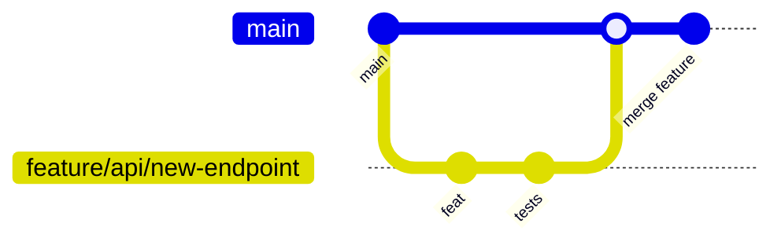

# CipherSwarm GitHub Copilot Instructions

This document provides authoritative guidance for GitHub Copilot and similar AI coding assistants working on the CipherSwarm project. Follow these rules strictly to avoid breaking critical contracts and to maintain established project patterns.

## Project Overview and Architecture

CipherSwarm is a distributed password cracking management system built with FastAPI (backend), SvelteKit (frontend), and Go agents that coordinate hashcat execution across multiple machines. The system provides a web interface for campaign management and agent orchestration.

### Architecture Snapshot

- **Backend**: FastAPI (Python 3.13+), SQLAlchemy 2.0 (async), Alembic migrations, Pydantic v2, Celery task queue, Redis cache, Cashews caching library, MinIO object storage, loguru logging
- **Frontend**: SvelteKit 5 with Runes, Shadcn-Svelte components, Tailwind CSS v4, Superforms v2 + Zod validation, Playwright/Vitest testing
- **Agents**: Go 1.22+ based CipherSwarmAgent (separate repository) that executes hashcat and communicates via Agent API v1
- **Object Storage**: MinIO buckets organized as:
    - `wordlists/` — Dictionary attack word lists
    - `rules/` — Hashcat rule files
    - `masks/` — Mask pattern files
    - `charsets/` — Custom charset definitions
    - `temp/` — Temporary storage for uploads
- **Queue/Cache**: Redis serving as both Celery broker/result backend and Cashews cache

### Service Layer Architecture

- **Principle**: All business logic resides in `app/core/services/`
- **Endpoints**: Thin wrappers that delegate to service functions
- **Multi-tenancy**: Enforced at the service layer via project-level access control

### Core Data Model Relationships

- Project → Campaigns (one-to-many)
- User ↔ Projects (many-to-many)
- Campaign → Attacks (one-to-many)
- Attack → Tasks (one-to-many)
- Campaign → HashList (many-to-one)
- HashList ↔ HashItems (many-to-many)
- CrackResult associated with Attack, HashItem, and Agent

## Folder Structure

```text
CipherSwarm/
├── app/                          # FastAPI backend application
│   ├── api/v1/endpoints/         # API endpoints organized by interface
│   │   ├── agent/               # Agent API (/api/v1/client/*)
│   │   ├── web/                 # Web UI API (/api/v1/web/*)
│   │   ├── control/             # Control API (/api/v1/control/*)
│   │   └── *.py                 # Shared infrastructure APIs
│   ├── core/                    # Core application logic
│   ├── models/                  # SQLAlchemy database models
│   ├── schemas/                 # Pydantic request/response schemas
│   └── plugins/                 # Plugin system
├── frontend/                     # SvelteKit frontend application
├── tests/                       # Test suite
├── docs/                        # Documentation
├── alembic/                     # Database migrations (PROTECTED)
├── contracts/                   # API contract reference files (PROTECTED)
└── .cursor/                     # Cursor AI configuration
```

## Technology Stack and Tools

### Core Technologies

- **Python**: Use `uv` for dependency management (never edit `pyproject.toml` manually)
- **Frontend**: Use `pnpm` from `frontend/` directory only
- **Task Runner**: `just` for all development tasks
- **CI/CD**: GitHub Actions
- **Documentation**: MkDocs with mermaid diagrams preferred for visual documentation

### Development Commands

- `just dev` / `just dev-backend` — Backend only with hot reload
- `just dev-frontend` — SvelteKit dev server only
- `just dev-fullstack` — Both in Docker with hot reload
- `just docker-dev-up-watch` — Full Docker stack with log following
- `just docker-dev-down` — Stop Docker development stack
- `just docs` — Serve MkDocs locally (port 9090)
- `just db-reset` — Reset test database

### Code Review Preference

- **Preferred**: Use coderabbit.ai for code reviews
- **Avoid**: GitHub Copilot auto-reviews (disable if configured)

## Critical API Compatibility Requirements (Agent API v1 IMMUTABLE)

### Agent API v1 (`/api/v1/client/*`) - LOCKED SPECIFICATION

- **Contract**: Must exactly match `contracts/v1_api_swagger.json` (OpenAPI 3.0.1)
- **No Breaking Changes**: Locked to mirror Ruby-on-Rails CipherSwarm version
- **Validation**: All responses must validate against OpenAPI specification
- **Error Format**: Uses legacy envelope structure (exempt from FastAPI defaults)

### Agent API v2 (`/api/v2/client/*`)

- **Status**: NOT YET IMPLEMENTED
- **Future**: Will allow breaking changes with proper versioning
- **Constraint**: Must not interfere with v1 Agent API in any way

### Never Do for Agent API v1

- ❌ Modify any field names, types, or enums in the specification
- ❌ Add extra fields to responses
- ❌ Remove or rename existing endpoints
- ❌ Change error message formats or structure
- ❌ Add new endpoints under the v1 prefix
- ❌ Alter the router file organization

## Coding Standards and Patterns

### Python Standards

- **Formatting**: `ruff format` with 119 character line limit
- **Type Hints**: Mandatory for all functions, prefer `| None` over `Optional[]`
- **Strings**: Always use double quotes (`"`)
- **Imports**: Group as stdlib, third-party, local with proper spacing
- **Pydantic v2**: Always use `Annotated` with `Field` for constraints

### Required Libraries (No Alternatives)

- **Logging**: `loguru` exclusively (never use stdlib `logging`)
- **Caching**: `cashews` only (never use `functools.lru_cache`)
- **Time**: `datetime.now(datetime.UTC)` (never use deprecated `datetime.utcnow()`)

### Naming Conventions

- **Models**: `PascalCase` (e.g., `Agent`, `CrackSession`)
- **Tables**: `snake_case` (e.g., `crack_session`, `task_result`)
- **Schemas**: `PascalCase` + suffix (`AgentCreate`, `TaskOut`, `CampaignUpdate`)
- **Files**: `snake_case.py`
- **Functions**: `snake_case`

### Service Function Naming

- **CRUD**: `create_`, `get_`, `list_`, `update_`, `delete_`
- **Business**: `estimate_keyspace_`, `reorder_attacks_`, `start_campaign_`
- **Pattern**: `{action}_{resource}_service()`

### Error Handling Patterns

- Use early returns and guard clauses
- Prefer raising specific custom exceptions over returning error dicts
- Define domain exceptions in service files or `app/core/exceptions.py`
- Never use broad `except:` blocks

## Testing Strategy

CipherSwarm uses a **three-tier testing architecture**:

### Tier 1: Backend (`just test-backend`)

- **Technology**: pytest + testcontainers + polyfactory
- **Scope**: API endpoints, services, models with real PostgreSQL
- **Speed**: Fast (seconds)

### Tier 2: Frontend (`just test-frontend`)

- **Technology**: Vitest + Playwright with mocked APIs
- **Scope**: UI components, user interactions, client-side logic
- **Speed**: Fast (seconds)

### Tier 3: Full E2E (`just test-e2e`)

- **Technology**: Playwright against full Docker stack
- **Scope**: Complete user workflows across real backend
- **Speed**: Slow (minutes)

### Testing Guidance

- Run the **smallest tier** that covers your changes
- Use `just ci-check` only when PR-ready or touching multiple tiers
- **Agent API v1**: All responses must validate against OpenAPI specification
- **Control API**: Verify RFC9457 error responses

### Test Commands

```bash
just test-backend    # Fast backend tests
just test-frontend   # Fast frontend tests
just test-e2e       # Full end-to-end tests
just ci-check       # Complete validation (PR readiness only)
```

## Development Workflow

### Golden Rules

1. **NO direct pushes** to `main` — PRs only
2. **Rebase before PR** — stay synced with target branch
3. **Test locally first** — run appropriate test tier before opening PR
4. **PR scope manageable** — under ~400 lines when feasible
5. **Agent API v1 compatibility** — maintain existing contracts
6. **Use uv for dependency management** — never edit `pyproject.toml` manually for Python dependencies
7. **Run `just check` before committing** — to ensure code is formatted and linted - no task is complete until this is run
8. **Run `just ci-check` before pushing** - to ensure all tests pass and code is ready for review

### Git Workflow



### Conventional Commits (Required)

- **Format**: `type(scope): description`
- **Types**: `feat`, `fix`, `docs`, `style`, `refactor`, `perf`, `test`, `ci`, `chore`, `deps`
- **Scopes**: `api`, `auth`, `models`, `services`, `frontend`, `agents`, `infra`

### Examples

- `feat(api): add RFC9457 error handler`
- `fix(frontend): correct SSR auth redirect`
- `docs(readme): update installation instructions`
- `feat(api)!: remove deprecated endpoints` (breaking change)

### Development URLs

- <http://localhost:8000/docs> — Swagger UI
- <http://localhost:8000/redoc> — ReDoc
- <http://localhost:5173> — SvelteKit Frontend
- <http://localhost:8000/api-info> — API metadata

## Security Guidelines

### General Security

- **HTTPS Only**: Never serve over plain HTTP in production
- **No Hard-coded Secrets**: Use pydantic-settings and environment variables
- **Strong JWT Secrets**: Use rotating secrets with short token lifetimes
- **CSRF Protection**: Implement CSRF tokens for state-changing requests
- **Rate Limiting**: Apply per-user and per-IP rate limiting

### Database Security

- **ORM Only**: Always use SQLAlchemy ORM, never raw SQL
- **SSL Connections**: Require SSL for all database connections
- **Migration Review**: Review all Alembic migrations before production
- **Minimal Permissions**: Database user should have minimum required permissions

### API Security

- **Input Validation**: Validate all input with Pydantic models
- **Access Control**: Use dependency injection for user context and authorization
- **Security Headers**: Set standard security headers (HSTS, X-Frame-Options, etc.)
- **No Information Leakage**: Never expose stack traces or internal errors to clients

### Object Storage Security

- **Presigned URLs**: Use temporary presigned URLs for agent downloads
- **Virus Scanning**: Automatic virus scanning for all uploads
- **Checksum Verification**: MD5 checksum verification for file integrity

## Protected Areas and Constraints (DO NOT MODIFY)

### PROTECTED Directories

- **`contracts/`** — API specifications (Agent API v1 is immutable)
- **`alembic/`** — Database migrations (use Alembic CLI only)
- **`.cursor/`** — Cursor AI configuration

### Hard Constraints

- **Router file organization** must remain exactly as defined
- **No alternative libraries** for logging, caching, or time handling
- **No raw SQL queries** — use SQLAlchemy ORM/async patterns only
- **Agent API v1 schema** is frozen and immutable

## Authentication Patterns

### Web UI Authentication

- **Flow**: OAuth2 with Password flow and refresh tokens
- **Sessions**: Secure HTTP-only cookies with CSRF protection
- **Passwords**: Argon2 hashing with complexity requirements
- **Rate Limiting**: Applied to login attempts

### Agent API Authentication

- **Method**: Bearer token authentication
- **Token Format**: `csa_<agent_id>_<random_string>`
- **Binding**: One token per agent, bound to agent ID
- **Lifecycle**: Automatic token invalidation on agent removal

### Control API Authentication

- **Method**: API key-based authentication using bearer tokens
- **Token Format**: `cst_<user_id>_<random_string>`
- **Features**: Multiple active keys per user, configurable scopes
- **Management**: Key creation, expiration, usage monitoring, revocation

## Error Handling Requirements

### General Rules

- Use `HTTPException` for API-specific errors
- Define custom exceptions for domain logic in services
- Never use broad `except:` blocks without specific exception types
- Log all errors with `loguru`, including stack traces for 5xx errors
- Never leak internal error details to clients

### Control API (RFC9457 Compliance)

All Control API endpoints (`/api/v1/control/*`) must return errors in `application/problem+json` format:

```python
from fastapi.responses import JSONResponse

return JSONResponse(
    status_code=400,
    content={
        "type": "https://example.com/problems/invalid-request",
        "title": "Invalid Request",
        "status": 400,
        "detail": "The request parameters are invalid",
        "instance": "/api/v1/control/campaigns/123",
    },
    headers={"Content-Type": "application/problem+json"},
)
```

### Agent API v1 (Legacy Format)

- **Exempt**: From FastAPI standard error formats
- **Requirement**: Must match legacy schema exactly as defined in `contracts/v1_api_swagger.json`
- **No Changes**: Error envelope structure is frozen

## Service Layer Architecture

### Organization

- **Location**: All business logic in `app/core/services/`
- **Pattern**: Endpoints are thin wrappers that delegate to service functions
- **Multi-tenancy**: Enforce project-level access control in services

### Service Function Structure

```python
async def create_campaign_service(
    db: AsyncSession, campaign_data: CampaignCreate, current_user: User
) -> Campaign:
    """Create a new campaign with business validation."""
    # Validation
    if await _campaign_name_exists(db, campaign_data.name, campaign_data.project_id):
        raise CampaignExistsError("Campaign name already exists in project")

    # Business logic
    campaign = Campaign(**campaign_data.model_dump())
    db.add(campaign)
    await db.commit()
    await db.refresh(campaign)
    return campaign
```

### Caching Strategy

- **Library**: Use `cashews` decorators with tags
- **TTL**: Keep short (≤ 60s) unless strong reason exists
- **Invalidation**: Use tagging and `.invalidate()` for cache busting
- **Keys**: Use logical prefixes (`campaign_stats:`, `agent_health:`)

### Exception Translation

```python
# In service
class CampaignNotFoundError(Exception):
    """Raised when a campaign is not found."""

    pass


# In endpoint
try:
    campaign = await get_campaign_service(db, campaign_id)
except CampaignNotFoundError:
    raise HTTPException(status_code=404, detail="Campaign not found")
```

## Database Patterns

### SQLAlchemy 2.0 Async

- **Session Management**: Use `Depends(get_db)` for dependency injection
- **Operations**: Use `db.get()`, `db.execute()`, `db.add()`, `db.commit()`, `db.refresh()`
- **Queries**: Use `select()` with proper joins and filters
- **Migrations**: Alembic only for all schema changes

### Pagination Pattern

**API Level** (return to clients):

```python
from app.schemas.shared import PaginatedResponse


@router.get("/campaigns")
async def list_campaigns() -> PaginatedResponse[CampaignOut]:
    return PaginatedResponse[CampaignOut](
        items=campaigns,
        total=total,
        page=page,
        page_size=size,
    )
```

**Service Level** (internal use):

```python
async def list_campaigns_service(
    db: AsyncSession, skip: int = 0, limit: int = 20
) -> tuple[list[Campaign], int]:
    query = select(Campaign).offset(skip).limit(limit)
    result = await db.execute(query)
    items = result.scalars().all()

    count_query = select(func.count(Campaign.id))
    total = await db.scalar(count_query)

    return list(items), total or 0
```

### Key Relationships

- **Multi-tenancy**: Project-level isolation enforced in services
- **Foreign Keys**: Explicit relationships with proper constraints
- **Indexing**: Consider indexing for frequently queried fields

## Frontend Patterns (SvelteKit 5)

### SSR-First Architecture

```typescript
// +page.server.ts
export const load = async ({ fetch, cookies }) => {
    const response = await fetch("/api/v1/web/campaigns", {
        headers: { Cookie: cookies.toString() },
    });
    return { campaigns: await response.json() };
};
```

### Component State Management

```svelte
<script lang="ts">
    // Use Runes for reactivity
    let campaigns = $state([]);
    let selectedCampaign = $derived(campaigns.find(c => c.selected));
    
    $effect(() => {
        // Side effects here
    });
</script>
```

### Forms and Validation

```typescript
// Superforms v2 + Zod
import { superForm } from "sveltekit-superforms";
import { zod } from "sveltekit-superforms/adapters";
import { campaignSchema } from "./schemas";

const form = superForm(data.form, {
    validators: zod(campaignSchema),
});
```

### UI Components

- **Library**: Shadcn-Svelte + bits-ui for accessibility
- **Styling**: Tailwind CSS v4 utility-first approach
- **Responsive**: Mobile-first design patterns
- **Authentication**: Handle 401 redirects appropriately

### Package Management

- **Important**: Always run `pnpm` commands from `frontend/` directory
- **Separate**: Frontend has its own `package.json`

## Router Organization (DO NOT CHANGE)

**⚠️ This table is authoritative and MUST NOT be changed.**

| Endpoint Path                  | Router File                              |
| ------------------------------ | ---------------------------------------- |
| `/api/v1/client/agents/*`      | `app/api/v1/endpoints/agent/agent.py`    |
| `/api/v1/client/attacks/*`     | `app/api/v1/endpoints/agent/attacks.py`  |
| `/api/v1/client/tasks/*`       | `app/api/v1/endpoints/agent/tasks.py`    |
| `/api/v1/client/crackers/*`    | `app/api/v1/endpoints/agent/crackers.py` |
| `/api/v1/client/configuration` | `app/api/v1/endpoints/agent/general.py`  |
| `/api/v1/web/*`                | `app/api/v1/endpoints/web/`              |
| `/api/v1/control/*`            | `app/api/v1/endpoints/control/`          |

## Do / Don't (Copilot Guardrails)

### ✅ DO

- Follow AGENTS.md, WARP.md, and .cursor/rules/ guidance
- Use loguru for logging, cashews for caching, datetime.now(datetime.UTC) for time
- Use Pydantic v2 with Annotated and Field
- Keep endpoints thin and delegate to services
- Use conventional commit format
- Enforce project-level access in services
- Test changes before submitting PRs
- Use `uv` for Python dependencies, `pnpm` for frontend (from frontend/ directory)

### ❌ DON'T

- Modify contracts/ directory or break Agent API v1 schemas
- Change router file locations or names
- Use stdlib logging, functools.lru_cache, or datetime.utcnow()
- Use raw SQL queries instead of SQLAlchemy ORM
- Push directly to main branch
- Introduce alternative libraries for logging/caching/time
- Leak internal error details to API clients
- Edit pyproject.toml dependencies manually

## Code Examples

### Logging with Context

```python
from loguru import logger

# Structured logging with context
logger.bind(task_id=task.id, agent_id=agent.id).info("Task started")

# Error logging with exception details
try:
    result = await process_task()
except Exception as e:
    logger.bind(task_id=task.id).error(f"Task failed: {e}")
    raise
```

### Caching with Cashews

```python
from cashews import cache


@cache(ttl=60, tags=["campaign", "stats"])
async def get_campaign_stats(campaign_id: int):
    return await calculate_stats(campaign_id)


# Cache invalidation
await cache.invalidate_tags(["campaign"])
```

### Time Handling

```python
from datetime import datetime

# ✅ Correct
now = datetime.now(datetime.UTC)

# ❌ Deprecated - don't use
now = datetime.utcnow()
```

### Pydantic v2 with Annotated

```python
from typing import Annotated
from pydantic import BaseModel, Field


class CampaignCreate(BaseModel):
    name: Annotated[
        str, Field(min_length=1, max_length=255, description="Campaign name")
    ]
    description: Annotated[str | None, Field(None, max_length=1000)]
    project_id: Annotated[int, Field(gt=0, description="Associated project ID")]
```

### FastAPI Endpoint with Service Pattern

```python
from fastapi import APIRouter, Depends, HTTPException
from sqlalchemy.ext.asyncio import AsyncSession

from app.core.deps import get_current_user, get_db
from app.models.user import User
from app.core.services.campaign_service import (
    create_campaign_service,
    CampaignNotFoundError,
)
from app.schemas.campaign import CampaignCreate, CampaignOut

router = APIRouter(prefix="/campaigns", tags=["Campaigns"])


@router.post("/", status_code=201)
async def create_campaign(
    campaign_data: CampaignCreate,
    db: AsyncSession = Depends(get_db),
    current_user: User = Depends(get_current_user),
) -> CampaignOut:
    """Create a new campaign."""
    try:
        campaign = await create_campaign_service(db, campaign_data, current_user)
        return CampaignOut.model_validate(campaign)
    except CampaignNotFoundError:
        raise HTTPException(status_code=404, detail="Campaign not found")
```

### RFC9457 Problem+JSON Error Response

```python
from fastapi.responses import JSONResponse

# Control API error format
return JSONResponse(
    status_code=400,
    content={
        "type": "https://cipherswarm.com/problems/validation-error",
        "title": "Validation Error",
        "status": 400,
        "detail": "The provided campaign data is invalid",
        "instance": "/api/v1/control/campaigns",
        "invalid_fields": ["name", "project_id"],
    },
    headers={"Content-Type": "application/problem+json"},
)
```

### SvelteKit SSR Load Function

```typescript
// +page.server.ts
import type { PageServerLoad } from './$types';

export const load: PageServerLoad = async ({ fetch, cookies, params }) => {
    const response = await fetch(`/api/v1/web/campaigns/${params.id}`, {
        headers: { Cookie: cookies.toString() },
    });
    
    if (!response.ok) {
        throw error(response.status, 'Campaign not found');
    }
    
    const campaign = await response.json();
    return { campaign };
};
```

### Superforms v2 + Zod Usage

```svelte
<script lang="ts">
    import { superForm } from 'sveltekit-superforms';
    import { zod } from 'sveltekit-superforms/adapters';
    import { campaignSchema } from '$lib/schemas';
    
    export let data;
    
    const { form, errors, enhance } = superForm(data.form, {
        validators: zod(campaignSchema),
        onUpdated: ({ form }) => {
            if (form.valid) {
                // Handle successful submission
            }
        },
    });
</script>

<form method="post" use:enhance>
    <input bind:value={$form.name} placeholder="Campaign name" />
    {#if $errors.name}<span class="error">{$errors.name}</span>{/if}
    
    <button type="submit">Create Campaign</button>
</form>
```

---

## Summary

This document serves as the definitive guide for GitHub Copilot when working with CipherSwarm. All code changes must comply with these standards and patterns. The Agent API v1 compatibility requirements are non-negotiable, and the router organization must remain unchanged.

For detailed information, refer to:

- [AGENTS.md](AGENTS.md) — Comprehensive agent development rules
- [WARP.md](WARP.md) — Developer guide and workflows
- [.cursor/rules/](.cursor/rules/) — Project-specific development patterns

Built with ❤️ for efficient AI-assisted development on CipherSwarm
