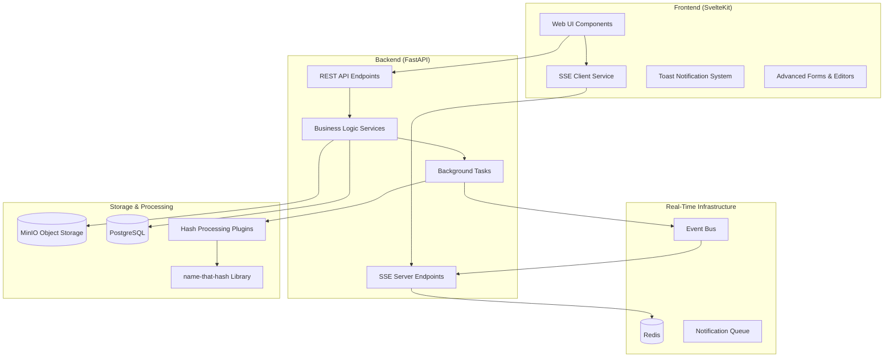
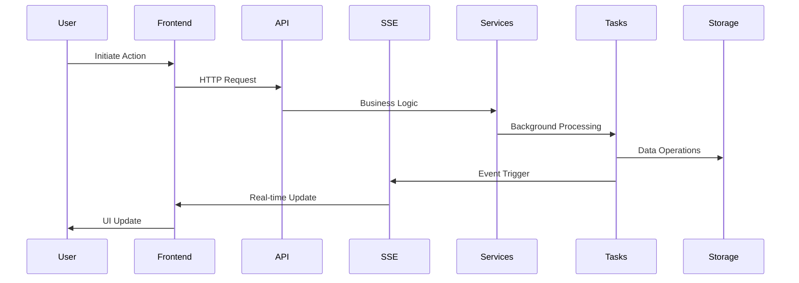

# Design Document

## Overview

This design document outlines the technical architecture for implementing advanced features and real-time capabilities in CipherSwarm's web interface. The system builds upon existing infrastructure including Phase 2b Resource Management, crackable uploads pipeline, and name-that-hash integration to provide a comprehensive, real-time user experience.

The design emphasizes modular architecture with clear separation of concerns, leveraging Server-Sent Events for real-time communication, plugin-based extensibility for hash processing, and comprehensive testing strategies to ensure reliability and maintainability.

## Architecture

### High-Level System Architecture



### Component Interaction Flow



## Components and Interfaces

### Real-Time Communication Layer

#### Server-Sent Events (SSE) Infrastructure

**SSE Endpoint Architecture:**

```python
# app/api/v1/endpoints/web/live.py
@router.get("/agents")
async def stream_agent_updates(
    current_user: User = Depends(get_current_user), project_id: int = Query(...)
) -> StreamingResponse:
    """Stream agent status updates for project-scoped filtering."""


@router.get("/campaigns")
async def stream_campaign_updates(
    current_user: User = Depends(get_current_user), project_id: int = Query(...)
) -> StreamingResponse:
    """Stream campaign progress updates."""


@router.get("/toasts")
async def stream_toast_notifications(
    current_user: User = Depends(get_current_user), project_id: int = Query(...)
) -> StreamingResponse:
    """Stream system notifications and alerts."""
```

**Event Broadcasting Service:**

```python
# app/core/services/event_service.py
class EventService:
    def __init__(self, redis_client: Redis):
        self.redis = redis_client

    async def broadcast_agent_status(
        self, project_id: int, agent_id: int, status: AgentStatus
    ) -> None:
        """Broadcast agent status change to project subscribers."""

    async def broadcast_campaign_progress(
        self, project_id: int, campaign_id: int, progress: float
    ) -> None:
        """Broadcast campaign progress update."""

    async def broadcast_crack_notification(
        self, project_id: int, crack_data: CrackEventData
    ) -> None:
        """Broadcast crack discovery notification."""
```

#### Frontend SSE Client Service

**SSE Connection Management:**

```typescript
// frontend/src/lib/services/sse-service.ts
export class SSEService {
    private connections: Map<string, EventSource> = new Map();
    private reconnectAttempts: Map<string, number> = new Map();
    
    async connect(endpoint: string, projectId: number): Promise<EventSource> {
        // Implement connection with exponential backoff
    }
    
    async disconnect(endpoint: string): Promise<void> {
        // Clean up connections and event listeners
    }
    
    private handleReconnection(endpoint: string): void {
        // Exponential backoff reconnection logic
    }
}
```

### Toast Notification System

#### Backend Notification Service

**Notification Processing:**

```python
# app/core/services/notification_service.py
class NotificationService:
    def __init__(self, event_service: EventService):
        self.event_service = event_service
        self.batch_queue: Dict[int, List[NotificationEvent]] = {}

    async def queue_crack_notification(
        self, project_id: int, crack_result: CrackResult
    ) -> None:
        """Queue crack notification with batching logic."""

    async def process_notification_batch(self, project_id: int) -> None:
        """Process batched notifications to prevent spam."""

    async def send_system_alert(self, project_id: int, alert: SystemAlert) -> None:
        """Send immediate system alert notification."""
```

#### Frontend Toast Component

**Toast Management:**

```typescript
// frontend/src/lib/components/ui/toast-manager.svelte
export interface ToastConfig {
    type: 'success' | 'error' | 'warning' | 'info';
    title: string;
    description?: string;
    duration?: number;
    actions?: ToastAction[];
    batchable?: boolean;
}

export class ToastManager {
    private toasts: Writable<Toast[]> = writable([]);
    private batchQueue: Map<string, Toast[]> = new Map();
    
    show(config: ToastConfig): void {
        // Handle individual and batched toast display
    }
    
    private processBatch(batchKey: string): void {
        // Combine multiple similar toasts into batch display
    }
}
```

### Advanced Attack Configuration

#### Attack Configuration Service

**Advanced Attack Features:**

```python
# app/core/services/advanced_attack_service.py
class AdvancedAttackService:
    def __init__(
        self,
        hash_guess_service: HashGuessService,
        keyspace_service: KeyspaceEstimationService,
    ):
        self.hash_guess_service = hash_guess_service
        self.keyspace_service = keyspace_service

    async def generate_dynamic_wordlist(
        self, project_id: int, source_type: DynamicWordlistSource
    ) -> EphemeralWordlist:
        """Generate wordlist from project history or cracked hashes."""

    async def detect_attack_overlap(
        self, attacks: List[Attack]
    ) -> List[OverlapWarning]:
        """Analyze keyspace overlap between attacks."""

    async def estimate_attack_performance(
        self, attack_config: AttackEstimateRequest
    ) -> AttackEstimateResponse:
        """Provide real-time keyspace and performance estimation."""
```

#### Rule Modificator System

**Rule Generation and Validation:**

```python
# app/core/services/rule_service.py
class RuleService:
    def __init__(self):
        self.rule_templates = self._load_rule_templates()

    def generate_rule_from_modifiers(self, modifiers: List[RuleModifier]) -> str:
        """Convert user-friendly modifiers to hashcat rules."""

    def validate_custom_rule(self, rule: str) -> RuleValidationResult:
        """Validate custom hashcat rule syntax."""

    def preview_rule_effects(self, rule: str, sample_words: List[str]) -> List[str]:
        """Show rule transformation preview."""
```

### Campaign Lifecycle Management

#### Campaign Operations Service

**Lifecycle Management:**

```python
# app/core/services/campaign_lifecycle_service.py
class CampaignLifecycleService:
    def __init__(self, task_service: TaskService, agent_service: AgentService):
        self.task_service = task_service
        self.agent_service = agent_service

    async def start_campaign(self, campaign_id: int, user: User) -> CampaignStartResult:
        """Start campaign with task generation and validation."""

    async def pause_campaign(self, campaign_id: int, user: User) -> CampaignPauseResult:
        """Safely pause running campaign."""

    async def resume_campaign(
        self, campaign_id: int, user: User
    ) -> CampaignResumeResult:
        """Resume paused campaign from checkpoint."""

    async def stop_campaign(
        self, campaign_id: int, user: User, impact_assessment: bool = True
    ) -> CampaignStopResult:
        """Stop campaign with impact assessment."""
```

#### Campaign Export/Import Service

**Template Management:**

```python
# app/core/services/campaign_template_service.py
class CampaignTemplateService:
    def __init__(self, storage_service: StorageService):
        self.storage_service = storage_service

    async def export_campaign_template(self, campaign_id: int) -> CampaignTemplate:
        """Export campaign as JSON template with GUID references."""

    async def import_campaign_template(
        self, template: CampaignTemplate, project_id: int, user: User
    ) -> Campaign:
        """Import and validate campaign template."""

    async def clone_campaign(
        self, source_campaign_id: int, target_project_id: int, user: User
    ) -> Campaign:
        """Clone campaign with new GUIDs."""
```

### Resource Management Enhancement

#### Enhanced Resource Service

**Complete Resource Operations:**

```python
# app/core/services/enhanced_resource_service.py
class EnhancedResourceService:
    def __init__(
        self,
        storage_service: StorageService,
        validation_service: ResourceValidationService,
    ):
        self.storage_service = storage_service
        self.validation_service = validation_service

    async def create_upload_session(
        self, resource_metadata: ResourceCreate, user: User
    ) -> UploadSession:
        """Create upload session with presigned URLs."""

    async def process_chunked_upload(
        self, upload_session_id: str, chunk_data: ChunkData
    ) -> ChunkProcessResult:
        """Handle chunked file upload with resume capability."""

    async def validate_and_finalize_upload(
        self, upload_session_id: str
    ) -> ResourceValidationResult:
        """Validate uploaded file and finalize resource creation."""
```

#### Resource Content Editor

**Line-Oriented Editing:**

```python
# app/core/services/resource_editor_service.py
class ResourceEditorService:
    def __init__(self, storage_service: StorageService):
        self.storage_service = storage_service

    async def get_editable_content(
        self, resource_id: int, line_range: Optional[Tuple[int, int]] = None
    ) -> EditableContent:
        """Get resource content for line-oriented editing."""

    async def update_resource_lines(
        self, resource_id: int, line_operations: List[LineOperation]
    ) -> ResourceUpdateResult:
        """Apply line-level changes with validation."""

    async def validate_content_changes(
        self, resource_id: int, proposed_changes: List[LineOperation]
    ) -> ValidationResult:
        """Real-time validation of content changes."""
```

### Hash List and Crackable Upload Integration

#### Enhanced Hash List Service

**Comprehensive Hash Management:**

```python
# app/core/services/enhanced_hash_list_service.py
class EnhancedHashListService:
    def __init__(
        self,
        hash_guess_service: HashGuessService,
        crackable_upload_service: CrackableUploadService,
    ):
        self.hash_guess_service = hash_guess_service
        self.crackable_upload_service = crackable_upload_service

    async def create_hash_list_from_upload(
        self, upload_data: HashListUploadData, user: User
    ) -> HashListCreationResult:
        """Create hash list with intelligent type detection."""

    async def analyze_hash_content(self, content: str) -> HashAnalysisResult:
        """Analyze pasted hash content with name-that-hash."""

    async def preview_hash_statistics(self, hash_list_id: int) -> HashListStatistics:
        """Generate preview statistics for hash list."""
```

#### Crackable Upload Processing Service

**Enhanced Upload Pipeline:**

```python
# app/core/services/enhanced_crackable_upload_service.py
class EnhancedCrackableUploadService:
    def __init__(
        self,
        plugin_dispatcher: PluginDispatcher,
        hash_guess_service: HashGuessService,
        campaign_service: CampaignService,
    ):
        self.plugin_dispatcher = plugin_dispatcher
        self.hash_guess_service = hash_guess_service
        self.campaign_service = campaign_service

    async def process_upload_with_preview(
        self, upload_task_id: int
    ) -> UploadProcessingResult:
        """Process upload with preview generation."""

    async def generate_campaign_from_upload(
        self, upload_task_id: int, campaign_config: CampaignGenerationConfig
    ) -> Campaign:
        """Generate campaign with automatic attack configuration."""

    async def create_dynamic_wordlist_from_upload(
        self, upload_task_id: int
    ) -> EphemeralWordlist:
        """Create wordlist from extracted usernames/passwords."""
```

## Data Models

### Real-Time Event Models

```python
# app/schemas/events.py
class SSEEvent(BaseModel):
    event_type: str
    project_id: int
    timestamp: datetime
    data: Dict[str, Any]


class AgentStatusEvent(SSEEvent):
    agent_id: int
    status: AgentStatus
    performance_metrics: Optional[Dict[str, float]]


class CampaignProgressEvent(SSEEvent):
    campaign_id: int
    progress_percentage: float
    estimated_completion: Optional[datetime]
    active_tasks: int


class CrackNotificationEvent(SSEEvent):
    hash_list_id: int
    crack_count: int
    crack_details: List[CrackDetail]
    agent_name: str
```

### Advanced Attack Models

```python
# app/schemas/advanced_attacks.py
class RuleModifier(BaseModel):
    type: RuleModifierType
    parameters: Dict[str, Any]
    enabled: bool = True


class AttackEstimateRequest(BaseModel):
    attack_mode: AttackMode
    hash_type: int
    wordlist_size: Optional[int]
    rule_count: Optional[int]
    mask_complexity: Optional[int]


class AttackEstimateResponse(BaseModel):
    keyspace_size: int
    estimated_duration: timedelta
    complexity_score: float
    recommendations: List[str]


class OverlapWarning(BaseModel):
    attack_ids: List[int]
    overlap_percentage: float
    recommendation: str
```

### Enhanced Resource Models

```python
# app/schemas/enhanced_resources.py
class UploadSession(BaseModel):
    id: str
    resource_metadata: ResourceCreate
    presigned_urls: List[PresignedURL]
    chunk_size: int
    total_chunks: int
    uploaded_chunks: List[int]
    status: UploadSessionStatus


class ChunkData(BaseModel):
    chunk_number: int
    chunk_size: int
    checksum: str
    is_final: bool


class EditableContent(BaseModel):
    resource_id: int
    content_lines: List[str]
    total_lines: int
    is_editable: bool
    size_limit_exceeded: bool


class LineOperation(BaseModel):
    operation: LineOperationType  # ADD, UPDATE, DELETE
    line_number: int
    content: Optional[str]
```

### Campaign Template Models

```python
# app/schemas/campaign_templates.py
class CampaignTemplate(BaseModel):
    version: str
    metadata: CampaignTemplateMetadata
    hash_list_config: HashListConfig
    attacks: List[AttackTemplate]
    resource_references: List[ResourceReference]


class AttackTemplate(BaseModel):
    attack_mode: AttackMode
    parameters: Dict[str, Any]
    resource_references: List[str]  # GUID references
    priority: int


class ResourceReference(BaseModel):
    guid: str
    resource_type: ResourceType
    name: str
    content_hash: Optional[str]
    is_ephemeral: bool
```

## Error Handling

### Comprehensive Error Management

**Error Classification:**

```python
# app/core/exceptions/advanced_features.py
class SSEConnectionError(Exception):
    """Raised when SSE connection fails or times out."""


class AttackOverlapError(Exception):
    """Raised when attack configurations have significant overlap."""


class ResourceUploadError(Exception):
    """Raised when resource upload fails validation or processing."""


class CampaignLifecycleError(Exception):
    """Raised when campaign state transitions are invalid."""


class TemplateImportError(Exception):
    """Raised when campaign template import fails validation."""
```

**Error Response Patterns:**

```python
# Error handling in endpoints
try:
    result = await advanced_service.process_request(data)
    return result
except AttackOverlapError as e:
    raise HTTPException(
        status_code=409,
        detail={
            "error": "attack_overlap",
            "message": str(e),
            "recommendations": e.recommendations,
        },
    )
except ResourceUploadError as e:
    raise HTTPException(
        status_code=422,
        detail={
            "error": "upload_validation_failed",
            "message": str(e),
            "validation_errors": e.validation_errors,
        },
    )
```

## Testing Strategy

### Multi-Tier Testing Approach

**Unit Testing:**

```python
# tests/unit/test_advanced_attack_service.py
@pytest.mark.asyncio
async def test_generate_dynamic_wordlist():
    service = AdvancedAttackService(mock_hash_guess, mock_keyspace)
    result = await service.generate_dynamic_wordlist(
        project_id=1, source_type=DynamicWordlistSource.CRACKED_HASHES
    )
    assert result.word_count > 0
    assert result.is_ephemeral is True
```

**Integration Testing:**

```python
# tests/integration/test_sse_endpoints.py
@pytest.mark.asyncio
async def test_sse_agent_updates(client, test_user, test_project):
    async with client.stream(
        "GET", f"/api/v1/web/live/agents?project_id={test_project.id}"
    ) as response:
        # Trigger agent status change
        await trigger_agent_status_change(test_project.id)

        # Verify SSE event received
        event = await response.aiter_lines().__anext__()
        assert "agent_status_change" in event
```

**End-to-End Testing:**

```typescript
// frontend/tests/e2e/advanced-features.test.ts
test('real-time campaign progress updates', async ({ page }) => {
    await page.goto('/campaigns/1');
    
    // Start campaign
    await page.click('[data-testid="start-campaign"]');
    
    // Verify real-time progress updates
    await expect(page.locator('[data-testid="progress-bar"]')).toBeVisible();
    
    // Wait for progress update via SSE
    await page.waitForFunction(() => {
        const progress = document.querySelector('[data-testid="progress-percentage"]');
        return progress && parseFloat(progress.textContent) > 0;
    });
});
```

**Mock Testing for SSE:**

```typescript
// frontend/e2e/mocked/sse-mock.test.ts
test('toast notifications with batching', async ({ page }) => {
    // Mock SSE endpoint
    await page.route('/api/v1/web/live/toasts*', (route) => {
        route.fulfill({
            status: 200,
            headers: { 'content-type': 'text/event-stream' },
            body: mockSSEStream([
                { type: 'crack_notification', data: { count: 5 } },
                { type: 'crack_notification', data: { count: 3 } }
            ])
        });
    });
    
    await page.goto('/dashboard');
    
    // Verify batched toast appears
    await expect(page.locator('[data-testid="toast-batch"]')).toContainText('8 new cracks');
});
```

### Performance Testing

**SSE Connection Load Testing:**

```python
# tests/performance/test_sse_load.py
@pytest.mark.asyncio
async def test_concurrent_sse_connections():
    """Test SSE performance with multiple concurrent connections."""
    connections = []
    for i in range(100):
        conn = await create_sse_connection(f"user_{i}")
        connections.append(conn)

    # Broadcast events and measure response time
    start_time = time.time()
    await broadcast_test_event()

    # Verify all connections receive event within threshold
    for conn in connections:
        event = await conn.receive_event(timeout=5.0)
        assert event is not None

    total_time = time.time() - start_time
    assert total_time < 2.0  # All events delivered within 2 seconds
```

## Implementation Notes

### Key Technical Patterns

**SSE Implementation Pattern:**

- Use Redis pub/sub for event distribution
- Implement connection pooling and cleanup
- Project-scoped filtering at the Redis level
- Graceful degradation to polling when SSE fails

**Resource Upload Pattern:**

- Chunked upload with resume capability
- Atomic operations using database transactions
- Presigned URL expiration and cleanup
- Background processing with status tracking

**Real-Time UI Updates:**

- Component-level state management with Svelte stores
- Optimistic updates with rollback capability
- Throttled updates to prevent UI flooding
- Connection status indicators for user feedback

**Plugin Architecture:**

- Dynamic plugin loading with validation
- Standardized plugin interface contracts
- Error isolation and recovery
- Plugin-specific configuration management

### Security Considerations

**SSE Security:**

- Project-scoped event filtering prevents data leaks
- Connection authentication and authorization
- Rate limiting on SSE endpoints
- Automatic connection cleanup on user logout

**Upload Security:**

- File type validation and sanitization
- Size limits and timeout enforcement
- Virus scanning integration points
- Secure temporary file handling

**Template Security:**

- Schema validation for imported templates
- GUID-based resource references prevent path traversal
- Version compatibility checks
- User permission validation for template operations

This design provides a comprehensive foundation for implementing the advanced features while maintaining security, performance, and maintainability standards established in the existing CipherSwarm architecture.
