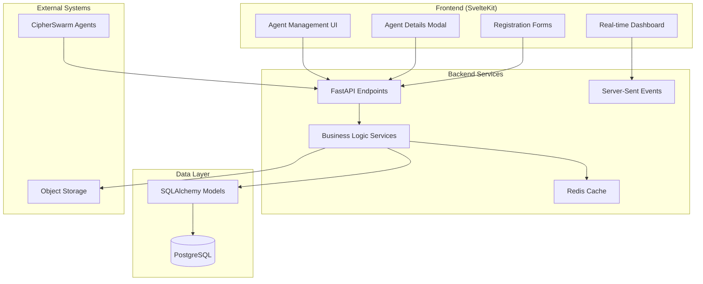
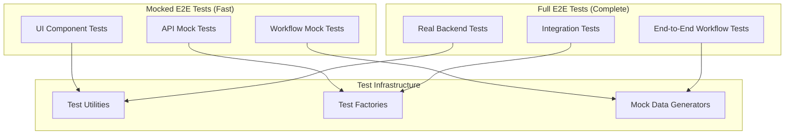

# Design Document

## Overview

This design document outlines the architecture and implementation approach for completing agent management functionality and implementing comprehensive cross-component integration workflows in CipherSwarm. The system will provide complete agent administrative capabilities while ensuring seamless integration across all components through robust workflows, real-time monitoring, and comprehensive error handling.

The design follows CipherSwarm's service layer architecture with FastAPI endpoints delegating to business logic services, using SQLAlchemy for data persistence, and SvelteKit for the frontend with real-time updates via Server-Sent Events.

## Architecture

### High-Level System Architecture



### Component Architecture

The system is organized into several key architectural components:

1. **Agent Management Layer**: Handles agent registration, configuration, and lifecycle management
2. **Integration Layer**: Manages cross-component workflows and data consistency
3. **Monitoring Layer**: Provides real-time performance tracking and health monitoring
4. **UI Layer**: Delivers comprehensive user interfaces with real-time updates
5. **Algorithm Layer**: Implements core business logic for task assignment and progress calculation

## Components and Interfaces

### Agent Management Components

#### Agent Registration Service
```python
class AgentRegistrationService:
    async def register_agent(
        self,
        db: AsyncSession,
        registration_data: AgentRegistrationRequest,
        current_user: User
    ) -> AgentRegistrationResponse:
        """Register new agent with token generation and project assignment."""
        
    async def generate_agent_token(self, agent_id: int) -> str:
        """Generate secure agent token in format csa_<agent_id>_<random_string>."""
        
    async def assign_projects(
        self,
        db: AsyncSession,
        agent_id: int,
        project_ids: list[int]
    ) -> None:
        """Assign agent to specified projects."""
```

#### Agent Configuration Service
```python
class AgentConfigurationService:
    async def update_agent_settings(
        self,
        db: AsyncSession,
        agent_id: int,
        settings: AgentSettingsUpdate
    ) -> Agent:
        """Update agent configuration settings."""
        
    async def configure_hardware(
        self,
        db: AsyncSession,
        agent_id: int,
        hardware_config: HardwareConfiguration
    ) -> Agent:
        """Configure agent hardware settings and backend devices."""
        
    async def trigger_benchmark(
        self,
        db: AsyncSession,
        agent_id: int
    ) -> None:
        """Trigger agent benchmark by setting state to pending."""
```

#### Agent Monitoring Service
```python
class AgentMonitoringService:
    async def get_agent_performance_data(
        self,
        db: AsyncSession,
        agent_id: int,
        time_window: timedelta = timedelta(hours=8)
    ) -> AgentPerformanceData:
        """Get agent performance metrics over specified time window."""
        
    async def get_agent_status_summary(
        self,
        db: AsyncSession
    ) -> list[AgentStatusSummary]:
        """Get summary status for all agents."""
        
    async def get_agent_errors(
        self,
        db: AsyncSession,
        agent_id: int,
        filters: AgentErrorFilters
    ) -> list[AgentError]:
        """Get filtered agent error logs."""
```

### Cross-Component Integration Services

#### Campaign Integration Service
```python
class CampaignIntegrationService:
    async def create_campaign_with_resources(
        self,
        db: AsyncSession,
        campaign_data: CampaignCreateRequest,
        resources: list[ResourceReference]
    ) -> Campaign:
        """Create campaign and integrate with uploaded resources."""
        
    async def execute_campaign_workflow(
        self,
        db: AsyncSession,
        campaign_id: int
    ) -> CampaignExecutionResult:
        """Execute complete campaign workflow from creation to completion."""
        
    async def handle_campaign_state_transitions(
        self,
        db: AsyncSession,
        campaign_id: int,
        new_state: CampaignState
    ) -> Campaign:
        """Handle campaign state transitions with proper validation."""
```

#### Resource Integration Service
```python
class ResourceIntegrationService:
    async def integrate_resource_with_attacks(
        self,
        db: AsyncSession,
        resource_id: int
    ) -> None:
        """Integrate newly created resource with existing attack configurations."""
        
    async def validate_resource_dependencies(
        self,
        db: AsyncSession,
        attack_config: AttackConfiguration
    ) -> ValidationResult:
        """Validate that all required resources are available for attack."""
        
    async def track_resource_usage(
        self,
        db: AsyncSession,
        resource_id: int,
        usage_context: ResourceUsageContext
    ) -> None:
        """Track resource usage across attacks and campaigns."""
```

### Real-Time Monitoring Components

#### SSE Event Service
```python
class SSEEventService:
    async def broadcast_agent_status_update(
        self,
        agent_id: int,
        status_data: AgentStatusUpdate
    ) -> None:
        """Broadcast agent status updates to connected clients."""
        
    async def broadcast_campaign_progress(
        self,
        campaign_id: int,
        progress_data: CampaignProgressUpdate
    ) -> None:
        """Broadcast campaign progress updates."""
        
    async def broadcast_crack_notification(
        self,
        crack_result: CrackResult
    ) -> None:
        """Broadcast hash crack notifications with rate limiting."""
```

#### Performance Monitoring Service
```python
class PerformanceMonitoringService:
    async def collect_agent_metrics(
        self,
        db: AsyncSession,
        agent_id: int
    ) -> AgentMetrics:
        """Collect comprehensive agent performance metrics."""
        
    async def generate_performance_charts(
        self,
        metrics_data: list[AgentMetrics],
        chart_type: ChartType
    ) -> ChartData:
        """Generate chart data for performance visualization."""
        
    async def calculate_utilization_trends(
        self,
        device_status_history: list[DeviceStatus]
    ) -> UtilizationTrends:
        """Calculate device utilization trends over time."""
```

### Core Algorithm Services

#### Task Assignment Service
```python
class TaskAssignmentService:
    async def assign_task_to_agent(
        self,
        db: AsyncSession,
        agent: Agent
    ) -> Optional[Task]:
        """Assign compatible task to agent based on benchmark capabilities."""
        
    async def can_handle_hash_type(
        self,
        agent: Agent,
        hash_type_id: int
    ) -> bool:
        """Check if agent has benchmark capability for hash type."""
        
    async def get_agent_benchmark_compatibility(
        self,
        db: AsyncSession,
        agent_id: int
    ) -> dict[int, float]:
        """Get agent's benchmark compatibility map."""
```

#### Progress Calculation Service
```python
class ProgressCalculationService:
    async def calculate_task_progress(
        self,
        task: Task
    ) -> float:
        """Calculate task completion progress."""
        
    async def calculate_attack_progress(
        self,
        db: AsyncSession,
        attack: Attack
    ) -> float:
        """Calculate keyspace-weighted attack progress."""
        
    async def calculate_campaign_progress(
        self,
        db: AsyncSession,
        campaign: Campaign
    ) -> float:
        """Calculate keyspace-weighted campaign progress."""
```

#### Keyspace Estimation Service
```python
class KeyspaceEstimationService:
    async def estimate_attack_keyspace(
        self,
        attack_config: AttackConfiguration,
        resources: AttackResources
    ) -> int:
        """Estimate total keyspace for attack configuration."""
        
    async def estimate_dictionary_keyspace(
        self,
        wordlist_size: int,
        rule_count: int
    ) -> int:
        """Estimate keyspace for dictionary attacks."""
        
    async def estimate_mask_keyspace(
        self,
        mask: str,
        custom_charsets: dict[str, str],
        increment: bool = False,
        min_len: int = 1,
        max_len: int = 0
    ) -> int:
        """Estimate keyspace for mask attacks."""
```

## Data Models

### Enhanced Agent Model
```python
class Agent(Base):
    id: Mapped[int] = mapped_column(Integer, primary_key=True)
    custom_label: Mapped[str] = mapped_column(String(255), nullable=True)
    host_name: Mapped[str] = mapped_column(String(255), nullable=False)
    client_signature: Mapped[str] = mapped_column(String(255), nullable=False)
    operating_system: Mapped[str] = mapped_column(String(100), nullable=False)
    last_seen_ip: Mapped[str] = mapped_column(String(45), nullable=True)
    
    # Hardware and configuration
    devices: Mapped[list[str]] = mapped_column(JSON, default=list)
    backend_device: Mapped[str] = mapped_column(String(255), nullable=True)
    
    # State and configuration
    state: Mapped[AgentState] = mapped_column(Enum(AgentState), default=AgentState.pending)
    enabled: Mapped[bool] = mapped_column(Boolean, default=True)
    
    # Advanced configuration
    advanced_configuration: Mapped["AdvancedAgentConfiguration"] = relationship(
        "AdvancedAgentConfiguration", back_populates="agent", uselist=False
    )
    
    # Relationships
    benchmarks: Mapped[list["HashcatBenchmark"]] = relationship(
        "HashcatBenchmark", back_populates="agent"
    )
    project_assignments: Mapped[list["AgentProjectAssignment"]] = relationship(
        "AgentProjectAssignment", back_populates="agent"
    )
    
    @property
    def display_name(self) -> str:
        """Agent display name using custom_label or host_name fallback."""
        return self.custom_label or self.host_name
```

### Agent Performance Tracking Models
```python
class AgentPerformanceMetric(Base):
    id: Mapped[int] = mapped_column(Integer, primary_key=True)
    agent_id: Mapped[int] = mapped_column(Integer, ForeignKey("agents.id"))
    device_id: Mapped[int] = mapped_column(Integer, nullable=False)
    device_name: Mapped[str] = mapped_column(String(255), nullable=False)
    
    # Performance data
    speed: Mapped[int] = mapped_column(BigInteger, nullable=False)  # hashes/sec
    utilization: Mapped[int] = mapped_column(Integer, nullable=False)  # percentage
    temperature: Mapped[int] = mapped_column(Integer, nullable=False)  # celsius or -1
    
    # Timing
    recorded_at: Mapped[datetime] = mapped_column(
        DateTime(timezone=True), default=datetime.utcnow
    )
    
    agent: Mapped["Agent"] = relationship("Agent")

class AgentError(Base):
    id: Mapped[int] = mapped_column(Integer, primary_key=True)
    agent_id: Mapped[int] = mapped_column(Integer, ForeignKey("agents.id"))
    task_id: Mapped[int] = mapped_column(Integer, ForeignKey("tasks.id"), nullable=True)
    
    # Error details
    message: Mapped[str] = mapped_column(Text, nullable=False)
    severity: Mapped[ErrorSeverity] = mapped_column(Enum(ErrorSeverity))
    error_code: Mapped[str] = mapped_column(String(50), nullable=True)
    details: Mapped[dict] = mapped_column(JSON, nullable=True)
    
    # Timing
    occurred_at: Mapped[datetime] = mapped_column(
        DateTime(timezone=True), default=datetime.utcnow
    )
    
    agent: Mapped["Agent"] = relationship("Agent")
    task: Mapped["Task"] = relationship("Task")
```

### Integration Tracking Models
```python
class ResourceUsageTracking(Base):
    id: Mapped[int] = mapped_column(Integer, primary_key=True)
    resource_id: Mapped[int] = mapped_column(Integer, ForeignKey("attack_resource_files.id"))
    attack_id: Mapped[int] = mapped_column(Integer, ForeignKey("attacks.id"))
    campaign_id: Mapped[int] = mapped_column(Integer, ForeignKey("campaigns.id"))
    
    # Usage context
    usage_type: Mapped[ResourceUsageType] = mapped_column(Enum(ResourceUsageType))
    used_at: Mapped[datetime] = mapped_column(DateTime(timezone=True), default=datetime.utcnow)
    
    resource: Mapped["AttackResourceFile"] = relationship("AttackResourceFile")
    attack: Mapped["Attack"] = relationship("Attack")
    campaign: Mapped["Campaign"] = relationship("Campaign")

class WorkflowExecution(Base):
    id: Mapped[int] = mapped_column(Integer, primary_key=True)
    workflow_type: Mapped[WorkflowType] = mapped_column(Enum(WorkflowType))
    entity_id: Mapped[int] = mapped_column(Integer, nullable=False)  # campaign_id, attack_id, etc.
    
    # Execution tracking
    status: Mapped[WorkflowStatus] = mapped_column(Enum(WorkflowStatus))
    started_at: Mapped[datetime] = mapped_column(DateTime(timezone=True), default=datetime.utcnow)
    completed_at: Mapped[datetime] = mapped_column(DateTime(timezone=True), nullable=True)
    error_message: Mapped[str] = mapped_column(Text, nullable=True)
    
    # Context data
    context_data: Mapped[dict] = mapped_column(JSON, nullable=True)
```

## Error Handling

### Error Recovery Strategies

#### Network and Connection Errors
```python
class NetworkErrorHandler:
    async def handle_connection_timeout(
        self,
        operation: Callable,
        max_retries: int = 3,
        backoff_factor: float = 1.5
    ) -> Any:
        """Handle connection timeouts with exponential backoff retry."""
        
    async def handle_sse_disconnection(
        self,
        client_id: str,
        reconnection_strategy: ReconnectionStrategy
    ) -> None:
        """Handle SSE disconnections with user-controlled recovery."""
        
    async def graceful_degradation(
        self,
        service_unavailable: str,
        fallback_data: Any
    ) -> Any:
        """Provide graceful degradation when services are unavailable."""
```

#### File and Data Handling Errors
```python
class FileErrorHandler:
    async def handle_large_file_upload(
        self,
        file_stream: AsyncIterator[bytes],
        resume_token: str = None
    ) -> UploadResult:
        """Handle large file uploads with interruption recovery."""
        
    async def handle_upload_interruption(
        self,
        upload_id: str,
        resume_from: int
    ) -> ResumeResult:
        """Handle upload interruption and resume capability."""
        
    async def detect_data_corruption(
        self,
        file_path: str,
        expected_checksum: str
    ) -> ValidationResult:
        """Detect and handle data corruption."""
```

#### User Interaction Edge Cases
```python
class UserInteractionErrorHandler:
    async def handle_concurrent_modifications(
        self,
        entity_id: int,
        entity_type: str,
        user_modifications: dict,
        current_version: int
    ) -> ConflictResolution:
        """Handle concurrent user modifications with conflict resolution."""
        
    async def handle_browser_refresh(
        self,
        session_id: str,
        operation_state: dict
    ) -> StateRecovery:
        """Handle browser refresh during operations."""
        
    async def handle_session_expiry(
        self,
        user_id: int,
        operation_context: dict
    ) -> SessionRecovery:
        """Handle session expiry during long operations."""
```

### Error Page System
```python
class ErrorPageService:
    async def generate_error_page(
        self,
        error_type: ErrorType,
        error_context: dict,
        recovery_options: list[RecoveryOption]
    ) -> ErrorPageData:
        """Generate contextual error pages with recovery options."""
        
    async def track_error_occurrence(
        self,
        error_id: str,
        user_id: int,
        error_context: dict
    ) -> None:
        """Track error occurrences for analysis and improvement."""
```

## Testing Strategy

### Testing Architecture Overview

The testing strategy follows CipherSwarm's comprehensive approach with both mocked E2E tests and full E2E tests:



### Agent Management Testing
```python
class AgentManagementTestSuite:
    async def test_agent_registration_workflow(self):
        """Test complete agent registration with token generation."""
        
    async def test_agent_details_modal_functionality(self):
        """Test all 5 tabs of agent details modal."""
        
    async def test_agent_hardware_configuration(self):
        """Test hardware device management and backend configuration."""
        
    async def test_agent_performance_monitoring(self):
        """Test real-time performance charts and metrics."""
        
    async def test_agent_administration_functions(self):
        """Test admin-only agent management functions."""
```

### Cross-Component Integration Testing
```python
class IntegrationTestSuite:
    async def test_campaign_creation_to_execution(self):
        """Test complete campaign workflow from creation to completion."""
        
    async def test_resource_integration_workflow(self):
        """Test resource creation and immediate use in attacks."""
        
    async def test_agent_task_assignment_workflow(self):
        """Test agent registration to task assignment workflow."""
        
    async def test_multi_user_collaboration(self):
        """Test multi-user scenarios with proper permissions."""
        
    async def test_project_switching_workflow(self):
        """Test project switching with data context updates."""
```

### Error Handling Testing
```python
class ErrorHandlingTestSuite:
    async def test_network_failure_recovery(self):
        """Test network failure handling and recovery mechanisms."""
        
    async def test_large_file_upload_handling(self):
        """Test large file upload with interruption and resume."""
        
    async def test_concurrent_modification_resolution(self):
        """Test concurrent user modification conflict resolution."""
        
    async def test_session_expiry_handling(self):
        """Test session expiry during long operations."""
        
    async def test_error_page_generation(self):
        """Test error page display and recovery options."""
```

## Security Considerations

### Authentication and Authorization
```python
class SecurityService:
    async def validate_agent_token(
        self,
        token: str
    ) -> Optional[Agent]:
        """Validate agent token format and authenticity."""
        
    async def enforce_admin_permissions(
        self,
        user: User,
        operation: AdminOperation
    ) -> None:
        """Enforce admin-only permissions for sensitive operations."""
        
    async def validate_project_access(
        self,
        user: User,
        project_id: int,
        operation: ProjectOperation
    ) -> None:
        """Validate user access to project resources."""
```

### Input Validation and Sanitization
```python
class InputValidationService:
    async def validate_agent_configuration(
        self,
        config_data: dict
    ) -> ValidationResult:
        """Validate agent configuration data."""
        
    async def sanitize_file_upload(
        self,
        file_data: bytes,
        file_type: str
    ) -> SanitizationResult:
        """Sanitize uploaded files for security."""
        
    async def validate_api_input(
        self,
        input_data: dict,
        schema: Schema
    ) -> ValidationResult:
        """Validate API input against schema."""
```

### CSRF and Session Security
```python
class CSRFProtectionService:
    async def generate_csrf_token(
        self,
        session_id: str
    ) -> str:
        """Generate CSRF token for form protection."""
        
    async def validate_csrf_token(
        self,
        token: str,
        session_id: str
    ) -> bool:
        """Validate CSRF token authenticity."""
        
    async def secure_session_management(
        self,
        user_id: int,
        session_data: dict
    ) -> SecureSession:
        """Manage secure user sessions with proper timeout handling."""
```

## Performance Optimization

### Caching Strategy
```python
class CacheService:
    async def cache_agent_performance_data(
        self,
        agent_id: int,
        performance_data: AgentPerformanceData,
        ttl: int = 60
    ) -> None:
        """Cache agent performance data with appropriate TTL."""
        
    async def cache_keyspace_estimations(
        self,
        attack_config_hash: str,
        keyspace: int,
        ttl: int = 3600
    ) -> None:
        """Cache keyspace estimations for repeated calculations."""
        
    async def invalidate_related_cache(
        self,
        entity_type: str,
        entity_id: int
    ) -> None:
        """Invalidate related cache entries when data changes."""
```

### Database Optimization
```python
class DatabaseOptimizationService:
    async def optimize_agent_queries(
        self,
        query_params: dict
    ) -> OptimizedQuery:
        """Optimize agent-related database queries."""
        
    async def batch_performance_updates(
        self,
        performance_updates: list[PerformanceUpdate]
    ) -> None:
        """Batch performance metric updates for efficiency."""
        
    async def index_optimization(
        self,
        table_name: str,
        query_patterns: list[str]
    ) -> IndexRecommendations:
        """Provide index optimization recommendations."""
```

### Real-Time Update Optimization
```python
class RealTimeOptimizationService:
    async def optimize_sse_broadcasts(
        self,
        event_type: str,
        target_clients: list[str]
    ) -> None:
        """Optimize SSE broadcasts for performance."""
        
    async def batch_status_updates(
        self,
        updates: list[StatusUpdate],
        batch_window: timedelta = timedelta(seconds=1)
    ) -> None:
        """Batch status updates to reduce broadcast frequency."""
        
    async def prioritize_critical_updates(
        self,
        updates: list[Update]
    ) -> list[Update]:
        """Prioritize critical updates over routine status changes."""
```

This comprehensive design provides the foundation for implementing complete agent management functionality and cross-component integration workflows while maintaining security, performance, and reliability standards.