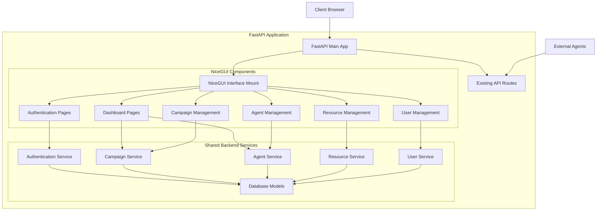

# Design Document

## Overview

The NiceGUI Web Interface will be implemented as an integrated component of the CipherSwarm FastAPI backend, providing a Python-native alternative to the existing SvelteKit frontend. This design leverages NiceGUI's reactive components and FastAPI's existing authentication and API infrastructure to create a seamless, single-deployment web interface.

The interface will be mounted at the `/ui/` path and will utilize the existing backend services, authentication system, and database models while providing a modern, responsive user experience comparable to the SvelteKit frontend.

## Architecture

### High-Level Architecture



### Component Architecture

The NiceGUI interface will be organized into the following component hierarchy:

```
app/ui/
├── __init__.py              # NiceGUI app initialization and mounting
├── main.py                  # Main UI application entry point
├── auth/                    # Authentication components
│   ├── __init__.py
│   ├── login.py            # Login page component
│   └── middleware.py       # Authentication middleware
├── components/             # Reusable UI components
│   ├── __init__.py
│   ├── layout.py           # Base layout and navigation
│   ├── cards.py            # Metric cards and data cards
│   ├── tables.py           # Data tables with sorting/filtering
│   ├── forms.py            # Form components
│   ├── charts.py           # Progress bars and charts
│   └── notifications.py    # Toast notifications and alerts
├── pages/                  # Page components
│   ├── __init__.py
│   ├── dashboard.py        # Dashboard page
│   ├── campaigns.py        # Campaign management pages
│   ├── agents.py           # Agent management pages
│   ├── attacks.py          # Attack configuration pages
│   ├── resources.py        # Resource management pages
│   ├── users.py            # User management pages
│   └── settings.py         # Settings page
├── services/               # UI-specific service layer
│   ├── __init__.py
│   ├── ui_auth.py          # UI authentication helpers
│   ├── ui_data.py          # Data formatting and transformation
│   └── ui_events.py        # Real-time event handling
└── static/                 # Static assets for NiceGUI
    ├── css/
    ├── js/
    └── images/
```

## Components and Interfaces

### 1. Application Initialization

**NiceGUI Integration (`app/ui/__init__.py`)**

```python
from nicegui import ui
from fastapi import FastAPI
from app.ui.pages import setup_ui_pages
from app.ui.auth.middleware import setup_auth_middleware

def setup_nicegui_interface(fastapi_app: FastAPI) -> None:
    """Setup NiceGUI interface integrated with FastAPI application"""

    # Setup authentication middleware for UI routes
    setup_auth_middleware(fastapi_app)

    # Create and configure UI page routes
    setup_ui_pages()

    # This integrates NiceGUI routes directly into the FastAPI app
    # instead of mounting as a separate application
    # The mount_path parameter makes all UI routes available under /ui/
    return fastapi_app  # NiceGUI routes are now part of the main app

# In main.py, this would be called like:
# from app.ui import setup_nicegui_interface
# setup_nicegui_interface(app)
# ui.run_with(app, mount_path='/ui', storage_secret=settings.SECRET_KEY)
```

### 2. Authentication System

**Authentication Middleware (`app/ui/auth/middleware.py`)**

```python
from nicegui import app, ui
from fastapi import Request, HTTPException
from app.core.auth import verify_session_token
from app.ui.auth.login import login_page

class UIAuthMiddleware:
    def __init__(self):
        self.protected_paths = ['/ui/dashboard', '/ui/campaigns', '/ui/agents',
                               '/ui/attacks', '/ui/resources', '/ui/users', '/ui/settings']

    async def __call__(self, request: Request):
        path = request.url.path

        if any(path.startswith(p) for p in self.protected_paths):
            # Check authentication using NiceGUI's app.storage
            if not app.storage.user.get('authenticated', False):
                # Use NiceGUI's proper navigation for middleware
                return {'redirect': '/ui/login'}

            # Store user info in request state for use in handlers
            request.state.user = {
                'id': app.storage.user.get('user_id'),
                'username': app.storage.user.get('username'),
                'login_time': app.storage.user.get('login_time')
            }
```

**Login Page (`app/ui/auth/login.py`)**

```python
from nicegui import ui, app
from app.core.auth import authenticate_user, create_session_token
from datetime import datetime

@ui.page('/ui/login')
async def login_page():
    with ui.card().classes('w-96 mx-auto mt-20'):
        ui.label('CipherSwarm Login').classes('text-2xl font-bold mb-4')

        username_input = ui.input('Username').classes('w-full')
        password_input = ui.input('Password', password=True).classes('w-full')

        async def handle_login():
            try:
                user = await authenticate_user(username_input.value, password_input.value)

                # Store user session in NiceGUI's app.storage
                app.storage.user['authenticated'] = True
                app.storage.user['user_id'] = user.id
                app.storage.user['username'] = user.username
                app.storage.user['login_time'] = datetime.utcnow().isoformat()

                # Navigate to dashboard using NiceGUI's navigation
                ui.navigate.to('/ui/dashboard')
            except Exception as e:
                ui.notify(f'Login failed: {str(e)}', type='negative')

        ui.button('Login', on_click=handle_login).classes('w-full mt-4')
```

### 3. Layout System

**Base Layout (`app/ui/components/layout.py`)**

```python
from nicegui import ui, app
from typing import Callable, Optional

class AppLayout:
    def __init__(self, user: Optional[dict] = None):
        self.user = user
        self.sidebar_items = [
            {'label': 'Dashboard', 'path': '/ui/dashboard', 'icon': 'dashboard'},
            {'label': 'Campaigns', 'path': '/ui/campaigns', 'icon': 'campaign'},
            {'label': 'Agents', 'path': '/ui/agents', 'icon': 'smart_toy'},
            {'label': 'Attacks', 'path': '/ui/attacks', 'icon': 'security'},
            {'label': 'Resources', 'path': '/ui/resources', 'icon': 'folder'},
            {'label': 'Users', 'path': '/ui/users', 'icon': 'people', 'admin_only': True},
            {'label': 'Settings', 'path': '/ui/settings', 'icon': 'settings'},
        ]

    def create_layout(self, content_func: Callable):
        with ui.header().classes('bg-primary text-white'):
            with ui.row().classes('w-full items-center'):
                ui.label('CipherSwarm').classes('text-xl font-bold')
                ui.space()
                if self.user:
                    with ui.dropdown_button(self.user['name']):
                        ui.item('Profile', on_click=lambda: ui.navigate.to('/ui/profile'))
                        ui.item('Logout', on_click=self._handle_logout)

        with ui.left_drawer().classes('bg-gray-100'):
            self._create_sidebar()

        with ui.page_sticky(position='bottom-right', x_offset=20, y_offset=20):
            ui.button(icon='refresh', on_click=self._refresh_data).props('fab color=primary')

        # Main content area
        with ui.column().classes('w-full p-4'):
            content_func()

    def _create_sidebar(self):
        for item in self.sidebar_items:
            if item.get('admin_only') and not self._is_admin():
                continue

            with ui.item(clickable=True, on_click=lambda path=item['path']: ui.navigate.to(path)):
                with ui.item_section(avatar=True):
                    ui.icon(item['icon'])
                with ui.item_section():
                    ui.item_label(item['label'])

    def _is_admin(self) -> bool:
        return self.user and self.user.get('role') in ['admin', 'project_admin']

    def _handle_logout(self):
        # Clear user session from NiceGUI storage
        app.storage.user.clear()

        # Navigate to login page
        ui.navigate.to('/ui/login')

    def _refresh_data(self):
        ui.notify('Refreshing data...', type='info')
        # Use NiceGUI's reactive refresh pattern instead of JavaScript
        # This will trigger a re-render of the current page
        ui.refresh()
```

### 4. Dashboard Components

**Dashboard Page (`app/ui/pages/dashboard.py`)**

```python
from nicegui import ui, app
from app.ui.components.layout import AppLayout
from app.ui.components.cards import MetricCard, CampaignCard
from app.core.services.dashboard_service import DashboardService
from app.ui.services.ui_events import setup_realtime_updates

@ui.page('/ui/dashboard')
async def dashboard_page(request):
    user = request.state.user
    layout = AppLayout(user)

    # Get dashboard data
    dashboard_service = DashboardService()
    dashboard_data = await dashboard_service.get_dashboard_summary()
    campaigns = await dashboard_service.get_recent_campaigns()

    def create_dashboard_content():
        ui.label('Dashboard').classes('text-3xl font-bold mb-6')

        # Metrics row
        with ui.row().classes('w-full gap-4 mb-6'):
            MetricCard(
                title='Active Agents',
                value=dashboard_data.active_agents,
                subtitle=f'/ {dashboard_data.total_agents} Total',
                icon='smart_toy',
                color='primary'
            )
            MetricCard(
                title='Running Tasks',
                value=dashboard_data.running_tasks,
                subtitle='Active Campaigns',
                icon='play_arrow',
                color='positive'
            )
            MetricCard(
                title='Cracked Hashes',
                value=dashboard_data.recently_cracked_hashes,
                subtitle='Last 24h',
                icon='check_circle',
                color='positive'
            )
            MetricCard(
                title='Resource Usage',
                value='85%',
                subtitle='System Load',
                icon='memory',
                color='warning'
            )

        # Campaigns section
        ui.label('Recent Campaigns').classes('text-xl font-semibold mb-4')

        if campaigns:
            with ui.column().classes('w-full gap-4'):
                for campaign in campaigns:
                    CampaignCard(campaign)
        else:
            with ui.card().classes('w-full p-8 text-center'):
                ui.label('No campaigns yet').classes('text-gray-500')
                ui.button('Create Campaign',
                         on_click=lambda: ui.navigate.to('/ui/campaigns/new')).classes('mt-4')

        # Setup real-time updates
        setup_realtime_updates('dashboard', _update_dashboard_data)

    def _update_dashboard_data(data):
        # Update dashboard metrics in real-time
        ui.notify(f'Dashboard updated: {data.get("message", "")}', type='info')

    layout.create_layout(create_dashboard_content)
```

**Metric Card Component (`app/ui/components/cards.py`)**

```python
from nicegui import ui
from typing import Optional

class MetricCard:
    def __init__(self, title: str, value: str | int, subtitle: str = '',
                 icon: str = '', color: str = 'primary'):
        with ui.card().classes('p-4 cursor-pointer hover:shadow-lg transition-shadow'):
            with ui.row().classes('items-center justify-between w-full'):
                with ui.column().classes('flex-grow'):
                    ui.label(title).classes('text-sm text-gray-600 mb-1')
                    ui.label(str(value)).classes('text-3xl font-bold mb-1')
                    if subtitle:
                        ui.label(subtitle).classes('text-xs text-gray-500')

                if icon:
                    ui.icon(icon).classes(f'text-4xl text-{color}')

class CampaignCard:
    def __init__(self, campaign: dict):
        with ui.card().classes('w-full p-4 hover:shadow-md transition-shadow cursor-pointer'):
            with ui.row().classes('items-center justify-between w-full'):
                with ui.column().classes('flex-grow'):
                    ui.label(campaign['name']).classes('font-semibold text-lg')
                    ui.label(campaign.get('description', 'No description')).classes('text-gray-600 text-sm')

                    # Progress bar
                    progress = campaign.get('progress', 0)
                    with ui.row().classes('items-center gap-2 mt-2'):
                        ui.linear_progress(progress / 100).classes('flex-grow')
                        ui.label(f'{progress:.1f}%').classes('text-sm')

                with ui.column().classes('items-end'):
                    # Status badge
                    status_color = {
                        'active': 'positive',
                        'draft': 'warning',
                        'archived': 'grey'
                    }.get(campaign.get('state', 'draft'), 'grey')

                    ui.badge(campaign.get('state', 'draft')).props(f'color={status_color}')

                    # Last updated
                    if campaign.get('updated_at'):
                        ui.label(f"Updated {campaign['updated_at']}").classes('text-xs text-gray-500 mt-1')
```

### 5. Data Management Components

**Data Table Component (`app/ui/components/tables.py`)**

```python
from nicegui import ui
from typing import List, Dict, Callable, Optional

class DataTable:
    def __init__(self, columns: List[Dict], data: List[Dict],
                 on_row_click: Optional[Callable] = None,
                 searchable: bool = True,
                 sortable: bool = True,
                 pagination: bool = True):

        self.columns = columns
        self.data = data
        self.filtered_data = data.copy()
        self.on_row_click = on_row_click
        self.search_term = ''
        self.sort_column = None
        self.sort_direction = 'asc'
        self.page = 1
        self.page_size = 10

        # Create reactive containers
        self.table_container = ui.column().classes('w-full')
        self.search_input = None
        self.table = None
        self.pagination_container = None

        self._create_table(searchable, sortable, pagination)

    def _create_table(self, searchable: bool, sortable: bool, pagination: bool):
        with self.table_container:
            # Search bar
            if searchable:
                self.search_input = ui.input('Search...').classes('w-full mb-4')
                self.search_input.on('input', self._handle_search)

            # Table with proper NiceGUI reactive patterns
            self.table = ui.table(columns=self.columns, rows=self.filtered_data).classes('w-full')

            if sortable:
                self.table.on('sort', self._handle_sort)

            if self.on_row_click:
                self.table.on('rowClick', self._handle_row_click)

            # Pagination
            if pagination:
                self.pagination_container = ui.row().classes('justify-center mt-4')
                self._create_pagination()

    def _handle_search(self, e):
        self.search_term = e.sender.value.lower()
        self._filter_data()

    def _handle_sort(self, e):
        self.sort_column = e.args['column']
        self.sort_direction = e.args['direction']
        self._sort_data()

    def _handle_row_click(self, e):
        if self.on_row_click:
            self.on_row_click(e.args['row'])

    def _filter_data(self):
        if not self.search_term:
            self.filtered_data = self.data.copy()
        else:
            self.filtered_data = [
                row for row in self.data
                if any(self.search_term in str(value).lower()
                      for value in row.values())
            ]
        self._update_table()

    def _sort_data(self):
        if self.sort_column:
            reverse = self.sort_direction == 'desc'
            self.filtered_data.sort(
                key=lambda x: x.get(self.sort_column, ''),
                reverse=reverse
            )
        self._update_table()

    def _update_table(self):
        # Update table using NiceGUI's reactive update pattern
        if self.table:
            self.table.rows = self.filtered_data
            self.table.update()

    def _create_pagination(self):
        if not self.pagination_container:
            return

        total_pages = (len(self.filtered_data) + self.page_size - 1) // self.page_size

        with self.pagination_container:
            ui.button('Previous',
                     on_click=lambda: self._change_page(self.page - 1),
                     enabled=self.page > 1)

            ui.label(f'Page {self.page} of {total_pages}').classes('mx-4')

            ui.button('Next',
                     on_click=lambda: self._change_page(self.page + 1),
                     enabled=self.page < total_pages)

    def _change_page(self, new_page: int):
        self.page = new_page
        self._update_table()
```

## Data Models

### UI Data Transfer Objects

The NiceGUI interface will use simplified data transfer objects optimized for UI display:

```python
from pydantic import BaseModel
from typing import List, Optional
from datetime import datetime

class UIDashboardSummary(BaseModel):
    active_agents: int
    total_agents: int
    running_tasks: int
    recently_cracked_hashes: int
    resource_usage: List[dict]

class UICampaignSummary(BaseModel):
    id: int
    name: str
    state: str
    progress: float
    description: Optional[str]
    updated_at: datetime
    attack_count: int
    hash_count: int

class UIAgentStatus(BaseModel):
    id: int
    name: str
    status: str
    last_seen: datetime
    current_task: Optional[str]
    hashrate: Optional[float]
    error_count: int

class UIResourceInfo(BaseModel):
    id: int
    name: str
    type: str
    size: int
    uploaded_at: datetime
    usage_count: int
```

## Error Handling

### Error Display Strategy

1. **Toast Notifications**: For temporary status updates and non-critical errors
2. **Modal Dialogs**: For critical errors requiring user acknowledgment
3. **Inline Validation**: For form validation errors
4. **Status Indicators**: For connection and loading states

```python
from nicegui import ui, app
from enum import Enum

class NotificationType(Enum):
    INFO = 'info'
    SUCCESS = 'positive'
    WARNING = 'warning'
    ERROR = 'negative'

class UIErrorHandler:
    @staticmethod
    def show_notification(message: str, type: NotificationType = NotificationType.INFO):
        ui.notify(message, type=type.value)

    @staticmethod
    def show_error_dialog(title: str, message: str, details: Optional[str] = None):
        with ui.dialog() as dialog:
            with ui.card():
                ui.label(title).classes('text-lg font-bold text-red-600')
                ui.label(message).classes('mt-2')

                if details:
                    with ui.expansion('Details'):
                        ui.label(details).classes('text-sm text-gray-600')

                with ui.row().classes('justify-end mt-4'):
                    ui.button('Close', on_click=dialog.close)

        dialog.open()

    @staticmethod
    def handle_api_error(error: Exception):
        if hasattr(error, 'status_code'):
            if error.status_code == 401:
                ui.navigate.to('/ui/login')
            elif error.status_code == 403:
                UIErrorHandler.show_notification('Access denied', NotificationType.ERROR)
            elif error.status_code >= 500:
                UIErrorHandler.show_error_dialog(
                    'Server Error',
                    'An internal server error occurred. Please try again later.',
                    str(error)
                )
            else:
                UIErrorHandler.show_notification(str(error), NotificationType.ERROR)
        else:
            UIErrorHandler.show_notification('An unexpected error occurred', NotificationType.ERROR)
```

## Testing Strategy

### Dual Testing Approach

The NiceGUI interface will use a comprehensive testing strategy combining NiceGUI's built-in testing framework for component-level testing and Playwright for full end-to-end testing.

#### Component Testing with NiceGUI Testing Framework

1. **UI Component Testing**: Test individual NiceGUI components in isolation
2. **Page Structure Testing**: Verify page layouts and component composition
3. **Form Validation**: Test client-side validation and user interactions
4. **Authentication Flow**: Test login/logout and session management

```python
import pytest
from nicegui.testing import Screen
from app.ui.pages.dashboard import dashboard_page
from app.ui.components.cards import MetricCard

def test_metric_card_component(screen: Screen):
    """Test MetricCard component displays correctly"""
    MetricCard(
        title='Active Agents',
        value=5,
        subtitle='/ 10 Total',
        icon='smart_toy',
        color='primary'
    )

    screen.open('/')
    screen.should_contain('Active Agents')
    screen.should_contain('5')
    screen.should_contain('/ 10 Total')

def test_dashboard_page_structure(screen: Screen):
    """Test dashboard page structure and components"""
    # Mock user authentication
    screen.user = {'id': 1, 'name': 'Test User', 'role': 'user'}

    screen.open('/ui/dashboard')
    screen.should_contain('Dashboard')
    screen.should_contain('Active Agents')
    screen.should_contain('Running Tasks')
    screen.should_contain('Cracked Hashes')
```

#### End-to-End Testing with Playwright

1. **Complete User Workflows**: Test full user journeys with real backend integration
2. **Cross-browser Compatibility**: Test on different browsers and devices
3. **Real-time Features**: Test SSE connections and live updates
4. **Performance Testing**: Test loading times and responsiveness
5. **Accessibility Testing**: Test keyboard navigation and screen reader compatibility

```python
import pytest
from playwright.async_api import async_playwright, Page, BrowserContext
from app.main import app
from app.core.config import settings

@pytest.fixture
async def authenticated_page():
    """Fixture that provides an authenticated browser page"""
    async with async_playwright() as p:
        browser = await p.chromium.launch()
        context = await browser.new_context()
        page = await context.new_page()

        # Navigate to login and authenticate
        await page.goto(f"{settings.BASE_URL}/ui/login")
        await page.fill('input[placeholder="Username"]', 'testuser')
        await page.fill('input[placeholder="Password"]', 'testpass')
        await page.click('button:has-text("Login")')

        # Wait for redirect to dashboard
        await page.wait_for_url(f"{settings.BASE_URL}/ui/dashboard")

        yield page

        await browser.close()

@pytest.mark.asyncio
async def test_complete_campaign_workflow(authenticated_page: Page):
    """Test complete campaign creation and management workflow"""
    page = authenticated_page

    # Navigate to campaigns
    await page.click('text=Campaigns')
    await page.wait_for_selector('[data-testid="campaigns-page"]')

    # Create new campaign
    await page.click('button:has-text("Create Campaign")')
    await page.fill('input[name="name"]', 'E2E Test Campaign')
    await page.fill('textarea[name="description"]', 'Created by E2E test')
    await page.select_option('select[name="hash_list_id"]', '1')
    await page.click('button:has-text("Create")')

    # Verify campaign was created
    await page.wait_for_selector('text=E2E Test Campaign')
```

### Testing Organization

```
tests/
├── unit/                    # NiceGUI component tests
│   ├── test_components.py   # UI component unit tests
│   ├── test_pages.py        # Page structure tests
│   └── test_forms.py        # Form validation tests
├── integration/             # Service integration tests
│   ├── test_auth.py         # Authentication integration
│   ├── test_api_client.py   # Backend API integration
│   └── test_sse.py          # Real-time updates
└── e2e/                     # Playwright end-to-end tests
    ├── test_workflows.py    # Complete user workflows
    ├── test_responsive.py   # Responsive design tests
    └── test_performance.py  # Performance and accessibility
```

```python
import pytest
from nicegui.testing import User
from app.ui.pages.dashboard import dashboard_page

@pytest.mark.asyncio
async def test_dashboard_page_loads():
    """Test that dashboard page loads correctly for authenticated user"""
    user = User(dashboard_page)

    # Mock authentication
    user.request.state.user = {'id': 1, 'name': 'Test User', 'role': 'user'}

    # Navigate to dashboard
    await user.open('/ui/dashboard')

    # Verify page elements
    assert user.find('Dashboard').exists()
    assert user.find('Active Agents').exists()
    assert user.find('Running Tasks').exists()

@pytest.mark.asyncio
async def test_campaign_table_filtering():
    """Test campaign table search and filtering functionality"""
    user = User('/ui/campaigns')

    # Enter search term
    await user.find('Search...').type('test campaign')

    # Verify filtered results
    assert user.find('test campaign').exists()
    assert not user.find('other campaign').exists()
```

## Updated Integration Approach

Based on NiceGUI documentation research, the design has been updated to use `ui.run_with()` instead of mounting NiceGUI as a separate application. This approach provides better integration:

### Key Benefits of `ui.run_with()`

1. **Unified Application**: NiceGUI routes become part of the main FastAPI app rather than a mounted sub-application
2. **Shared Middleware**: Authentication and other middleware work seamlessly across both API and UI routes
3. **Simplified Deployment**: No need for separate application mounting or complex routing
4. **Better Performance**: Direct integration reduces overhead compared to mounting

### Implementation Pattern

```python
# In app/main.py
from app.ui import setup_nicegui_interface

# Setup FastAPI app
app = FastAPI()

# Setup existing API routes
app.include_router(api_router, prefix="/api")

# Setup NiceGUI interface
setup_nicegui_interface(app)

# Run with NiceGUI integration
if __name__ == "__main__":
    ui.run_with(app, mount_path='/ui', storage_secret=settings.SECRET_KEY)
```

This design provides a comprehensive foundation for implementing a NiceGUI-based web interface that replicates the functionality of the existing SvelteKit frontend while being tightly integrated with the FastAPI backend infrastructure using the most efficient integration approach.
