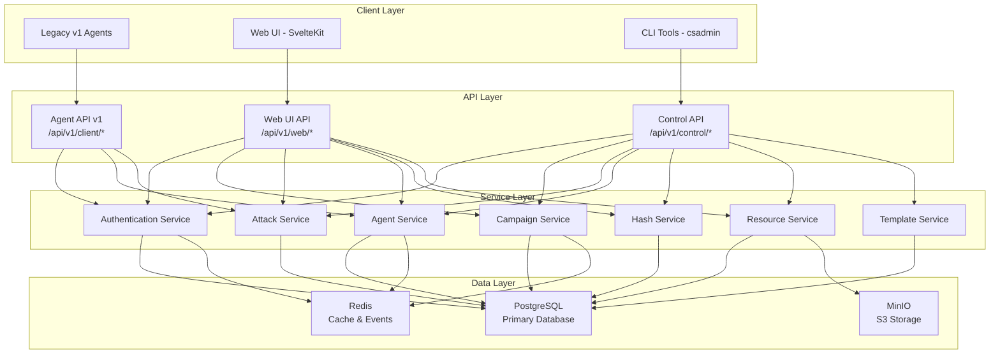

# Design Document

## Overview

The Phase 2 API Implementation establishes CipherSwarm's complete backend API architecture through three distinct but interconnected API surfaces. This design leverages FastAPI's modern async capabilities, implements a robust service layer architecture, and provides comprehensive authentication and authorization systems. The implementation prioritizes backward compatibility with existing v1 agents while introducing modern patterns for web UI and programmatic access.

The architecture follows a layered approach with clear separation of concerns: API endpoints handle HTTP concerns and delegate to service layer functions that contain all business logic. This design ensures consistency across all three API interfaces while maximizing code reuse and maintainability.

## Architecture

### High-Level System Architecture



### API Interface Design

#### Agent API v1 (`/api/v1/client/*`)

- **Purpose**: Legacy compatibility for existing hashcat agents
- **Authentication**: Bearer tokens (`csa_<agent_id>_<token>`)
- **Contract**: Strict adherence to `contracts/v1_api_swagger.json`
- **Features**: Registration, heartbeat, task assignment, progress reporting, result submission

#### Web UI API (`/api/v1/web/*`)

- **Purpose**: Rich interface for SvelteKit frontend
- **Authentication**: JWT tokens with HTTP-only cookies
- **Features**: Campaign management, attack configuration, agent monitoring, resource management, real-time SSE

#### Control API (`/api/v1/control/*`)

- **Purpose**: Programmatic access for CLI tools and automation
- **Authentication**: API keys (`cst_<user_id>_<token>`)
- **Error Format**: RFC9457 Problem Details
- **Features**: Complete CRUD operations, batch processing, template management

## Components and Interfaces

### Service Layer Architecture

The service layer implements all business logic and is shared across all API interfaces:

```python
# Service Function Pattern
async def create_campaign_service(
    db: AsyncSession, campaign_data: CampaignCreate, current_user: User
) -> Campaign:
    """Create a new campaign with validation and business logic."""
    # Validation
    if not await _validate_hash_list_access(
        db, campaign_data.hash_list_id, current_user
    ):
        raise CampaignAccessError("Hash list not accessible")

    # Business logic
    campaign = Campaign(**campaign_data.model_dump())
    campaign.created_by_id = current_user.id

    db.add(campaign)
    await db.commit()
    await db.refresh(campaign)

    return campaign
```

### Authentication System Design

#### Multi-Modal Authentication

```python
# JWT for Web UI
class JWTAuthDependency:
    async def __call__(self, request: Request) -> User:
        token = extract_jwt_from_cookie(request)
        return await validate_jwt_token(token)


# Bearer tokens for Agents
class AgentAuthDependency:
    async def __call__(self, authorization: str = Header()) -> Agent:
        token = extract_bearer_token(authorization)
        return await validate_agent_token(token)


# API keys for Control API
class APIKeyAuthDependency:
    async def __call__(self, authorization: str = Header()) -> User:
        api_key = extract_bearer_token(authorization)
        return await validate_api_key(api_key)
```

#### Project Scoping

```python
def user_can_access_project_by_id(user: User, project_id: int) -> None:
    """Enforce project-based access control."""
    if not user.is_admin and project_id not in user.accessible_project_ids:
        raise HTTPException(status_code=403, detail="Project access denied")
```

### Real-Time Event System

#### Server-Sent Events Architecture

```python
class SSEManager:
    def __init__(self):
        self.connections: Dict[str, List[SSEConnection]] = {}

    async def broadcast_to_project(self, project_id: int, event: SSEEvent):
        """Broadcast events to all users in a project."""
        connections = self.connections.get(f"project_{project_id}", [])
        for connection in connections:
            await connection.send_event(event)

    async def handle_campaign_update(self, campaign_id: int):
        """Trigger lightweight update events."""
        campaign = await get_campaign_service(db, campaign_id)
        event = SSEEvent(
            type="campaign_update",
            data={"campaign_id": campaign_id, "trigger": "refresh"},
        )
        await self.broadcast_to_project(campaign.project_id, event)
```

### Hash Analysis Service

#### Name-That-Hash Integration

```python
class HashAnalysisService:
    def __init__(self):
        self.nth = NameThatHash()

    async def analyze_hash_samples(self, samples: List[str]) -> HashAnalysisResult:
        """Analyze hash samples and return confidence-ranked results."""
        results = []

        for sample in samples:
            # Normalize hash format
            normalized = self._normalize_hash(sample)

            # Use Name-That-Hash for detection
            nth_results = self.nth.identify(normalized)

            # Convert to CipherSwarm format
            for result in nth_results:
                if result.hashcat_mode:
                    results.append(
                        HashCandidate(
                            hash_type=result.hashcat_mode,
                            name=result.name,
                            confidence=result.confidence,
                        )
                    )

        # Rank by confidence and frequency
        return self._rank_candidates(results)
```

### Template System Design

#### JSON Schema Management

```python
class TemplateService:
    async def export_campaign_template(
        self, db: AsyncSession, campaign_id: int
    ) -> CampaignTemplate:
        """Export campaign as JSON template."""
        campaign = await get_campaign_service(db, campaign_id)
        attacks = await list_attacks_by_campaign_service(db, campaign_id)

        template = CampaignTemplate(
            schema_version="20250511",
            name=campaign.name,
            description=campaign.description,
            attacks=[await self._export_attack_template(attack) for attack in attacks],
        )

        return template

    async def import_campaign_template(
        self,
        db: AsyncSession,
        template: CampaignTemplate,
        project_id: int,
        current_user: User,
    ) -> Campaign:
        """Import campaign from JSON template."""
        # Validate schema
        validated_template = self._validate_template(template)

        # Resolve resource references
        resolved_template = await self._resolve_resource_references(
            db, validated_template, project_id
        )

        # Create campaign
        return await self._create_campaign_from_template(
            db, resolved_template, project_id, current_user
        )
```

## Data Models

### Core Domain Models

#### Campaign State Machine

```python
class CampaignState(str, Enum):
    DRAFT = "draft"
    ACTIVE = "active"
    PAUSED = "paused"
    COMPLETED = "completed"
    ARCHIVED = "archived"


class Campaign(Base):
    __tablename__ = "campaigns"

    id: Mapped[int] = mapped_column(primary_key=True)
    name: Mapped[str] = mapped_column(String(255))
    state: Mapped[CampaignState] = mapped_column(default=CampaignState.DRAFT)
    project_id: Mapped[int] = mapped_column(ForeignKey("projects.id"))
    hash_list_id: Mapped[int] = mapped_column(ForeignKey("hash_lists.id"))
    created_by_id: Mapped[int] = mapped_column(ForeignKey("users.id"))

    # Relationships
    project: Mapped["Project"] = relationship(back_populates="campaigns")
    hash_list: Mapped["HashList"] = relationship(back_populates="campaigns")
    attacks: Mapped[List["Attack"]] = relationship(back_populates="campaign")
```

#### Attack Configuration Model

```python
class AttackMode(str, Enum):
    DICTIONARY = "dictionary"
    MASK = "mask"
    BRUTE_FORCE = "brute_force"
    HYBRID_DICT = "hybrid_dict"
    HYBRID_MASK = "hybrid_mask"


class Attack(Base):
    __tablename__ = "attacks"

    id: Mapped[int] = mapped_column(primary_key=True)
    campaign_id: Mapped[int] = mapped_column(ForeignKey("campaigns.id"))
    mode: Mapped[AttackMode]
    position: Mapped[int] = mapped_column(default=0)

    # Mode-specific configuration (JSONB)
    config: Mapped[Dict[str, Any]] = mapped_column(JSON)

    # Resource references
    wordlist_id: Mapped[Optional[int]] = mapped_column(ForeignKey("resources.id"))
    rulelist_id: Mapped[Optional[int]] = mapped_column(ForeignKey("resources.id"))
    masklist_id: Mapped[Optional[int]] = mapped_column(ForeignKey("resources.id"))

    # Ephemeral resources (inline content)
    ephemeral_data: Mapped[Optional[Dict[str, Any]]] = mapped_column(JSON)
```

### Pydantic Schemas

#### API Request/Response Models

```python
class CampaignCreate(BaseModel):
    name: str = Field(..., min_length=1, max_length=255)
    description: Optional[str] = Field(None, max_length=1000)
    hash_list_id: int = Field(..., gt=0)
    project_id: int = Field(..., gt=0)


class CampaignOut(BaseModel):
    id: int
    name: str
    description: Optional[str]
    state: CampaignState
    project_id: int
    hash_list_id: int
    created_at: datetime
    updated_at: datetime

    # Progress metrics
    total_hashes: int
    cracked_hashes: int
    progress_percent: float

    # Performance metrics
    current_guess_rate: Optional[int]
    estimated_completion: Optional[datetime]


class AttackTemplate(BaseModel):
    """JSON template for attack configuration."""

    mode: AttackMode
    wordlist_guid: Optional[str] = None
    rulelist_guid: Optional[str] = None
    masklist_guid: Optional[str] = None

    # Ephemeral content
    words: Optional[List[str]] = None
    masks: Optional[List[str]] = None
    rules: Optional[List[str]] = None

    # Configuration
    min_length: Optional[int] = None
    max_length: Optional[int] = None
    charset: Optional[str] = None
```

## Error Handling

### Unified Error Response System

#### Service Layer Exceptions

```python
class CipherSwarmError(Exception):
    """Base exception for all CipherSwarm errors."""

    pass


class CampaignNotFoundError(CipherSwarmError):
    """Campaign not found."""

    pass


class InvalidStateTransitionError(CipherSwarmError):
    """Invalid campaign state transition."""

    pass


class ResourceInUseError(CipherSwarmError):
    """Resource cannot be deleted because it's in use."""

    pass
```

#### API-Specific Error Translation

```python
# Web UI API - Standard FastAPI errors
@app.exception_handler(CampaignNotFoundError)
async def campaign_not_found_handler(request: Request, exc: CampaignNotFoundError):
    raise HTTPException(status_code=404, detail="Campaign not found")


# Control API - RFC9457 Problem Details
@control_router.exception_handler(CampaignNotFoundError)
async def campaign_not_found_problem(request: Request, exc: CampaignNotFoundError):
    return JSONResponse(
        status_code=404,
        content={
            "type": "campaign-not-found",
            "title": "Campaign Not Found",
            "status": 404,
            "detail": str(exc),
            "instance": str(request.url),
        },
    )


# Agent API v1 - Legacy format compatibility
@agent_router.exception_handler(CampaignNotFoundError)
async def agent_campaign_not_found(request: Request, exc: CampaignNotFoundError):
    return JSONResponse(
        status_code=404, content={"error": "Campaign not found", "code": 404}
    )
```

## Testing Strategy

### Multi-Layer Testing Approach

#### Unit Testing - Service Layer

```python
@pytest.mark.asyncio
async def test_create_campaign_service_success(
    db_session, user_factory, hash_list_factory
):
    # Arrange
    user = await user_factory.create_async()
    hash_list = await hash_list_factory.create_async(project_id=user.project_id)
    campaign_data = CampaignCreate(
        name="Test Campaign", hash_list_id=hash_list.id, project_id=user.project_id
    )

    # Act
    result = await create_campaign_service(db_session, campaign_data, user)

    # Assert
    assert result.name == "Test Campaign"
    assert result.created_by_id == user.id

    # Verify persistence
    saved = await get_campaign_service(db_session, result.id)
    assert saved.name == "Test Campaign"
```

#### Integration Testing - API Endpoints

```python
@pytest.mark.asyncio
async def test_create_campaign_endpoint(client, auth_headers, hash_list):
    # Arrange
    campaign_data = {
        "name": "Integration Test Campaign",
        "hash_list_id": hash_list.id,
        "project_id": hash_list.project_id,
    }

    # Act
    response = await client.post(
        "/api/v1/web/campaigns", json=campaign_data, headers=auth_headers
    )

    # Assert
    assert response.status_code == 201
    data = response.json()
    assert data["name"] == "Integration Test Campaign"
    assert data["state"] == "draft"
```

#### Contract Testing - Agent API v1

```python
@pytest.mark.asyncio
async def test_agent_api_v1_contract_compliance(client, agent_token):
    """Verify Agent API v1 responses match OpenAPI specification."""
    # Load contract specification
    with open("contracts/v1_api_swagger.json") as f:
        spec = json.load(f)

    # Test agent registration
    response = await client.post(
        "/api/v1/client/agents",
        json={"client_signature": "test-agent", "hostname": "test-host"},
        headers={"Authorization": f"Bearer {agent_token}"},
    )

    # Validate response against schema
    validate_response_against_schema(response.json(), spec, "/agents", "post")
```

### Performance Testing

```python
@pytest.mark.performance
async def test_campaign_list_performance(client, auth_headers, campaign_factory):
    # Create large dataset
    campaigns = await campaign_factory.create_batch_async(1000)

    # Measure response time
    start_time = time.time()
    response = await client.get("/api/v1/web/campaigns", headers=auth_headers)
    end_time = time.time()

    # Assert performance requirements
    assert response.status_code == 200
    assert end_time - start_time < 1.0  # Sub-second response
    assert len(response.json()["items"]) <= 20  # Proper pagination
```

## Implementation Phases

### Phase 2.1: Core Service Layer and Agent API

1. **Service Layer Foundation**

   - Implement base service patterns and dependency injection
   - Create authentication services for all token types
   - Implement project scoping utilities

2. **Agent API v1 Implementation**

   - Implement legacy-compatible endpoints
   - Add contract validation testing
   - Integrate with existing task distribution logic

### Phase 2.2: Web UI API and Real-Time Features

1. **Web UI API Implementation**

   - Implement comprehensive CRUD operations
   - Add SSE event system
   - Create rich response schemas with progress metrics

2. **Hash Analysis Service**

   - Integrate Name-That-Hash library
   - Implement confidence ranking algorithms
   - Add support for common hash formats

### Phase 2.3: Control API and Template System

1. **Control API Implementation**

   - Implement RFC9457 error handling
   - Add offset-based pagination
   - Create comprehensive programmatic interface

2. **Template System**

   - Implement JSON schema validation
   - Add resource reference resolution
   - Create import/export workflows

### Phase 2.4: Performance and Production Readiness

1. **Performance Optimization**

   - Implement caching strategies
   - Optimize database queries
   - Add performance monitoring

2. **Production Features**

   - Add comprehensive logging
   - Implement health checks
   - Create monitoring dashboards

## Security Considerations

### Authentication Security

- JWT tokens use secure signing algorithms (RS256)
- Bearer tokens include cryptographically secure random components
- API keys support rotation and revocation
- All tokens have configurable expiration times

### Authorization Security

- Project-based access control prevents data leakage
- Admin operations require explicit role validation
- Resource access is validated at service layer
- Audit logging for all sensitive operations

### Data Security

- All API communication requires HTTPS
- Sensitive data is never logged or exposed in errors
- Database connections use SSL/TLS
- S3 storage uses presigned URLs with time limits

### Input Validation Security

- All input validated through Pydantic models
- SQL injection prevented through ORM usage
- File uploads validated for type and size
- Hash input sanitized and normalized

This design provides a comprehensive, scalable, and secure foundation for CipherSwarm's API architecture while maintaining backward compatibility and supporting future extensibility.
