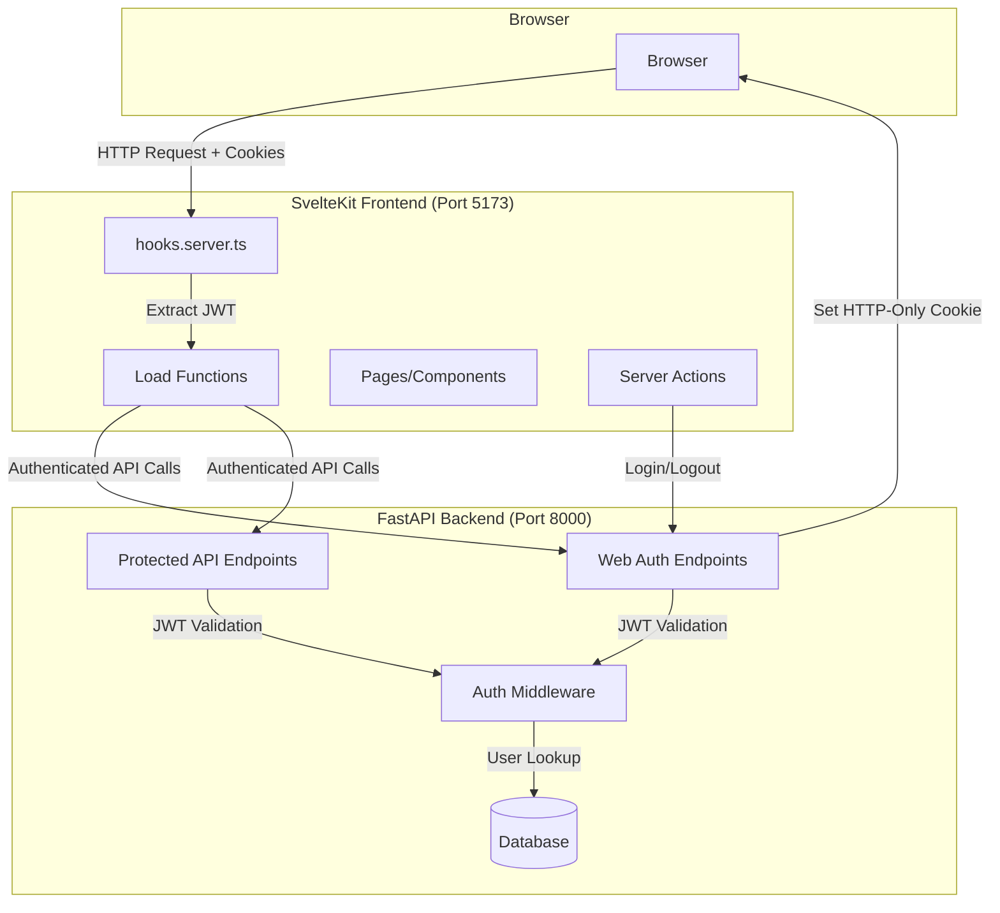
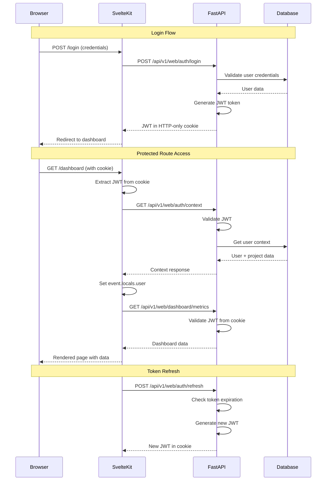
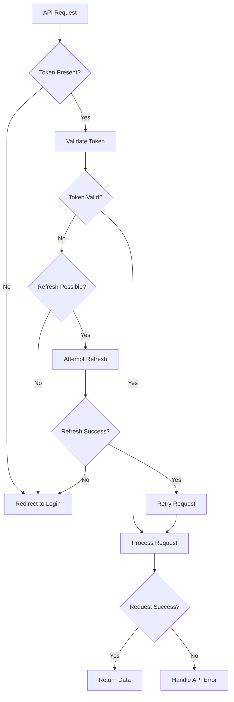

# Design Document

## Overview

The SSR Authentication Foundation implements a comprehensive authentication system that bridges SvelteKit server-side rendering with FastAPI backend authentication. The design adapts the existing JWT-based authentication to support HTTP-only cookies, enabling secure server-side API calls while maintaining compatibility with existing client-side authentication patterns.

This system addresses the critical gap in the current architecture where SSR load functions cannot make authenticated API calls, blocking full end-to-end testing and proper server-side rendering functionality.

## Architecture

### High-Level Architecture



### Authentication Flow



## Components and Interfaces

### Backend Components

#### 1. Enhanced JWT Authentication Middleware

**Location**: `app/core/deps.py`

**Key Functions**:

- `extract_jwt_token_from_request()`: Extracts JWT from cookies or Authorization header
- `get_current_user()`: Enhanced user authentication with detailed error handling
- Token validation with expiration handling and refresh logic

**Design Decisions**:

- Cookie-first authentication for SSR compatibility
- Fallback to Authorization header for API client compatibility
- Detailed error logging for debugging authentication issues

#### 2. Web Authentication Endpoints

**Location**: `app/api/v1/endpoints/web/auth.py`

**Endpoints**:

- `POST /api/v1/web/auth/login`: Login with HTTP-only cookie response
- `POST /api/v1/web/auth/logout`: Logout with cookie cleanup
- `GET /api/v1/web/auth/context`: Get user and project context
- `POST /api/v1/web/auth/refresh`: Token refresh with auto-refresh capability

**Cookie Configuration**:

```python
cookie_config = {
    "httponly": True,
    "secure": settings.ENVIRONMENT == "production",
    "samesite": "lax",
    "max_age": settings.ACCESS_TOKEN_EXPIRE_MINUTES * 60,
    "path": "/",
}
```

#### 3. CORS Configuration

**Location**: `app/main.py`

**Configuration**:

- Allow credentials for cookie handling
- Specific origins for development and production
- Proper headers for cross-origin cookie support

### Frontend Components

#### 1. SvelteKit Hooks

**Location**: `frontend/src/hooks.server.ts`

**Key Functions**:

- `handle()`: Main authentication hook for all requests
- `transformContextToUserSession()`: Convert backend context to frontend format
- `attemptTokenRefresh()`: Automatic token refresh logic
- `isTestEnvironment()`: Environment detection for testing
- `isPublicRoute()`: Route-based authentication bypass

**Authentication Flow**:

1. Extract session cookie from request
2. Validate session with backend `/context` endpoint
3. Set `event.locals.user` and `event.locals.session`
4. Handle token refresh on 401 errors
5. Redirect to login for invalid/expired sessions

#### 2. Server-Side API Client

**Location**: `frontend/src/lib/server/api.ts`

**Key Features**:

- `ServerApiClient` class with cookie and Bearer token support
- Zod schema validation for type safety
- Comprehensive error handling with SvelteKit error conversion
- Request/response interceptors for logging and debugging

**Authentication Methods**:

- `setAuth(token)`: Set Bearer token for API requests
- `setSessionCookie(cookie)`: Set cookie header for SSR requests

#### 3. Login/Logout Implementation

**Login Page**: `frontend/src/routes/login/+page.svelte`

- Shadcn-Svelte form components
- Client-side validation with Zod
- Loading states and error handling

**Login Action**: `frontend/src/routes/login/+page.server.ts`

- Superforms integration for form handling
- Cookie setting from FastAPI response
- Redirect logic with return URL support

**Logout Action**: Accessible from layout

- Cookie cleanup and session termination
- Confirmation handling
- Redirect to login page

#### 4. Load Function Authentication Pattern

**Standard Pattern for Protected Routes**:

```typescript
export const load: PageServerLoad = async ({ locals }) => {
    // Test environment bypass
    if (process.env.NODE_ENV === 'test' || process.env.PLAYWRIGHT_TEST || process.env.CI) {
        return {
            // Mock data matching API response structure
        };
    }

    // Authentication check
    if (!locals.user || !locals.session) {
        throw redirect(302, '/login');
    }

    // Authenticated API calls
    const api = new ServerApiClient();
    api.setSessionCookie(`access_token=${locals.session}`);
    
    const data = await api.get('/api/v1/web/endpoint', schema);
    
    return {
        data
    };
};
```

## Data Models

### User Session Model

```typescript
interface UserSession {
    id: string;
    email: string;
    name: string;
    role: 'admin' | 'project_admin' | 'user';
    projects: Array<{
        id: number;
        name: string;
        role: 'admin' | 'project_admin' | 'user';
    }>;
    current_project_id?: number;
    is_authenticated: boolean;
}
```

### Context Response Model

```typescript
interface ContextResponse {
    user: {
        id: string;
        email: string;
        name: string;
        role: string;
    };
    active_project?: {
        id: number;
        name: string;
    };
    available_projects: Array<{
        id: number;
        name: string;
    }>;
}
```

### JWT Token Structure

```json
{
  "sub": "user-uuid",
  "exp": 1234567890,
  "iat": 1234567890,
  "type": "access"
}
```

## Error Handling

### Authentication Error Types

1. **No Token Present**

   - Status: 401 Unauthorized
   - Action: Redirect to login
   - Context: Missing cookie or Authorization header

2. **Token Expired**

   - Status: 401 Unauthorized
   - Action: Attempt refresh, then redirect to login
   - Context: JWT exp claim is past current time

3. **Invalid Token**

   - Status: 401 Unauthorized
   - Action: Clear cookies, redirect to login
   - Context: Malformed JWT or signature validation failure

4. **User Not Found**

   - Status: 403 Forbidden
   - Action: Clear session, redirect to login
   - Context: Valid JWT but user doesn't exist or is inactive

5. **Network/Server Errors**

   - Status: 500+ Server Error
   - Action: Show error message, allow retry
   - Context: Backend unavailable or internal errors

### Error Handling Strategy



## Testing Strategy

### Test Environment Detection

**Environment Variables**:

- `NODE_ENV=test`: Standard Node.js test environment
- `PLAYWRIGHT_TEST=true`: Playwright-specific testing
- `CI=true`: Continuous integration environment

**Mock Data Strategy**:

- Load functions return mock data in test environments
- Mock data matches exact API response structure
- Consistent test data across all test scenarios

### Three-Tier Testing Architecture

1. **Layer 1: Backend Tests**

   - Unit tests for authentication services
   - Integration tests for auth endpoints
   - JWT token validation and refresh logic

2. **Layer 2: Frontend Mocked Tests**

   - Component testing with mock data
   - Load function testing with environment detection
   - Fast feedback loop without backend dependencies

3. **Layer 3: Full E2E Tests**

   - Complete authentication flows
   - Real backend integration
   - Docker environment testing

### Test User Management

**Test Data Seeding**:

- Consistent test users with known credentials
- Multiple user roles for permission testing
- Project associations for context testing

**Playwright Global Setup**:

- Automated login for authenticated test scenarios
- Session persistence across test cases
- Cookie management for cross-tab testing

## Security Considerations

### Cookie Security

**HTTP-Only Cookies**:

- Prevents XSS attacks via JavaScript access
- Secure flag for HTTPS-only transmission
- SameSite=Lax for CSRF protection
- Appropriate expiration times

### Token Management

**JWT Security**:

- Strong secret key for token signing
- Short token lifetimes (1 hour default)
- Automatic refresh mechanism
- Proper token validation and error handling

### CORS Configuration

**Cross-Origin Security**:

- Specific allowed origins (no wildcards in production)
- Credentials support for cookie handling
- Proper preflight request handling
- Secure headers configuration

### Session Management

**Session Security**:

- Automatic session cleanup on logout
- Token refresh with sliding expiration
- Inactive session detection
- Multi-tab session synchronization

## Performance Considerations

### Caching Strategy

**Authentication Context**:

- Short-lived context caching (60 seconds)
- User session data caching
- Project association caching
- Cache invalidation on user changes

### Request Optimization

**API Call Efficiency**:

- Single context call for user + project data
- Batch API requests where possible
- Efficient token validation
- Minimal database queries per request

### Load Function Performance

**SSR Optimization**:

- Parallel API calls where possible
- Efficient mock data in test environments
- Minimal authentication overhead
- Fast redirect handling for unauthenticated users

## Deployment Considerations

### Environment Configuration

**Development Environment**:

- HTTP cookies for local development
- CORS configuration for localhost
- Hot reload compatibility
- Debug logging enabled

**Production Environment**:

- HTTPS-only cookies
- Secure CORS configuration
- Production logging levels
- Health check compatibility

### Docker Integration

**Container Configuration**:

- Environment variable management
- Service-to-service communication
- Health check endpoints
- Volume mounts for development

### Monitoring and Logging

**Authentication Monitoring**:

- Login/logout event logging
- Failed authentication tracking
- Token refresh monitoring
- Performance metrics collection

## Migration and Compatibility

### Backward Compatibility

**Existing API Clients**:

- Authorization header support maintained
- Agent API v1 compatibility preserved
- Control API authentication unchanged
- Web UI gradual migration support

### Migration Strategy

**Phased Implementation**:

1. Backend cookie support addition
2. Frontend hooks implementation
3. Load function updates
4. Test environment integration
5. Full E2E testing enablement

### Rollback Considerations

**Fallback Mechanisms**:

- Authorization header fallback
- Graceful degradation for unsupported clients
- Configuration-based feature flags
- Monitoring for migration issues
