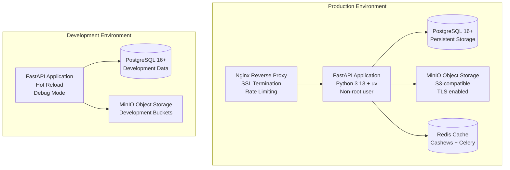

# Design Document

## Overview

This design document outlines the containerization and deployment architecture for CipherSwarm Phase 4. The solution provides a complete Docker-based deployment strategy that supports both development and production environments, following FastAPI best practices and CipherSwarm's security standards.

The design emphasizes reproducibility, security, scalability, and operational simplicity through containerization of all services, automated deployment workflows, and comprehensive monitoring capabilities.

## Architecture

### Container Architecture



### Service Components

#### FastAPI Application Container
- **Base Image**: Python 3.13-slim for optimal size and security
- **Package Manager**: uv for fast, reliable dependency management
- **User Security**: Non-root user (app:app) with minimal privileges
- **Health Monitoring**: Built-in health check endpoint at `/health`
- **Development Features**: Hot reload with volume mounts
- **Production Features**: Optimized for performance and security

#### PostgreSQL Database Container
- **Version**: PostgreSQL 16+ for latest features and security
- **Storage**: Persistent volumes for data durability
- **Configuration**: Optimized for CipherSwarm workloads
- **Backup**: Automated backup hooks and restore procedures
- **Security**: SSL connections required, limited user privileges

#### MinIO Object Storage Container
- **Purpose**: S3-compatible storage for attack resources
- **Buckets**: Pre-configured buckets (wordlists, rules, masks, charsets, temp)
- **Security**: TLS/SSL enabled, access key management
- **Integration**: Presigned URLs for secure agent downloads
- **Backup**: Automated bucket backup and versioning

#### Redis Cache Container (Optional)
- **Purpose**: Cashews caching backend and Celery task queue
- **Configuration**: Optimized for CipherSwarm caching patterns
- **Persistence**: Optional persistence for task queue reliability
- **Development**: In-memory caching used instead for simplicity

#### Nginx Reverse Proxy (Production Only)
- **Purpose**: SSL termination, rate limiting, static file serving
- **Configuration**: Optimized for FastAPI backend
- **Security**: Security headers, request size limits
- **Performance**: Gzip compression, caching headers

## Components and Interfaces

### Docker Configuration Structure

```
docker/
├── app/
│   ├── Dockerfile.dev          # Development container
│   ├── Dockerfile.prod         # Production container
│   └── entrypoint.sh           # Container startup script
├── nginx/
│   ├── nginx.conf              # Nginx configuration
│   ├── ssl/                    # SSL certificates
│   └── static/                 # Static file serving
└── scripts/
    ├── backup-db.sh            # Database backup script
    ├── restore-db.sh           # Database restore script
    └── health-check.sh         # Health monitoring script
```

### Docker Compose Configurations

#### Development Configuration (`docker-compose.dev.yml`)
```yaml
version: '3.8'
services:
  app:
    build:
      context: .
      dockerfile: docker/app/Dockerfile.dev
    volumes:
      - ./app:/app/app:ro
      - ./tests:/app/tests:ro
    environment:
      - ENVIRONMENT=development
      - DATABASE_URL=postgresql://dev:dev@db:5432/cipherswarm_dev
      - MINIO_ENDPOINT=minio:9000
    depends_on:
      - db
      - minio
    ports:
      - "8000:8000"
    
  db:
    image: postgres:16-alpine
    environment:
      - POSTGRES_DB=cipherswarm_dev
      - POSTGRES_USER=dev
      - POSTGRES_PASSWORD=dev
    volumes:
      - postgres_dev_data:/var/lib/postgresql/data
    ports:
      - "5432:5432"
    
  minio:
    image: minio/minio:latest
    command: server /data --console-address ":9001"
    environment:
      - MINIO_ROOT_USER=minioadmin
      - MINIO_ROOT_PASSWORD=minioadmin
    volumes:
      - minio_dev_data:/data
    ports:
      - "9000:9000"
      - "9001:9001"

volumes:
  postgres_dev_data:
  minio_dev_data:
```

#### Production Configuration (`docker-compose.prod.yml`)
```yaml
version: '3.8'
services:
  nginx:
    image: nginx:alpine
    volumes:
      - ./docker/nginx/nginx.conf:/etc/nginx/nginx.conf:ro
      - ./docker/nginx/ssl:/etc/nginx/ssl:ro
      - static_files:/var/www/static:ro
    ports:
      - "80:80"
      - "443:443"
    depends_on:
      - app
    restart: unless-stopped
    
  app:
    build:
      context: .
      dockerfile: docker/app/Dockerfile.prod
    environment:
      - ENVIRONMENT=production
      - DATABASE_URL=postgresql://prod:${DB_PASSWORD}@db:5432/cipherswarm
      - MINIO_ENDPOINT=minio:9000
      - REDIS_URL=redis://redis:6379
    depends_on:
      - db
      - minio
      - redis
    volumes:
      - static_files:/app/static
    restart: unless-stopped
    deploy:
      replicas: 2
      resources:
        limits:
          memory: 1G
          cpus: '0.5'
    
  db:
    image: postgres:16-alpine
    environment:
      - POSTGRES_DB=cipherswarm
      - POSTGRES_USER=prod
      - POSTGRES_PASSWORD=${DB_PASSWORD}
    volumes:
      - postgres_prod_data:/var/lib/postgresql/data
      - ./docker/scripts/backup-db.sh:/usr/local/bin/backup-db.sh:ro
    restart: unless-stopped
    deploy:
      resources:
        limits:
          memory: 2G
          cpus: '1.0'
    
  minio:
    image: minio/minio:latest
    command: server /data --console-address ":9001"
    environment:
      - MINIO_ROOT_USER=${MINIO_ROOT_USER}
      - MINIO_ROOT_PASSWORD=${MINIO_ROOT_PASSWORD}
    volumes:
      - minio_prod_data:/data
    restart: unless-stopped
    deploy:
      resources:
        limits:
          memory: 1G
          cpus: '0.5'
    
  redis:
    image: redis:7-alpine
    volumes:
      - redis_prod_data:/data
    restart: unless-stopped
    deploy:
      resources:
        limits:
          memory: 512M
          cpus: '0.25'

volumes:
  postgres_prod_data:
  minio_prod_data:
  redis_prod_data:
  static_files:
```

### Dockerfile Designs

#### Development Dockerfile (`docker/app/Dockerfile.dev`)
```dockerfile
FROM python:3.13-slim

# Install system dependencies
RUN apt-get update && apt-get install -y \
    curl \
    && rm -rf /var/lib/apt/lists/*

# Install uv
RUN pip install uv

# Create non-root user
RUN groupadd -r app && useradd -r -g app app

# Set working directory
WORKDIR /app

# Copy dependency files
COPY pyproject.toml uv.lock ./

# Install dependencies
RUN uv sync --dev

# Copy application code
COPY --chown=app:app . .

# Switch to non-root user
USER app

# Expose port
EXPOSE 8000

# Health check
HEALTHCHECK --interval=30s --timeout=10s --start-period=5s --retries=3 \
    CMD curl -f http://localhost:8000/health || exit 1

# Start application with hot reload
CMD ["uv", "run", "uvicorn", "app.main:app", "--host", "0.0.0.0", "--port", "8000", "--reload"]
```

#### Production Dockerfile (`docker/app/Dockerfile.prod`)
```dockerfile
FROM python:3.13-slim as builder

# Install system dependencies
RUN apt-get update && apt-get install -y \
    build-essential \
    && rm -rf /var/lib/apt/lists/*

# Install uv
RUN pip install uv

# Set working directory
WORKDIR /app

# Copy dependency files
COPY pyproject.toml uv.lock ./

# Install dependencies
RUN uv sync --no-dev

FROM python:3.13-slim as runtime

# Install runtime dependencies
RUN apt-get update && apt-get install -y \
    curl \
    && rm -rf /var/lib/apt/lists/*

# Create non-root user
RUN groupadd -r app && useradd -r -g app app

# Set working directory
WORKDIR /app

# Copy virtual environment from builder
COPY --from=builder /app/.venv /app/.venv

# Copy application code
COPY --chown=app:app app ./app
COPY --chown=app:app alembic ./alembic
COPY --chown=app:app alembic.ini ./

# Switch to non-root user
USER app

# Add venv to PATH
ENV PATH="/app/.venv/bin:$PATH"

# Expose port
EXPOSE 8000

# Health check
HEALTHCHECK --interval=30s --timeout=10s --start-period=5s --retries=3 \
    CMD curl -f http://localhost:8000/health || exit 1

# Start application
CMD ["uvicorn", "app.main:app", "--host", "0.0.0.0", "--port", "8000"]
```

## Data Models

### Environment Configuration

#### Development Environment Variables
```bash
# Database
DATABASE_URL=postgresql://dev:dev@db:5432/cipherswarm_dev

# MinIO
MINIO_ENDPOINT=minio:9000
MINIO_ACCESS_KEY=minioadmin
MINIO_SECRET_KEY=minioadmin
MINIO_SECURE=false

# Application
ENVIRONMENT=development
DEBUG=true
LOG_LEVEL=debug

# Caching
CACHE_URL=mem://
```

#### Production Environment Variables
```bash
# Database
DATABASE_URL=postgresql://prod:${DB_PASSWORD}@db:5432/cipherswarm
DB_PASSWORD=${DB_PASSWORD}

# MinIO
MINIO_ENDPOINT=minio:9000
MINIO_ACCESS_KEY=${MINIO_ROOT_USER}
MINIO_SECRET_KEY=${MINIO_ROOT_PASSWORD}
MINIO_SECURE=true

# Redis
REDIS_URL=redis://redis:6379

# Application
ENVIRONMENT=production
DEBUG=false
LOG_LEVEL=info

# Security
JWT_SECRET_KEY=${JWT_SECRET_KEY}
CSRF_SECRET_KEY=${CSRF_SECRET_KEY}

# Caching
CACHE_URL=redis://redis:6379/1
```

### Volume and Storage Configuration

#### Persistent Volumes
- **postgres_data**: Database storage with backup hooks
- **minio_data**: Object storage with versioning
- **redis_data**: Cache persistence (production only)
- **static_files**: Nginx static file serving
- **ssl_certs**: SSL certificate storage

#### Backup Strategy
- **Database**: Daily automated dumps with 30-day retention
- **MinIO**: Bucket-level backups with versioning
- **Configuration**: Environment and compose file backups
- **Logs**: Centralized logging with rotation

## Error Handling

### Container Health Monitoring

#### Health Check Implementation
```python
# app/api/health.py
from fastapi import APIRouter, Depends
from sqlalchemy.ext.asyncio import AsyncSession
from app.db.session import get_db
from app.core.cache import cache

router = APIRouter()

@router.get("/health")
async def health_check(db: AsyncSession = Depends(get_db)):
    """Comprehensive health check for container monitoring."""
    try:
        # Database connectivity
        await db.execute("SELECT 1")
        
        # Cache connectivity (if Redis)
        if cache.backend != "mem://":
            await cache.get("health_check")
        
        return {
            "status": "healthy",
            "database": "connected",
            "cache": "connected",
            "timestamp": datetime.utcnow().isoformat()
        }
    except Exception as e:
        raise HTTPException(
            status_code=503,
            detail=f"Health check failed: {str(e)}"
        )
```

#### Container Restart Policies
- **Development**: `restart: "no"` for debugging
- **Production**: `restart: unless-stopped` for reliability
- **Health-based**: Automatic restart on health check failures

### Error Recovery Strategies

#### Database Connection Failures
- Automatic retry with exponential backoff
- Connection pooling with health checks
- Graceful degradation for read-only operations

#### MinIO Storage Failures
- Fallback to local temporary storage
- Retry mechanisms for upload/download operations
- Error logging and alerting

#### Service Dependencies
- Startup dependency ordering with `depends_on`
- Health check dependencies
- Circuit breaker patterns for external services

## Testing Strategy

### Container Testing Approach

#### Build Testing
```bash
# Test development build
docker build -f docker/app/Dockerfile.dev -t cipherswarm:dev .
docker run --rm cipherswarm:dev python -c "import app; print('Build successful')"

# Test production build
docker build -f docker/app/Dockerfile.prod -t cipherswarm:prod .
docker run --rm cipherswarm:prod python -c "import app; print('Build successful')"
```

#### Integration Testing
```bash
# Start test environment
docker compose -f docker-compose.dev.yml up -d

# Run integration tests
docker compose -f docker-compose.dev.yml exec app pytest tests/integration/

# Cleanup
docker compose -f docker-compose.dev.yml down -v
```

#### Production Validation
```bash
# Deploy production stack
docker compose -f docker-compose.prod.yml up -d

# Validate services
docker compose -f docker-compose.prod.yml ps
curl -f https://localhost/health

# Run smoke tests
docker compose -f docker-compose.prod.yml exec app pytest tests/smoke/
```

### CI/CD Integration Testing

#### GitHub Actions Workflow
```yaml
name: Docker Build and Test

on:
  push:
    branches: [main, develop]
  pull_request:
    branches: [main]

jobs:
  docker-test:
    runs-on: ubuntu-latest
    steps:
      - uses: actions/checkout@v4
      
      - name: Build development image
        run: docker build -f docker/app/Dockerfile.dev -t cipherswarm:dev .
      
      - name: Build production image
        run: docker build -f docker/app/Dockerfile.prod -t cipherswarm:prod .
      
      - name: Test development stack
        run: |
          docker compose -f docker-compose.dev.yml up -d
          sleep 30
          docker compose -f docker-compose.dev.yml exec -T app pytest tests/integration/
          docker compose -f docker-compose.dev.yml down -v
      
      - name: Security scan
        uses: aquasecurity/trivy-action@master
        with:
          image-ref: cipherswarm:prod
          format: sarif
          output: trivy-results.sarif
```

### Performance and Load Testing

#### Container Resource Testing
- Memory usage profiling under load
- CPU utilization monitoring
- Network throughput testing
- Storage I/O performance validation

#### Scaling Validation
- Horizontal scaling with multiple app replicas
- Load balancer configuration testing
- Database connection pool optimization
- Cache performance under concurrent load

## Security Considerations

### Container Security Hardening

#### Base Image Security
- Use official Python slim images
- Regular security updates and patches
- Minimal attack surface with essential packages only
- Multi-stage builds to reduce final image size

#### Runtime Security
- Non-root user execution (app:app)
- Read-only root filesystem where possible
- Resource limits and quotas
- Security context constraints

#### Network Security
- Internal network isolation
- TLS/SSL for all external communications
- Firewall rules and port restrictions
- Service mesh considerations for production

### Secrets Management

#### Development Secrets
- Local environment files (.env.dev)
- Default credentials for development only
- Clear documentation of security implications

#### Production Secrets
- External secret management (Docker Secrets, Kubernetes Secrets)
- Environment variable injection
- Rotation policies and procedures
- Audit logging for secret access

### Compliance and Monitoring

#### Security Scanning
- Container image vulnerability scanning
- Dependency vulnerability assessment
- Runtime security monitoring
- Compliance reporting

#### Audit and Logging
- Container access logging
- Security event monitoring
- Compliance audit trails
- Incident response procedures
