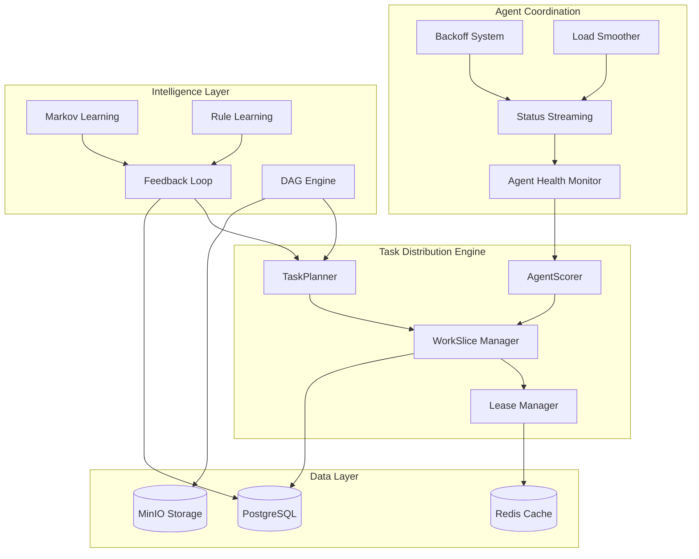

# Design Document

## Overview

The Phase 5 Task Distribution System transforms CipherSwarm from a basic orchestrator into an intelligent, adaptive distributed cracking platform. This system implements advanced scheduling algorithms, real-time agent coordination, and feedback-driven optimization to maximize cracking efficiency across heterogeneous agent fleets.

The design centers around WorkSlice-based task distribution, where attacks are divided into precisely controlled keyspace segments that can be efficiently distributed, monitored, and reassigned based on agent capabilities and real-time performance data.

## Architecture

### Core Components



### System Flow

1. **Campaign Initialization**: TaskPlanner analyzes attack parameters and creates TaskPlan with WorkSlice divisions
2. **Agent Scoring**: AgentScorer evaluates available agents based on benchmarks, reliability, and current status
3. **Slice Assignment**: WorkSlice Manager assigns optimal slices to agents with Redis-based lease tracking
4. **Real-time Monitoring**: Agents stream status updates parsed from hashcat --status-json output
5. **Adaptive Adjustment**: System adjusts slice sizes, agent priorities, and campaign strategies based on performance data
6. **Fault Recovery**: Lease Manager reclaims expired work and reassigns to healthy agents

## Components and Interfaces

### TaskPlanner

**Purpose**: Converts high-level attacks into executable WorkSlice distributions

**Key Methods**:

- `create_task_plan(attack: Attack) -> TaskPlan`
- `calculate_keyspace(attack: Attack) -> int`
- `generate_work_slices(task_plan: TaskPlan, agents: List[Agent]) -> List[WorkSlice]`
- `handle_incremental_phases(attack: Attack) -> List[KeyspacePhase]`

**Algorithms**:

- Uses hashcat --keyspace for accurate keyspace calculation
- Implements skip/limit-based slice generation for precise control
- Supports incremental attacks with multi-phase KeyspacePhase objects
- Handles hybrid attacks with multiplicative keyspace calculations

### AgentScorer

**Purpose**: Evaluates and ranks agents for optimal task assignment

**Scoring Factors**:

- Hash-type specific benchmark performance
- Historical reliability score (success/failure ratio)
- Current thermal status and throttling state
- Recent heartbeat frequency and response times
- Agent-reported capabilities and resource availability

**Key Methods**:

- `score_agent(agent: Agent, hash_type: int) -> float`
- `update_reliability(agent: Agent, outcome: TaskOutcome) -> None`
- `apply_thermal_penalty(agent: Agent, score: float) -> float`

### WorkSlice Manager

**Purpose**: Manages the lifecycle of individual work units

**Data Model**:

```python
class WorkSlice(Base):
    id: int
    task_plan_id: int
    start_offset: int
    length: int
    status: WorkSliceStatus  # queued, assigned, running, completed, failed
    assigned_agent_id: Optional[int]
    lease_expires_at: Optional[datetime]
    progress_percent: float = 0.0
    guessrate: Optional[float]
    created_at: datetime
    completed_at: Optional[datetime]
```

**Key Methods**:

- `assign_slice(slice: WorkSlice, agent: Agent) -> None`
- `update_progress(slice_id: int, progress: float, guessrate: float) -> None`
- `complete_slice(slice_id: int, results: List[CrackResult]) -> None`
- `reclaim_expired_slices() -> List[WorkSlice]`

### Lease Manager

**Purpose**: Tracks and manages Redis-based slice leases with automatic reclamation

**Redis Schema**:

- `task:lease:{agent_id}:{slice_id}` - TTL-based lease tracking
- `agent:health:{agent_id}` - Agent health and status cache
- `slice:progress:{slice_id}` - Real-time progress updates

**Key Methods**:

- `create_lease(agent: Agent, slice: WorkSlice, duration: int) -> None`
- `extend_lease(agent_id: int, slice_id: int) -> bool`
- `reclaim_expired_leases() -> List[WorkSlice]`
- `cleanup_agent_leases(agent_id: int) -> None`

### Agent Health Monitor

**Purpose**: Tracks agent status, reliability, and performance patterns

**Metrics Tracked**:

- Heartbeat frequency and consistency
- Task success/failure/timeout rates
- Thermal status and throttling events
- Performance degradation patterns
- Resource utilization trends

**Key Methods**:

- `update_agent_health(agent: Agent, status: AgentStatus) -> None`
- `calculate_reliability_score(agent: Agent) -> float`
- `detect_failure_patterns(agent: Agent) -> List[FailurePattern]`
- `recommend_backoff(agent: Agent) -> Optional[int]`

### Status Streaming System

**Purpose**: Processes real-time agent status updates from hashcat --status-json

**Data Flow**:

1. Agent parses hashcat --status-json output every 5 seconds
2. Structured telemetry sent to `/api/v2/client/status` endpoint
3. Server updates WorkSlice progress and agent health metrics
4. Real-time dashboards receive WebSocket updates

**Status Data Structure**:

```python
class AgentStatusUpdate(BaseModel):
    agent_id: int
    slice_id: int
    timestamp: datetime
    progress_percent: float
    guesses_completed: int
    guessrate_per_device: List[float]
    device_temperatures: List[float]
    cracked_hashes: List[str]
    rejected_guesses: int
    host_metrics: HostMetrics
```

### Intelligence Layer

#### Feedback Loop Engine

**Purpose**: Learns from crack results to improve future attack strategies

**Learning Mechanisms**:

- Rule effectiveness analysis from --debug-mode=3 output
- Dictionary candidate frequency tracking
- Mask pattern success attribution
- Agent performance modeling per hash type

**Key Methods**:

- `analyze_crack_result(result: CrackResult, debug_output: str) -> None`
- `update_rule_effectiveness(rule: str, success: bool, hash_type: int) -> None`
- `generate_learned_rules(project_id: int) -> str`
- `suggest_attack_strategies(campaign: Campaign) -> List[AttackStrategy]`

#### Markov Learning System

**Purpose**: Generates project-specific Markov models from cracked passwords

**Implementation**:

- Analyzes character position frequencies and transitions using internal `markov_statsgen()` engine
- Builds .hcstat2 files for hashcat Markov mode with automatic seeding from global dictionaries
- Updates models incrementally triggered by thresholds (≥100 new cracks) or staleness (48+ hours)
- Provides UI toggle for Markov-enhanced brute force attacks with project-specific or global model options

**Auto-Generation Strategy**:

- Initial seeding with Aspell dictionaries (English, Spanish, French, German, Russian) and RockYou corpus
- Per-project evolution based on `CrackedPassword` submissions
- Background job `update_markov_model(project_id)` handles model regeneration
- Binary .hcstat2 files stored in cache with metadata tracking

**Key Methods**:

- `update_markov_stats(password: str, project_id: int) -> None`
- `generate_hcstat2_file(project_id: int) -> bytes`
- `markov_statsgen(passwords: List[str], charset: str) -> bytes`
- `calculate_markov_priority(candidate: str, project_id: int) -> float`

#### Learned Rules System

**Purpose**: Extracts and promotes effective hashcat rules from debug output

**Implementation**:

- Agents run rule-based attacks with `--debug-mode=3` and upload compressed output to MinIO
- Asynchronous Celery task `parse_and_score_debug_rules()` processes debug artifacts
- Rules are tracked in `RuleUsageLog` and promoted to `LearnedRule` based on success criteria
- Dynamic scoring considers usage frequency, cost, and freshness factors

**Promotion Criteria**:

- Rule observed cracking ≥3 distinct hashes
- Most recent use within 60 days
- Project has ≥50 total cracked hashes
- Rules scored by `(cracked_count / estimated_cost) * freshness_factor`

**Key Methods**:

- `parse_and_score_debug_rules(debug_file_url: str, task_id: int, project_id: int) -> None`
- `promote_rule_to_learned(rule: str, project_id: int, hash_type: int) -> None`
- `generate_learned_rules_file(project_id: int) -> str`
- `calculate_rule_effectiveness(rule: str, project_id: int) -> float`

#### DAG Engine

**Purpose**: Manages directed acyclic graph-based campaign execution

**DAG Node Types**:

- Dictionary attacks with rule sets
- Mask attacks with character sets
- Hybrid attacks combining dictionaries and masks
- Markov-enhanced brute force
- Custom attack strategies

**Key Methods**:

- `create_dag_campaign(template: DAGTemplate) -> Campaign`
- `execute_dag_phase(phase: DAGPhase) -> None`
- `evaluate_phase_success(phase: DAGPhase) -> bool`
- `trigger_dependent_phases(completed_phase: DAGPhase) -> None`

## Data Models

### Core Models

```python
class TaskPlan(Base):
    id: int
    attack_id: int
    mode: AttackMode  # dictionary, mask, hybrid, incremental
    total_keyspace: int
    estimated_duration: Optional[int]
    phases: List[KeyspacePhase]  # For incremental attacks
    work_slices: List[WorkSlice]
    created_at: datetime
    status: TaskPlanStatus


class KeyspacePhase(Base):
    id: int
    task_plan_id: int
    phase_order: int
    mask_pattern: Optional[str]  # For incremental phases
    keyspace_start: int
    keyspace_size: int
    status: PhaseStatus
    work_slices: List[WorkSlice]


class AgentReliability(Base):
    id: int
    agent_id: int
    hash_type_id: int
    success_count: int = 0
    failure_count: int = 0
    timeout_count: int = 0
    reliability_score: float = 1.0
    last_updated: datetime


class SubmittedDebugArtifact(Base):
    id: int
    project_id: int
    attack_id: int
    task_id: int
    agent_id: int
    storage_url: str
    compressed: bool = True
    status: DebugArtifactStatus  # submitted, parsing, parsed, failed
    submitted_at: datetime
    parsed_at: Optional[datetime]


class RuleUsageLog(Base):
    id: int
    project_id: int
    rule: str
    cracked_count: int = 0
    hash_type: int
    first_seen_at: datetime
    last_seen_at: datetime


class LearnedRule(Base):
    id: int
    project_id: int
    rule: str
    score: float = 0.0
    source_count: int = 0
    auto_promoted: bool = True
    last_updated: datetime
    used_in_last_attack: bool = False


class ProjectMarkovModel(Base):
    id: int
    project_id: int
    version: str  # e.g. v1, v2, hcstat2-r1
    generated_at: datetime
    model_path: str  # Location of .hcstat2 binary
    input_cracks: int  # Number of passwords used for training
    seed_source: str  # e.g. rockyou, aspell_en, custom
```

### Extended Models

```python
class DAGCampaign(Base):
    id: int
    project_id: int
    name: str
    dag_template_id: int
    current_phase_id: Optional[int]
    status: DAGStatus
    phases: List[DAGPhase]


class DAGPhase(Base):
    id: int
    dag_campaign_id: int
    phase_order: int
    attack_config: Dict[str, Any]
    dependencies: List[int]  # Phase IDs that must complete first
    success_criteria: Dict[str, Any]
    status: PhaseStatus
    results: List[CrackResult]


class AgentCapability(Base):
    id: int
    agent_id: int
    hash_type_id: int
    benchmark_speed: int  # H/s
    memory_required: int  # MB
    supported: bool = True
    last_benchmarked: datetime
```

## Error Handling

### Fault Tolerance Strategies

1. **Lease Expiration Recovery**

   - Background worker scans for expired leases every 10 seconds
   - Automatically reassigns orphaned WorkSlices to available agents
   - Maintains audit trail of reassignments for debugging

2. **Agent Failure Detection**

   - Heartbeat timeout triggers agent status change to 'disconnected'
   - Running slices are marked for reclamation
   - Agent reliability score is updated based on failure pattern

3. **Slice Failure Handling**

   - Failed slices are retried up to 3 times with different agents
   - Persistent failures trigger slice analysis and potential splitting
   - Error details are logged for campaign post-mortem analysis

4. **Thermal Protection**

   - Agents reporting high temperatures receive reduced slice assignments
   - Automatic backoff signals prevent thermal damage
   - Thermal recovery allows gradual workload restoration

### Error Recovery Mechanisms

```python
class ErrorRecoveryService:
    async def handle_agent_failure(self, agent_id: int) -> None:
        # Reclaim all active slices from failed agent
        # Update agent reliability score
        # Redistribute work to healthy agents
        pass

    async def handle_slice_failure(self, slice_id: int, error: str) -> None:
        # Analyze failure cause
        # Determine if retry is appropriate
        # Split slice if too large for agent capabilities
        pass

    async def handle_thermal_event(self, agent_id: int, temperature: float) -> None:
        # Calculate appropriate backoff duration
        # Reduce agent scoring priority
        # Send backoff signal to agent
        pass
```

## Testing Strategy

### Unit Testing

- **TaskPlanner**: Test keyspace calculations, slice generation algorithms
- **AgentScorer**: Verify scoring logic with various agent states and capabilities
- **WorkSlice Manager**: Test slice lifecycle management and progress tracking
- **Lease Manager**: Verify Redis lease operations and expiration handling

### Integration Testing

- **End-to-End Slice Distribution**: Test complete flow from attack creation to slice completion
- **Agent Coordination**: Verify heartbeat, status streaming, and backoff mechanisms
- **Fault Recovery**: Test agent failures, slice reassignment, and recovery scenarios
- **Performance Under Load**: Validate system behavior with multiple concurrent campaigns

### Performance Testing

- **Slice Distribution Throughput**: Measure slice assignment rate under various loads
- **Status Update Processing**: Test real-time status streaming with high-frequency updates
- **Redis Performance**: Validate lease management performance with large agent fleets
- **Database Scalability**: Test TaskPlan and WorkSlice storage with large keyspaces

### Contract Testing

- **Agent API Compatibility**: Ensure new endpoints maintain backward compatibility
- **Status Streaming Protocol**: Validate structured telemetry format and processing
- **Lease Management**: Test Redis-based lease operations across different scenarios

## Security Considerations

### Authentication and Authorization

- All agent communications use JWT tokens with project-scoped permissions
- Status streaming endpoints require valid agent authentication
- Slice assignment restricted to agents with appropriate project access
- Administrative endpoints protected with elevated permissions

### Data Protection

- Sensitive slice data encrypted in Redis cache
- Agent status updates sanitized to prevent information leakage
- Crack results handled with appropriate access controls
- Audit logging for all slice assignments and completions

### Resource Protection

- Rate limiting on agent endpoints to prevent abuse
- Slice size limits to prevent resource exhaustion
- Memory usage monitoring for large keyspace operations
- Automatic cleanup of expired data and abandoned slices

## Performance Optimization

### Caching Strategy

- Agent scoring results cached in Redis with 30-second TTL
- TaskPlan metadata cached to reduce database queries
- Slice assignment decisions cached to improve response times
- Markov statistics cached for fast candidate prioritization

### Database Optimization

- Indexed queries for slice assignment and agent scoring
- Partitioned tables for high-volume status updates
- Optimized queries for lease expiration scanning
- Batch operations for bulk slice updates

### Real-time Performance

- WebSocket connections for live dashboard updates
- Efficient JSON serialization for status streaming
- Optimized Redis operations for lease management
- Background workers for non-critical processing

This design provides a comprehensive foundation for implementing CipherSwarm's advanced task distribution system, enabling intelligent, adaptive, and fault-tolerant distributed password cracking operations.
