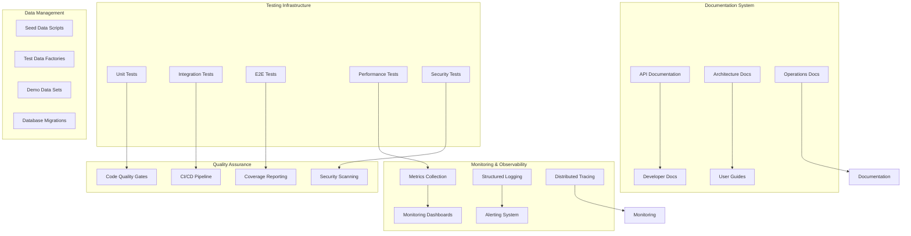
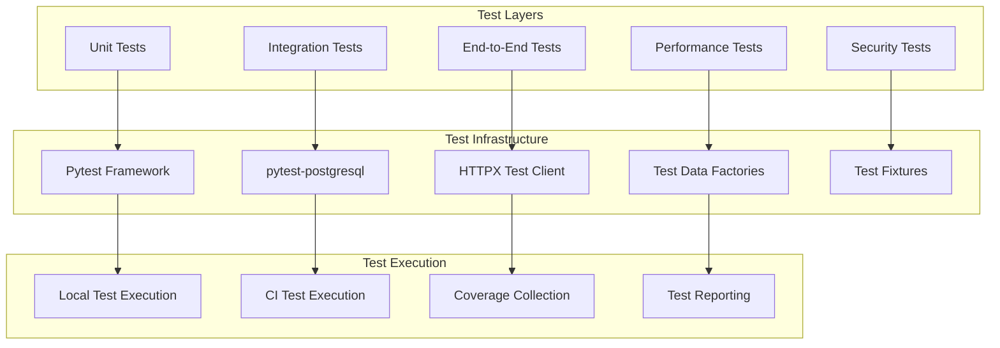
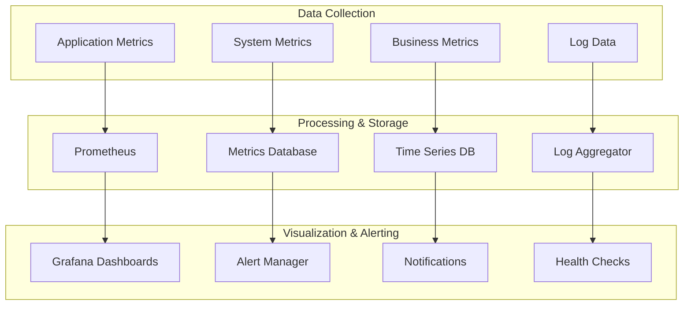

# Phase 6: Monitoring, Testing & Documentation Design

## Overview

The Phase 6: Monitoring, Testing & Documentation design establishes comprehensive testing infrastructure, monitoring capabilities, documentation systems, and quality assurance processes for CipherSwarm. This design ensures the system is production-ready with robust testing coverage, comprehensive observability, thorough documentation, and reliable deployment processes.

## Architecture

### High-Level Architecture



### Testing Architecture



### Monitoring Architecture



## Components and Interfaces

### Testing Infrastructure Components

#### Test Framework Configuration

```python
# pytest.ini configuration
[tool.pytest.ini_options]
minversion = "6.0"
addopts = [
    "-ra",
    "--strict-markers",
    "--strict-config",
    "--cov=app",
    "--cov-report=term-missing",
    "--cov-report=html",
    "--cov-report=xml",
    "--cov-fail-under=80",
]
testpaths = ["tests"]
markers = [
    "unit: Unit tests",
    "integration: Integration tests",
    "e2e: End-to-end tests",
    "performance: Performance tests",
    "security: Security tests",
    "slow: Slow running tests",
]
```

#### Test Data Factories

```python
from polyfactory import AsyncSQLAlchemyFactory
from app.models import User, Project, Campaign, Agent


class UserFactory(AsyncSQLAlchemyFactory[User]):
    __model__ = User
    __async_persistence__ = "create"

    email = Use(lambda: fake.email())
    username = Use(lambda: fake.user_name())
    is_active = True
    is_admin = False


class ProjectFactory(AsyncSQLAlchemyFactory[Project]):
    __model__ = Project
    __async_persistence__ = "create"

    name = Use(lambda: fake.company())
    description = Use(lambda: fake.text(max_nb_chars=200))


class CampaignFactory(AsyncSQLAlchemyFactory[Campaign]):
    __model__ = Campaign
    __async_persistence__ = "create"

    name = Use(lambda: fake.catch_phrase())
    description = Use(lambda: fake.text(max_nb_chars=500))
    project_id = None  # Must be set explicitly
    created_by = None  # Must be set explicitly


class AgentFactory(AsyncSQLAlchemyFactory[Agent]):
    __model__ = Agent
    __async_persistence__ = "create"

    name = Use(lambda: fake.hostname())
    operating_system = "Linux"
    devices = []
    project_id = None  # Must be set explicitly
```

#### Integration Test Base Classes

```python
import pytest
from httpx import AsyncClient
from sqlalchemy.ext.asyncio import AsyncSession
from app.main import app
from app.core.deps import get_db_session


class BaseIntegrationTest:
    """Base class for integration tests with database setup."""

    @pytest.fixture
    async def db_session(self, postgresql_proc) -> AsyncSession:
        """Provide isolated database session for tests."""
        # Database setup logic
        pass

    @pytest.fixture
    async def client(self, db_session) -> AsyncClient:
        """Provide HTTP client with database dependency override."""
        app.dependency_overrides[get_db_session] = lambda: db_session
        async with AsyncClient(app=app, base_url="http://test") as client:
            yield client
        app.dependency_overrides.clear()

    @pytest.fixture
    async def admin_user(self, db_session) -> User:
        """Create admin user for tests."""
        return await UserFactory.create_async(is_admin=True)

    @pytest.fixture
    async def auth_headers(self, admin_user) -> dict:
        """Provide authentication headers for admin user."""
        # JWT token generation logic
        pass


class BaseAPITest(BaseIntegrationTest):
    """Base class for API endpoint tests."""

    async def test_endpoint_requires_auth(self, client):
        """Test that endpoint requires authentication."""
        pass

    async def test_endpoint_requires_admin(self, client, auth_headers):
        """Test that endpoint requires admin privileges."""
        pass
```

### Monitoring and Observability Components

#### Metrics Collection Service

```python
from prometheus_client import Counter, Histogram, Gauge, CollectorRegistry
from typing import Dict, Any
import time


class MetricsCollector:
    """Centralized metrics collection service."""

    def __init__(self):
        self.registry = CollectorRegistry()
        self._setup_metrics()

    def _setup_metrics(self):
        """Initialize Prometheus metrics."""
        self.request_count = Counter(
            "http_requests_total",
            "Total HTTP requests",
            ["method", "endpoint", "status"],
            registry=self.registry,
        )

        self.request_duration = Histogram(
            "http_request_duration_seconds",
            "HTTP request duration",
            ["method", "endpoint"],
            registry=self.registry,
        )

        self.active_agents = Gauge(
            "active_agents_total", "Number of active agents", registry=self.registry
        )

        self.campaign_progress = Gauge(
            "campaign_progress_percent",
            "Campaign completion percentage",
            ["campaign_id"],
            registry=self.registry,
        )

        self.task_completion_rate = Histogram(
            "task_completion_seconds",
            "Task completion time",
            ["attack_mode"],
            registry=self.registry,
        )

    def record_request(self, method: str, endpoint: str, status: int, duration: float):
        """Record HTTP request metrics."""
        self.request_count.labels(method=method, endpoint=endpoint, status=status).inc()
        self.request_duration.labels(method=method, endpoint=endpoint).observe(duration)

    def update_agent_count(self, count: int):
        """Update active agent count."""
        self.active_agents.set(count)

    def update_campaign_progress(self, campaign_id: str, progress: float):
        """Update campaign progress percentage."""
        self.campaign_progress.labels(campaign_id=campaign_id).set(progress)

    def record_task_completion(self, attack_mode: str, duration: float):
        """Record task completion time."""
        self.task_completion_rate.labels(attack_mode=attack_mode).observe(duration)


# Global metrics instance
metrics = MetricsCollector()
```

#### Structured Logging Configuration

```python
from loguru import logger
import sys
import json
from typing import Dict, Any


class StructuredLogger:
    """Structured logging configuration for CipherSwarm."""

    def __init__(self):
        self._configure_logger()

    def _configure_logger(self):
        """Configure loguru with structured output."""
        # Remove default handler
        logger.remove()

        # Add structured JSON handler for production
        logger.add(
            sys.stdout, format=self._json_formatter, level="INFO", serialize=True
        )

        # Add human-readable handler for development
        if self._is_development():
            logger.add(
                sys.stderr,
                format="<green>{time:YYYY-MM-DD HH:mm:ss}</green> | "
                "<level>{level: <8}</level> | "
                "<cyan>{name}</cyan>:<cyan>{function}</cyan>:<cyan>{line}</cyan> | "
                "<level>{message}</level>",
                level="DEBUG",
            )

    def _json_formatter(self, record: Dict[str, Any]) -> str:
        """Format log record as JSON."""
        log_entry = {
            "timestamp": record["time"].isoformat(),
            "level": record["level"].name,
            "logger": record["name"],
            "function": record["function"],
            "line": record["line"],
            "message": record["message"],
            "extra": record.get("extra", {}),
        }
        return json.dumps(log_entry)

    def _is_development(self) -> bool:
        """Check if running in development mode."""
        import os

        return os.getenv("ENVIRONMENT", "development") == "development"


# Initialize structured logging
structured_logger = StructuredLogger()
```

#### Health Check System

```python
from typing import Dict, Any, List
from enum import Enum
import asyncio
import time


class HealthStatus(Enum):
    HEALTHY = "healthy"
    WARNING = "warning"
    ERROR = "error"
    UNKNOWN = "unknown"


class HealthCheck:
    """Individual health check component."""

    def __init__(self, name: str, check_func, timeout: float = 5.0):
        self.name = name
        self.check_func = check_func
        self.timeout = timeout
        self.last_check = None
        self.last_status = HealthStatus.UNKNOWN
        self.last_error = None

    async def check(self) -> Dict[str, Any]:
        """Execute health check with timeout."""
        start_time = time.time()
        try:
            result = await asyncio.wait_for(self.check_func(), timeout=self.timeout)
            self.last_status = HealthStatus.HEALTHY
            self.last_error = None
            return {
                "name": self.name,
                "status": self.last_status.value,
                "duration": time.time() - start_time,
                "details": result,
            }
        except asyncio.TimeoutError:
            self.last_status = HealthStatus.ERROR
            self.last_error = "Health check timeout"
            return {
                "name": self.name,
                "status": self.last_status.value,
                "duration": time.time() - start_time,
                "error": self.last_error,
            }
        except Exception as e:
            self.last_status = HealthStatus.ERROR
            self.last_error = str(e)
            return {
                "name": self.name,
                "status": self.last_status.value,
                "duration": time.time() - start_time,
                "error": self.last_error,
            }


class HealthCheckManager:
    """Manages all system health checks."""

    def __init__(self):
        self.checks: List[HealthCheck] = []
        self._register_default_checks()

    def _register_default_checks(self):
        """Register default system health checks."""
        from app.core.services.health_service import (
            check_database_health,
            check_redis_health,
            check_minio_health,
        )

        self.register_check("database", check_database_health)
        self.register_check("redis", check_redis_health)
        self.register_check("minio", check_minio_health)

    def register_check(self, name: str, check_func, timeout: float = 5.0):
        """Register a new health check."""
        self.checks.append(HealthCheck(name, check_func, timeout))

    async def check_all(self) -> Dict[str, Any]:
        """Execute all health checks concurrently."""
        results = await asyncio.gather(
            *[check.check() for check in self.checks], return_exceptions=True
        )

        overall_status = HealthStatus.HEALTHY
        for result in results:
            if isinstance(result, Exception):
                overall_status = HealthStatus.ERROR
                break
            elif result["status"] == HealthStatus.ERROR.value:
                overall_status = HealthStatus.ERROR
                break
            elif (
                result["status"] == HealthStatus.WARNING.value
                and overall_status == HealthStatus.HEALTHY
            ):
                overall_status = HealthStatus.WARNING

        return {
            "status": overall_status.value,
            "timestamp": time.time(),
            "checks": [r for r in results if not isinstance(r, Exception)],
        }


# Global health check manager
health_manager = HealthCheckManager()
```

### Documentation System Components

#### API Documentation Generator

```python
from fastapi import FastAPI
from fastapi.openapi.utils import get_openapi
from typing import Dict, Any


class APIDocumentationGenerator:
    """Generates comprehensive API documentation."""

    def __init__(self, app: FastAPI):
        self.app = app

    def generate_openapi_schema(self) -> Dict[str, Any]:
        """Generate OpenAPI schema with custom metadata."""
        if self.app.openapi_schema:
            return self.app.openapi_schema

        openapi_schema = get_openapi(
            title="CipherSwarm API",
            version="2.0.0",
            description=self._get_api_description(),
            routes=self.app.routes,
            servers=[
                {
                    "url": "https://api.cipherswarm.com",
                    "description": "Production server",
                },
                {
                    "url": "https://staging-api.cipherswarm.com",
                    "description": "Staging server",
                },
                {"url": "http://localhost:8000", "description": "Development server"},
            ],
        )

        # Add custom extensions
        openapi_schema["info"]["x-logo"] = {"url": "https://cipherswarm.com/logo.png"}

        # Add authentication schemes
        openapi_schema["components"]["securitySchemes"] = {
            "BearerAuth": {"type": "http", "scheme": "bearer", "bearerFormat": "JWT"},
            "AgentToken": {
                "type": "http",
                "scheme": "bearer",
                "description": "Agent authentication token",
            },
        }

        self.app.openapi_schema = openapi_schema
        return self.app.openapi_schema

    def _get_api_description(self) -> str:
        """Get comprehensive API description."""
        return """
        CipherSwarm is a distributed password cracking management system that coordinates
        multiple hashcat instances across different machines to efficiently crack password
        hashes using various attack strategies.
        
        ## Authentication
        
        The API uses different authentication methods for different interfaces:
        
        - **Web UI API**: JWT tokens with refresh token support
        - **Agent API**: Bearer tokens specific to each agent
        - **Control API**: API keys for programmatic access
        
        ## Rate Limiting
        
        API endpoints are rate limited to prevent abuse:
        
        - Web UI API: 1000 requests per hour per user
        - Agent API: 10000 requests per hour per agent
        - Control API: 5000 requests per hour per API key
        
        ## Error Handling
        
        All API endpoints return consistent error responses following RFC 7807
        Problem Details for HTTP APIs standard.
        """


def setup_api_docs(app: FastAPI):
    """Setup API documentation with Swagger UI and ReDoc."""
    doc_generator = APIDocumentationGenerator(app)

    # Generate OpenAPI schema
    doc_generator.generate_openapi_schema()

    # Configure Swagger UI
    app.swagger_ui_parameters = {
        "deepLinking": True,
        "displayRequestDuration": True,
        "docExpansion": "none",
        "operationsSorter": "method",
        "filter": True,
        "showExtensions": True,
        "showCommonExtensions": True,
    }
```

#### Documentation Site Generator

```yaml
# mkdocs.yml configuration
site_name: CipherSwarm Documentation
site_description: Distributed Password Cracking Management System
site_author: CipherSwarm Team
site_url: https://docs.cipherswarm.com

repo_name: cipherswarm/cipherswarm
repo_url: https://github.com/cipherswarm/cipherswarm

theme:
  name: material
  palette:
    - scheme: default
      primary: indigo
      accent: indigo
      toggle:
        icon: material/brightness-7
        name: Switch to dark mode
    - scheme: slate
      primary: indigo
      accent: indigo
      toggle:
        icon: material/brightness-4
        name: Switch to light mode
  features:
    - navigation.tabs
    - navigation.sections
    - navigation.expand
    - navigation.top
    - search.highlight
    - search.share
    - content.code.annotate

plugins:
  - search
  - mkdocstrings:
      handlers:
        python:
          options:
            docstring_style: google
  - mermaid2

markdown_extensions:
  - admonition
  - pymdownx.details
  - pymdownx.superfences:
      custom_fences:
        - name: mermaid
          class: mermaid
          format: !!python/name:pymdownx.superfences.fence_code_format
  - pymdownx.tabbed:
      alternate_style: true
  - pymdownx.highlight:
      anchor_linenums: true
  - pymdownx.inlinehilite
  - pymdownx.snippets
  - attr_list
  - md_in_html

nav:
  - Home: index.md
  - Getting Started:
      - Installation: getting-started/installation.md
      - Quick Start: getting-started/quick-start.md
      - Configuration: getting-started/configuration.md
  - Architecture:
      - Overview: architecture/overview.md
      - Components: architecture/components.md
      - Security: architecture/security.md
  - User Guide:
      - Projects: user-guide/projects.md
      - Campaigns: user-guide/campaigns.md
      - Agents: user-guide/agents.md
      - Results: user-guide/results.md
  - API Reference:
      - Overview: api/overview.md
      - Authentication: api/authentication.md
      - Web UI API: api/web-ui.md
      - Agent API: api/agent.md
      - Control API: api/control.md
  - Development:
      - Setup: development/setup.md
      - Contributing: development/contributing.md
      - Testing: development/testing.md
      - Deployment: development/deployment.md
```

### Database Seeding Components

#### Seed Data Manager

```python
from typing import List, Dict, Any
import asyncio
from sqlalchemy.ext.asyncio import AsyncSession
from app.models import User, Project, Campaign, HashList, Agent
from tests.factories import UserFactory, ProjectFactory, CampaignFactory


class SeedDataManager:
    """Manages database seeding for development and demo purposes."""

    def __init__(self, db_session: AsyncSession):
        self.db = db_session
        self.created_objects = {}

    async def seed_all(self):
        """Seed all demo data."""
        await self.seed_admin_user()
        await self.seed_demo_projects()
        await self.seed_demo_campaigns()
        await self.seed_demo_agents()
        await self.seed_wordlists_and_rules()
        await self.db.commit()

    async def seed_admin_user(self) -> User:
        """Create default admin user."""
        admin = await UserFactory.create_async(
            email="admin@cipherswarm.local",
            username="admin",
            is_admin=True,
            is_active=True,
        )
        self.created_objects["admin_user"] = admin
        return admin

    async def seed_demo_projects(self) -> List[Project]:
        """Create demo projects with different configurations."""
        projects = []

        # Enterprise project
        enterprise_project = await ProjectFactory.create_async(
            name="Enterprise Security Assessment",
            description="Large-scale password audit for enterprise environment",
        )
        projects.append(enterprise_project)

        # Research project
        research_project = await ProjectFactory.create_async(
            name="Password Research Study",
            description="Academic research on password patterns and security",
        )
        projects.append(research_project)

        # Penetration testing project
        pentest_project = await ProjectFactory.create_async(
            name="Penetration Testing Campaign",
            description="Red team engagement password cracking activities",
        )
        projects.append(pentest_project)

        self.created_objects["demo_projects"] = projects
        return projects

    async def seed_demo_campaigns(self) -> List[Campaign]:
        """Create demo campaigns with various configurations."""
        campaigns = []
        admin_user = self.created_objects["admin_user"]
        projects = self.created_objects["demo_projects"]

        for i, project in enumerate(projects):
            campaign = await CampaignFactory.create_async(
                name=f"Demo Campaign {i + 1}",
                description=f"Demonstration campaign for {project.name}",
                project_id=project.id,
                created_by=admin_user.id,
            )
            campaigns.append(campaign)

        self.created_objects["demo_campaigns"] = campaigns
        return campaigns

    async def seed_demo_agents(self) -> List[Agent]:
        """Create demo agents with different capabilities."""
        agents = []
        projects = self.created_objects["demo_projects"]

        # High-performance GPU agent
        gpu_agent = await AgentFactory.create_async(
            name="gpu-workstation-01",
            operating_system="Linux",
            project_id=projects[0].id,
            devices=[
                {
                    "device_id": 1,
                    "device_name": "NVIDIA RTX 4090",
                    "device_type": "GPU",
                    "compute_capability": "8.9",
                    "memory_total": 24576,
                }
            ],
        )
        agents.append(gpu_agent)

        # CPU-only agent
        cpu_agent = await AgentFactory.create_async(
            name="cpu-server-01",
            operating_system="Linux",
            project_id=projects[1].id,
            devices=[
                {
                    "device_id": 0,
                    "device_name": "Intel Xeon E5-2690",
                    "device_type": "CPU",
                    "cores": 16,
                    "threads": 32,
                }
            ],
        )
        agents.append(cpu_agent)

        self.created_objects["demo_agents"] = agents
        return agents

    async def seed_wordlists_and_rules(self):
        """Seed common wordlists and rules for demonstrations."""
        # This would typically involve uploading files to MinIO
        # and creating database records for the resources
        pass


async def run_seed_data(db_session: AsyncSession):
    """Run complete database seeding process."""
    seeder = SeedDataManager(db_session)
    await seeder.seed_all()

    print("Database seeding completed successfully!")
    print(f"Created admin user: {seeder.created_objects['admin_user'].email}")
    print(f"Created {len(seeder.created_objects['demo_projects'])} demo projects")
    print(f"Created {len(seeder.created_objects['demo_campaigns'])} demo campaigns")
    print(f"Created {len(seeder.created_objects['demo_agents'])} demo agents")
```

## Data Models

### Test Data Models

```python
from dataclasses import dataclass
from typing import List, Dict, Any, Optional
from datetime import datetime


@dataclass
class TestScenario:
    """Represents a complete test scenario with setup and validation."""

    name: str
    description: str
    setup_data: Dict[str, Any]
    test_steps: List[str]
    expected_results: Dict[str, Any]
    cleanup_required: bool = True


@dataclass
class PerformanceBaseline:
    """Performance baseline for comparison testing."""

    endpoint: str
    method: str
    avg_response_time: float
    max_response_time: float
    requests_per_second: float
    memory_usage_mb: float
    cpu_usage_percent: float
    timestamp: datetime


@dataclass
class SecurityTestCase:
    """Security test case definition."""

    name: str
    category: str  # authentication, authorization, input_validation, etc.
    test_type: str  # positive, negative, boundary
    payload: Dict[str, Any]
    expected_status: int
    expected_response: Dict[str, Any]
    risk_level: str  # low, medium, high, critical
```

### Monitoring Data Models

```python
from sqlalchemy import Column, String, Float, Integer, DateTime, JSON
from sqlalchemy.dialects.postgresql import UUID
from app.models.base import BaseModel
import uuid


class SystemMetric(BaseModel):
    """System performance metrics storage."""

    __tablename__ = "system_metrics"

    id = Column(UUID(as_uuid=True), primary_key=True, default=uuid.uuid4)
    metric_name = Column(String(100), nullable=False, index=True)
    metric_value = Column(Float, nullable=False)
    metric_unit = Column(String(20))
    component = Column(String(50), nullable=False, index=True)
    labels = Column(JSON, default={})
    timestamp = Column(DateTime, nullable=False, index=True)


class HealthCheckResult(BaseModel):
    """Health check results storage."""

    __tablename__ = "health_check_results"

    id = Column(UUID(as_uuid=True), primary_key=True, default=uuid.uuid4)
    check_name = Column(String(100), nullable=False, index=True)
    status = Column(String(20), nullable=False)  # healthy, warning, error
    duration_ms = Column(Float, nullable=False)
    details = Column(JSON, default={})
    error_message = Column(String(500))
    timestamp = Column(DateTime, nullable=False, index=True)


class PerformanceTest(BaseModel):
    """Performance test results storage."""

    __tablename__ = "performance_tests"

    id = Column(UUID(as_uuid=True), primary_key=True, default=uuid.uuid4)
    test_name = Column(String(100), nullable=False)
    test_type = Column(String(50), nullable=False)  # load, stress, spike, volume
    duration_seconds = Column(Integer, nullable=False)
    concurrent_users = Column(Integer, nullable=False)
    total_requests = Column(Integer, nullable=False)
    successful_requests = Column(Integer, nullable=False)
    failed_requests = Column(Integer, nullable=False)
    avg_response_time = Column(Float, nullable=False)
    max_response_time = Column(Float, nullable=False)
    requests_per_second = Column(Float, nullable=False)
    results = Column(JSON, default={})
    timestamp = Column(DateTime, nullable=False, index=True)
```

## Error Handling

### Test Error Handling

```python
class TestError(Exception):
    """Base exception for test-related errors."""

    pass


class TestSetupError(TestError):
    """Raised when test setup fails."""

    pass


class TestDataError(TestError):
    """Raised when test data is invalid or corrupted."""

    pass


class PerformanceTestError(TestError):
    """Raised when performance tests fail to meet criteria."""

    pass


class SecurityTestError(TestError):
    """Raised when security tests detect vulnerabilities."""

    pass


def handle_test_errors(func):
    """Decorator for handling test errors gracefully."""

    def wrapper(*args, **kwargs):
        try:
            return func(*args, **kwargs)
        except TestSetupError as e:
            logger.error(f"Test setup failed: {e}")
            pytest.skip(f"Test setup failed: {e}")
        except TestDataError as e:
            logger.error(f"Test data error: {e}")
            pytest.fail(f"Test data error: {e}")
        except PerformanceTestError as e:
            logger.warning(f"Performance test failed: {e}")
            # Don't fail the test, but log the performance issue
            return False
        except SecurityTestError as e:
            logger.critical(f"Security test failed: {e}")
            pytest.fail(f"SECURITY ISSUE DETECTED: {e}")

    return wrapper
```

### Monitoring Error Handling

```python
class MonitoringError(Exception):
    """Base exception for monitoring-related errors."""

    pass


class MetricsCollectionError(MonitoringError):
    """Raised when metrics collection fails."""

    pass


class HealthCheckError(MonitoringError):
    """Raised when health checks fail."""

    pass


class AlertingError(MonitoringError):
    """Raised when alerting system fails."""

    pass


async def safe_metrics_collection(func):
    """Decorator for safe metrics collection with error handling."""

    async def wrapper(*args, **kwargs):
        try:
            return await func(*args, **kwargs)
        except Exception as e:
            logger.error(f"Metrics collection failed: {e}")
            # Don't let monitoring failures break the application
            return None

    return wrapper
```

## Testing Strategy

### Unit Testing Strategy

```python
# Example unit test structure
class TestCampaignService:
    """Unit tests for campaign service."""

    @pytest.fixture
    def mock_db_session(self):
        """Mock database session."""
        return AsyncMock(spec=AsyncSession)

    @pytest.fixture
    def campaign_service(self, mock_db_session):
        """Campaign service with mocked dependencies."""
        return CampaignService(mock_db_session)

    async def test_create_campaign_success(self, campaign_service, mock_db_session):
        """Test successful campaign creation."""
        # Arrange
        campaign_data = CampaignCreate(
            name="Test Campaign",
            description="Test Description",
            project_id=uuid.uuid4(),
        )

        # Act
        result = await campaign_service.create_campaign(campaign_data)

        # Assert
        assert result.name == campaign_data.name
        mock_db_session.add.assert_called_once()
        mock_db_session.commit.assert_called_once()

    async def test_create_campaign_validation_error(self, campaign_service):
        """Test campaign creation with invalid data."""
        # Arrange
        invalid_data = CampaignCreate(
            name="",  # Invalid empty name
            description="Test Description",
            project_id=uuid.uuid4(),
        )

        # Act & Assert
        with pytest.raises(ValidationError):
            await campaign_service.create_campaign(invalid_data)
```

### Integration Testing Strategy

```python
class TestCampaignAPI(BaseIntegrationTest):
    """Integration tests for campaign API endpoints."""

    async def test_create_campaign_endpoint(self, client, auth_headers, db_session):
        """Test campaign creation endpoint."""
        # Arrange
        project = await ProjectFactory.create_async()
        campaign_data = {
            "name": "Integration Test Campaign",
            "description": "Test campaign for integration testing",
            "project_id": str(project.id),
        }

        # Act
        response = await client.post(
            "/api/v1/web/campaigns/", json=campaign_data, headers=auth_headers
        )

        # Assert
        assert response.status_code == 201
        data = response.json()
        assert data["name"] == campaign_data["name"]
        assert data["project_id"] == campaign_data["project_id"]

        # Verify database state
        campaign = await db_session.get(Campaign, data["id"])
        assert campaign is not None
        assert campaign.name == campaign_data["name"]
```

### Performance Testing Strategy

```python
import asyncio
import time
from concurrent.futures import ThreadPoolExecutor


class PerformanceTestSuite:
    """Performance testing suite for CipherSwarm."""

    def __init__(self, base_url: str):
        self.base_url = base_url
        self.results = []

    async def load_test_endpoint(
        self, endpoint: str, concurrent_users: int, duration: int
    ):
        """Load test a specific endpoint."""
        start_time = time.time()
        tasks = []

        async with aiohttp.ClientSession() as session:
            for _ in range(concurrent_users):
                task = asyncio.create_task(
                    self._simulate_user_load(session, endpoint, duration)
                )
                tasks.append(task)

            results = await asyncio.gather(*tasks, return_exceptions=True)

        end_time = time.time()

        # Analyze results
        successful_requests = sum(1 for r in results if not isinstance(r, Exception))
        failed_requests = len(results) - successful_requests
        total_duration = end_time - start_time

        return {
            "endpoint": endpoint,
            "concurrent_users": concurrent_users,
            "duration": total_duration,
            "successful_requests": successful_requests,
            "failed_requests": failed_requests,
            "requests_per_second": successful_requests / total_duration,
        }

    async def _simulate_user_load(self, session, endpoint: str, duration: int):
        """Simulate user load for specified duration."""
        end_time = time.time() + duration
        request_count = 0

        while time.time() < end_time:
            try:
                async with session.get(f"{self.base_url}{endpoint}") as response:
                    await response.read()
                    request_count += 1
            except Exception as e:
                logger.error(f"Request failed: {e}")

            # Small delay to prevent overwhelming the server
            await asyncio.sleep(0.1)

        return request_count
```

## Performance Considerations

### Testing Performance Optimization

- **Parallel Test Execution**: Use pytest-xdist for parallel test execution
- **Database Optimization**: Use transaction rollback for test isolation
- **Mock Strategy**: Mock external dependencies to improve test speed
- **Test Data Management**: Use factories and fixtures efficiently
- **Resource Cleanup**: Ensure proper cleanup to prevent resource leaks

### Monitoring Performance Optimization

- **Metrics Aggregation**: Pre-aggregate metrics to reduce query load
- **Sampling Strategy**: Use sampling for high-frequency metrics
- **Storage Optimization**: Use time-series databases for metrics storage
- **Query Optimization**: Optimize monitoring queries for performance
- **Caching Strategy**: Cache frequently accessed monitoring data

### Documentation Performance Optimization

- **Static Generation**: Use static site generation for documentation
- **CDN Distribution**: Distribute documentation via CDN
- **Search Optimization**: Optimize search functionality for large documentation sets
- **Image Optimization**: Optimize images and diagrams for web delivery
- **Lazy Loading**: Implement lazy loading for large documentation sections

This comprehensive design provides the foundation for implementing robust testing, monitoring, and documentation systems that ensure CipherSwarm is production-ready with high quality, reliability, and maintainability.
