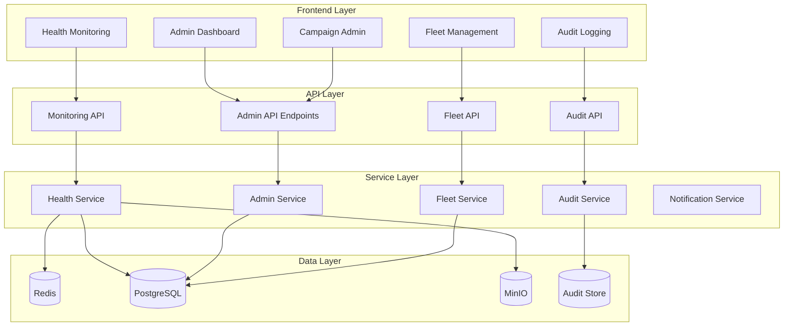
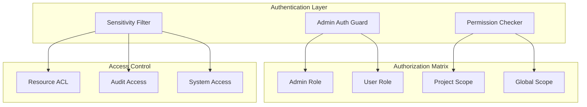

# System Monitoring & Administrative Features Design

## Overview

The System Monitoring & Administrative Features provide comprehensive system oversight, audit compliance, and administrative control capabilities for CipherSwarm. This design implements real-time monitoring dashboards, comprehensive audit logging, fleet management, and advanced administrative controls while maintaining security, performance, and usability standards.

## Architecture

### High-Level Architecture



### Security Architecture



## Components and Interfaces

### System Health Monitoring Components

#### Health Dashboard Component

```typescript
interface HealthDashboardProps {
  refreshInterval?: number;
  alertThresholds?: AlertThresholds;
  adminOnly: boolean;
}

interface SystemHealthMetrics {
  redis: RedisHealthMetrics;
  postgresql: PostgreSQLHealthMetrics;
  minio: MinIOHealthMetrics;
  agents: AgentFleetMetrics;
  alerts: SystemAlert[];
}

interface RedisHealthMetrics {
  connectionStatus: 'healthy' | 'warning' | 'error';
  queueLengths: Record<string, number>;
  processingRates: Record<string, number>;
  failedJobs: number;
  latency: number;
}

interface PostgreSQLHealthMetrics {
  connectionPool: {
    active: number;
    idle: number;
    total: number;
  };
  queryPerformance: {
    avgExecutionTime: number;
    slowQueries: number;
  };
  health: 'healthy' | 'warning' | 'error';
}

interface MinIOHealthMetrics {
  storage: {
    used: number;
    available: number;
    percentage: number;
  };
  performance: {
    uploadSpeed: number;
    downloadSpeed: number;
    latency: number;
    errorRate: number;
  };
  buckets: BucketHealthInfo[];
}
```

#### Real-time Metrics Service

```typescript
class HealthMonitoringService {
  async getSystemHealth(): Promise<SystemHealthMetrics>;
  async getRedisMetrics(): Promise<RedisHealthMetrics>;
  async getPostgreSQLMetrics(): Promise<PostgreSQLHealthMetrics>;
  async getMinIOMetrics(): Promise<MinIOHealthMetrics>;
  async getAgentFleetMetrics(): Promise<AgentFleetMetrics>;
  async subscribeToHealthUpdates(callback: (metrics: SystemHealthMetrics) => void): Promise<void>;
  async setAlertThresholds(thresholds: AlertThresholds): Promise<void>;
}
```

### Audit Logging Components

#### Audit Log Interface

```typescript
interface AuditLogEntry {
  id: string;
  timestamp: Date;
  userId?: string;
  userEmail?: string;
  action: string;
  resourceType: string;
  resourceId?: string;
  details: Record<string, any>;
  ipAddress: string;
  userAgent: string;
  sessionId: string;
  severity: 'info' | 'warning' | 'error' | 'critical';
  category: 'user_action' | 'system_event' | 'security_event';
  beforeState?: Record<string, any>;
  afterState?: Record<string, any>;
}

interface AuditLogFilter {
  dateRange?: {
    start: Date;
    end: Date;
  };
  userId?: string;
  actionType?: string;
  resourceType?: string;
  severity?: string[];
  category?: string[];
  searchQuery?: string;
}

interface AuditLogExportOptions {
  format: 'csv' | 'json';
  filter: AuditLogFilter;
  includeDetails: boolean;
}
```

#### Audit Service

```typescript
class AuditService {
  async logUserAction(action: string, userId: string, details: Record<string, any>): Promise<void>;
  async logSystemEvent(event: string, details: Record<string, any>): Promise<void>;
  async logSecurityEvent(event: string, details: Record<string, any>): Promise<void>;
  async getAuditLogs(filter: AuditLogFilter, pagination: PaginationOptions): Promise<PaginatedResult<AuditLogEntry>>;
  async searchAuditLogs(query: string, filter: AuditLogFilter): Promise<AuditLogEntry[]>;
  async exportAuditLogs(options: AuditLogExportOptions): Promise<ExportResult>;
  async getAuditLogDetails(id: string): Promise<AuditLogEntry>;
  async getRelatedAuditLogs(id: string): Promise<AuditLogEntry[]>;
}
```

### Administrative Dashboard Components

#### Admin Dashboard Interface

```typescript
interface AdminDashboardState {
  systemStatus: SystemStatus;
  backgroundJobs: BackgroundJobStatus[];
  maintenanceMode: boolean;
  systemConfiguration: SystemConfiguration;
  bulkOperations: BulkOperationStatus[];
}

interface SystemStatus {
  services: ServiceStatus[];
  uptime: number;
  version: string;
  lastRestart: Date;
}

interface ServiceStatus {
  name: string;
  status: 'running' | 'stopped' | 'error' | 'maintenance';
  health: 'healthy' | 'warning' | 'error';
  lastCheck: Date;
  details?: Record<string, any>;
}

interface BackgroundJobStatus {
  id: string;
  name: string;
  status: 'pending' | 'running' | 'completed' | 'failed' | 'paused';
  progress?: number;
  startTime?: Date;
  endTime?: Date;
  error?: string;
}
```

#### Administrative Service

```typescript
class AdministrativeService {
  async getSystemStatus(): Promise<SystemStatus>;
  async getBackgroundJobs(): Promise<BackgroundJobStatus[]>;
  async controlBackgroundJob(jobId: string, action: 'pause' | 'resume' | 'cancel' | 'retry'): Promise<void>;
  async enableMaintenanceMode(reason: string): Promise<void>;
  async disableMaintenanceMode(): Promise<void>;
  async performBulkOperation(operation: BulkOperation): Promise<BulkOperationResult>;
  async getSystemConfiguration(): Promise<SystemConfiguration>;
  async updateSystemConfiguration(config: Partial<SystemConfiguration>): Promise<void>;
  async performEmergencyShutdown(reason: string): Promise<void>;
  async restartSystem(reason: string): Promise<void>;
}
```

### Resource Permission Management

#### Permission Management Interface

```typescript
interface ResourcePermission {
  resourceType: string;
  resourceId: string;
  userId: string;
  permissions: Permission[];
  scope: 'global' | 'project';
  projectId?: string;
  inheritedFrom?: string;
  sensitivityLevel: 'public' | 'internal' | 'confidential' | 'restricted';
}

interface Permission {
  action: string;
  granted: boolean;
  conditions?: Record<string, any>;
}

interface SensitivityRule {
  resourceType: string;
  field: string;
  sensitivityLevel: 'public' | 'internal' | 'confidential' | 'restricted';
  redactionRule: 'hide' | 'mask' | 'truncate' | 'hash';
}
```

#### Permission Service

```typescript
class PermissionService {
  async checkResourceAccess(userId: string, resourceType: string, resourceId: string, action: string): Promise<boolean>;
  async getResourcePermissions(resourceType: string, resourceId: string): Promise<ResourcePermission[]>;
  async setResourcePermissions(permissions: ResourcePermission[]): Promise<void>;
  async applySensitivityFilter(data: any, userId: string, resourceType: string): Promise<any>;
  async shareResourceAcrossProjects(resourceId: string, sourceProjectId: string, targetProjectIds: string[]): Promise<void>;
  async getPermissionInheritance(resourceType: string, resourceId: string): Promise<PermissionInheritance>;
}
```

### Agent Fleet Management

#### Fleet Management Interface

```typescript
interface AgentFleetOverview {
  totalAgents: number;
  onlineAgents: number;
  offlineAgents: number;
  performanceSummary: FleetPerformanceSummary;
  healthDistribution: Record<string, number>;
  utilizationMetrics: AgentUtilizationMetrics;
}

interface FleetPerformanceSummary {
  totalHashRate: number;
  averageUtilization: number;
  performanceTrends: PerformanceTrend[];
  bottlenecks: PerformanceBottleneck[];
}

interface AgentConfiguration {
  agentId: string;
  configuration: Record<string, any>;
  version: string;
  lastUpdated: Date;
  status: 'pending' | 'applied' | 'failed';
}

interface AgentAnalytics {
  agentId: string;
  utilizationHistory: UtilizationDataPoint[];
  performanceMetrics: PerformanceMetrics;
  costEffectiveness: CostEffectivenessMetrics;
  predictiveMaintenanceScore: number;
}
```

#### Fleet Management Service

```typescript
class FleetManagementService {
  async getFleetOverview(): Promise<AgentFleetOverview>;
  async getAgentConfigurations(): Promise<AgentConfiguration[]>;
  async updateAgentConfiguration(agentId: string, configuration: Record<string, any>): Promise<void>;
  async deployConfigurationUpdate(agentIds: string[], configuration: Record<string, any>): Promise<DeploymentResult>;
  async getAgentAnalytics(agentId: string): Promise<AgentAnalytics>;
  async getFleetAnalytics(): Promise<FleetAnalytics>;
  async optimizeWorkloadDistribution(): Promise<WorkloadOptimizationResult>;
  async getPredictiveMaintenanceRecommendations(): Promise<MaintenanceRecommendation[]>;
}
```

### Campaign and Attack Administration

#### Campaign Administration Interface

```typescript
interface CampaignEditData {
  id: string;
  name: string;
  description: string;
  notes?: string;
  settings: CampaignSettings;
  attacks: AttackConfiguration[];
}

interface CampaignDeletionAssessment {
  campaignId: string;
  associatedAttacks: number;
  activeTasks: number;
  associatedResources: ResourceReference[];
  warnings: DeletionWarning[];
  cascadeEffects: CascadeEffect[];
}

interface StandaloneAttack {
  id: string;
  name: string;
  description: string;
  configuration: AttackConfiguration;
  template: boolean;
  shared: boolean;
  keyspaceEstimate: KeyspaceEstimate;
}
```

#### Campaign Administration Service

```typescript
class CampaignAdministrationService {
  async getCampaignForEdit(campaignId: string): Promise<CampaignEditData>;
  async updateCampaign(campaignId: string, updates: Partial<CampaignEditData>): Promise<void>;
  async reorderAttacks(campaignId: string, attackOrder: string[]): Promise<void>;
  async assessCampaignDeletion(campaignId: string): Promise<CampaignDeletionAssessment>;
  async deleteCampaign(campaignId: string, confirmation: DeletionConfirmation): Promise<void>;
  async transferCampaignOwnership(campaignId: string, newOwnerId: string): Promise<void>;
  async createStandaloneAttack(attack: StandaloneAttack): Promise<string>;
  async saveAttackAsTemplate(attackId: string, templateName: string): Promise<void>;
  async exportAttackConfiguration(attackId: string): Promise<AttackExport>;
}
```

### Notification and Communication System

#### Notification Interface

```typescript
interface AdminNotification {
  id: string;
  type: 'system_health' | 'security_event' | 'resource_quota' | 'maintenance' | 'critical_error';
  severity: 'info' | 'warning' | 'error' | 'critical';
  title: string;
  message: string;
  details?: Record<string, any>;
  timestamp: Date;
  acknowledged: boolean;
  acknowledgedBy?: string;
  acknowledgedAt?: Date;
  escalated: boolean;
  escalationLevel: number;
}

interface UserAnnouncement {
  id: string;
  title: string;
  content: string;
  targetAudience: 'all' | 'admins' | 'project_users' | 'specific_users';
  targetUserIds?: string[];
  priority: 'low' | 'normal' | 'high' | 'urgent';
  startDate: Date;
  endDate?: Date;
  active: boolean;
}
```

#### Notification Service

```typescript
class NotificationService {
  async createSystemHealthAlert(alert: SystemHealthAlert): Promise<void>;
  async createSecurityEventNotification(event: SecurityEvent): Promise<void>;
  async createResourceQuotaNotification(quota: ResourceQuotaAlert): Promise<void>;
  async createMaintenanceNotification(maintenance: MaintenanceNotification): Promise<void>;
  async escalateCriticalError(error: CriticalError): Promise<void>;
  async createUserAnnouncement(announcement: UserAnnouncement): Promise<string>;
  async getActiveNotifications(): Promise<AdminNotification[]>;
  async acknowledgeNotification(notificationId: string, userId: string): Promise<void>;
  async getNotificationDeliveryStatus(notificationId: string): Promise<DeliveryStatus>;
}
```

## Data Models

### Audit Log Schema

```sql
CREATE TABLE audit_logs (
    id UUID PRIMARY KEY DEFAULT gen_random_uuid(),
    timestamp TIMESTAMPTZ NOT NULL DEFAULT NOW(),
    user_id UUID REFERENCES users(id),
    user_email VARCHAR(255),
    action VARCHAR(100) NOT NULL,
    resource_type VARCHAR(50) NOT NULL,
    resource_id VARCHAR(100),
    details JSONB NOT NULL DEFAULT '{}',
    ip_address INET,
    user_agent TEXT,
    session_id VARCHAR(100),
    severity VARCHAR(20) NOT NULL DEFAULT 'info',
    category VARCHAR(30) NOT NULL DEFAULT 'user_action',
    before_state JSONB,
    after_state JSONB,
    created_at TIMESTAMPTZ NOT NULL DEFAULT NOW()
);

CREATE INDEX idx_audit_logs_timestamp ON audit_logs(timestamp DESC);
CREATE INDEX idx_audit_logs_user_id ON audit_logs(user_id);
CREATE INDEX idx_audit_logs_action ON audit_logs(action);
CREATE INDEX idx_audit_logs_resource ON audit_logs(resource_type, resource_id);
CREATE INDEX idx_audit_logs_category ON audit_logs(category);
CREATE INDEX idx_audit_logs_severity ON audit_logs(severity);
```

### System Health Metrics Schema

```sql
CREATE TABLE system_health_metrics (
    id UUID PRIMARY KEY DEFAULT gen_random_uuid(),
    timestamp TIMESTAMPTZ NOT NULL DEFAULT NOW(),
    service_name VARCHAR(50) NOT NULL,
    metric_name VARCHAR(100) NOT NULL,
    metric_value NUMERIC,
    metric_unit VARCHAR(20),
    metadata JSONB DEFAULT '{}',
    created_at TIMESTAMPTZ NOT NULL DEFAULT NOW()
);

CREATE INDEX idx_health_metrics_timestamp ON system_health_metrics(timestamp DESC);
CREATE INDEX idx_health_metrics_service ON system_health_metrics(service_name);
CREATE INDEX idx_health_metrics_name ON system_health_metrics(metric_name);
```

### Resource Permissions Schema

```sql
CREATE TABLE resource_permissions (
    id UUID PRIMARY KEY DEFAULT gen_random_uuid(),
    resource_type VARCHAR(50) NOT NULL,
    resource_id VARCHAR(100) NOT NULL,
    user_id UUID REFERENCES users(id),
    permissions JSONB NOT NULL DEFAULT '[]',
    scope VARCHAR(20) NOT NULL DEFAULT 'project',
    project_id UUID REFERENCES projects(id),
    inherited_from UUID REFERENCES resource_permissions(id),
    sensitivity_level VARCHAR(20) NOT NULL DEFAULT 'internal',
    created_at TIMESTAMPTZ NOT NULL DEFAULT NOW(),
    updated_at TIMESTAMPTZ NOT NULL DEFAULT NOW()
);

CREATE INDEX idx_resource_permissions_resource ON resource_permissions(resource_type, resource_id);
CREATE INDEX idx_resource_permissions_user ON resource_permissions(user_id);
CREATE INDEX idx_resource_permissions_project ON resource_permissions(project_id);
```

### Admin Notifications Schema

```sql
CREATE TABLE admin_notifications (
    id UUID PRIMARY KEY DEFAULT gen_random_uuid(),
    type VARCHAR(30) NOT NULL,
    severity VARCHAR(20) NOT NULL,
    title VARCHAR(255) NOT NULL,
    message TEXT NOT NULL,
    details JSONB DEFAULT '{}',
    timestamp TIMESTAMPTZ NOT NULL DEFAULT NOW(),
    acknowledged BOOLEAN NOT NULL DEFAULT FALSE,
    acknowledged_by UUID REFERENCES users(id),
    acknowledged_at TIMESTAMPTZ,
    escalated BOOLEAN NOT NULL DEFAULT FALSE,
    escalation_level INTEGER NOT NULL DEFAULT 0,
    created_at TIMESTAMPTZ NOT NULL DEFAULT NOW()
);

CREATE INDEX idx_admin_notifications_type ON admin_notifications(type);
CREATE INDEX idx_admin_notifications_severity ON admin_notifications(severity);
CREATE INDEX idx_admin_notifications_timestamp ON admin_notifications(timestamp DESC);
CREATE INDEX idx_admin_notifications_acknowledged ON admin_notifications(acknowledged);
```

## Error Handling

### Error Categories

1. **Authentication Errors**: Unauthorized access to admin features
2. **Permission Errors**: Insufficient privileges for operations
3. **System Health Errors**: Service unavailability or degraded performance
4. **Audit Errors**: Audit log corruption or access failures
5. **Configuration Errors**: Invalid system configuration changes
6. **Export Errors**: Audit log export failures or timeouts

### Error Response Format

```typescript
interface AdminErrorResponse {
  error: {
    code: string;
    message: string;
    details?: Record<string, any>;
    severity: 'low' | 'medium' | 'high' | 'critical';
    timestamp: Date;
    correlationId: string;
  };
}
```

### Error Handling Strategies

- **Graceful Degradation**: Continue operation with reduced functionality when non-critical services fail
- **Circuit Breaker**: Prevent cascade failures in monitoring systems
- **Retry Logic**: Automatic retry for transient failures with exponential backoff
- **Fallback Mechanisms**: Alternative data sources when primary monitoring fails
- **Error Aggregation**: Group similar errors to prevent notification spam

## Testing Strategy

### Unit Testing

- **Service Layer Testing**: Mock external dependencies and test business logic
- **Component Testing**: Test UI components with mocked data
- **Permission Testing**: Verify access control enforcement
- **Audit Testing**: Validate audit log creation and retrieval

### Integration Testing

- **API Integration**: Test admin API endpoints with real database
- **Service Integration**: Test service interactions with external systems
- **Permission Integration**: Test end-to-end permission enforcement
- **Notification Integration**: Test notification delivery mechanisms

### End-to-End Testing

- **Mocked E2E Tests**: Fast tests with mocked backend responses
- **Full E2E Tests**: Complete integration tests with real backend
- **Admin Workflow Tests**: Test complete administrative workflows
- **Monitoring Tests**: Verify real-time monitoring functionality

### Performance Testing

- **Dashboard Load Testing**: Verify dashboard performance with large datasets
- **Audit Query Testing**: Test audit log query performance
- **Real-time Update Testing**: Verify real-time monitoring performance
- **Bulk Operation Testing**: Test bulk administrative operations

### Security Testing

- **Access Control Testing**: Verify admin-only access enforcement
- **Sensitivity Testing**: Test data redaction and filtering
- **Audit Integrity Testing**: Verify audit trail integrity
- **Permission Testing**: Test resource permission enforcement

## Performance Considerations

### Real-time Monitoring Optimization

- **WebSocket Connections**: Efficient real-time data updates
- **Data Aggregation**: Pre-aggregate metrics to reduce query load
- **Caching Strategy**: Cache frequently accessed monitoring data
- **Connection Pooling**: Optimize database connections for monitoring queries

### Audit Log Performance

- **Indexing Strategy**: Optimize indexes for common query patterns
- **Partitioning**: Partition audit logs by date for better performance
- **Archival Strategy**: Archive old audit logs to maintain performance
- **Query Optimization**: Optimize audit log search and filtering queries

### Dashboard Performance

- **Lazy Loading**: Load dashboard components on demand
- **Data Pagination**: Paginate large datasets efficiently
- **Chart Optimization**: Optimize chart rendering for large datasets
- **Update Throttling**: Throttle real-time updates to prevent UI lag

### Scalability Considerations

- **Horizontal Scaling**: Design for multi-instance deployment
- **Load Balancing**: Distribute monitoring load across instances
- **Resource Isolation**: Isolate monitoring resources from operational systems
- **Capacity Planning**: Monitor and plan for monitoring system capacity

This design provides a comprehensive foundation for implementing the System Monitoring & Administrative Features while maintaining security, performance, and usability standards. The modular architecture supports incremental development and testing while ensuring robust administrative capabilities.
