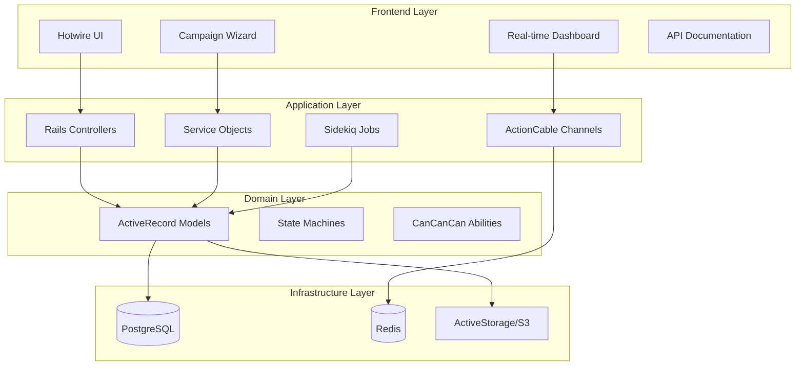
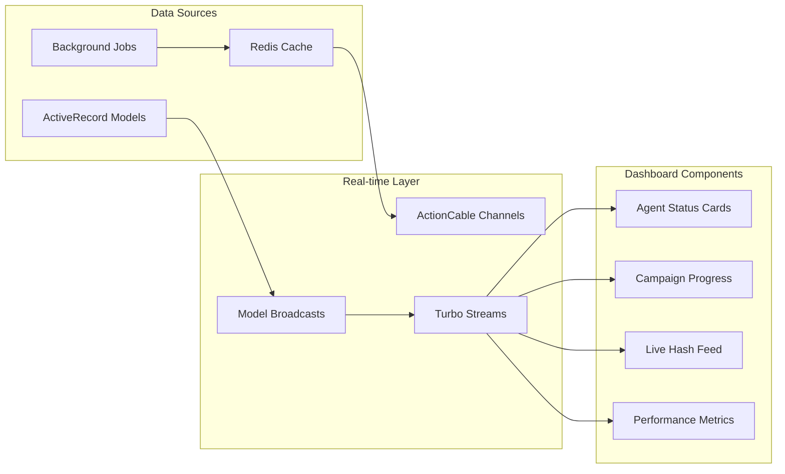
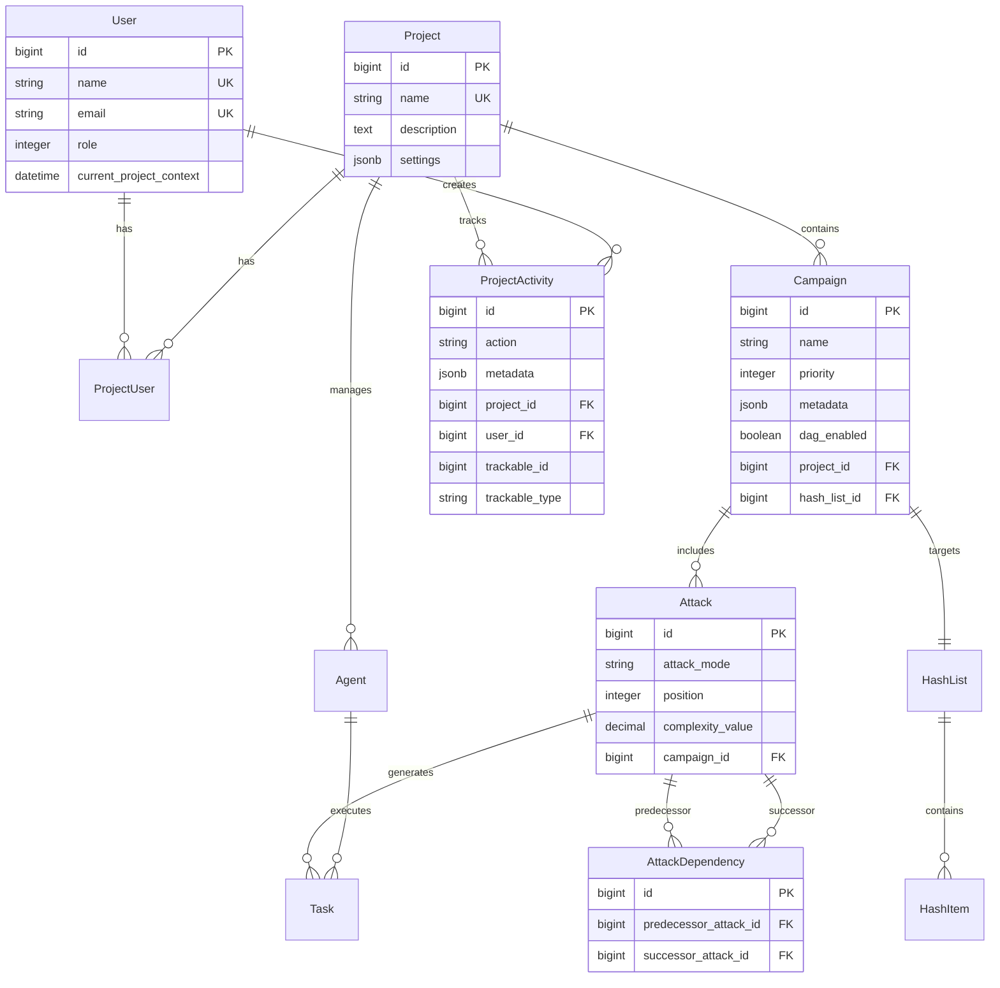

# Design Document

## Overview

This design document outlines the technical approach for upgrading CipherSwarm from V1 to V2, transforming it from a functional tool into a comprehensive platform for distributed password cracking operations. The upgrade maintains the existing Ruby on Rails + Hotwire technology stack while delivering a fundamental shift in philosophy: from manual configuration to guided workflows, from hard-to-debug operations to live feedback and observability, and from single-user tool to multi-user coordination platform.

The V2 upgrade addresses key pain points identified in the current system:

- **Agent Visibility**: Poor insight into agent status, performance, and task execution
- **Attack Configuration**: Overwhelming forms with all hashcat options exposed simultaneously
- **Campaign Management**: Limited visibility into attack lifecycle, ordering, and dependencies
- **Resource Management**: Cumbersome file upload/download cycles for iterative refinement
- **User Experience**: Lack of real-time feedback and modern interface patterns
- **Operational Complexity**: Difficult debugging and system monitoring

The design builds upon existing models (`Campaign`, `Agent`, `Project`, `User`, `Attack`, `Task`) and their established relationships, state machines, and broadcasting capabilities while adding comprehensive real-time monitoring, guided workflows, inline resource editing, and advanced orchestration features.

## Architecture

### High-Level Architecture

The V2 upgrade maintains the monolithic Rails architecture with the following key components:



### Technology Stack Enhancements

**Core Platform Upgrades:**

- **Rails 8.0+**: Modern framework with Propshaft asset pipeline and enhanced performance
- **Ruby 3.4.5**: Latest stable runtime with improved performance and memory management
- **PostgreSQL 17+**: Advanced database features for better query performance and JSON handling
- **Tailwind CSS v4**: Modern utility-first CSS framework replacing custom styles
- **Hotwire (Turbo 8 + Stimulus 3.2+)**: Enhanced real-time capabilities and progressive enhancement

**Authentication & Authorization:**

- **Rails 8 Authentication**: Simplified session-based auth replacing Devise complexity
- **CanCanCan + Rolify**: Enhanced with new persona-based permissions (Red/Blue/Infra/PM)
- **Project Context Management**: Session-based active project selection and filtering

**Real-time & Background Processing:**

- **ActionCable with Solid Cable**: Database-backed WebSocket connections for scalability
- **Turbo Streams**: Live DOM updates without JavaScript complexity
- **Sidekiq 7.2+**: Enhanced background job processing with better monitoring
- **Solid Cache**: High-performance caching with database or Redis backend

**UI & Component Architecture:**

- **ViewComponent 4.0+**: Reusable, testable UI components with Tailwind integration
- **Stimulus Controllers**: Progressive enhancement for interactive features
- **Catppuccin Macchiato Theme**: Consistent dark theme with DarkViolet accents
- **WCAG 2.1 AA Compliance**: Full accessibility support with keyboard navigation

**Development & Deployment:**

- **Kamal 2**: Zero-downtime deployments with health checks and rollback capabilities
- **Thruster**: HTTP/2 reverse proxy for production performance
- **Just**: Modern task runner replacing complex Makefiles
- **RSpec + Rswag**: Comprehensive testing with API contract validation

## Components and Interfaces

### 1. Enhanced Authentication & Project Context

#### Project Context Management

```ruby
# New service for managing project context
class ProjectContextService
  def initialize(user, session)
    @user = user
    @session = session
  end

  def set_active_project(project_id)
    # Validate user has access to project
    # Store in session and cache
    # Broadcast context change via Turbo
  end

  def current_project
    # Retrieve from session with fallback logic
  end
end
```

#### Enhanced Authorization

```ruby
# Extended Ability class with new personas
class Ability
  def initialize(user)
    # Existing basic/admin roles
    # New persona-specific permissions:
    # - Red Team: campaign creation, attack configuration
    # - Blue Team: reporting, analytics, read-only operations
    # - Infrastructure: agent management, system monitoring
    # - Project Manager: project oversight, team coordination
  end
end
```

#### UI Components

- **Project Selector Modal**: Turbo-powered modal for switching projects
- **Persona-based Navigation**: Dynamic navigation based on user roles
- **Session Management**: Enhanced session security with project context

### 2. Real-Time Operations Dashboard

#### Dashboard Architecture



#### ActionCable Channels

```ruby
# New channel for dashboard updates
class DashboardChannel < ApplicationCable::Channel
  def subscribed
    stream_from "dashboard_#{current_user.id}"
    stream_from "project_dashboard_#{current_project.id}"
  end

  def receive(data)
    # Handle dashboard interactions
  end
end
```

#### Background Data Collection

```ruby
# New job for collecting dashboard metrics
class DashboardMetricsJob < ApplicationJob
  def perform
    # Collect agent health metrics
    # Calculate hash rate trends
    # Update cached statistics
    # Broadcast updates to subscribers
  end
end
```

### 3. Enhanced Campaign Management

#### Multi-Step Campaign Wizard

```ruby
# New service for campaign creation workflow
class CampaignWizardService
  include ActiveModel::Model
  include ActiveModel::Attributes

  attribute :step, :integer, default: 1
  attribute :campaign_data, :hash
  attribute :file_uploads, :hash
  attribute :attack_configurations, :array

  def process_step(step_data)
    # Validate current step
    # Store step data
    # Advance to next step or complete
  end

  def create_campaign
    # Create campaign with all collected data
    # Handle file uploads via ActiveStorage
    # Create attack configurations
    # Set up DAG dependencies
  end
end
```

#### DAG Support Implementation

```ruby
# New model for attack dependencies
class AttackDependency < ApplicationRecord
  belongs_to :predecessor_attack, class_name: 'Attack'
  belongs_to :successor_attack, class_name: 'Attack'

  validates :predecessor_attack_id, :successor_attack_id, presence: true
  validate :no_circular_dependencies
end

# Enhanced Attack model
class Attack < ApplicationRecord
  has_many :predecessor_dependencies, class_name: 'AttackDependency',
           foreign_key: 'successor_attack_id'
  has_many :successor_dependencies, class_name: 'AttackDependency',
           foreign_key: 'predecessor_attack_id'
  has_many :predecessors, through: :predecessor_dependencies,
           source: :predecessor_attack
  has_many :successors, through: :successor_dependencies,
           source: :successor_attack

  def can_start?
    predecessors.all?(&:completed?)
  end
end
```

#### UI Components

- **Wizard Steps**: Multi-step form with progress indicator
- **File Upload**: Direct upload with progress tracking
- **Attack Builder**: Drag-and-drop attack configuration
- **Dependency Graph**: Visual DAG editor using Stimulus

### 4. Advanced Agent Management

#### Enhanced Agent API

```ruby
# Extended agent configuration endpoint
class Api::V1::Client::ConfigurationController < Api::V1::BaseController
  def show
    render json: {
      agent: agent_configuration,
      hash_types: allowed_hash_types,
      resources: available_resources,
      update_interval: @agent.advanced_configuration['agent_update_interval']
    }
  end

  private

  def agent_configuration
    {
      id: @agent.id,
      capabilities: @agent.devices,
      performance_thresholds: performance_requirements,
      project_context: @agent.project_ids
    }
  end
end
```

#### Intelligent Task Distribution

```ruby
# Enhanced task scheduling service
class TaskSchedulingService
  def initialize(agent)
    @agent = agent
  end

  def next_task
    # Check for incomplete tasks
    # Consider agent capabilities
    # Respect campaign priorities
    # Handle DAG dependencies
    # Load balance across agents
  end

  private

  def capability_match?(task)
    # Check hash type compatibility
    # Verify performance thresholds
    # Consider resource availability
  end
end
```

### 5. Reporting & Analytics System

#### Reporting Architecture

```ruby
# New reporting service
class ReportingService
  def initialize(project, user, time_range)
    @project = project
    @user = user
    @time_range = time_range
  end

  def generate_password_analysis
    # Analyze cracked passwords
    # Identify patterns and trends
    # Generate security insights
  end

  def campaign_performance_report
    # Calculate success rates
    # Analyze resource utilization
    # Generate efficiency metrics
  end
end
```

#### Background Report Generation

```ruby
# Scheduled reporting job
class GenerateReportsJob < ApplicationJob
  def perform(report_type, project_id, user_id, options = {})
    # Generate requested report
    # Store results in database
    # Notify user via email/notification
    # Cache for quick access
  end
end
```

### 6. Collaboration Features

#### Activity Feed System

```ruby
# New model for project activities
class ProjectActivity < ApplicationRecord
  belongs_to :project
  belongs_to :user
  belongs_to :trackable, polymorphic: true

  scope :recent, -> { order(created_at: :desc).limit(50) }
  scope :for_user_roles, ->(user) { where(activity_type: allowed_types_for(user)) }
end

# Activity tracking service
class ActivityTrackingService
  def self.track(action, resource, user, project)
    ProjectActivity.create!(
      project: project,
      user: user,
      trackable: resource,
      action: action,
      metadata: generate_metadata(action, resource)
    )

    broadcast_activity_update(project)
  end
end
```

#### Real-time Collaboration

```ruby
# Project activity channel
class ProjectActivityChannel < ApplicationCable::Channel
  def subscribed
    stream_from "project_activity_#{params[:project_id]}"
  end

  def add_comment(data)
    # Handle comment creation
    # Broadcast to project members
  end
end
```

## Data Models

### Enhanced Model Relationships



### New Models

#### AttackDependency

```ruby
class AttackDependency < ApplicationRecord
  belongs_to :predecessor_attack, class_name: 'Attack'
  belongs_to :successor_attack, class_name: 'Attack'

  validates :predecessor_attack_id, :successor_attack_id, presence: true
  validate :no_circular_dependencies
  validate :same_campaign_attacks
end
```

#### ProjectActivity

```ruby
class ProjectActivity < ApplicationRecord
  belongs_to :project
  belongs_to :user
  belongs_to :trackable, polymorphic: true

  validates :action, presence: true
  validates :metadata, presence: true

  scope :recent, -> { order(created_at: :desc) }
  scope :for_project, ->(project_id) { where(project_id: project_id) }
end
```

#### DashboardMetric

```ruby
class DashboardMetric < ApplicationRecord
  belongs_to :project

  validates :metric_type, :value, :recorded_at, presence: true

  scope :recent, -> { where(recorded_at: 24.hours.ago..) }
  scope :by_type, ->(type) { where(metric_type: type) }
end
```

## Error Handling

### Enhanced Error Management

#### API Error Responses

```ruby
# Standardized API error handling
class Api::V1::BaseController < ApplicationController
  rescue_from StandardError do |exception|
    log_error(exception)
    render_error_response(exception)
  end

  private

  def render_error_response(exception)
    case exception
    when ActiveRecord::RecordNotFound
      render json: { error: 'Resource not found' }, status: :not_found
    when CanCan::AccessDenied
      render json: { error: 'Access denied' }, status: :forbidden
    when ActionController::ParameterMissing
      render json: { error: 'Missing required parameters' }, status: :bad_request
    else
      render json: { error: 'Internal server error' }, status: :internal_server_error
    end
  end
end
```

#### Web UI Error Handling

```ruby
# Enhanced error pages with context
class ErrorsController < ApplicationController
  def not_found
    @context = determine_context
    render 'errors/404', status: :not_found
  end

  def forbidden
    @project = current_project
    @user_roles = current_user&.roles
    render 'errors/403', status: :forbidden
  end
end
```

### Logging and Monitoring

#### Structured Logging

```ruby
# Enhanced logging service
class LoggingService
  def self.log_user_action(user, action, resource, project = nil)
    Rails.logger.tagged(
      "user:#{user.id}",
      "project:#{project&.id}",
      "action:#{action}"
    ) do
      Rails.logger.info({
        event: 'user_action',
        user_id: user.id,
        action: action,
        resource_type: resource.class.name,
        resource_id: resource.id,
        project_id: project&.id,
        timestamp: Time.current
      }.to_json)
    end
  end
end
```

## Testing Strategy

### Test Coverage Areas

#### Model Testing

```ruby
# Enhanced model specs with new functionality
RSpec.describe Campaign, type: :model do
  describe 'DAG functionality' do
    it 'validates attack dependencies' do
      # Test dependency validation
    end

    it 'prevents circular dependencies' do
      # Test circular dependency prevention
    end
  end

  describe 'priority management' do
    it 'pauses lower priority campaigns' do
      # Test priority-based pausing
    end
  end
end
```

#### Integration Testing

```ruby
# API contract testing with Rswag
RSpec.describe 'Agent API v1', type: :request do
  path '/api/v1/client/configuration' do
    get 'Get agent configuration' do
      tags 'Agent Configuration'
      security [bearer_auth: []]

      response '200', 'configuration retrieved' do
        schema type: :object,
               properties: {
                 agent: { '$ref' => '#/components/schemas/AgentConfiguration' },
                 hash_types: { type: :array, items: { type: :string } },
                 resources: { '$ref' => '#/components/schemas/ResourceManifest' }
               }

        run_test!
      end
    end
  end
end
```

#### System Testing

```ruby
# End-to-end workflow testing
RSpec.describe 'Campaign Creation Workflow', type: :system do
  it 'creates campaign with DAG dependencies' do
    # Test complete wizard workflow
    # Verify file uploads
    # Check dependency creation
    # Validate real-time updates
  end
end
```

### Performance Testing

#### Load Testing

```ruby
# Performance benchmarks for real-time features
RSpec.describe 'Dashboard Performance', type: :performance do
  it 'handles concurrent dashboard connections' do
    # Test ActionCable scaling
    # Measure update latency
    # Verify memory usage
  end
end
```

## Deployment Considerations

### Container Architecture

#### Enhanced Docker Configuration

```yaml
# docker-compose.yml enhancements
version: '3.8'
services:
  app:
    build: .
    environment:
      - RAILS_ENV=production
      - REDIS_URL=redis://redis:6379
    depends_on:
      - db
      - redis
    healthcheck:
      test: [CMD, curl, -f, http://localhost:3000/health]
      interval: 30s
      timeout: 10s
      retries: 3

  sidekiq:
    build: .
    command: bundle exec sidekiq
    environment:
      - RAILS_ENV=production
      - REDIS_URL=redis://redis:6379
    depends_on:
      - db
      - redis

  cable:
    build: .
    command: bundle exec puma -p 28080 config/cable.ru
    environment:
      - RAILS_ENV=production
      - REDIS_URL=redis://redis:6379
    ports:
      - 28080:28080
```

### Scaling Considerations

#### Horizontal Scaling

- **Rails App**: Multiple instances behind load balancer
- **Sidekiq Workers**: Separate worker pools for different job types
- **ActionCable**: Dedicated cable servers for WebSocket connections
- **Database**: Read replicas for reporting queries
- **Redis**: Cluster setup for high availability

#### Performance Optimization

- **Caching Strategy**: Multi-level caching with Redis and application-level caches
- **Database Optimization**: Proper indexing and query optimization
- **Asset Delivery**: CDN integration for static assets
- **Background Jobs**: Queue prioritization and resource allocation

## V2 Feature Enhancements

### Live Agent Monitoring

The V2 upgrade transforms static agent management into comprehensive real-time monitoring:

#### Agent Status Dashboard

```ruby
# Enhanced agent monitoring service
class AgentMonitoringService
  def initialize(project)
    @project = project
  end

  def real_time_metrics
    {
      online_agents: agents.active.count,
      total_hash_rate: calculate_aggregate_hash_rate,
      device_utilization: calculate_device_utilization,
      error_summary: recent_error_summary,
      performance_trends: eight_hour_performance_data
    }
  end

  def agent_health_check
    agents.find_each do |agent|
      health_status = {
        connectivity: agent.last_seen_at > 5.minutes.ago,
        performance: agent.meets_performance_threshold?,
        temperature: agent.temperature_within_limits?,
        errors: agent.recent_errors.severity_summary
      }

      broadcast_agent_update(agent, health_status)
    end
  end
end
```

#### Real-time Performance Tracking

- **8-hour Hash Rate Trends**: Rolling performance windows with device-specific breakdowns
- **Temperature Monitoring**: Thermal throttling detection and alerts
- **Device Utilization**: GPU/CPU usage with optimization recommendations
- **Error Classification**: Automatic severity assessment and resolution tracking

### Redesigned Attack Editor

The overwhelming single-form approach is replaced with modal-based, attack-specific editors:

#### Attack Configuration Wizard

```ruby
# Modal-based attack configuration
class AttackConfigurationService
  ATTACK_TYPES = {
    dictionary: {
      required: [:wordlist_id],
      optional: [:rule_list_id, :optimized_kernels],
      complexity_factors: [:wordlist_size, :rule_count]
    },
    mask: {
      required: [:mask_list_id],
      optional: [:increment_mode, :custom_charset],
      complexity_factors: [:keyspace_size, :charset_complexity]
    },
    hybrid_dictionary: {
      required: [:wordlist_id, :mask_list_id],
      optional: [:rule_list_id],
      complexity_factors: [:wordlist_size, :mask_keyspace]
    }
  }.freeze

  def configure_attack(attack_type, params)
    config = ATTACK_TYPES[attack_type.to_sym]
    validate_required_params(params, config[:required])

    complexity = calculate_complexity(params, config[:complexity_factors])
    keyspace = estimate_keyspace(attack_type, params)

    {
      configuration: build_hashcat_config(attack_type, params),
      complexity_score: complexity,
      estimated_keyspace: keyspace,
      estimated_runtime: calculate_runtime_estimate(keyspace, complexity)
    }
  end
end
```

#### Live Keyspace Estimation

- **Real-time Complexity Scoring**: 1-5 dot visual indicators based on computational requirements
- **Keyspace Calculations**: Dynamic estimates as users modify attack parameters
- **Runtime Predictions**: ETA calculations based on available agent performance
- **Resource Validation**: Automatic checks for wordlist/rule compatibility

### Campaign Dashboard & Orchestration

Enhanced campaign management with comprehensive lifecycle control:

#### Campaign Orchestration Engine

```ruby
# Enhanced campaign state management
class CampaignOrchestrationService
  def initialize(campaign)
    @campaign = campaign
  end

  def launch_campaign
    validate_campaign_readiness
    generate_attack_tasks
    distribute_to_agents
    broadcast_campaign_started
  end

  def manage_dag_execution
    return unless @campaign.dag_enabled?

    completed_attacks = @campaign.attacks.completed
    ready_attacks = @campaign.attacks.pending.select(&:dependencies_satisfied?)

    ready_attacks.each do |attack|
      launch_attack(attack) if agents_available_for(attack)
    end
  end

  def real_time_progress
    {
      overall_progress: calculate_overall_progress,
      attack_breakdown: attack_progress_summary,
      agent_assignments: current_agent_assignments,
      estimated_completion: calculate_eta,
      recent_cracks: recent_crack_summary
    }
  end
end
```

#### DAG-Based Attack Execution

- **Visual Dependency Editor**: Drag-and-drop interface for attack ordering
- **Phase-based Execution**: Automatic progression through attack phases
- **Dynamic Reordering**: Live modification of attack sequences with impact analysis
- **Dependency Validation**: Circular dependency detection and resolution

### Inline Resource Management

Eliminates the download-edit-upload cycle for iterative resource refinement:

#### In-Browser Resource Editor

```ruby
# Resource editing service with validation
class ResourceEditorService
  MAX_INLINE_EDIT_SIZE = 1.megabyte

  def initialize(resource, user)
    @resource = resource
    @user = user
  end

  def can_edit_inline?
    @resource.file.byte_size <= MAX_INLINE_EDIT_SIZE &&
    @resource.file.content_type.in?(['text/plain', 'application/octet-stream'])
  end

  def validate_content(content, resource_type)
    case resource_type
    when 'wordlist'
      validate_wordlist_format(content)
    when 'rules'
      validate_hashcat_rules(content)
    when 'masks'
      validate_mask_patterns(content)
    end
  end

  def save_changes(new_content)
    validation_result = validate_content(new_content, @resource.resource_type)
    return validation_result unless validation_result.valid?

    @resource.file.attach(
      io: StringIO.new(new_content),
      filename: @resource.file.filename,
      content_type: @resource.file.content_type
    )

    broadcast_resource_updated
    { success: true, message: 'Resource updated successfully' }
  end
end
```

#### Resource Management Features

- **Syntax Highlighting**: Rule file validation with error highlighting
- **Live Validation**: Real-time format checking and error reporting
- **Metadata Previews**: Line counts, character sets, complexity analysis
- **Size-based Gating**: Automatic fallback to download/upload for large files

### Crackable Upload System

Simplifies hash cracking workflows for less-technical users:

#### Automated Hash Processing

```ruby
# Hash type detection and attack generation
class CrackableUploadService
  def initialize(upload_data, user, project)
    @upload_data = upload_data
    @user = user
    @project = project
  end

  def process_upload
    detected_hashes = extract_and_detect_hashes
    hash_list = create_hash_list(detected_hashes)
    suggested_attacks = generate_attack_suggestions(detected_hashes)

    {
      hash_list: hash_list,
      detection_results: format_detection_results(detected_hashes),
      suggested_attacks: suggested_attacks,
      campaign_template: build_campaign_template(hash_list, suggested_attacks)
    }
  end

  private

  def extract_and_detect_hashes
    # Integration with name-that-hash for detection
    # Support for common formats (shadow, NTLM, etc.)
    # Confidence scoring for hash type suggestions
  end

  def generate_attack_suggestions
    # Automatic attack configuration based on hash types
    # Wordlist recommendations based on hash characteristics
    # Rule suggestions for common password patterns
  end
end
```

#### Automated Workflow Features

- **Hash Type Detection**: Integration with name-that-hash for confidence-ranked suggestions
- **Format Extraction**: Support for shadow files, NTLM dumps, custom formats
- **Attack Pre-generation**: Automatic creation of appropriate attack configurations
- **Template Creation**: One-click campaign setup from detected hash characteristics

## Enhanced Testing Strategy

### Comprehensive Test Coverage

#### Real-time Feature Testing

```ruby
# System tests for real-time features
RSpec.describe 'Real-time Dashboard', type: :system do
  it 'updates agent status in real-time' do
    visit dashboard_path

    # Simulate agent heartbeat
    agent.update!(last_seen_at: Time.current)

    # Verify Turbo Stream update
    expect(page).to have_css("[data-agent-id='#{agent.id}']", text: 'Online')
    expect(page).to have_css('.agent-status.online')
  end

  it 'streams crack results as they occur' do
    visit campaign_path(campaign)

    # Simulate crack result
    perform_enqueued_jobs do
      CrackResult.create!(
        hash_item: hash_item,
        plaintext: 'password123',
        attack: attack,
        agent: agent
      )
    end

    # Verify live update
    expect(page).to have_content('password123')
    expect(page).to have_css('.crack-notification')
  end
end
```

#### API Contract Validation

```ruby
# Enhanced API testing with Rswag
RSpec.describe 'Agent API v1 Compatibility', type: :request do
  path '/api/v1/client/heartbeat' do
    post 'Agent heartbeat with performance data' do
      tags 'Agent Management'
      security [bearer_auth: []]

      parameter name: :heartbeat_data, in: :body, schema: {
        type: :object,
        properties: {
          performance_metrics: {
            type: :object,
            properties: {
              hash_rate: { type: :number },
              temperature: { type: :number },
              utilization: { type: :number }
            }
          },
          device_status: {
            type: :array,
            items: { '$ref' => '#/components/schemas/DeviceStatus' }
          }
        }
      }

      response '200', 'heartbeat acknowledged' do
        schema type: :object,
               properties: {
                 next_task: { '$ref' => '#/components/schemas/Task' },
                 configuration_updates: { type: :object },
                 system_commands: { type: :array }
               }

        run_test! do |response|
          # Verify backward compatibility
          expect(response.parsed_body).to include('next_task')
          # Verify new features don't break existing agents
          expect(response.parsed_body['configuration_updates']).to be_present
        end
      end
    end
  end
end
```

This comprehensive design provides the foundation for transforming CipherSwarm from a functional tool into a modern, user-friendly platform while maintaining the stability and compatibility of the existing Rails infrastructure. The modular approach enables incremental implementation and thorough testing of each enhancement.
