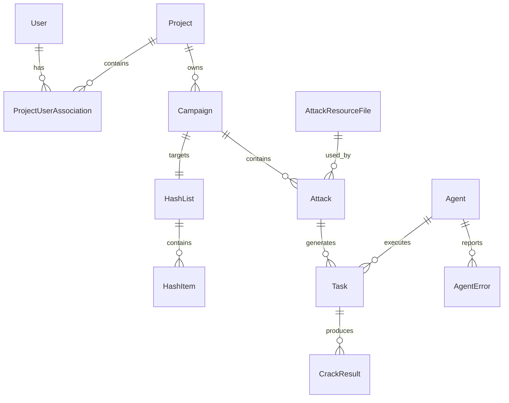

# Design Document

## Overview

The Web UI API v1 (`/api/v1/web/*`) is a comprehensive REST API designed to power the SvelteKit-based dashboard for CipherSwarm. This API provides rich, user-friendly interfaces for managing distributed password cracking operations, including campaign orchestration, attack configuration, agent monitoring, and resource management.

The design follows FastAPI best practices with a service-layer architecture, comprehensive validation, real-time updates via Server-Sent Events (SSE), and project-based access control. The API is optimized for frontend consumption with features like pagination, filtering, caching, and structured error responses.

## Architecture

### Layered Architecture Pattern

The Web UI API follows a strict layered architecture to ensure maintainability, testability, and separation of concerns:

```
┌─────────────────────────────────────────┐
│           Frontend (SvelteKit)          │
├─────────────────────────────────────────┤
│         API Layer (FastAPI)            │
│  - Route handlers                       │
│  - Request/response validation          │
│  - Authentication/authorization         │
├─────────────────────────────────────────┤
│        Service Layer (Business)        │
│  - Business logic                      │
│  - Data transformation                  │
│  - External service integration        │
├─────────────────────────────────────────┤
│       Data Layer (SQLAlchemy)          │
│  - Database operations                  │
│  - Model relationships                  │
│  - Query optimization                   │
├─────────────────────────────────────────┤
│      Infrastructure Layer              │
│  - PostgreSQL, Redis, MinIO            │
│  - Caching, messaging, storage         │
└─────────────────────────────────────────┘
```

### Service-First Design

All business logic resides in dedicated service modules under `app/core/services/`. API endpoints are thin wrappers that:

-   Validate input using Pydantic schemas
-   Delegate to appropriate service functions
-   Handle authentication and authorization
-   Transform service responses to API schemas
-   Manage HTTP status codes and error handling

### Real-Time Architecture

The API uses Server-Sent Events (SSE) for real-time updates instead of WebSockets:

-   **Lightweight notifications**: Only trigger events, not data payloads
-   **Client-driven updates**: Frontend issues targeted fetch requests on events
-   **Automatic reconnection**: Browser handles connection management
-   **Project scoping**: Events filtered by user's active project context

## Components and Interfaces

### API Route Organization

The API is organized around user workflows and UX patterns identified in the design documents:

```
/api/v1/web/
├── auth/                    # Authentication & user management
│   ├── login, logout, refresh
│   ├── me, change_password
│   └── context (project switching)
├── campaigns/               # Campaign lifecycle management
│   ├── CRUD operations with DAG support
│   ├── progress, metrics (real-time)
│   ├── start, stop, relaunch
│   └── reorder_attacks (DAG phase management)
├── attacks/                 # Attack configuration & management
│   ├── CRUD with real-time validation
│   ├── move, duplicate, bulk operations
│   ├── validate, estimate (live keyspace calculation)
│   └── export/import (JSON templates)
├── hash_lists/              # Hash list management
│   ├── CRUD operations
│   ├── items (paginated with crack status)
│   └── import/export (CSV/TSV)
├── agents/                  # Agent monitoring & configuration
│   ├── list with real-time status
│   ├── detail views (tabbed interface)
│   ├── hardware config, performance graphs
│   ├── benchmarks, error logs
│   └── admin controls (restart, disable)
├── resources/               # Resource management
│   ├── upload with type detection
│   ├── line-level editing (< 1MB files)
│   ├── metadata management
│   └── ephemeral resource support
├── uploads/                 # Crackable upload processing
│   ├── file/hash upload with analysis
│   ├── status tracking
│   └── automatic campaign generation
├── live/                    # Server-Sent Events
│   ├── campaigns (progress updates)
│   ├── agents (status, performance)
│   └── toasts (crack notifications)
├── modals/                  # UI support data
│   ├── agents, resources (dropdowns)
│   ├── hash_types (with confidence scores)
│   └── rule_explanation (syntax help)
├── dashboard/               # Dashboard metrics
│   └── summary (4-card layout with sparklines)
├── health/                  # System monitoring
│   ├── overview (operational status)
│   └── components (service health cards)
├── users/                   # User management (admin)
└── projects/                # Project management (admin)
```

### UX-Driven Design Patterns

Based on the UX documentation, the API implements several key patterns:

#### Real-Time Dashboard

-   **4-card layout**: Active Agents, Running Tasks, Recently Cracked, Resource Usage
-   **Campaign accordion**: Expandable rows with progress bars and attack summaries
-   **Live updates**: SSE-driven notifications with manual refresh fallback
-   **Agent sheet**: Slide-out panel with agent status and sparklines

#### Attack Editor Modals

-   **Type-specific wizards**: Dictionary, Mask, Brute Force with guided configuration
-   **Real-time validation**: Live keyspace estimation and complexity scoring
-   **Ephemeral resources**: Inline wordlists and mask lists scoped to attacks
-   **Modifier system**: User-friendly rule application without hashcat syntax

#### Campaign Management

-   **DAG support**: Phase-based attack ordering with visual indicators
-   **Lifecycle controls**: Start/stop/pause with confirmation dialogs
-   **Template system**: Export/import JSON configurations with resource references

#### Agent Administration

-   **Tabbed detail view**: Settings, Hardware, Performance, Logs, Capabilities
-   **Real-time monitoring**: Performance graphs with 8-hour time series
-   **Hardware configuration**: Device toggles, backend selection, temperature limits

### Service Layer Architecture

Each domain has a dedicated service module with consistent patterns:

```python
# app/core/services/{domain}_service.py

async def list_{domain}_service(
    db: AsyncSession,
    skip: int = 0,
    limit: int = 20,
    filters: dict = None,
    project_ids: list[int] = None
) -> tuple[list[DomainOut], int]:
    """List domain objects with pagination and filtering."""

async def get_{domain}_service(
    db: AsyncSession,
    domain_id: int
) -> DomainOut:
    """Get single domain object by ID."""

async def create_{domain}_service(
    db: AsyncSession,
    data: DomainCreate
) -> DomainOut:
    """Create new domain object."""

async def update_{domain}_service(
    db: AsyncSession,
    domain_id: int,
    data: DomainUpdate
) -> DomainOut:
    """Update existing domain object."""

async def delete_{domain}_service(
    db: AsyncSession,
    domain_id: int
) -> None:
    """Delete domain object."""
```

### Schema Design Patterns

All API schemas follow consistent patterns using Pydantic v2:

```python
# Input schemas
class DomainCreate(BaseModel):
    """Schema for creating domain objects."""
    name: str = Field(..., min_length=1, max_length=255)
    description: str | None = Field(None, max_length=1000)

class DomainUpdate(BaseModel):
    """Schema for updating domain objects."""
    name: str | None = Field(None, min_length=1, max_length=255)
    description: str | None = Field(None, max_length=1000)

# Output schemas
class DomainOut(BaseModel):
    """Schema for domain object responses."""
    id: int
    name: str
    description: str | None
    created_at: datetime
    updated_at: datetime

    model_config = ConfigDict(from_attributes=True)

# List response schemas
class DomainListResponse(BaseModel):
    """Paginated list response."""
    items: list[DomainOut]
    total: int
    page: int
    size: int
    total_pages: int
```

## Data Models

### Core Domain Models

The API builds upon existing SQLAlchemy models with enhancements for Web UI requirements:

#### Campaign Management

-   **Campaign**: Enhanced with `state` enum (draft/active/archived)
-   **Attack**: Added `position`, `comment`, `complexity_score` fields
-   **Task**: Progress tracking and agent assignment
-   **CrackResult**: Hash cracking results with metadata

#### Resource Management

-   **AttackResourceFile**: Enhanced with `resource_type`, `guid`, line editing metadata
-   **ResourceLine**: Virtual model for line-level editing
-   **HashList**: Import/export capabilities with item management

#### Agent Management

-   **Agent**: Real-time status, performance metrics, configuration
-   **AgentError**: Structured error logging with severity levels
-   **DeviceStatus**: Performance time-series data
-   **HashcatBenchmark**: Capability matrices

#### User Management

-   **User**: Enhanced with project context and session management
-   **Project**: Multi-tenant isolation with user assignments
-   **ProjectUserAssociation**: Role-based project access

### Data Relationships



## Error Handling

### Structured Error Responses

The API uses consistent error response formats:

```python
# Standard HTTP errors
{
    "detail": "Resource not found"
}

# Validation errors (422)
{
    "detail": [
        {
            "type": "string_too_short",
            "loc": ["body", "name"],
            "msg": "String should have at least 1 character",
            "input": "",
            "ctx": {"min_length": 1}
        }
    ]
}

# Business logic errors
{
    "detail": "Cannot delete hash list that is in use by active campaigns",
    "error_code": "RESOURCE_IN_USE",
    "context": {
        "hash_list_id": 123,
        "active_campaigns": [456, 789]
    }
}
```

### Exception Hierarchy

```python
# Base exceptions
class WebAPIError(Exception):
    """Base exception for Web API errors."""

class ResourceNotFoundError(WebAPIError):
    """Resource not found."""

class ResourceInUseError(WebAPIError):
    """Resource cannot be deleted because it's in use."""

class ValidationError(WebAPIError):
    """Business validation error."""

class PermissionDeniedError(WebAPIError):
    """User lacks required permissions."""
```

### Error Translation

Service layer exceptions are translated to appropriate HTTP responses:

```python
@router.post("/campaigns/")
async def create_campaign(
    data: CampaignCreate,
    db: AsyncSession = Depends(get_db),
    current_user: User = Depends(get_current_user)
) -> CampaignOut:
    try:
        return await create_campaign_service(db, data)
    except HashListNotFoundError:
        raise HTTPException(status_code=404, detail="Hash list not found")
    except ValidationError as e:
        raise HTTPException(status_code=422, detail=str(e))
```

## Testing Strategy

### Test Organization

```
tests/
├── unit/
│   ├── services/           # Service layer unit tests
│   └── schemas/            # Schema validation tests
├── integration/
│   ├── web/               # API endpoint integration tests
│   └── database/          # Database operation tests
└── e2e/
    └── web_api/           # End-to-end API workflow tests
```

### Testing Patterns

#### Service Layer Testing

```python
@pytest.mark.asyncio
async def test_create_campaign_service_success(db_session):
    # Arrange
    project = await ProjectFactory.create_async()
    hash_list = await HashListFactory.create_async(project_id=project.id)
    data = CampaignCreate(
        name="Test Campaign",
        project_id=project.id,
        hash_list_id=hash_list.id
    )

    # Act
    result = await create_campaign_service(db_session, data)

    # Assert
    assert result.name == "Test Campaign"
    assert result.project_id == project.id
```

#### API Endpoint Testing

```python
@pytest.mark.asyncio
async def test_create_campaign_endpoint(client, auth_headers, db_session):
    # Arrange
    project = await ProjectFactory.create_async()
    hash_list = await HashListFactory.create_async(project_id=project.id)

    # Act
    response = await client.post(
        "/api/v1/web/campaigns/",
        json={
            "name": "Test Campaign",
            "project_id": project.id,
            "hash_list_id": hash_list.id
        },
        headers=auth_headers
    )

    # Assert
    assert response.status_code == 201
    data = response.json()
    assert data["name"] == "Test Campaign"
```

### Test Coverage Requirements

-   **Service Layer**: 100% coverage of business logic paths
-   **API Endpoints**: All success and error scenarios
-   **Schema Validation**: Edge cases and boundary conditions
-   **Authentication**: Permission checks and access control
-   **Real-time Features**: SSE event broadcasting and filtering

## Security Considerations

### Authentication and Authorization

#### JWT-Based Authentication

-   Access tokens with configurable expiration (default 60 minutes)
-   Refresh token mechanism for seamless user experience
-   Secure cookie storage for web clients
-   HTTPS enforcement in production

#### Project-Based Authorization

```python
async def get_current_user_context(
    current_user: User = Depends(get_current_user),
    db: AsyncSession = Depends(get_db)
) -> UserContext:
    """Get user with active project context."""
    context = await get_user_context_service(db, current_user.id)
    if not context.active_project_id:
        raise HTTPException(status_code=400, detail="No active project selected")
    return context

async def require_project_access(
    project_id: int,
    user_context: UserContext = Depends(get_current_user_context)
) -> None:
    """Ensure user has access to specified project."""
    if project_id not in user_context.accessible_project_ids:
        raise HTTPException(status_code=403, detail="Access denied to project")
```

#### Role-Based Permissions

Using Casbin for fine-grained authorization:

```python
# Policy examples
p, admin, *, *
p, analyst, campaigns, read
p, analyst, campaigns, write
p, operator, agents, read
```

### Data Protection

#### Input Validation

-   Comprehensive Pydantic schema validation
-   SQL injection prevention through parameterized queries
-   File upload size and type restrictions
-   XSS prevention through output encoding

#### Project Isolation

-   All data access filtered by user's accessible projects
-   Cross-project data leakage prevention
-   Audit logging for sensitive operations

#### Secure Headers

```python
# Security middleware
app.add_middleware(
    SecurityHeadersMiddleware,
    headers={
        "X-Content-Type-Options": "nosniff",
        "X-Frame-Options": "DENY",
        "X-XSS-Protection": "1; mode=block",
        "Strict-Transport-Security": "max-age=31536000; includeSubDomains",
        "Referrer-Policy": "strict-origin-when-cross-origin"
    }
)
```

## Performance Optimization

### Database Optimization

#### Query Optimization

-   Appropriate indexes on frequently queried columns
-   Eager loading for related data to prevent N+1 queries
-   Query result caching for expensive operations
-   Connection pooling with optimal pool sizes

#### Pagination Strategy

```python
async def list_with_cursor_pagination(
    db: AsyncSession,
    cursor: str | None = None,
    limit: int = 20
) -> tuple[list[Model], str | None]:
    """Cursor-based pagination for large datasets."""
    query = select(Model)

    if cursor:
        decoded_cursor = decode_cursor(cursor)
        query = query.where(Model.id > decoded_cursor.last_id)

    query = query.order_by(Model.id).limit(limit + 1)
    results = await db.execute(query)
    items = results.scalars().all()

    next_cursor = None
    if len(items) > limit:
        items = items[:-1]
        next_cursor = encode_cursor(items[-1].id)

    return items, next_cursor
```

### Caching Strategy

#### Multi-Level Caching

```python
from cashews import cache

# Application-level caching
@cache(ttl=60, key="dashboard:summary:{project_id}")
async def get_dashboard_summary_cached(
    project_id: int,
    db: AsyncSession
) -> DashboardSummary:
    return await get_dashboard_summary_service(db, project_id)

# HTTP-level caching
@router.get("/dashboard/summary")
@cache_control(max_age=30)
async def get_dashboard_summary(...):
    ...
```

#### Cache Invalidation

```python
async def invalidate_campaign_cache(campaign_id: int, project_id: int):
    """Invalidate related cache entries when campaign changes."""
    await cache.delete(f"campaign:detail:{campaign_id}")
    await cache.delete(f"dashboard:summary:{project_id}")
    await cache.delete_match(f"campaigns:list:*:project:{project_id}")
```

### Real-Time Performance

#### SSE Optimization

-   Connection pooling and management
-   Event filtering at the source to reduce bandwidth
-   Automatic reconnection with exponential backoff
-   Memory-efficient event broadcasting

#### Background Task Processing

```python
from fastapi import BackgroundTasks

@router.post("/uploads/")
async def upload_crackable_file(
    background_tasks: BackgroundTasks,
    file: UploadFile,
    db: AsyncSession = Depends(get_db)
):
    # Create upload record immediately
    upload = await create_upload_service(db, file.filename)

    # Process file in background
    background_tasks.add_task(
        process_crackable_upload,
        upload.id,
        file.file.read()
    )

    return {"upload_id": upload.id, "status": "processing"}
```

## Deployment Considerations

### Environment Configuration

```python
# Production settings
ENVIRONMENT=production
CACHE_CONNECT_STRING=redis://redis:6379/0
RESOURCE_EDIT_MAX_SIZE_MB=5
RESOURCE_EDIT_MAX_LINES=10000
ACCESS_TOKEN_EXPIRE_MINUTES=60
```

### Health Checks

```python
@router.get("/health/components")
async def health_components() -> HealthComponents:
    """Detailed health check for all system components."""
    return HealthComponents(
        database=await check_database_health(),
        redis=await check_redis_health(),
        minio=await check_minio_health(),
        event_service=await check_event_service_health()
    )
```

### Monitoring and Observability

-   Structured logging with correlation IDs
-   Performance metrics collection
-   Error rate monitoring
-   Real-time alerting for critical issues

### Scalability Considerations

-   Horizontal scaling support through stateless design
-   Database read replicas for query-heavy operations
-   CDN integration for static resource delivery
-   Load balancer configuration for sticky sessions (if needed)

This design provides a robust, scalable, and maintainable foundation for the Web UI API v1 implementation, ensuring excellent user experience while maintaining security and performance standards.
