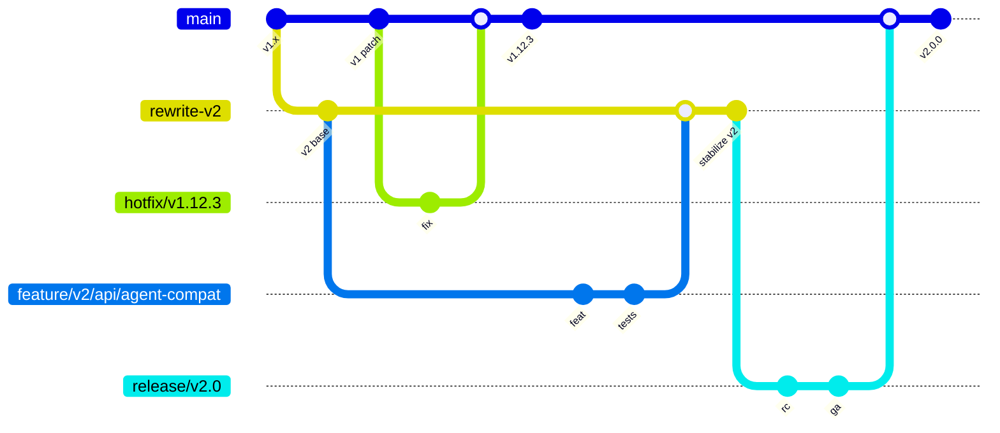

# Contributing to CipherSwarm

Thank you for your interest in contributing to CipherSwarm! We appreciate your efforts and value your time. This guide will help you understand how to contribute effectively to the project.

⚡ **Quick Start**: See [WARP.md](WARP.md) for comprehensive development rules and setup commands.

---

## Table of Contents

<!-- mdformat-toc start --slug=github --no-anchors --maxlevel=3 --minlevel=1 -->

- [Contributing to CipherSwarm](#contributing-to-cipherswarm)
  - [Table of Contents](#table-of-contents)
  - [Getting Started](#getting-started)
    - [1. Setup Your Environment](#1-setup-your-environment)
    - [2. Verify Setup](#2-verify-setup)
  - [Dual-Track Git Workflow](#dual-track-git-workflow)
    - [Branch Structure](#branch-structure)
    - [Development Workflow](#development-workflow)
  - [Conventional Commits](#conventional-commits)
    - [Format](#format)
    - [Types](#types)
    - [Scopes (Examples)](#scopes-examples)
    - [Examples](#examples)
  - [Testing Strategy](#testing-strategy)
    - [Tier 1: Backend Tests](#tier-1-backend-tests)
    - [Tier 2: Frontend Tests](#tier-2-frontend-tests)
    - [Tier 3: E2E Tests](#tier-3-e2e-tests)
    - [Full CI Check](#full-ci-check)
  - [Protected Areas](#protected-areas)
  - [Code Review Process](#code-review-process)
    - [Automated Reviews](#automated-reviews)
    - [Review Focus Areas](#review-focus-areas)
    - [Single Maintainer Workflow](#single-maintainer-workflow)
  - [Submitting Contributions](#submitting-contributions)
    - [Before Opening PR](#before-opening-pr)
    - [Opening the PR](#opening-the-pr)
    - [PR Requirements](#pr-requirements)
  - [Code of Conduct](#code-of-conduct)

<!-- mdformat-toc end -->

---

## Getting Started

To get started contributing to CipherSwarm:

### 1. Setup Your Environment

1. Fork the repository from [CipherSwarm](https://github.com/unclesp1d3r/CipherSwarm)
2. Clone your fork locally:
   ```bash
   git clone https://github.com/your-username/CipherSwarm.git
   cd CipherSwarm
   ```
3. Install dependencies and setup:
   ```bash
   just install  # Sets up Python/JS deps, pre-commit hooks
   ```
4. Start development environment:
   ```bash
   just docker-dev-up-watch  # Full stack with hot reload
   # OR
   just dev  # Backend only
   ```

### 2. Verify Setup

- [http://localhost:8000/docs](http://localhost:8000/docs) (Swagger UI)
- [http://localhost:5173](http://localhost:5173) (SvelteKit Frontend)
- [http://localhost:8000/redoc](http://localhost:8000/redoc) (ReDoc)

## Dual-Track Git Workflow

CipherSwarm uses a **dual-track workflow** to manage v1 (stable) and v2 (rewrite) development in parallel.

### Branch Structure



#### Long-lived Branches

- **`main`**: v1 production, stable releases and hotfixes only
- **`rewrite-v2`**: v2 integration branch, base for all v2 features

#### Short-lived Branches

- **`feature/v2/<area>/<short-desc>`**: v2 features off `rewrite-v2`
- **`fix/v1/<short-desc>`**: v1 bug fixes off `main`
- **`hotfix/v1.<x>.<y>`**: Emergency v1 fixes off `main`
- **`release/v2.0`**: v2 GA preparation off `rewrite-v2`

### Development Workflow

#### For v2 Features (Preferred)

```bash
# Start from rewrite-v2
git checkout rewrite-v2
git pull origin rewrite-v2
git checkout -b feature/v2/api/new-feature

# Development
just dev  # or just docker-dev-up-watch
# Make changes...
just test-backend  # Run smallest tier covering changes

# Commit with Conventional Commits
git add .
git commit -m "feat(api): add project quotas"

# Stay synced with rewrite-v2
git fetch origin
git rebase origin/rewrite-v2

# Open PR targeting rewrite-v2
gh pr create --base rewrite-v2 --title "feat(api): add project quotas"
```

#### For v1 Fixes

```bash
# Start from main
git checkout main
git pull origin main
git checkout -b fix/v1/auth-issue

# Make minimal fix...
just test-backend
git commit -m "fix(auth): handle expired tokens correctly"

# Open PR targeting main
gh pr create --base main --title "fix(auth): handle expired tokens correctly"
```

## Conventional Commits

All commit messages **must** follow the [Conventional Commits](https://conventionalcommits.org) specification:

### Format

```
type(scope): description

[optional body]

[optional footer(s)]
```

### Types

- **`feat`**: New feature for users
- **`fix`**: Bug fix for users
- **`docs`**: Documentation changes
- **`style`**: Code formatting (no logic changes)
- **`refactor`**: Code restructuring (no behavior changes)
- **`perf`**: Performance improvements
- **`test`**: Test additions or corrections
- **`ci`**: CI/CD configuration changes
- **`chore`**: Maintenance tasks
- **`deps`**: Dependency updates

### Scopes (Examples)

- `api`, `auth`, `models`, `services`, `frontend`, `agents`, `infra`

### Examples

```bash
feat(api): add RFC9457 error handler
fix(frontend): correct SSR auth redirect  
docs(readme): update installation instructions
feat(api)!: remove deprecated endpoints  # Breaking change
```

## Testing Strategy

CipherSwarm uses a **three-tier testing architecture**. Choose the **smallest tier** that covers your changes:

### Tier 1: Backend Tests

```bash
just test-backend
```

- **Scope**: API endpoints, services, models with real PostgreSQL/MongoDB
- **Technology**: pytest + testcontainers + polyfactory
- **Speed**: Fast (seconds)

### Tier 2: Frontend Tests

```bash
just test-frontend
```

- **Scope**: UI components, user interactions, client-side logic
- **Technology**: Vitest + Playwright with mocked APIs
- **Speed**: Fast (seconds)

### Tier 3: E2E Tests

```bash
just test-e2e
```

- **Scope**: Complete user workflows across real backend
- **Technology**: Playwright against full Docker stack
- **Speed**: Slow (minutes)

### Full CI Check

```bash
just ci-check  # Only when PR-ready
```

- **Use**: Complete validation before opening PR
- **Includes**: All tiers + format + lint + security checks

## Protected Areas

⚠️ **These areas require explicit permission before modification:**

- **`contracts/`** — API specifications (Agent API v1 is **IMMUTABLE**)
- **`alembic/`** — Database migrations (use Alembic CLI only)
- **`.cursor/`** — AI assistant configuration
- **`.github/workflows/`** — CI workflows (require `ci-approved` label)

**Golden Rule**: Never break Agent API v1 contract in `contracts/v1_api_swagger.json`

## Code Review Process

### Automated Reviews

- **CodeRabbit AI**: Primary review tool (configured in `.coderabbit.yml`)
- **GitHub Copilot**: Disabled per user preference

### Review Focus Areas

1. **WARP.md compliance**: Service layer patterns, architecture alignment
2. **Agent API v1 compatibility**: No breaking changes allowed
3. **Test coverage**: Appropriate tier selected and passing
4. **Security**: No hardcoded secrets, proper input validation
5. **Performance**: Async patterns, proper database usage

### Single Maintainer Workflow

- Rely on automated checks + template compliance
- Optional self-review with summary comment
- Merge after all required status checks pass

## Submitting Contributions

### Before Opening PR

1. **Run tests locally**:
   ```bash
   just test-backend  # or appropriate tier
   ```
2. **Format code**:
   ```bash
   just format
   ```
3. **Rebase on target branch**:
   ```bash
   git fetch origin
   git rebase origin/rewrite-v2  # for v2 features
   git rebase origin/main        # for v1 fixes
   ```

### Opening the PR

1. **Push to your fork**:
   ```bash
   git push origin feature/v2/api/new-feature
   ```
2. **Create PR with correct base**:
   ```bash
   gh pr create --base rewrite-v2 --title "feat(api): add project quotas"
   ```
3. **Fill out PR template** completely
4. **Assign to milestone** (v2.0.0-alpha.1, etc.)
5. **Add appropriate labels** (type:feat, area:api, etc.)

### PR Requirements

- ✅ Conventional Commit title
- ✅ WARP.md compliance checklist completed
- ✅ Test tier selected and passing locally
- ✅ No PROTECTED areas modified without justification
- ✅ PR scope under ~400 lines when feasible

## Code of Conduct

Please note that we have a [Code of Conduct](CODE_OF_CONDUCT.md). By participating, you are expected to uphold this code.

Thank you for contributing to CipherSwarm! We look forward to your pull requests.
