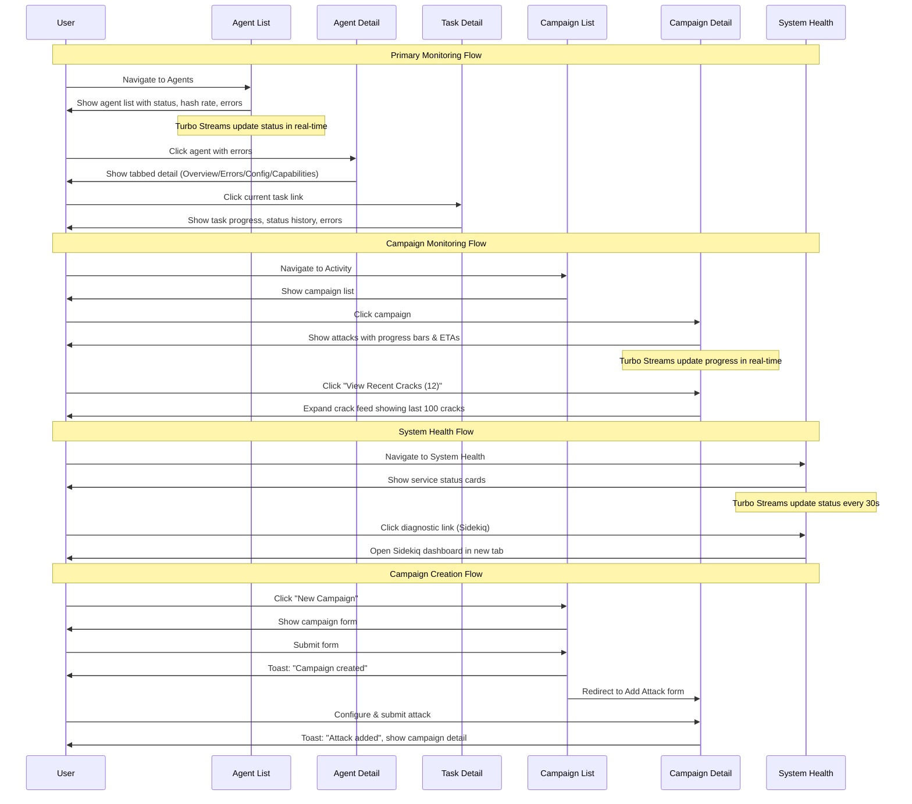

# Core Flows: Operational Monitoring & User Experience

# Core Flows: Operational Monitoring & User Experience

This specification documents the core user flows for CipherSwarm V2 Operational Excellence, focusing on improving visibility, feedback, and troubleshooting capabilities for a solo developer managing a production system.

## Flow 1: Agent Fleet Monitoring

**Description:** Monitor the health and activity of all agents in the system at a glance, with ability to drill down into individual agent details for troubleshooting.

**Trigger:** User clicks "Agents" in sidebar navigation

**Flow Steps:**

1. **Agent List Page Loads**

   - Skeleton screen appears while data loads
   - Table populates with agent rows showing: State, Name, Projects, Client Signature, Enabled, OS, Last Seen
   - **New columns added:** Status Badge (🟢 Online / 🟡 Idle / 🔴 Offline), Hash Rate, Error Indicator (red badge with count if errors exist)
   - Turbo Stream updates status badges, hash rates, and error indicators in real-time (scoped to data cells only, not entire table)

2. **User Scans Agent List**

   - Quickly identifies problematic agents by red error badges
   - Sees which agents are actively working (hash rate > 0)
   - Identifies offline agents by status badge

3. **User Clicks Agent Name to Investigate**

   - Navigates to agent detail page
   - Skeleton screen shows while loading

4. **Agent Detail Page Loads (Tabbed Interface)**

   - **Overview Tab (default):**
     - Current task section (if working): Shows task name, campaign, attack, with link to task detail page
     - Performance metrics: Current hash rate, temperature, device utilization
     - Quick stats: Total tasks completed, success rate, last seen timestamp
   - **Errors Tab:**
     - Error log table: Timestamp, Severity (color-coded), Message, Task (if applicable)
     - Sorted by most recent first
     - Shows last 50 errors
   - **Configuration Tab:**
     - Agent settings: Projects assigned, enabled/disabled status
     - Device information: GPU/CPU details
   - **Capabilities Tab:**
     - Supported hash types (from benchmarks)
     - Benchmark data table: Hash type, speed, date

5. **User Clicks Current Task Link**

   - Navigates to task detail page (Flow 3)

6. **Real-time Updates**

   - Turbo Streams update current task, performance metrics, and error log as changes occur
   - Updates scoped to specific sections (not entire page or form inputs)

**Exit Points:**

- Navigate to task detail page
- Return to agent list
- Navigate to related campaign

```wireframe
<!DOCTYPE html>
<html>
<head>
<style>
body { font-family: system-ui; margin: 20px; background: #f5f5f5; }
.page { background: white; padding: 20px; border-radius: 8px; }
h2 { margin: 0 0 20px 0; font-size: 24px; }
table { width: 100%; border-collapse: collapse; margin-top: 20px; }
th, td { padding: 12px; text-align: left; border-bottom: 1px solid #ddd; }
th { background: #f8f9fa; font-weight: 600; }
.badge { display: inline-block; padding: 4px 8px; border-radius: 4px; font-size: 12px; font-weight: 600; }
.badge-success { background: #d4edda; color: #155724; }
.badge-warning { background: #fff3cd; color: #856404; }
.badge-danger { background: #f8d7da; color: #721c24; }
.status-online { color: #28a745; }
.status-idle { color: #ffc107; }
.status-offline { color: #dc3545; }
.error-badge { background: #dc3545; color: white; padding: 2px 6px; border-radius: 10px; font-size: 11px; margin-left: 8px; }
</style>
</head>
<body>
<div class="page">
  <h2>Agents</h2>
  <button data-element-id="new-agent-btn" style="padding: 8px 16px; background: #007bff; color: white; border: none; border-radius: 4px; cursor: pointer;">+ New Agent</button>
  
  <table>
    <thead>
      <tr>
        <th>Status</th>
        <th>Name</th>
        <th>Hash Rate</th>
        <th>Errors</th>
        <th>Projects</th>
        <th>OS</th>
        <th>Last Seen</th>
        <th>Actions</th>
      </tr>
    </thead>
    <tbody>
      <tr>
        <td><span class="status-online">🟢 Online</span></td>
        <td><a href="#" data-element-id="agent-link-1">cracker-01</a></td>
        <td>2.5 GH/s</td>
        <td>—</td>
        <td>Project Alpha</td>
        <td>Linux</td>
        <td>2 minutes ago</td>
        <td><a href="#" data-element-id="edit-agent-1">Edit</a></td>
      </tr>
      <tr>
        <td><span class="status-idle">🟡 Idle</span></td>
        <td><a href="#" data-element-id="agent-link-2">cracker-02</a> <span class="error-badge">3</span></td>
        <td>0 H/s</td>
        <td><span class="badge-danger">3 errors</span></td>
        <td>Project Alpha, Beta</td>
        <td>Windows</td>
        <td>5 minutes ago</td>
        <td><a href="#" data-element-id="edit-agent-2">Edit</a></td>
      </tr>
      <tr>
        <td><span class="status-offline">🔴 Offline</span></td>
        <td><a href="#" data-element-id="agent-link-3">cracker-03</a></td>
        <td>—</td>
        <td>—</td>
        <td>All Projects</td>
        <td>Linux</td>
        <td>2 hours ago</td>
        <td><a href="#" data-element-id="edit-agent-3">Edit</a></td>
      </tr>
    </tbody>
  </table>
</div>
</body>
</html>
```

```wireframe
<!DOCTYPE html>
<html>
<head>
<style>
body { font-family: system-ui; margin: 20px; background: #f5f5f5; }
.page { background: white; padding: 20px; border-radius: 8px; max-width: 1200px; }
h2 { margin: 0 0 20px 0; font-size: 24px; }
.breadcrumb { margin-bottom: 20px; color: #6c757d; font-size: 14px; }
.tabs { display: flex; border-bottom: 2px solid #dee2e6; margin-bottom: 20px; }
.tab { padding: 12px 24px; cursor: pointer; border: none; background: none; font-size: 16px; }
.tab.active { border-bottom: 3px solid #007bff; color: #007bff; font-weight: 600; margin-bottom: -2px; }
.section { margin-bottom: 30px; }
.section h3 { font-size: 18px; margin-bottom: 12px; color: #495057; }
.card { background: #f8f9fa; padding: 16px; border-radius: 6px; margin-bottom: 12px; }
.metric { display: inline-block; margin-right: 30px; }
.metric-label { font-size: 12px; color: #6c757d; text-transform: uppercase; }
.metric-value { font-size: 24px; font-weight: 600; color: #212529; }
.task-link { color: #007bff; text-decoration: none; font-weight: 500; }
.error-table { width: 100%; border-collapse: collapse; }
.error-table th, .error-table td { padding: 10px; text-align: left; border-bottom: 1px solid #ddd; }
.error-table th { background: #f8f9fa; font-weight: 600; font-size: 14px; }
.severity-error { color: #dc3545; font-weight: 600; }
.severity-warning { color: #ffc107; font-weight: 600; }
.severity-info { color: #17a2b8; font-weight: 600; }
</style>
</head>
<body>
<div class="page">
  <div class="breadcrumb">Dashboard > Agents > cracker-02</div>
  <h2>Agent: cracker-02</h2>
  
  <div class="tabs">
    <button class="tab active" data-element-id="tab-overview">Overview</button>
    <button class="tab" data-element-id="tab-errors">Errors (3)</button>
    <button class="tab" data-element-id="tab-config">Configuration</button>
    <button class="tab" data-element-id="tab-capabilities">Capabilities</button>
  </div>
  
  <div class="section">
    <h3>Current Activity</h3>
    <div class="card">
      <strong>Task #1247:</strong> <a href="#" class="task-link" data-element-id="current-task-link">Dictionary Attack - Campaign: Password Audit</a><br>
      <span style="color: #6c757d; font-size: 14px;">Started 45 minutes ago • 23% complete • ETA: 2h 15m</span>
    </div>
  </div>
  
  <div class="section">
    <h3>Performance Metrics</h3>
    <div class="metric">
      <div class="metric-label">Hash Rate</div>
      <div class="metric-value">2.5 GH/s</div>
    </div>
    <div class="metric">
      <div class="metric-label">Temperature</div>
      <div class="metric-value">72°C</div>
    </div>
    <div class="metric">
      <div class="metric-label">Utilization</div>
      <div class="metric-value">85%</div>
    </div>
  </div>
  
  <div class="section">
    <h3>Quick Stats</h3>
    <div class="card">
      <strong>Total Tasks Completed:</strong> 156<br>
      <strong>Success Rate:</strong> 94.2%<br>
      <strong>Last Seen:</strong> 2 minutes ago
    </div>
  </div>
</div>
</body>
</html>
```

```wireframe
<!DOCTYPE html>
<html>
<head>
<style>
body { font-family: system-ui; margin: 20px; background: #f5f5f5; }
.page { background: white; padding: 20px; border-radius: 8px; max-width: 1200px; }
h2 { margin: 0 0 20px 0; font-size: 24px; }
.tabs { display: flex; border-bottom: 2px solid #dee2e6; margin-bottom: 20px; }
.tab { padding: 12px 24px; cursor: pointer; border: none; background: none; font-size: 16px; }
.tab.active { border-bottom: 3px solid #007bff; color: #007bff; font-weight: 600; margin-bottom: -2px; }
.error-table { width: 100%; border-collapse: collapse; margin-top: 20px; }
.error-table th, .error-table td { padding: 12px; text-align: left; border-bottom: 1px solid #ddd; }
.error-table th { background: #f8f9fa; font-weight: 600; }
.severity-fatal { color: #dc3545; font-weight: 600; }
.severity-error { color: #fd7e14; font-weight: 600; }
.severity-warning { color: #ffc107; font-weight: 600; }
.severity-info { color: #17a2b8; font-weight: 600; }
</style>
</head>
<body>
<div class="page">
  <h2>Agent: cracker-02</h2>
  
  <div class="tabs">
    <button class="tab" data-element-id="tab-overview">Overview</button>
    <button class="tab active" data-element-id="tab-errors">Errors (3)</button>
    <button class="tab" data-element-id="tab-config">Configuration</button>
    <button class="tab" data-element-id="tab-capabilities">Capabilities</button>
  </div>
  
  <table class="error-table">
    <thead>
      <tr>
        <th>Timestamp</th>
        <th>Severity</th>
        <th>Message</th>
        <th>Task</th>
      </tr>
    </thead>
    <tbody>
      <tr>
        <td>2024-01-06 14:32:15</td>
        <td><span class="severity-error">ERROR</span></td>
        <td>GPU temperature exceeded threshold (85°C), throttling enabled</td>
        <td><a href="#" data-element-id="error-task-link-1">Task #1247</a></td>
      </tr>
      <tr>
        <td>2024-01-06 13:15:42</td>
        <td><span class="severity-warning">WARNING</span></td>
        <td>Task assignment delayed due to benchmark age</td>
        <td>—</td>
      </tr>
      <tr>
        <td>2024-01-06 12:08:33</td>
        <td><span class="severity-info">INFO</span></td>
        <td>Task skipped: does not meet performance threshold for hash type 1000</td>
        <td>—</td>
      </tr>
    </tbody>
  </table>
</div>
</body>
</html>
```

---

## Flow 2: Campaign Progress Monitoring

**Description:** Monitor campaign execution, track attack progress, identify failures, and view cracked hashes.

**Trigger:** User clicks "Activity" in sidebar or clicks a campaign name from the list

**Flow Steps:**

1. **Campaign Detail Page Loads**

   - Skeleton screen appears while data loads
   - Page header shows campaign name, priority, description
   - Attack stepper component displays with progress bars

2. **User Views Attack Progress**

   - Each attack shows:
     - Attack name and type (Dictionary, Mask, Hybrid)
     - Progress bar (0-100%) with percentage text
     - ETA text below progress bar: "ETA: 2h 30m" or "Completed" or "Failed"
     - Error indicator (⚠️ red icon) if attack failed
   - Turbo Streams update progress bars and ETAs in real-time

3. **User Identifies Failed Attack**

   - Red error indicator (⚠️) visible on failed attack
   - User clicks error indicator or attack name

4. **Error Details Revealed**

   - Modal dialog opens showing error details:
     - Error message: "Attack failed: Invalid mask pattern in mask list"
     - Timestamp when error occurred
     - Affected task ID (clickable link)
     - Suggested actions: "Check mask list configuration" or "Retry attack"
   - User can close modal or click task link for more details

5. **User Views Recent Cracks**

   - Button at bottom of page: "View Recent Cracks (12 in last 24h)"
   - User clicks button
   - Section expands showing table of cracked hashes (max 100):
     - Hash value
     - Plaintext (always visible, not masked)
     - Cracked timestamp
     - Attack that cracked it
   - Turbo Streams add new cracks to top of list as they occur

6. **Error Log Section (Bottom of Page)**

   - "Campaign Errors" section shows recent errors across all attacks
   - Table: Timestamp, Attack, Error Message
   - Helps identify patterns or systemic issues

**Exit Points:**

- Navigate to attack detail (if needed)
- Navigate to hash list to see all results
- Return to campaign list

```wireframe
<!DOCTYPE html>
<html>
<head>
<style>
body { font-family: system-ui; margin: 20px; background: #f5f5f5; }
.page { background: white; padding: 20px; border-radius: 8px; max-width: 1000px; }
h2 { margin: 0 0 10px 0; font-size: 24px; }
.meta { color: #6c757d; font-size: 14px; margin-bottom: 20px; }
.attack-list { margin-top: 30px; }
.attack-item { background: #f8f9fa; padding: 20px; border-radius: 6px; margin-bottom: 16px; border-left: 4px solid #007bff; }
.attack-item.failed { border-left-color: #dc3545; }
.attack-item.completed { border-left-color: #28a745; }
.attack-header { display: flex; justify-content: space-between; align-items: center; margin-bottom: 12px; }
.attack-name { font-size: 16px; font-weight: 600; }
.error-icon { color: #dc3545; font-size: 20px; }
.progress-bar { width: 100%; height: 24px; background: #e9ecef; border-radius: 4px; overflow: hidden; margin-bottom: 8px; }
.progress-fill { height: 100%; background: #007bff; transition: width 0.3s; }
.progress-text { font-size: 14px; color: #495057; }
.eta-text { font-size: 13px; color: #6c757d; }
.cracks-section { margin-top: 40px; padding-top: 20px; border-top: 2px solid #dee2e6; }
.expand-btn { padding: 10px 20px; background: #f8f9fa; border: 1px solid #dee2e6; border-radius: 4px; cursor: pointer; }
.crack-table { width: 100%; border-collapse: collapse; margin-top: 16px; }
.crack-table th, .crack-table td { padding: 10px; text-align: left; border-bottom: 1px solid #ddd; font-size: 13px; }
.crack-table th { background: #f8f9fa; font-weight: 600; }
</style>
</head>
<body>
<div class="page">
  <h2>Campaign: Password Audit 2024</h2>
  <div class="meta">Priority: Urgent • Created 3 days ago • Hash List: corporate_ntlm.txt (1,000 hashes)</div>
  
  <div class="attack-list">
    <div class="attack-item completed">
      <div class="attack-header">
        <span class="attack-name">Attack 1: Common Passwords (Dictionary)</span>
        <span style="color: #28a745; font-weight: 600;">✓ Completed</span>
      </div>
      <div class="progress-bar"><div class="progress-fill" style="width: 100%; background: #28a745;"></div></div>
      <div class="progress-text">100% complete</div>
      <div class="eta-text">Completed 2 hours ago • 234 hashes cracked</div>
    </div>
    
    <div class="attack-item">
      <div class="attack-header">
        <span class="attack-name">Attack 2: Rules + Wordlist (Dictionary)</span>
        <span style="color: #007bff; font-weight: 600;">⚡ Running</span>
      </div>
      <div class="progress-bar"><div class="progress-fill" style="width: 45%;"></div></div>
      <div class="progress-text">45% complete</div>
      <div class="eta-text">ETA: 2h 30m • 3 agents working</div>
    </div>
    
    <div class="attack-item failed">
      <div class="attack-header">
        <span class="attack-name">Attack 3: Mask Attack</span>
        <span class="error-icon" data-element-id="error-indicator">⚠️</span>
        <span style="color: #dc3545; font-weight: 600;">Failed</span>
      </div>
      <div class="progress-bar"><div class="progress-fill" style="width: 12%; background: #dc3545;"></div></div>
      <div class="progress-text">12% complete (failed)</div>
      <div class="eta-text" style="color: #dc3545;">Error: Invalid mask pattern - check mask list configuration</div>
    </div>
  </div>
  
  <div class="cracks-section">
    <button class="expand-btn" data-element-id="expand-cracks-btn">📊 View Recent Cracks (12 in last 24h)</button>
    <table class="crack-table" style="display: none;" data-element-id="cracks-table">
      <thead>
        <tr>
          <th>Hash</th>
          <th>Plaintext</th>
          <th>Cracked</th>
          <th>Attack</th>
        </tr>
      </thead>
      <tbody>
        <tr>
          <td>5f4dcc3b5aa765d61d8327deb882cf99</td>
          <td>password</td>
          <td>2 hours ago</td>
          <td>Attack 1</td>
        </tr>
        <tr>
          <td>e10adc3949ba59abbe56e057f20f883e</td>
          <td>123456</td>
          <td>2 hours ago</td>
          <td>Attack 1</td>
        </tr>
      </tbody>
    </table>
  </div>
</div>
</body>
</html>
```

---

## Flow 3: Task Detail Investigation

**Description:** View detailed information about a specific task, including progress, status history, and errors.

**Trigger:** User clicks on a task link from agent detail page or campaign page

**Flow Steps:**

1. **Task Detail Page Loads**

   - Skeleton screen appears while data loads
   - Breadcrumb shows: Dashboard > Agents > [Agent Name] > Task #[ID] (or via Campaign path)

2. **Page Displays Comprehensive Task Information**

   - **Header Section:**

     - Task ID and state badge (Pending/Running/Completed/Failed)
     - Associated campaign and attack (both clickable links)
     - Assigned agent (clickable link)
     - Start time, end time (if complete)

   - **Progress Section:**

     - Progress bar with percentage
     - Keyspace processed / total keyspace
     - Current hash rate
     - Estimated finish time (if running)

   - **Status History Section:**

     - Table of recent status updates from hashcat
     - Columns: Timestamp, Progress %, Hash Rate, Status
     - Shows last 20 updates

   - **Errors Section (if any):**

     - Error messages with timestamps
     - Severity indicators

   - **Crack Results Section (if any):**

     - Hashes cracked during this task
     - Table: Hash, Plaintext, Timestamp

3. **Real-time Updates**

   - Turbo Streams update progress bar, hash rate, and status history as task executes
   - New crack results appear in real-time

4. **User Actions Available:**

   - **Cancel Task** button (if running or pending) - stops task execution
   - **Retry Task** button (if failed) - creates new task with same parameters
   - **Reassign Task** button (if stuck) - allows selecting different agent
   - **View Logs** button - shows full hashcat output in modal
   - **Download Results** button (if completed) - downloads cracked hashes for this task
   - Navigate to campaign (to see broader context)
   - Navigate to agent (to see agent status)
   - Navigate to attack (to see attack configuration)

**Exit Points:**

- Navigate to campaign detail
- Navigate to agent detail
- Return to previous page

```wireframe
<!DOCTYPE html>
<html>
<head>
<style>
body { font-family: system-ui; margin: 20px; background: #f5f5f5; }
.page { background: white; padding: 20px; border-radius: 8px; max-width: 1000px; }
h2 { margin: 0 0 10px 0; font-size: 24px; }
.breadcrumb { margin-bottom: 20px; color: #6c757d; font-size: 14px; }
.badge { display: inline-block; padding: 6px 12px; border-radius: 4px; font-size: 14px; font-weight: 600; margin-left: 12px; }
.badge-running { background: #cfe2ff; color: #084298; }
.actions { margin: 20px 0; display: flex; gap: 12px; }
.btn { padding: 10px 20px; border: none; border-radius: 4px; cursor: pointer; font-size: 14px; font-weight: 600; }
.btn-danger { background: #dc3545; color: white; }
.btn-primary { background: #007bff; color: white; }
.btn-secondary { background: #6c757d; color: white; }
.section { margin-top: 30px; }
.section h3 { font-size: 18px; margin-bottom: 12px; color: #495057; border-bottom: 2px solid #dee2e6; padding-bottom: 8px; }
.info-grid { display: grid; grid-template-columns: 200px 1fr; gap: 12px; margin-bottom: 20px; }
.info-label { font-weight: 600; color: #495057; }
.info-value { color: #212529; }
.progress-bar { width: 100%; height: 32px; background: #e9ecef; border-radius: 6px; overflow: hidden; margin: 16px 0; }
.progress-fill { height: 100%; background: #007bff; display: flex; align-items: center; padding-left: 12px; color: white; font-weight: 600; }
.metrics { display: flex; gap: 30px; margin: 16px 0; }
.metric { text-align: center; }
.metric-value { font-size: 28px; font-weight: 600; color: #212529; }
.metric-label { font-size: 12px; color: #6c757d; text-transform: uppercase; margin-top: 4px; }
table { width: 100%; border-collapse: collapse; margin-top: 12px; }
th, td { padding: 10px; text-align: left; border-bottom: 1px solid #ddd; font-size: 14px; }
th { background: #f8f9fa; font-weight: 600; }
</style>
</head>
<body>
<div class="page">
  <div class="breadcrumb">Dashboard > Agents > cracker-02 > Task #1247</div>
  <h2>Task #1247 <span class="badge badge-running">Running</span></h2>
  
  <div class="actions">
    <button class="btn btn-danger" data-element-id="cancel-task-btn">Cancel Task</button>
    <button class="btn btn-secondary" data-element-id="reassign-task-btn">Reassign to Agent</button>
    <button class="btn btn-secondary" data-element-id="view-logs-btn">View Logs</button>
    <button class="btn btn-primary" data-element-id="download-results-btn">Download Results</button>
  </div>
  
  <div class="info-grid">
    <div class="info-label">Campaign:</div>
    <div class="info-value"><a href="#" data-element-id="campaign-link">Password Audit 2024</a></div>
    
    <div class="info-label">Attack:</div>
    <div class="info-value"><a href="#" data-element-id="attack-link">Attack 2: Rules + Wordlist (Dictionary)</a></div>
    
    <div class="info-label">Agent:</div>
    <div class="info-value"><a href="#" data-element-id="agent-link">cracker-02</a></div>
    
    <div class="info-label">Started:</div>
    <div class="info-value">45 minutes ago (2024-01-06 13:47:00)</div>
  </div>
  
  <div class="section">
    <h3>Progress</h3>
    <div class="progress-bar">
      <div class="progress-fill" style="width: 45%;">45%</div>
    </div>
    <div class="metrics">
      <div class="metric">
        <div class="metric-value">2.5 GH/s</div>
        <div class="metric-label">Hash Rate</div>
      </div>
      <div class="metric">
        <div class="metric-value">2h 30m</div>
        <div class="metric-label">ETA</div>
      </div>
      <div class="metric">
        <div class="metric-value">450M / 1B</div>
        <div class="metric-label">Keyspace</div>
      </div>
    </div>
  </div>
  
  <div class="section">
    <h3>Recent Status Updates</h3>
    <table>
      <thead>
        <tr>
          <th>Timestamp</th>
          <th>Progress</th>
          <th>Hash Rate</th>
          <th>Status</th>
        </tr>
      </thead>
      <tbody>
        <tr>
          <td>14:32:15</td>
          <td>45%</td>
          <td>2.5 GH/s</td>
          <td>Running</td>
        </tr>
        <tr>
          <td>14:31:15</td>
          <td>44%</td>
          <td>2.6 GH/s</td>
          <td>Running</td>
        </tr>
      </tbody>
    </table>
  </div>
</div>
</body>
</html>
```

---

## Flow 4: System Health Monitoring

**Description:** Check the health status of all system services (PostgreSQL, Redis, MinIO) and access diagnostic tools.

**Trigger:** User clicks "System Health" in sidebar navigation

**Flow Steps:**

1. **System Health Page Loads**

   - Skeleton screen appears while checking service status
   - Page displays service status cards

2. **Service Status Cards Display**

   - **PostgreSQL Card:**

     - Status indicator: 🟢 Healthy / 🔴 Down
     - Metrics: Connection count, query latency, database size
     - Link: "View slow queries" (if admin)

   - **Redis Card:**

     - Status indicator: 🟢 Healthy / 🔴 Down
     - Metrics: Memory usage, connected clients, cache hit rate
     - Link: "View Sidekiq Dashboard"

   - **MinIO Card:**

     - Status indicator: 🟢 Healthy / 🔴 Down
     - Metrics: Storage used, bucket count, API latency
     - Link: "Open MinIO Console" (external)

   - **Application Card:**

     - Rails version, uptime, worker status
     - Link: "View Rails Logs"

3. **User Identifies Issue**

   - Red status indicator on a service
   - Error message displayed: "Redis connection failed: Connection refused"
   - Last successful check timestamp shown

4. **User Accesses Diagnostic Tools**

   - Clicks diagnostic link (e.g., "View Sidekiq Dashboard")
   - Opens in new tab or navigates to tool
   - Returns to health page to verify fix

5. **Real-time Updates**

   - Turbo Streams update service status indicators and metrics every 30 seconds
   - Critical errors trigger immediate updates

**Exit Points:**

- Navigate to diagnostic tools (Sidekiq, logs)
- Return to dashboard or other pages

```wireframe
<!DOCTYPE html>
<html>
<head>
<style>
body { font-family: system-ui; margin: 20px; background: #f5f5f5; }
.page { background: white; padding: 20px; border-radius: 8px; max-width: 1200px; }
h2 { margin: 0 0 20px 0; font-size: 24px; }
.services-grid { display: grid; grid-template-columns: repeat(2, 1fr); gap: 20px; margin-top: 20px; }
.service-card { background: #f8f9fa; padding: 20px; border-radius: 8px; border: 2px solid #dee2e6; }
.service-card.healthy { border-color: #28a745; }
.service-card.error { border-color: #dc3545; }
.service-header { display: flex; justify-content: space-between; align-items: center; margin-bottom: 16px; }
.service-name { font-size: 18px; font-weight: 600; }
.status-indicator { font-size: 24px; }
.metrics { margin: 16px 0; }
.metric-row { display: flex; justify-content: space-between; padding: 8px 0; border-bottom: 1px solid #dee2e6; }
.metric-label { color: #6c757d; font-size: 14px; }
.metric-value { font-weight: 600; color: #212529; }
.diagnostic-links { margin-top: 16px; padding-top: 16px; border-top: 1px solid #dee2e6; }
.diagnostic-link { color: #007bff; text-decoration: none; font-size: 14px; margin-right: 16px; }
.error-message { background: #f8d7da; color: #721c24; padding: 12px; border-radius: 4px; margin-top: 12px; font-size: 14px; }
</style>
</head>
<body>
<div class="page">
  <h2>System Health</h2>
  <div style="color: #6c757d; font-size: 14px; margin-bottom: 20px;">Last updated: 2 minutes ago</div>
  
  <div class="services-grid">
    <div class="service-card healthy">
      <div class="service-header">
        <span class="service-name">PostgreSQL</span>
        <span class="status-indicator">🟢</span>
      </div>
      <div class="metrics">
        <div class="metric-row">
          <span class="metric-label">Status</span>
          <span class="metric-value">Healthy</span>
        </div>
        <div class="metric-row">
          <span class="metric-label">Connections</span>
          <span class="metric-value">12 / 100</span>
        </div>
        <div class="metric-row">
          <span class="metric-label">Query Latency</span>
          <span class="metric-value">2.3ms</span>
        </div>
        <div class="metric-row">
          <span class="metric-label">Database Size</span>
          <span class="metric-value">1.2 GB</span>
        </div>
      </div>
      <div class="diagnostic-links">
        <a href="#" class="diagnostic-link" data-element-id="pg-slow-queries">View Slow Queries</a>
      </div>
    </div>
    
    <div class="service-card healthy">
      <div class="service-header">
        <span class="service-name">Redis</span>
        <span class="status-indicator">🟢</span>
      </div>
      <div class="metrics">
        <div class="metric-row">
          <span class="metric-label">Status</span>
          <span class="metric-value">Healthy</span>
        </div>
        <div class="metric-row">
          <span class="metric-label">Memory Usage</span>
          <span class="metric-value">245 MB / 2 GB</span>
        </div>
        <div class="metric-row">
          <span class="metric-label">Connected Clients</span>
          <span class="metric-value">8</span>
        </div>
        <div class="metric-row">
          <span class="metric-label">Cache Hit Rate</span>
          <span class="metric-value">87.3%</span>
        </div>
      </div>
      <div class="diagnostic-links">
        <a href="#" class="diagnostic-link" data-element-id="sidekiq-link">Sidekiq Dashboard</a>
      </div>
    </div>
    
    <div class="service-card error">
      <div class="service-header">
        <span class="service-name">MinIO</span>
        <span class="status-indicator">🔴</span>
      </div>
      <div class="metrics">
        <div class="metric-row">
          <span class="metric-label">Status</span>
          <span class="metric-value" style="color: #dc3545;">Connection Failed</span>
        </div>
        <div class="metric-row">
          <span class="metric-label">Last Successful Check</span>
          <span class="metric-value">15 minutes ago</span>
        </div>
      </div>
      <div class="error-message">
        ⚠️ Connection refused: Unable to connect to MinIO at http://minio:9000
      </div>
      <div class="diagnostic-links">
        <a href="#" class="diagnostic-link" data-element-id="minio-console">MinIO Console</a>
        <a href="#" class="diagnostic-link" data-element-id="minio-logs">View Logs</a>
      </div>
    </div>
    
    <div class="service-card healthy">
      <div class="service-header">
        <span class="service-name">Application</span>
        <span class="status-indicator">🟢</span>
      </div>
      <div class="metrics">
        <div class="metric-row">
          <span class="metric-label">Rails Version</span>
          <span class="metric-value">8.0.1</span>
        </div>
        <div class="metric-row">
          <span class="metric-label">Uptime</span>
          <span class="metric-value">3 days 14h</span>
        </div>
        <div class="metric-row">
          <span class="metric-label">Sidekiq Workers</span>
          <span class="metric-value">5 active</span>
        </div>
        <div class="metric-row">
          <span class="metric-label">Job Queue</span>
          <span class="metric-value">12 pending</span>
        </div>
      </div>
      <div class="diagnostic-links">
        <a href="#" class="diagnostic-link" data-element-id="rails-logs">View Rails Logs</a>
      </div>
    </div>
  </div>
</div>
</body>
</html>
```

---

## Flow 5: Campaign Creation Workflow

**Description:** Create a new campaign and immediately add the first attack to begin cracking operations.

**Trigger:** User clicks "+ New Campaign" button on Activity page

**Flow Steps:**

1. **Campaign Creation Form Loads**

   - Form displays with fields:
     - Campaign name (required)
     - Description (optional)
     - Priority level (dropdown: Routine, Priority, Urgent, etc.)
     - Hash list selection (dropdown of existing hash lists)
     - Project selection (dropdown of user's projects)
   - Skeleton screen while hash lists load

2. **User Fills Form**

   - Enters campaign name: "Password Audit 2024"
   - Selects hash list from dropdown
   - Selects priority: "Urgent"
   - Clicks "Create Campaign" button

3. **Form Submits**

   - Loading spinner appears on submit button
   - Button text changes to "Creating..."
   - Form inputs disabled during submission

4. **Campaign Created Successfully**

   - Toast notification appears: "✓ Campaign created successfully"
   - **Immediately redirects to "Add Attack" form** (not campaign detail page)
   - Attack form pre-populated with campaign context

5. **Add First Attack Form**

   - Attack type selector: Dictionary / Mask / Hybrid Dictionary / Hybrid Mask
   - User selects attack type
   - Type-specific form appears (e.g., wordlist + rules for dictionary)
   - User configures attack parameters
   - Clicks "Create Attack"

6. **Attack Created**

   - Toast notification: "✓ Attack added to campaign"
   - Redirects to campaign detail page
   - Campaign page shows newly created attack in stepper

**Exit Points:**

- Campaign detail page (after adding first attack)
- Can add more attacks from campaign page
- Can navigate away during creation (changes lost)

```wireframe
<!DOCTYPE html>
<html>
<head>
<style>
body { font-family: system-ui; margin: 20px; background: #f5f5f5; }
.page { background: white; padding: 20px; border-radius: 8px; max-width: 800px; }
h2 { margin: 0 0 20px 0; font-size: 24px; }
.form-group { margin-bottom: 20px; }
label { display: block; font-weight: 600; margin-bottom: 6px; color: #495057; }
input, select, textarea { width: 100%; padding: 10px; border: 1px solid #ced4da; border-radius: 4px; font-size: 14px; }
textarea { min-height: 80px; resize: vertical; }
.required { color: #dc3545; }
.help-text { font-size: 13px; color: #6c757d; margin-top: 4px; }
.button-group { display: flex; gap: 12px; margin-top: 30px; }
button { padding: 10px 24px; border: none; border-radius: 4px; font-size: 16px; cursor: pointer; font-weight: 600; }
.btn-primary { background: #007bff; color: white; }
.btn-secondary { background: #6c757d; color: white; }
</style>
</head>
<body>
<div class="page">
  <h2>Create New Campaign</h2>
  
  <form data-element-id="campaign-form">
    <div class="form-group">
      <label>Campaign Name <span class="required">*</span></label>
      <input type="text" placeholder="e.g., Password Audit 2024" data-element-id="campaign-name" required>
    </div>
    
    <div class="form-group">
      <label>Description</label>
      <textarea placeholder="Optional description of this campaign" data-element-id="campaign-description"></textarea>
    </div>
    
    <div class="form-group">
      <label>Priority <span class="required">*</span></label>
      <select data-element-id="campaign-priority" required>
        <option value="">Select priority...</option>
        <option value="deferred">Deferred (Best effort)</option>
        <option value="routine" selected>Routine (Default)</option>
        <option value="priority">Priority (Important)</option>
        <option value="urgent">Urgent (Important & Urgent)</option>
        <option value="immediate">Immediate (ASAP)</option>
        <option value="flash">Flash (Critical, small hashes)</option>
      </select>
      <div class="help-text">Higher priority campaigns pause lower priority ones</div>
    </div>
    
    <div class="form-group">
      <label>Hash List <span class="required">*</span></label>
      <select data-element-id="hash-list-select" required>
        <option value="">Select hash list...</option>
        <option value="1">corporate_ntlm.txt (1,000 hashes - NTLM)</option>
        <option value="2">linux_shadow.txt (500 hashes - SHA512)</option>
        <option value="3">wifi_handshakes.hccapx (25 hashes - WPA2)</option>
      </select>
    </div>
    
    <div class="form-group">
      <label>Project <span class="required">*</span></label>
      <select data-element-id="project-select" required>
        <option value="">Select project...</option>
        <option value="1">Project Alpha</option>
        <option value="2">Project Beta</option>
      </select>
    </div>
    
    <div class="button-group">
      <button type="submit" class="btn-primary" data-element-id="create-campaign-btn">Create Campaign</button>
      <button type="button" class="btn-secondary" data-element-id="cancel-btn">Cancel</button>
    </div>
  </form>
</div>
</body>
</html>
```

---

## Flow 6: Error Investigation & Troubleshooting

**Description:** Identify, investigate, and resolve errors across agents, campaigns, and tasks.

**Trigger:** User notices error indicator (red badge, warning icon, or failed status)

**Flow Steps:**

1. **Error Discovery**

   - **From Agent List:** Red error badge shows "3" next to agent name
   - **From Campaign Page:** Red ⚠️ icon on failed attack
   - **From System Health:** Red 🔴 status on service card

2. **User Clicks Error Indicator**

   - **Agent Error:** Navigates to agent detail page, Errors tab
   - **Campaign Error:** Modal dialog opens with error details
   - **System Error:** Error message visible on service card

3. **Error Details Displayed**

   - **Error Log Table Shows:**
     - Timestamp (when error occurred)
     - Severity (Fatal/Error/Warning/Info) - color-coded
     - Error message (descriptive, actionable)
     - Related task (if applicable) - clickable link
   - Sorted by most recent first
   - Shows context needed for diagnosis

4. **User Investigates Root Cause**

   - Clicks task link to see task details
   - Reviews error message for clues
   - Checks related resources (hash list, wordlist, etc.)

5. **User Takes Corrective Action**

   - Fixes configuration issue
   - Restarts agent (if needed)
   - Retries failed task/attack
   - Updates resources

6. **Confirmation**

   - Toast notification: "✓ Changes saved"
   - Error clears from list (if resolved)
   - Status updates via Turbo Streams

**Exit Points:**

- Return to monitoring (agent list, campaign page)
- Navigate to related resources for fixes
- Check system health to verify resolution

```wireframe
<!DOCTYPE html>
<html>
<head>
<style>
body { font-family: system-ui; margin: 0; padding: 0; }
.modal-overlay { position: fixed; top: 0; left: 0; right: 0; bottom: 0; background: rgba(0,0,0,0.5); display: flex; align-items: center; justify-content: center; z-index: 1000; }
.modal { background: white; border-radius: 8px; max-width: 600px; width: 90%; box-shadow: 0 4px 20px rgba(0,0,0,0.3); }
.modal-header { padding: 20px; border-bottom: 1px solid #dee2e6; display: flex; justify-content: space-between; align-items: center; }
.modal-title { font-size: 20px; font-weight: 600; color: #dc3545; display: flex; align-items: center; gap: 10px; }
.modal-close { background: none; border: none; font-size: 24px; color: #6c757d; cursor: pointer; padding: 0; }
.modal-body { padding: 20px; }
.error-detail { margin-bottom: 16px; }
.error-label { font-weight: 600; color: #495057; font-size: 14px; margin-bottom: 4px; }
.error-value { color: #212529; font-size: 14px; }
.error-message { background: #f8d7da; color: #721c24; padding: 12px; border-radius: 4px; margin: 16px 0; }
.suggestion { background: #d1ecf1; color: #0c5460; padding: 12px; border-radius: 4px; margin: 16px 0; }
.modal-footer { padding: 20px; border-top: 1px solid #dee2e6; display: flex; justify-content: flex-end; gap: 12px; }
.btn { padding: 10px 20px; border: none; border-radius: 4px; cursor: pointer; font-size: 14px; font-weight: 600; }
.btn-primary { background: #007bff; color: white; }
.btn-secondary { background: #6c757d; color: white; }
</style>
</head>
<body>
<div class="modal-overlay" data-element-id="error-modal-overlay">
  <div class="modal">
    <div class="modal-header">
      <div class="modal-title">
        <span style="font-size: 24px;">⚠️</span>
        Attack Failed
      </div>
      <button class="modal-close" data-element-id="modal-close-btn">×</button>
    </div>
    
    <div class="modal-body">
      <div class="error-detail">
        <div class="error-label">Attack:</div>
        <div class="error-value">Attack 3: Mask Attack</div>
      </div>
      
      <div class="error-detail">
        <div class="error-label">Timestamp:</div>
        <div class="error-value">2024-01-06 14:15:32</div>
      </div>
      
      <div class="error-detail">
        <div class="error-label">Affected Task:</div>
        <div class="error-value"><a href="#" data-element-id="task-link" style="color: #007bff;">Task #1248</a></div>
      </div>
      
      <div class="error-message">
        <strong>Error:</strong> Invalid mask pattern in mask list - hashcat returned error code 1
      </div>
      
      <div class="suggestion">
        <strong>💡 Suggested Action:</strong> Check mask list configuration and verify mask patterns are valid hashcat syntax
      </div>
    </div>
    
    <div class="modal-footer">
      <button class="btn btn-secondary" data-element-id="view-task-btn">View Task Details</button>
      <button class="btn btn-primary" data-element-id="retry-attack-btn">Retry Attack</button>
    </div>
  </div>
</div>
</body>
</html>
```

---

## Flow 7: Loading & Feedback Patterns (Cross-cutting)

**Description:** Consistent feedback patterns used across all flows to communicate system state.

### Loading States

**Initial Page Load:**

- Skeleton screen displays showing page structure
- Placeholder boxes for content areas
- Maintains layout to prevent content shift

**Data Refresh:**

- Turbo Streams update specific sections
- No full-page reload
- Smooth transitions without flicker

**Form Submission:**

- Submit button shows spinner
- Button text changes: "Create Campaign" → "Creating..."
- Form inputs disabled
- Prevents double-submission

### Success Feedback

**Action Completion:**

- Toast notification appears (top-right corner)
- Green background with checkmark: "✓ Campaign created successfully"
- Auto-dismisses after 5 seconds
- Can be manually dismissed with X button

**State Changes:**

- Status badges update via Turbo Streams
- Progress bars animate smoothly
- Color changes reflect new state

### Error Feedback

**Validation Errors:**

- Red border on invalid input fields
- Error message below field: "Campaign name is required"
- Form cannot submit until fixed

**Operation Errors:**

- Toast notification with red background: "✗ Failed to create campaign: [reason]"
- Error persists until dismissed
- Actionable error messages when possible

**System Errors:**

- Error banner on affected page
- Clear description of problem
- Link to diagnostic tools or support

### Real-time Updates (Turbo Streams)

**Scoped Updates:**

- Agent list: Status badges, hash rates, error indicators update
- Campaign page: Progress bars, ETAs, crack counts update
- Agent detail: Current task, performance metrics, error log update
- System health: Service status indicators update

**Non-updated Elements:**

- Form inputs (never update while user is typing)
- Navigation elements (sidebar, navbar)
- Static content (headers, labels, help text)
- Action buttons (to prevent accidental clicks)

```wireframe
<!DOCTYPE html>
<html>
<head>
<style>
body { font-family: system-ui; margin: 0; padding: 0; }
.toast-container { position: fixed; top: 20px; right: 20px; z-index: 1000; }
.toast { background: white; border-radius: 6px; box-shadow: 0 4px 12px rgba(0,0,0,0.15); padding: 16px 20px; margin-bottom: 12px; min-width: 300px; display: flex; align-items: center; justify-content: space-between; }
.toast-success { border-left: 4px solid #28a745; }
.toast-error { border-left: 4px solid #dc3545; }
.toast-content { display: flex; align-items: center; gap: 12px; }
.toast-icon { font-size: 20px; }
.toast-message { font-size: 14px; color: #212529; }
.toast-close { background: none; border: none; font-size: 18px; color: #6c757d; cursor: pointer; padding: 0; }
.skeleton { background: linear-gradient(90deg, #f0f0f0 25%, #e0e0e0 50%, #f0f0f0 75%); background-size: 200% 100%; animation: loading 1.5s infinite; border-radius: 4px; }
.skeleton-text { height: 16px; margin-bottom: 8px; }
.skeleton-header { height: 32px; width: 60%; margin-bottom: 20px; }
.skeleton-card { height: 120px; margin-bottom: 16px; }
@keyframes loading { 0% { background-position: 200% 0; } 100% { background-position: -200% 0; } }
.loading-spinner { border: 3px solid #f3f3f3; border-top: 3px solid #007bff; border-radius: 50%; width: 20px; height: 20px; animation: spin 1s linear infinite; display: inline-block; margin-right: 8px; }
@keyframes spin { 0% { transform: rotate(0deg); } 100% { transform: rotate(360deg); } }
</style>
</head>
<body>
<!-- Toast Notifications -->
<div class="toast-container">
  <div class="toast toast-success" data-element-id="success-toast">
    <div class="toast-content">
      <span class="toast-icon">✓</span>
      <span class="toast-message">Campaign created successfully</span>
    </div>
    <button class="toast-close" data-element-id="toast-close">×</button>
  </div>
  
  <div class="toast toast-error" data-element-id="error-toast">
    <div class="toast-content">
      <span class="toast-icon">✗</span>
      <span class="toast-message">Failed to update agent: Connection timeout</span>
    </div>
    <button class="toast-close">×</button>
  </div>
</div>

<!-- Skeleton Loading State -->
<div style="background: white; padding: 20px; margin: 20px; border-radius: 8px; max-width: 800px;">
  <div class="skeleton skeleton-header"></div>
  <div class="skeleton skeleton-card"></div>
  <div class="skeleton skeleton-card"></div>
  <div class="skeleton skeleton-text" style="width: 80%;"></div>
  <div class="skeleton skeleton-text" style="width: 60%;"></div>
</div>

<!-- Loading Button State -->
<div style="background: white; padding: 20px; margin: 20px; border-radius: 8px;">
  <button style="padding: 10px 24px; background: #007bff; color: white; border: none; border-radius: 4px; font-size: 16px; cursor: not-allowed; opacity: 0.7;" disabled data-element-id="loading-button">
    <span class="loading-spinner"></span>
    Creating...
  </button>
</div>
</body>
</html>
```

---

## User Journey Map



---

## Information Hierarchy Summary

### Critical (Always Visible)

- Agent status (online/offline/idle)
- Campaign progress (percentage, ETA)
- Error indicators (badges, icons)
- Current activity (what's running now)

### Secondary (One Click Away)

- Error details and logs
- Performance metrics and trends
- Task history and details
- Configuration and capabilities

### Tertiary (Progressive Disclosure)

- Crack results (expandable feed)
- Detailed status history
- Diagnostic tools and logs
- Advanced configuration options

---

## Key UX Principles

1. **Visibility Without Overwhelm:** Critical information in lists, full details on dedicated pages
2. **Real-time Awareness:** Turbo Streams for live updates, scoped to avoid disrupting user input
3. **Clear Feedback:** Toast notifications for actions, skeleton screens for loading, inline errors for validation
4. **Efficient Navigation:** Direct links between related entities (agent → task → campaign)
5. **Progressive Disclosure:** Tabs and expandable sections for detailed information
6. **Error Prominence:** Red indicators make problems immediately visible, detailed logs for diagnosis
7. **Desktop-Optimized:** No mobile considerations, focus on efficient desktop workflows

---

## Edge Cases & Default Behaviors

### Empty States

**All Agents Offline:**

- Agent list shows all agents with 🔴 Offline status
- Warning banner at top: "⚠️ No agents currently online. Tasks cannot be assigned."
- Suggestion: "Check agent connectivity or start new agents"

**No Recent Cracks:**

- Crack feed button shows: "View Recent Cracks (0 in last 24h)"
- When expanded: "No hashes cracked in the last 24 hours"
- Suggestion: "Check campaign progress and agent status"

**No Errors:**

- Error tab shows: "No errors recorded"
- Agent list: No error badge displayed
- Campaign: No error indicators

**Empty Campaign:**

- Already handled with blank slate component
- Message: "Add your first attack to begin cracking"

### Large Data Sets

**Campaign with 50+ Attacks:**

- Stepper component scrolls vertically
- No pagination (keep all attacks visible for context)
- Consider grouping by state (Running → Pending → Completed → Failed)

**Error Log with 1000+ Errors:**

- Show most recent 50 errors by default
- "Load More" button at bottom to fetch next 50
- Filter options: By severity, by date range, by task

**Crack Feed with 10,000+ Cracks:**

- Truncate at 100 most recent cracks (last 24h)
- Message: "Showing 100 most recent cracks. View hash list for complete results."
- Link to hash list detail page for full crack history

### Missing or Unavailable Data

**ETA Unavailable:**

- Show "Calculating..." if task just started (< 1 minute)
- Show "—" if no benchmark data available
- Show "Unknown" if calculation fails

**Hash Rate Display:**

- "—" = Agent idle (no task assigned)
- "0 H/s" = Agent working but no progress (possible issue)
- "2.5 GH/s" = Normal operation

**Temperature/Utilization Not Reported:**

- Show "N/A" if agent doesn't report these metrics
- Don't show error or warning (some agents may not support)

**Service Health Check Fails:**

- Show last successful check timestamp
- Display error message from connection attempt
- Provide diagnostic links to investigate

### Default Pagination & Limits

- **Lists:** 50 items per page (agents, campaigns, tasks)
- **Error Logs:** 50 most recent, load more on demand
- **Status History:** 20 most recent updates
- **Crack Feed:** 100 most recent in last 24h
- **Search Results:** 50 items per page
