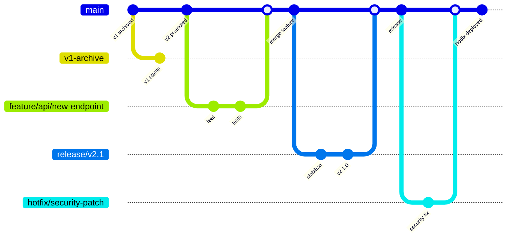

This file provides guidance to WARP (warp.dev) when working with code in this repository.

# CipherSwarm Developer Guide for WARP

Authoritative "rules of engagement" for AI assistants and contributors working in the CipherSwarm distributed password cracking management system. This file complements `AGENTS.md`, `GEMINI.md`, and `.cursor/rules`.

**🚨 Golden Rules:**

- Never push directly on behalf of the maintainer (handle: UncleSp1d3r). Always open a PR.
- Never modify PROTECTED areas without explicit permission.
- Never break Agent API v1 contract in `contracts/v1_api_swagger.json`.
- Rebase before PR — stay synced with target branch
- Test locally first — run appropriate test tier before opening PR
- PR scope manageable — under ~400 lines when feasible

## TL;DR Quickstart

```bash
# 1) Setup
just install

# 2) Backend dev only (hot reload)
just dev

# 3) Fullstack dev (Docker, hot reload, migrations, seed, logs)
just docker-dev-up-watch

# 4) Stop dev stack
just docker-dev-down

# 5) Open docs/UI
open http://localhost:8000/docs     # Swagger UI
open http://localhost:8000/redoc    # ReDoc
open http://localhost:5173          # SvelteKit Frontend

# 6) Full CI checks (heavy - only before PR)
just ci-check
```

Prefer targeted test suites locally (see [Testing Strategy](#testing-strategy)) and reserve `just ci-check` for PR readiness.

## Everyday Commands

### Setup & Maintenance

- `just install` — Install Python/JS dependencies and pre-commit hooks
- `just update-deps` — Update uv and pnpm dependencies

### Linting & Formatting

- `just check` — Run all code and commit checks
- `just format` — Auto-format code with ruff and prettier
- `just format-check` — Check formatting only
- `just lint` — Run all linting checks

### Testing (Three-Tier Architecture)

- `just test-backend` — Backend tests (pytest + testcontainers)
- `just test-frontend` — Frontend tests (vitest + mocked Playwright)
- `just test-e2e` — Full E2E tests (Playwright vs Docker stack)
- `just test` — Alias for `test-backend` (legacy compatibility)
- `just coverage` — Show coverage report

### Development Servers

- `just dev` — Backend only (legacy alias for `dev-backend`)
- `just dev-backend` — Run migrations + start FastAPI dev server
- `just dev-frontend` — Start SvelteKit dev server only
- `just dev-fullstack` — Start both in Docker with hot reload

### Docker Workflows

- `just docker-dev-up-watch` — Start dev stack + follow logs
- `just docker-dev-down` — Stop dev stack
- `just docker-prod-up` / `just docker-prod-down` — Production compose

### Documentation

- `just docs` — Serve MkDocs locally (port 9090)
- `just docs-test` — Test documentation build

### Database (Test DB)

- `just db-reset` — Drop, recreate, and migrate test database

### Release Management

- `just release` — Generate CHANGELOG.md with git-cliff
- `just release-preview` — Preview changelog without writing

## Architecture Snapshot

CipherSwarm is a distributed password cracking platform built on modern web technologies:

**Backend:** FastAPI (Python 3.13+), SQLAlchemy 2.0 (async), Alembic, Pydantic v2, Celery, Redis, Cashews caching, MinIO object storage, loguru logging

**Frontend:** SvelteKit 5 with Runes, Shadcn-Svelte components, Tailwind CSS v4, Superforms v2 + Zod validation, Playwright/Vitest testing

**Agents:** Go-based CipherSwarmAgent (separate repository) that executes hashcat and communicates via Agent API v1

**Object Storage:** MinIO buckets organized as:

- `wordlists/` — Dictionary attack word lists
- `rules/` — Hashcat rule files
- `masks/` — Mask pattern files
- `charsets/` — Custom charset definitions
- `temp/` — Temporary storage for uploads

**Queue/Cache:** Redis serving as both Celery broker/result backend and Cashews cache

**Core Data Model:** Projects (multi-tenancy) → Campaigns → Attacks → Tasks, with HashLists/HashItems, Agents, CrackResults, and Users

**Service Layer Architecture:** All business logic in `app/core/services/` with thin API endpoints that delegate to service functions

**Authentication:** Role-based access control with JWT tokens for APIs, HTTP-only cookies for Web UI, API keys for Control API

For detailed architecture, see `AGENTS.md` sections 2-3 and `.kiro/steering/` documentation.

## API Surfaces and Contracts

### Agent API v1 (`/api/v1/client/*`) - **IMMUTABLE**

- **Contract:** Must exactly match `contracts/v1_api_swagger.json` (PROTECTED file)
- **Compatibility:** No breaking changes allowed - mirrors Ruby-on-Rails CipherSwarm
- **Testing:** All responses must validate against OpenAPI specification
- **Error Format:** Legacy envelope structure via v1 HTTPException handler

### Web UI API (`/api/v1/web/*`)

- **Nature:** FastAPI-native, can evolve with standard versioning
- **Authentication:** Bearer token + cookie-based sessions

### Control API (`/api/v1/control/*`)

- **Error Format:** RFC9457 `application/problem+json` (middleware enforced)
- **Required Fields:** `type`, `title`, `status`, `detail`, `instance`

### Router Organization (DO NOT MODIFY)

| Endpoint Path              | Router File                             |
| -------------------------- | --------------------------------------- |
| `/api/v1/client/agents/*`  | `app/api/v1/endpoints/agent/agent.py`   |
| `/api/v1/client/attacks/*` | `app/api/v1/endpoints/agent/attacks.py` |
| `/api/v1/client/tasks/*`   | `app/api/v1/endpoints/agent/tasks.py`   |
| `/api/v1/web/*`            | `app/api/v1/endpoints/web/`             |
| `/api/v1/control/*`        | `app/api/v1/endpoints/control/`         |

## Project-Specific Patterns (Non-Obvious)

### Backend Patterns

```python
# ✅ Logging - use loguru exclusively
from loguru import logger

logger.info("Task completed", task_id=task.id)

# ✅ Caching - use cashews only
from cashews import cache


@cache(ttl=60)
async def expensive_operation(): ...


# ✅ Time handling - use UTC timezone
from datetime import datetime

now = datetime.now(datetime.UTC)  # NOT datetime.utcnow()

# ✅ Pydantic v2 - use Annotated with Field
from typing import Annotated
from pydantic import Field

name: Annotated[str, Field(min_length=1, description="User's name")]

# ✅ Strings - always double quotes
message = "Hello world"
```

### Frontend Patterns

```typescript
// ✅ SvelteKit 5 Runes - SSR-first data loading
// +page.server.ts
export const load = async ({ fetch, cookies }) => {
    const response = await fetch("/api/v1/web/campaigns", {
        headers: { Cookie: cookies.toString() },
    });
    return { campaigns: await response.json() };
};

// ✅ Component state management
let campaigns = $state([]);

// ✅ Superforms v2 + Zod
import { superForm } from "sveltekit-superforms";
import { zod } from "sveltekit-superforms/adapters";
```

### Service Layer Architecture Patterns

```python
# ✅ Service Function Structure
async def create_campaign_service(
    db: AsyncSession, campaign_data: CampaignCreate, current_user: User
) -> Campaign:
    """Create a new campaign with business validation."""
    # Validation
    if await _campaign_name_exists(db, campaign_data.name, campaign_data.project_id):
        raise CampaignExistsError("Campaign name already exists in project")

    # Business logic
    campaign = Campaign(**campaign_data.model_dump())
    db.add(campaign)
    await db.commit()
    await db.refresh(campaign)
    return campaign


# ✅ Service Function Naming
# CRUD: create_, get_, list_, update_, delete_
# Business: estimate_keyspace_, reorder_attacks_, start_campaign_
```

### Database Patterns

```python
# ✅ Session management with dependency injection
from app.core.deps import get_db


@router.get("/campaigns")
async def list_campaigns(db: AsyncSession = Depends(get_db)):
    return await campaign_service.list_campaigns_service(db)


# ✅ Pagination pattern
async def list_campaigns_service(
    db: AsyncSession, skip: int = 0, limit: int = 20
) -> tuple[list[Campaign], int]:
    query = select(Campaign).offset(skip).limit(limit)
    result = await db.execute(query)
    items = result.scalars().all()

    count_query = select(func.count(Campaign.id))
    total = await db.scalar(count_query)

    return list(items), total or 0
```

### Error Handling Patterns

```python
# ✅ Custom domain exceptions in services
class CampaignNotFoundError(Exception):
    """Raised when a campaign is not found."""

    pass


# ✅ Exception translation in endpoints
try:
    campaign = await get_campaign_service(db, campaign_id)
except CampaignNotFoundError:
    raise HTTPException(status_code=404, detail="Campaign not found")
```

### General Patterns

- **Dependencies:** Use `uv add/remove/sync` - never hand-edit `pyproject.toml`
- **Multi-tenancy:** Enforce project-level access in service layer
- **Error Handling:** Early returns with guard clauses, specific exceptions
- **Service Organization:** One service file per domain, functions named `{action}_{resource}_service()`
- **API Endpoints:** Thin wrappers that delegate to service functions
- **Type Safety:** All functions require type hints, return Pydantic models

## Testing Strategy

CipherSwarm uses a **three-tier testing architecture**:

### Tier 1: Backend (`just test-backend`)

- **Technology:** pytest + testcontainers + polyfactory
- **Scope:** API endpoints, services, models with real PostgreSQL/MongoDB
- **Coverage:** Focused on `app/` directory
- **Speed:** Fast (seconds)

### Tier 2: Frontend (`just test-frontend`)

- **Technology:** Vitest + Playwright with mocked APIs
- **Scope:** UI components, user interactions, client-side logic
- **Speed:** Fast (seconds)

### Tier 3: Full E2E (`just test-e2e`)

- **Technology:** Playwright against full Docker stack
- **Scope:** Complete user workflows across real backend
- **Data:** Uses `scripts/seed_e2e_data.py` for test data
- **Speed:** Slow (minutes)

### Testing Guidance

- Run the **smallest tier** that exercises your changes
- Use `just ci-check` only when PR-ready or touching multiple tiers
- **Phase 3 Verification:** Don't run `ci-check` for verification-only tasks (no code changes)

## Docker Environments

### Development (Hot Reload)

```bash
# Start fullstack with migrations, seeding, and log following
just docker-dev-up-watch

# Stop and clean up
just docker-dev-down
```

### Production

```bash
just docker-prod-up      # Start production stack
just docker-prod-down    # Stop production stack
```

### Key Environment Variables

From `docker-compose.yml` and `docker-compose.dev.yml`:

- `DATABASE_URL` — PostgreSQL connection string
- `REDIS_HOST/PORT` — Redis cache connection
- `CELERY_BROKER_URL/RESULT_BACKEND` — Task queue configuration
- `SECRET_KEY` — JWT signing secret
- `FIRST_SUPERUSER/PASSWORD` — Initial admin user
- `BACKEND_CORS_ORIGINS` — Frontend origins for CORS

### Health Endpoints

- `/api-info` — API metadata (name, version, docs links)
- `/health` — Simple health check for Docker

## Security Posture

- **Production:** HTTPS only, no hard-coded secrets
- **Authentication:** JWT tokens + secure HTTP-only cookies
- **Input Validation:** All inputs validated via Pydantic schemas
- **Authorization:** RBAC with project-level scoping enforced in service layer
- **Error Handling:** Never leak stack traces; use `HTTPException` or RFC9457 problem+json
- **Rate Limiting:** Applied per-user and per-IP
- **CSRF Protection:** Implemented for state-changing requests

## Protected Areas - DO NOT MODIFY

- **`contracts/`** — API specifications (Agent API v1 is immutable)
- **`alembic/`** — Database migrations (use Alembic CLI only)
- **`.cursor/`** — Cursor AI configuration
- **`.github/`** — GitHub Actions workflows

### Additional Constraints

- Do not break router file organization
- Avoid raw SQL queries; use SQLAlchemy ORM/async patterns
- Don't introduce alternative logging/caching/time libraries

## Frontend Development Guidelines

### SvelteKit 5 Patterns

- **Runes:** Use `$state`, `$derived`, `$effect` for reactivity
- **SSR:** Prefer server-side data loading with load functions
- **Authentication:** Handle 401 redirects appropriately
- **State:** Keep client state minimal; prefer server-driven data

### UI Framework

- **Components:** Shadcn-Svelte + bits-ui for accessibility
- **Styling:** Tailwind CSS v4 utility-first approach
- **Forms:** Superforms v2 with Zod validation schemas
- **Responsive:** Mobile-first responsive design patterns

## Code Style and Tooling

### Python

- **Formatter:** `ruff format` (line length: 119 characters)
- **Linter:** `ruff` (configured in `pyproject.toml`)
- **Type Checker:** `mypy` strict mode
- **Pre-commit:** Run `just check` before commits

### Frontend

- **Formatter:** Prettier (configured for Svelte/TypeScript)
- **Linter:** ESLint + oxlint
- **Type Checker:** `svelte-check`

### Git Workflow - V2-Primary Development

CipherSwarm uses a **streamlined workflow** focused on v2 development with v1 archived for reference:

#### Branch Strategy



#### Branch Types

- **Long-lived:**
  - `main`: Primary development branch (v2 codebase)
  - `v1-archive`: Archived v1 stable (maintenance-only, rarely updated)
- **Short-lived:**
  - `feature/<area>/<desc>`: New features off `main`
  - `hotfix/<desc>`: Emergency fixes off `main`
  - `release/<version>`: Release preparation off `main`

#### Development Workflow

**Standard Development:**

```bash
git checkout main && git pull
git checkout -b feature/api/new-feature
just dev  # develop with hot reload
just test-backend  # smallest tier covering changes
git commit -m "feat(api): add project quotas"
gh pr create --base main
```

**Hotfixes:**

```bash
git checkout main && git pull
git checkout -b hotfix/critical-security-fix
# fix the issue...
just test-backend
git commit -m "fix(auth): patch security vulnerability"
gh pr create --base main
```

**Releases:**

```bash
git checkout main && git pull
git checkout -b release/v2.1.0
# stabilization work...
just ci-check  # full validation
git commit -m "chore(release): prepare v2.1.0"
gh pr create --base main
```

#### Conventional Commits (Required)

- **Format:** `type(scope): description`
- **Types:** `feat`, `fix`, `docs`, `style`, `refactor`, `perf`, `test`, `ci`, `chore`, `deps`
- **Scopes:** `api`, `auth`, `models`, `services`, `frontend`, `agents`, `infra`
- **Examples:**
  - `feat(api): add RFC9457 error handler`
  - `fix(frontend): correct SSR auth redirect`
  - `docs(readme): update installation instructions`
  - `feat(api)!: remove deprecated endpoints` (breaking change)

#### Golden Rules

1. **NO direct pushes** to `main` – PRs only
2. **Agent API v1 compatibility** – maintain existing contracts during transition
3. **Rebase before PR** – stay synced with `main`
4. **Test locally first** – run appropriate test tier before opening PR
5. **PR scope manageable** – under ~400 lines when feasible
6. **v1-archive is read-only** – only emergency security patches if absolutely needed

## User Preferences

- **Code Review:** Prefer coderabbit.ai over GitHub Copilot auto-reviews
- **Milestones:** Named as version numbers (e.g., `v2.0`) with descriptive summaries
- **Real Name:** Always use handle 'UncleSp1d3r', never real name
- **Commits:** Never commit on behalf of maintainer; always open PRs

## SDK and Rust Client Development

- **Code Generation:** Use OpenAPI Generator for Rust client code from current API schema
- **Linting:** Enforce `cargo clippy -- -D warnings` for strict checking
- **Testing:** Recommend `criterion` for benchmarks, `insta` for snapshot testing
- **Organization:** Keep generated SDK code in separate packages/repositories

## First Tasks Checklist for New AI Agents

1. **Setup:** `just install`
2. **Start Development:** `just docker-dev-up-watch`
3. **Verify URLs:**
   - <http://localhost:8000/docs> (Swagger UI)
   - <http://localhost:5173> (Frontend)
4. **Read Documentation:**
   - `AGENTS.md` (mandatory - comprehensive agent rules)
   - `GEMINI.md` (architecture overview)
   - `.cursor/rules/` (project-specific patterns)
5. **Choose Test Strategy:** Select smallest tier covering your changes
6. **API Compliance:**
   - If touching `/api/v1/client/*`, validate against `contracts/v1_api_swagger.json`
   - If touching Control API, ensure RFC9457 `application/problem+json` responses
7. **Validate Changes:** Run appropriate test suite before marking complete

## Verification for This File

Before considering this WARP.md complete:

- ✅ `just check` passes (formatting and pre-commit hooks)
- ✅ All referenced links resolve (README.md, AGENTS.md, GEMINI.md, /docs, /redoc)
- ✅ Quickstart commands work on clean development environment
- ✅ Critical constraints highlighted: Agent API v1 immutability, PROTECTED directories, required libraries (loguru/cashews/datetime.UTC)
- ✅ No code changes made (documentation only), so `just ci-check` not required per Phase 3 verification rules

## References and Links

- [README.md](README.md) — Project overview, features, installation
- [AGENTS.md](AGENTS.md) — Comprehensive agent development rules
- [GEMINI.md](GEMINI.md) — Architecture and design patterns
- [.cursor/rules/](.cursor/rules/) — Project-specific development patterns
- [CONTRIBUTING.md](CONTRIBUTING.md) — Contribution guidelines
- API Documentation:
  - <http://localhost:8000/docs> (Swagger UI)
  - <http://localhost:8000/redoc> (ReDoc)
  - <http://localhost:8000/api-info> (API metadata)

---

Built with ❤️ for efficient AI-assisted development on CipherSwarm
