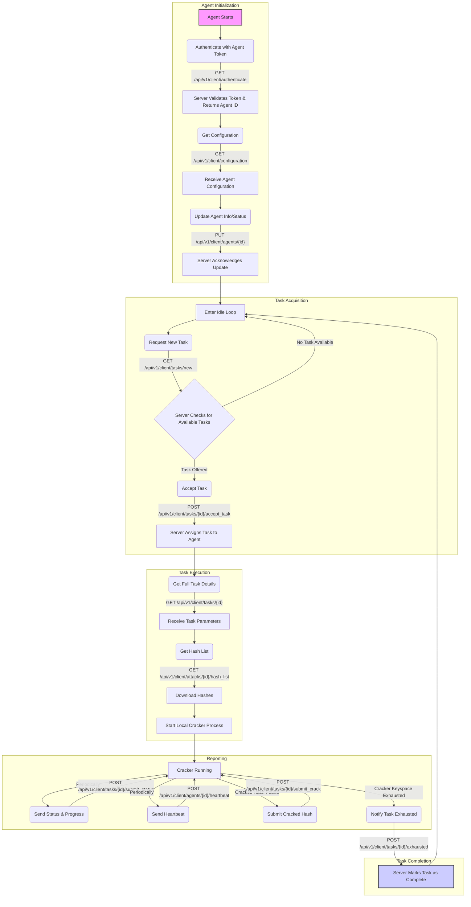

# Agent Cracking Operation Flowchart

This document outlines the typical lifecycle of a CipherSwarm agent and its interaction with the server API during a cracking operation.

## Flowchart

## Explanation

### 1. Agent Initialization
- **Authentication**: The agent starts up and authenticates with the server by sending its pre-configured, long-lived agent token in the `Authorization` header of a `GET` request to the `/api/v1/client/authenticate` endpoint.
- **Verification**: The server validates the agent token. If successful, it confirms the agent's identity and returns its unique `agent_id`.
- **Configuration**: The agent fetches its specific configuration from `/api/v1/client/configuration`. This can include performance settings, assigned hardware, or other operational parameters.
- **Status Update**: Finally, the agent sends its initial status and device information (like GPU details) to the server via a `PUT` request to `/api/v1/client/agents/{id}`.

### 2. Task Acquisition
- **Idle Loop**: After initialization, the agent enters an idle state, where it periodically polls the `/api/v1/client/tasks/new` endpoint to request a cracking task.
- **Task Offer**: If the server has a suitable, available task, it will offer it to the agent in the response. If not, the agent continues its polling loop.
- **Task Acceptance**: Upon receiving a task offer, the agent formally accepts it by sending a `POST` request to `/api/v1/client/tasks/{id}/accept_task`. The server then officially assigns the task to this agent.

### 3. Task Execution
- **Get Task Details**: The agent retrieves the full parameters for the assigned task by calling `GET /api/v1/client/tasks/{id}`. This includes the attack mode, wordlists, rules, etc.
- **Download Hashes**: It then downloads the target hash list for the associated attack from `/api/v1/client/attacks/{id}/hash_list`.
- **Start Cracker**: With all the necessary data, the agent configures and launches the local cracking engine (e.g., Hashcat) to begin the cracking process.

### 4. Reporting
While the cracker is running, the agent is responsible for several concurrent reporting duties:
- **Status and Progress**: It periodically sends progress updates (speed, progress percentage, temperature) to `/api/v1/client/tasks/{id}/submit_status`.
- **Heartbeat**: It sends a simple heartbeat to `/api/v1/client/agents/{id}/heartbeat` at regular intervals to signal that it is still online and functioning.
- **Submit Cracks**: If the cracker successfully finds a password, the agent immediately sends the cracked hash and plaintext to `/api/v1/client/tasks/{id}/submit_crack`.
- **Notify Exhaustion**: Once the cracker has completed its entire assigned workload (i.e., the keyspace is exhausted), the agent informs the server.

### 5. Task Completion
- **Mark as Complete**: The agent sends a final notification to `/api/v1/client/tasks/{id}/exhausted`. The server then marks the task as complete.
- **Return to Idle**: The agent cleans up the completed task and returns to the idle loop to request a new one, starting the cycle over again.
