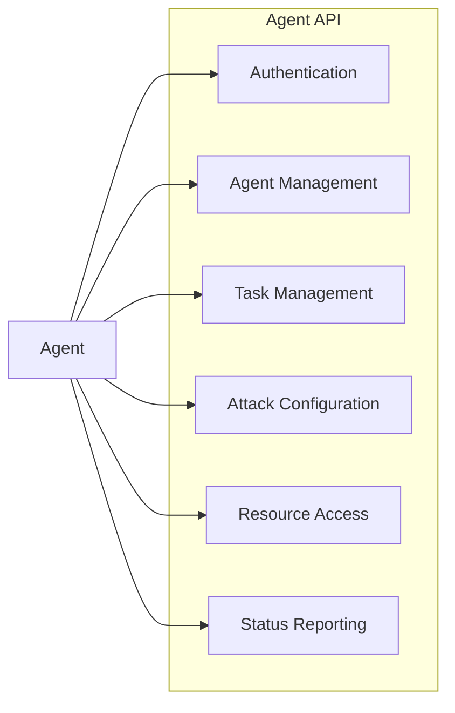
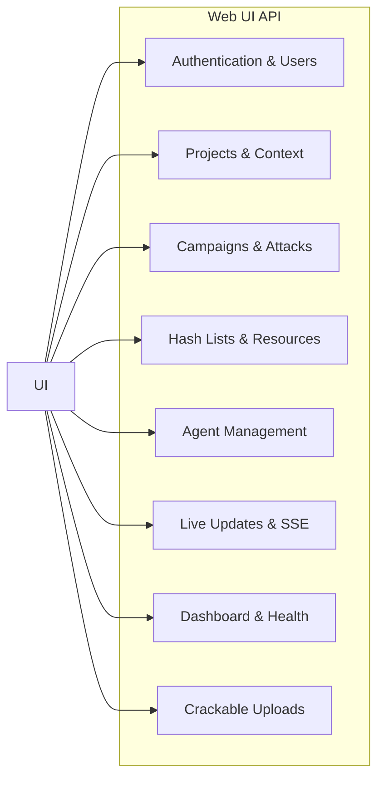
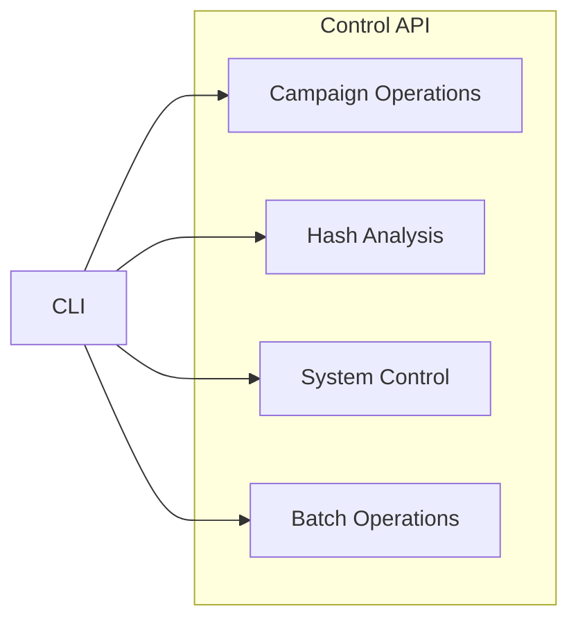
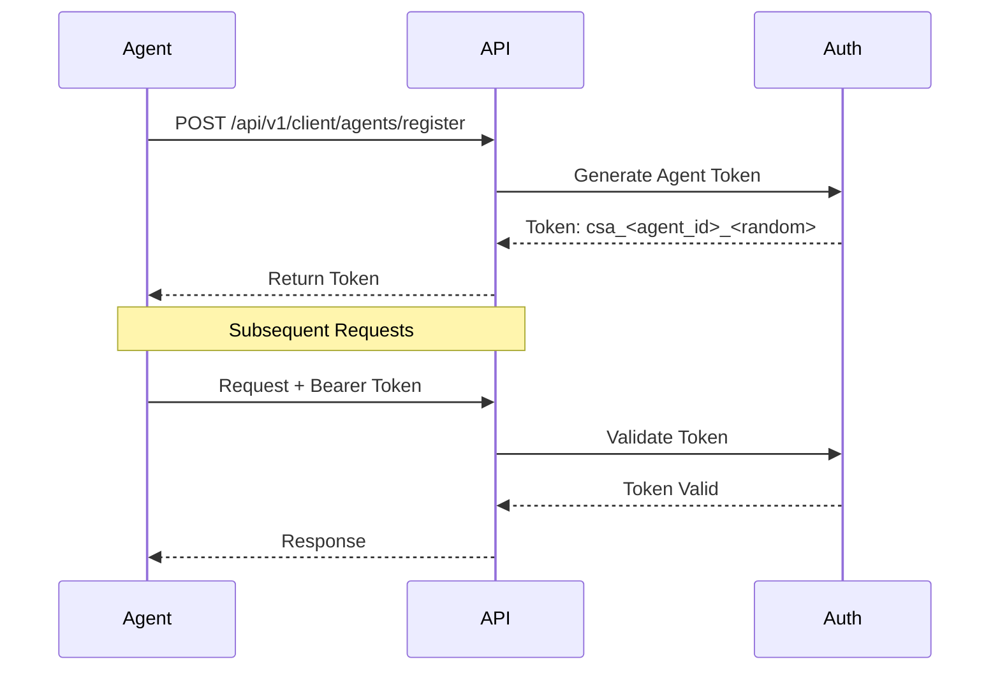
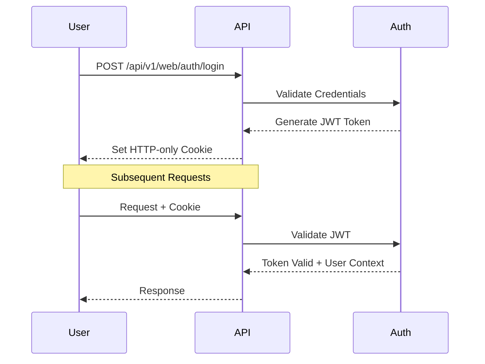
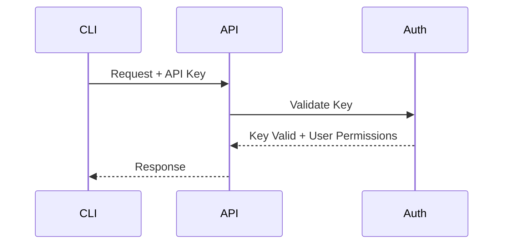

# API Overview

CipherSwarm provides three distinct API interfaces, each designed for specific use cases and integration needs. This document provides an overview of the API structure, authentication mechanisms, and general usage guidelines.

## Quick Start

- **Interactive Documentation**: Visit `/docs` for Swagger UI or `/redoc` for ReDoc
- **OpenAPI Specification**: Available at `/openapi.json`
- **Integration Guides**: See [Integration Guides](integration-guides.md) for detailed examples
- **Workflow Examples**: See [Workflow Examples](workflow-examples.md) for complete scenarios
- **Error Handling**: See [Error Response Reference](error-responses.md) for troubleshooting

---

## Table of Contents

<!-- mdformat-toc start --slug=github --no-anchors --maxlevel=3 --minlevel=1 -->

- [API Overview](#api-overview)
  - [Quick Start](#quick-start)
  - [Table of Contents](#table-of-contents)
  - [API Interfaces](#api-interfaces)
    - [1. Agent API (`/api/v1/client/*`)](#1-agent-api-apiv1client)
    - [2. Web UI API (`/api/v1/web/*`)](#2-web-ui-api-apiv1web)
    - [3. Control API (`/api/v1/control/*`)](#3-control-api-apiv1control)
  - [Authentication](#authentication)
    - [Agent Authentication](#agent-authentication)
    - [Web UI Authentication](#web-ui-authentication)
    - [Control API Authentication](#control-api-authentication)
  - [Real-Time Updates](#real-time-updates)
    - [SSE Endpoints](#sse-endpoints)
    - [Event Format](#event-format)
  - [Rate Limiting](#rate-limiting)
  - [Error Handling](#error-handling)
    - [Agent API (Legacy Format)](#agent-api-legacy-format)
    - [Web UI API (FastAPI Standard)](#web-ui-api-fastapi-standard)
    - [Control API (RFC9457 Problem Details)](#control-api-rfc9457-problem-details)
    - [Common HTTP Status Codes](#common-http-status-codes)
  - [API Versioning](#api-versioning)
  - [Security Features](#security-features)
  - [Multi-Tenancy](#multi-tenancy)
  - [API Documentation](#api-documentation)

<!-- mdformat-toc end -->

---

## API Interfaces

### 1. Agent API (`/api/v1/client/*`)

The Agent API is a strictly specified interface used by CipherSwarm agents to communicate with the central server. It follows the OpenAPI 3.0.1 specification defined in `contracts/v1_api_swagger.json` and maintains strict backward compatibility.



**Key Features:**

- OpenAPI 3.0.1 specification compliance
- Bearer token authentication (`csa_` prefix)
- Binary-safe file transfers via presigned URLs
- Real-time status updates and heartbeat
- Error reporting and diagnostics
- Benchmark submission and capabilities reporting

**Base Path:** `/api/v1/client`

**Key Endpoints:**

- `/authenticate` - Agent authentication verification
- `/configuration` - Agent configuration retrieval
- `/agents/*` - Agent lifecycle management and heartbeat
- `/attacks/*` - Attack configuration retrieval
- `/tasks/*` - Task management and progress reporting
- `/crackers/*` - Cracker binary updates

### 2. Web UI API (`/api/v1/web/*`)

The Web UI API powers the SvelteKit-based web interface, providing endpoints for the dynamic user interface, administrative functions, and real-time updates via Server-Sent Events (SSE).



**Key Features:**

- SvelteKit integration with JSON API endpoints
- JWT-based authentication with HTTP-only cookies
- Project-scoped access control and multi-tenancy
- Real-time updates via Server-Sent Events (SSE)
- CSRF protection and security headers
- File upload with presigned URLs
- Hash type detection and validation
- Resource management with line-level editing

**Base Path:** `/api/v1/web`

**Key Endpoint Groups:**

- `/auth/*` - Authentication, profile, and context management
- `/users/*` - User administration (admin only)
- `/projects/*` - Project management (admin only)
- `/campaigns/*` - Campaign creation and management
- `/attacks/*` - Attack configuration and monitoring
- `/hash_lists/*` - Hash list management and item viewing
- `/resources/*` - Resource upload, editing, and management
- `/agents/*` - Agent monitoring and configuration
- `/uploads/*` - Crackable file/hash upload processing
- `/live/*` - Server-Sent Events for real-time updates
- `/dashboard/*` - System statistics and summaries
- `/health/*` - System health monitoring
- `/modals/*` - UI helper endpoints for dropdowns and selectors

### 3. Control API (`/api/v1/control/*`)

The Control API provides endpoints for command-line and scripting interfaces, focusing on automation and programmatic access. This API follows RFC9457 (Problem Details for HTTP APIs) for error responses.



**Key Features:**

- API key authentication (`cst_` prefix)
- RFC9457 compliant error responses
- Batch operations and automation support
- Scriptable interface with structured responses
- Performance metrics and monitoring

**Base Path:** `/api/v1/control`

**Key Endpoints:**

- `/campaigns/*` - Campaign operations and monitoring
- `/hash/guess` - Hash type detection and analysis

## Authentication

### Agent Authentication



**Token Format:**

```text
Authorization: Bearer csa_<agent_id>_<random_string>
```

**Required Headers:**

```http
Authorization: Bearer csa_<agent_id>_<token>
User-Agent: CipherSwarm-Agent/<version>
```

**Features:**

- One token per agent, bound to agent ID
- Automatic token generation on registration
- Token rotation on security events
- Rate limiting per agent token

### Web UI Authentication



**Features:**

- JWT tokens in secure HTTP-only cookies
- Project context switching via cookies
- CSRF protection for state-changing operations
- Password complexity requirements (Argon2 hashing)
- Session refresh and automatic expiration
- Multi-project access control

### Control API Authentication



**Token Format:**

```text
Authorization: Bearer cst_<user_id>_<random_string>
```

**Required Headers:**

```http
Authorization: Bearer cst_<user_id>_<token>
User-Agent: CipherSwarm-Control/<version>
```

**Features:**

- API key-based authentication
- Multiple active keys per user
- Configurable permissions and scopes
- Key management through web interface
- Usage monitoring and revocation

## Real-Time Updates

The Web UI API provides Server-Sent Events (SSE) for real-time notifications:

### SSE Endpoints

- `/api/v1/web/live/campaigns` - Campaign, attack, and task state changes
- `/api/v1/web/live/agents` - Agent status, performance, and error updates
- `/api/v1/web/live/toasts` - Crack results and system notifications

### Event Format

```json
{
  "trigger": "refresh",
  "timestamp": "2024-01-01T12:00:00Z",
  "target": "campaign",
  "id": 123
}
```

## Rate Limiting

All APIs implement rate limiting to prevent abuse:

1. **Agent API**

   - 100 requests/minute per agent
   - Burst allowance: 20 requests
   - Separate limits for file uploads

2. **Web UI API**

   - 300 requests/minute per session
   - Burst allowance: 50 requests
   - Lower limits for authentication endpoints

3. **Control API**

   - 500 requests/minute per API key
   - Burst allowance: 100 requests
   - Configurable per-key limits

## Error Handling

### Agent API (Legacy Format)

```json
{
  "error": "Human readable error message"
}
```

### Web UI API (FastAPI Standard)

```json
{
  "detail": "Human readable error message"
}
```

### Control API (RFC9457 Problem Details)

```json
{
  "type": "https://example.com/problems/validation-error",
  "title": "Validation Error",
  "status": 422,
  "detail": "The request contains invalid data",
  "instance": "/api/v1/control/campaigns/123"
}
```

### Common HTTP Status Codes

| Code | Description           | Usage                    |
| ---- | --------------------- | ------------------------ |
| 200  | OK                    | Successful requests      |
| 201  | Created               | Resource creation        |
| 204  | No Content            | Successful deletion      |
| 400  | Bad Request           | Invalid request format   |
| 401  | Unauthorized          | Authentication required  |
| 403  | Forbidden             | Insufficient permissions |
| 404  | Not Found             | Resource not found       |
| 409  | Conflict              | Resource conflict        |
| 422  | Unprocessable Entity  | Validation errors        |
| 429  | Too Many Requests     | Rate limit exceeded      |
| 500  | Internal Server Error | Server errors            |

## API Versioning

1. **Agent API**

   - Strict versioning via OpenAPI 3.0.1 specification
   - Breaking changes prohibited in v1
   - Version in URL path: `/api/v1/client`
   - Future v2 planned for enhanced features

2. **Web UI API**

   - Independent versioning from Agent API
   - Breaking changes with proper migration
   - Version in URL path: `/api/v1/web`

3. **Control API**

   - Independent versioning
   - RFC9457 compliance for error handling
   - Version in URL path: `/api/v1/control`

## Security Features

1. **Transport Security**

   - HTTPS required for all endpoints
   - TLS 1.2 or higher required
   - Strong cipher suites only

2. **Authentication Security**

   - Token rotation on security events
   - Automatic token expiration
   - Rate limiting on auth endpoints
   - IP-based restrictions

3. **Input Validation**

   - Pydantic schema validation
   - Content type verification
   - File type and size checking
   - Hash validation and sanitization

4. **Output Security**

   - Security headers (HSTS, CSP, etc.)
   - CORS configuration
   - Error message sanitization
   - Project-scoped data isolation

## Multi-Tenancy

CipherSwarm implements project-based multi-tenancy:

- **Projects** serve as the top-level organizational boundary
- All resources (campaigns, hash lists, agents) are scoped to projects
- Users can be members of multiple projects
- Project context switching via Web UI API
- Cross-project data isolation enforced at the API level

## API Documentation

Detailed API documentation is available:

1. **Agent API**

   - OpenAPI specification: `/swagger.json`
   - Interactive documentation: `/docs`
   - Strict schema validation

2. **Web UI API**

   - Endpoint documentation in this guide
   - SvelteKit integration examples
   - SSE implementation guide

3. **Control API**

   - CLI documentation and examples
   - RFC9457 error handling guide
   - Automation scripting examples
