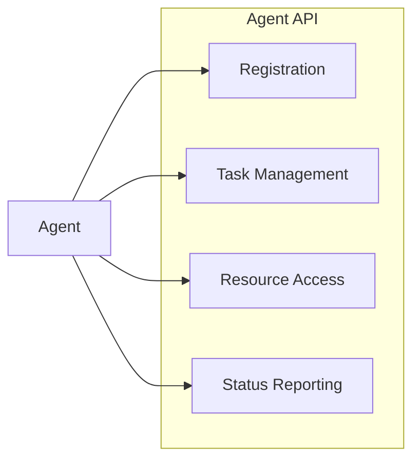
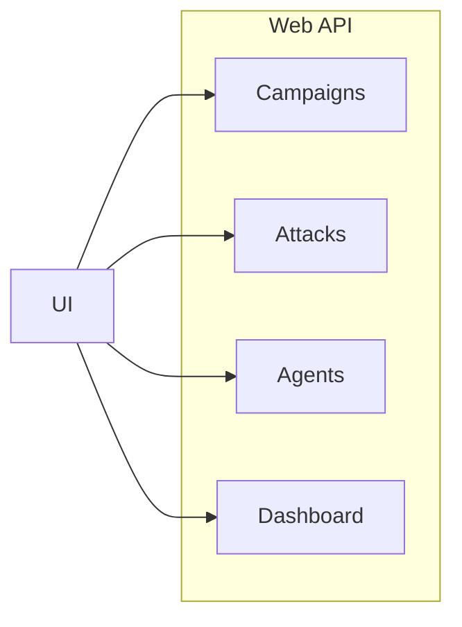
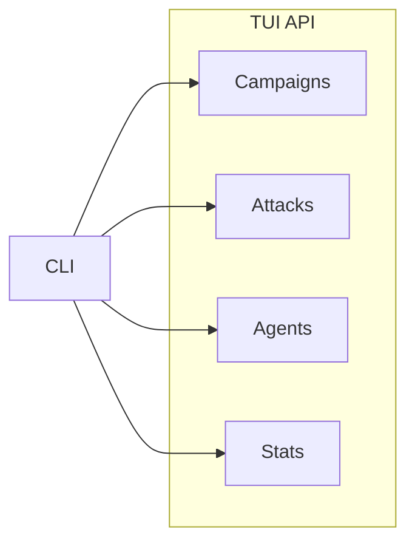
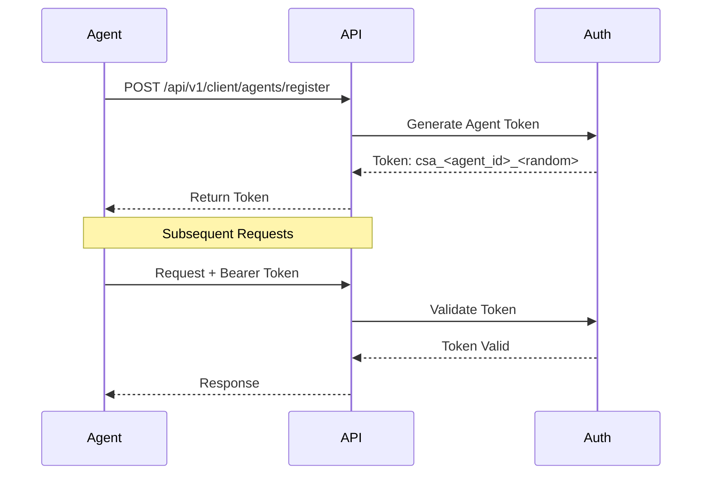
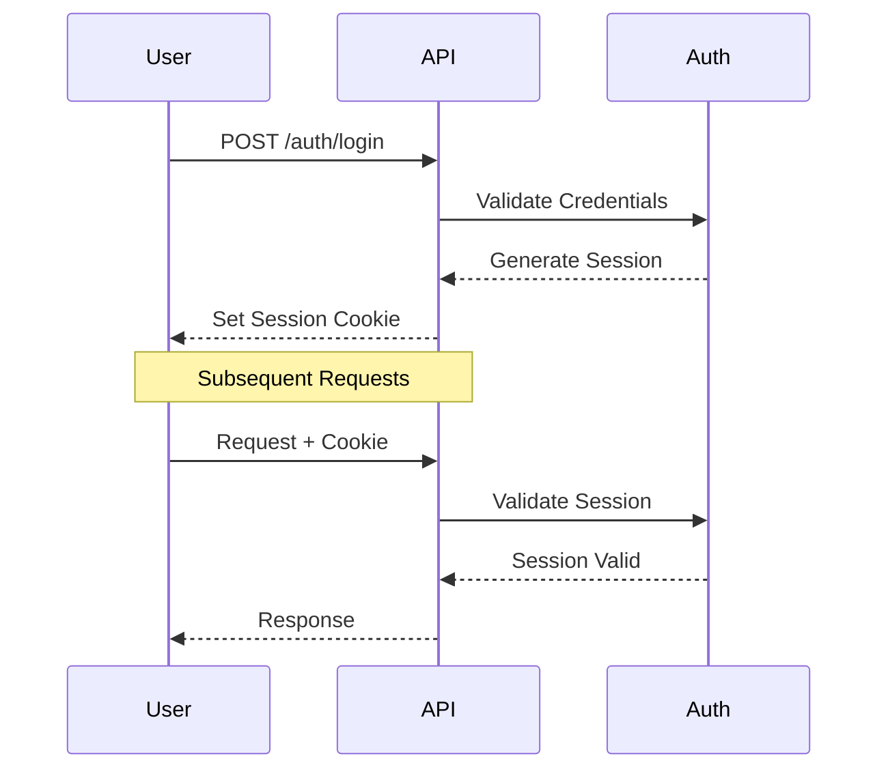
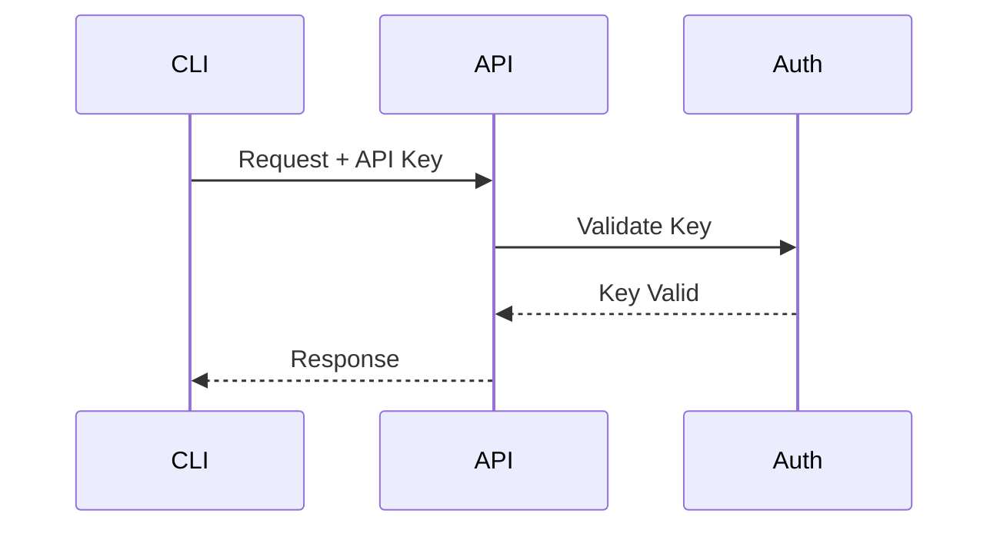

# API Overview

CipherSwarm provides three distinct API interfaces, each designed for specific use cases and integration needs. This document provides an overview of the API structure, authentication mechanisms, and general usage guidelines.

## API Interfaces

### 1. Agent API

The Agent API is a strictly specified interface used by CipherSwarm agents to communicate with the central server. It follows the OpenAPI 3.0.1 specification defined in `swagger.json`.



**Key Features:**

-   OpenAPI 3.0.1 specification
-   Bearer token authentication
-   Binary-safe file transfers
-   Real-time status updates
-   Error reporting

**Base Path:** `/api/v1/client`

**Key Endpoints:**

-   `/agents/*`: Agent lifecycle management
-   `/attacks/*`: Attack configuration retrieval
-   `/tasks/*`: Task management
-   `/crackers/*`: Cracker binary updates

### 2. Web API

The Web API powers the SvelteKit-based web interface, providing endpoints for the dynamic user interface and administrative functions.



**Key Features:**

-   SvelteKit integration
-   JSON API endpoints
-   Real-time updates
-   Session-based authentication
-   CSRF protection

**Base Path:** `/api/v1/web`

**Key Endpoints:**

-   `/campaigns/*`: Campaign management
-   `/attacks/*`: Attack configuration
-   `/agents/*`: Agent monitoring
-   `/dashboard/*`: System statistics

### 3. TUI API

The TUI API provides endpoints for command-line and scripting interfaces, focusing on batch operations and automation.



**Key Features:**

-   API key authentication
-   Batch operations
-   Scriptable interface
-   Performance metrics
-   Command-line friendly responses

**Base Path:** `/api/v1/tui`

**Key Endpoints:**

-   `/campaigns/*`: Campaign operations
-   `/attacks/*`: Attack management
-   `/agents/*`: Agent control
-   `/stats/*`: Performance metrics

## Authentication

### Agent Authentication



**Token Format:**

```
Authorization: Bearer csa_<agent_id>_<random_string>
```

**Required Headers:**

```http
Authorization: Bearer csa_<agent_id>_<token>
User-Agent: CipherSwarm-Agent/<version>
```

### Web Authentication



**Features:**

-   Session-based authentication
-   Secure HTTP-only cookies
-   CSRF protection
-   Optional 2FA support
-   Remember-me functionality

### TUI Authentication



**Token Format:**

```
Authorization: Bearer cst_<user_id>_<random_string>
```

**Required Headers:**

```http
Authorization: Bearer cst_<user_id>_<token>
User-Agent: CipherSwarm-TUI/<version>
```

## Rate Limiting

All APIs implement rate limiting to prevent abuse:

1. **Agent API**

    - 100 requests/minute per agent
    - Burst allowance: 20 requests
    - Separate limits for file uploads

2. **Web API**

    - 300 requests/minute per session
    - Burst allowance: 50 requests
    - Lower limits for authentication endpoints

3. **TUI API**
    - 500 requests/minute per API key
    - Burst allowance: 100 requests
    - Configurable per-key limits

## Error Handling

All APIs follow a consistent error response format:

```json
{
    "error": {
        "code": "ERROR_CODE",
        "message": "Human readable error message",
        "details": {
            "field": "Additional error context"
        }
    }
}
```

### Common Error Codes

| Code              | Description              |
| ----------------- | ------------------------ |
| `AUTH_REQUIRED`   | Authentication required  |
| `INVALID_TOKEN`   | Invalid or expired token |
| `RATE_LIMITED`    | Rate limit exceeded      |
| `INVALID_REQUEST` | Invalid request format   |
| `NOT_FOUND`       | Resource not found       |
| `SERVER_ERROR`    | Internal server error    |

## API Versioning

1. **Agent API**

    - Strict versioning via OpenAPI spec
    - Breaking changes prohibited
    - Version in URL path: `/api/v1/`

2. **Web API**

    - Independent versioning
    - Breaking changes with notice
    - Version in URL path: `/api/v1/`

3. **TUI API**
    - Independent versioning
    - Breaking changes with notice
    - Version in URL path: `/api/v1/`

## Security Best Practices

1. **Transport Security**

    - HTTPS required for all endpoints
    - TLS 1.2 or higher required
    - Strong cipher suites only

2. **Authentication Security**

    - Token rotation on security events
    - Automatic token expiration
    - Rate limiting on auth endpoints
    - IP-based blocking

3. **Input Validation**

    - Schema validation
    - Content type verification
    - File type checking
    - Size limits

4. **Output Security**
    - Content type headers
    - CORS configuration
    - Security headers
    - Error message sanitization

## API Documentation

Detailed API documentation is available:

1. **Agent API**

    - OpenAPI specification: `/swagger.json`
    - Interactive documentation: `/docs`
    - Schema validation

2. **Web API**

    - Endpoint documentation
    - SvelteKit integration guide
    - Example requests

3. **TUI API**
    - CLI documentation
    - Scripting examples
    - Batch operation guide
