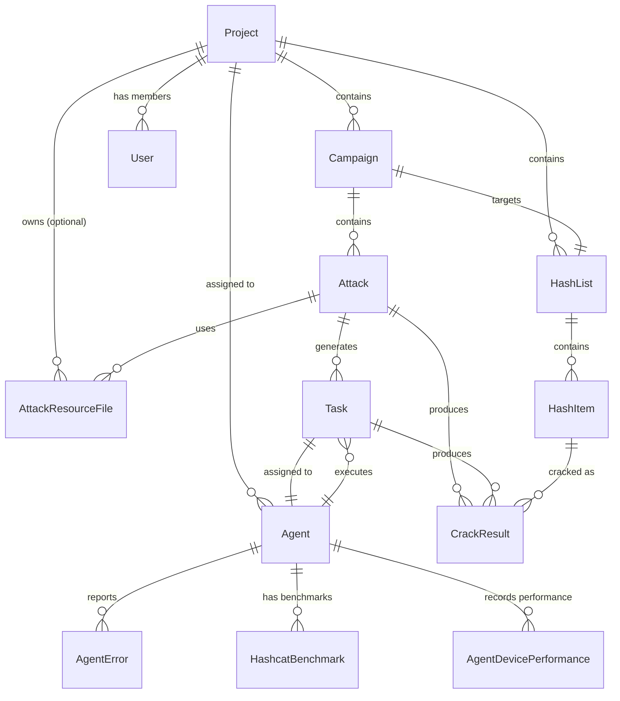
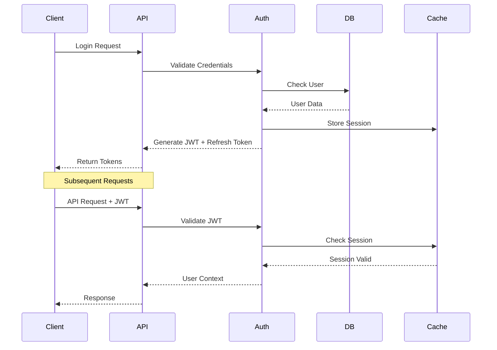

# System Components

This document details the core components of the CipherSwarm system and their current implementation status.

## FastAPI Backend

The backend is built with FastAPI, providing a high-performance, async-first API server with comprehensive service architecture.

### Key Features

- Async request handling with Python 3.13
- OpenAPI 3.0.1 specification (locked for Agent API v1)
- Type-safe request/response validation with Pydantic v2
- Server-Sent Events (SSE) for real-time notifications
- JWT-based authentication with refresh token support
- Bearer token authentication for agents
- API key authentication for TUI clients
- Comprehensive service layer architecture
- Project-based multi-tenancy

### API Structure

```text
app/
├── api/
│   └── v1/
│       └── endpoints/
│           ├── agent/          # Agent API v1 (/api/v1/client/*)
│           │   ├── agent.py    # Agent lifecycle management
│           │   ├── attacks.py  # Attack configuration retrieval
│           │   ├── tasks.py    # Task management
│           │   ├── crackers.py # Cracker binary updates
│           │   └── general.py  # Authentication & configuration
│           ├── web/            # Web UI API (/api/v1/web/*)
│           │   ├── auth.py     # Authentication & user management
│           │   ├── campaigns.py # Campaign management
│           │   ├── attacks.py  # Attack configuration
│           │   ├── agents.py   # Agent monitoring
│           │   ├── resources.py # Resource management
│           │   ├── hash_lists.py # Hash list management
│           │   ├── uploads.py  # Crackable file uploads
│           │   ├── live.py     # SSE event streams
│           │   ├── health.py   # System health monitoring
│           │   └── modals.py   # UI helper endpoints
│           ├── control/        # Control API (/api/v1/control/*)
│           │   ├── campaigns.py # Campaign operations
│           │   └── hash_guess.py # Hash type detection
│           ├── resources.py    # Shared resource downloads
│           └── downloads.py    # Shared file downloads
├── core/
│   └── services/              # Business logic layer
│       ├── agent_service.py   # Agent management
│       ├── attack_service.py  # Attack configuration & validation
│       ├── campaign_service.py # Campaign orchestration
│       ├── resource_service.py # Resource management
│       ├── task_service.py    # Task distribution
│       ├── hash_list_service.py # Hash collection management
│       ├── event_service.py   # SSE broadcasting
│       ├── health_service.py  # System monitoring
│       ├── storage_service.py # MinIO integration
│       ├── hash_guess_service.py # Hash type detection
│       └── user_service.py    # User management
├── models/                    # SQLAlchemy database models
└── schemas/                   # Pydantic request/response schemas
```

## Database Layer

PostgreSQL 16+ is used as the primary data store, with SQLAlchemy ORM providing type-safe database access.

### Core Models

```python
# Project Model - Top-level organizational boundary
class Project(Base):
    id: UUID
    name: str
    description: Optional[str]
    is_archived: bool
    created_at: datetime
    updated_at: datetime


# User Model - Authenticated system users
class User(Base):
    id: UUID
    email: str
    hashed_password: str
    role: UserRole  # admin, user, power_user
    is_active: bool
    created_at: datetime


# Agent Model - Registered client systems
class Agent(Base):
    id: UUID
    name: str
    host_name: str
    operating_system: str
    devices: list[str]
    status: AgentStatus  # pending, active, stopped, error
    last_seen: datetime
    token_hash: str
    advanced_config: JSON


# Campaign Model - Coordinated cracking attempts
class Campaign(Base):
    id: UUID
    name: str
    description: Optional[str]
    state: CampaignState  # draft, active, archived
    hash_list_id: UUID
    project_id: UUID
    created_at: datetime
    updated_at: datetime


# Attack Model - Specific cracking configurations
class Attack(Base):
    id: UUID
    name: str
    attack_mode: AttackMode  # dictionary, mask, brute_force, etc.
    campaign_id: UUID
    status: AttackStatus  # pending, running, completed, failed
    position: int  # Ordering within campaign
    comment: Optional[str]  # User description
    complexity_score: Optional[int]  # 1-5 difficulty rating
    config: JSON  # Attack-specific configuration
    created_at: datetime
    updated_at: datetime


# Task Model - Discrete work units for agents
class Task(Base):
    id: UUID
    attack_id: UUID
    agent_id: Optional[UUID]
    status: TaskStatus  # pending, assigned, running, completed, failed
    keyspace_offset: int
    keyspace_limit: int
    progress: float
    started_at: Optional[datetime]
    completed_at: Optional[datetime]


# HashList Model - Collections of target hashes
class HashList(Base):
    id: UUID
    name: str
    description: Optional[str]
    hash_mode: int  # Hashcat hash mode
    separator: str
    project_id: UUID
    created_at: datetime


# HashItem Model - Individual hash entries
class HashItem(Base):
    id: UUID
    hash_value: str
    salt: Optional[str]
    plaintext: Optional[str]  # Set when cracked
    metadata: JSON  # User-defined data (username, source, etc.)
    is_cracked: bool
    cracked_at: Optional[datetime]


# AttackResourceFile Model - Reusable attack resources
class AttackResourceFile(Base):
    id: UUID
    guid: UUID  # Stable identifier for export/import
    name: str
    resource_type: AttackResourceType  # word_list, rule_list, mask_list, charset
    file_size: int
    line_count: Optional[int]
    checksum: str
    s3_key: Optional[str]  # MinIO object key
    content: Optional[str]  # For ephemeral resources
    project_id: Optional[UUID]  # None for unrestricted resources
    created_at: datetime


# CrackResult Model - Successfully cracked hashes
class CrackResult(Base):
    id: UUID
    hash_item_id: UUID
    attack_id: UUID
    agent_id: UUID
    plaintext: str
    cracked_at: datetime
```

### Database Relationships



## Service Layer Architecture

The service layer provides business logic abstraction and coordinates between the API layer and data models.

### Campaign Service

```python
class CampaignService:
    async def create_campaign(
        self, data: CampaignCreate, project_id: UUID
    ) -> Campaign: ...
    async def get_campaign_progress(self, campaign_id: UUID) -> CampaignProgress: ...
    async def get_campaign_metrics(self, campaign_id: UUID) -> CampaignMetrics: ...
    async def start_campaign(self, campaign_id: UUID) -> None: ...
    async def stop_campaign(self, campaign_id: UUID) -> None: ...
    async def relaunch_campaign(self, campaign_id: UUID) -> None: ...
```

### Attack Service

```python
class AttackService:
    async def create_attack(self, data: AttackCreate) -> Attack: ...
    async def validate_attack_config(
        self, config: AttackConfig
    ) -> ValidationResult: ...
    async def estimate_keyspace(self, config: AttackConfig) -> KeyspaceEstimate: ...
    async def calculate_complexity_score(self, attack: Attack) -> int: ...
    async def duplicate_attack(self, attack_id: UUID) -> Attack: ...
    async def move_attack_position(self, attack_id: UUID, direction: str) -> None: ...
```

### Resource Service

```python
class ResourceService:
    async def create_resource(self, data: ResourceCreate) -> AttackResourceFile: ...
    async def get_presigned_upload_url(self, resource_id: UUID) -> str: ...
    async def get_presigned_download_url(self, resource_id: UUID) -> str: ...
    async def validate_resource_lines(
        self, resource_id: UUID
    ) -> list[ValidationError]: ...
    async def update_resource_content(
        self, resource_id: UUID, content: str
    ) -> None: ...
    async def get_resource_lines(
        self, resource_id: UUID, page: int, size: int
    ) -> PaginatedLines: ...
```

### Agent Service

```python
class AgentService:
    async def register_agent(
        self, data: AgentCreate
    ) -> tuple[Agent, str]: ...  # Returns agent and token
    async def authenticate_agent(self, token: str) -> Agent: ...
    async def update_agent_heartbeat(self, agent_id: UUID) -> AgentConfig: ...
    async def update_agent_config(
        self, agent_id: UUID, config: AgentConfigUpdate
    ) -> None: ...
    async def get_agent_performance_data(
        self, agent_id: UUID, hours: int = 8
    ) -> list[PerformanceData]: ...
    async def trigger_benchmark(self, agent_id: UUID) -> None: ...
```

### Event Service (SSE)

```python
class EventService:
    async def broadcast(
        self, topic: str, message: dict, project_id: Optional[UUID] = None
    ) -> None: ...
    async def subscribe(
        self, topic: str, project_id: Optional[UUID] = None
    ) -> AsyncGenerator[str, None]: ...
    def add_listener(
        self, topic: str, callback: Callable, project_id: Optional[UUID] = None
    ) -> str: ...
    def remove_listener(self, listener_id: str) -> None: ...
```

## Caching Layer

Cashews provides flexible caching with multiple backend support.

### Cache Configuration

```python
# Default: In-memory for development
CACHE_CONNECT_STRING = "mem://?check_interval=10&size=10000"

# Production: Redis backend (optional)
CACHE_CONNECT_STRING = "redis://localhost:6379/1"

# Cache setup in main.py
from cashews import cache

cache.setup(settings.CACHE_CONNECT_STRING)
```

### Cache Usage Patterns

```python
# Service-level caching with decorators
@cache(ttl=60, key="health:overview")
async def get_health_overview() -> HealthOverview:
    return await health_service.get_overview()


# Manual cache operations
await cache.set("agent:status:{agent_id}", status, expire=300)
status = await cache.get("agent:status:{agent_id}")


# Cache invalidation with tags
@cache(ttl=600, tags=["campaign:{campaign_id}"])
async def get_campaign_metrics(campaign_id: UUID) -> CampaignMetrics:
    return metrics


# Invalidate all campaign-related cache entries
await cache.invalidate_tag(f"campaign:{campaign_id}")
```

## Real-time Event System

Server-Sent Events (SSE) provide real-time notifications with project-scoped filtering.

### Event Broadcasting Architecture

```python
# Event Service Implementation
class EventService:
    def __init__(self):
        self._listeners: dict[str, list[EventListener]] = defaultdict(list)
        self._lock = asyncio.Lock()

    async def broadcast(
        self, topic: str, message: dict, project_id: Optional[UUID] = None
    ):
        """Broadcast event to all listeners on a topic."""
        async with self._lock:
            for listener in self._listeners[topic]:
                if project_id is None or listener.project_id == project_id:
                    await listener.queue.put(message)


# SSE Endpoint Implementation
@router.get("/live/campaigns")
async def campaign_events(
    current_user: User = Depends(get_current_user),
    project_id: UUID = Depends(get_current_project_id),
):
    async def event_generator():
        async for message in event_service.subscribe("campaigns", project_id):
            yield f"data: {json.dumps(message)}\n\n"

    return StreamingResponse(event_generator(), media_type="text/event-stream")
```

### SSE Event Types

```python
# Campaign/Attack/Task updates
{
    "trigger": "refresh",
    "target": "campaign",
    "id": "camp123",
    "timestamp": "2024-01-01T12:00:00Z",
}

# Agent status changes
{
    "trigger": "refresh",
    "target": "agent",
    "id": "agent456",
    "timestamp": "2024-01-01T12:00:00Z",
}

# Toast notifications
{
    "message": "Hash cracked: admin:password123",
    "type": "success",
    "timestamp": "2024-01-01T12:00:00Z",
}
```

## Storage Layer

MinIO provides S3-compatible object storage with comprehensive integration.

### Storage Service Implementation

```python
class StorageService:
    def __init__(self, minio_client: Minio):
        self.client = minio_client
        self.bucket = settings.MINIO_BUCKET

    async def generate_presigned_upload_url(
        self, object_key: str, expires: timedelta
    ) -> str:
        """Generate presigned URL for file upload."""
        return await self.client.presigned_put_object(
            self.bucket, object_key, expires=expires
        )

    async def generate_presigned_download_url(
        self, object_key: str, expires: timedelta
    ) -> str:
        """Generate presigned URL for file download."""
        return await self.client.presigned_get_object(
            self.bucket, object_key, expires=expires
        )

    async def verify_object_exists(self, object_key: str) -> bool:
        """Check if object exists in storage."""
        try:
            await self.client.stat_object(self.bucket, object_key)
            return True
        except S3Error:
            return False
```

### Bucket Structure

```text
cipherswarm-resources/
├── wordlists/
│   ├── {uuid}/rockyou.txt
│   └── {uuid}/custom-wordlist.txt
├── rules/
│   ├── {uuid}/best64.rule
│   └── {uuid}/custom-rules.rule
├── masks/
│   ├── {uuid}/common-masks.txt
│   └── {uuid}/custom-masks.txt
├── charsets/
│   ├── {uuid}/custom-charset.hcchr
│   └── {uuid}/special-chars.hcchr
└── temp/
    ├── uploads/{uuid}/
    └── tasks/{uuid}/
```

## SvelteKit Frontend

The frontend is built with SvelteKit, providing a modern, reactive user interface.

### Technology Stack

```typescript
// Frontend Dependencies
{
  "svelte": "^5.0.0",
  "sveltekit": "^2.0.0",
  "@shadcn/ui": "latest",
  "bits-ui": "latest",
  "tailwindcss": "^3.4.0",
  "typescript": "^5.0.0",
  "zod": "^3.22.0",
  "superforms": "^2.0.0"
}
```

### Component Architecture

```typescript
// Component Structure
src/
├── lib/
│   ├── components/
│   │   ├── ui/              # Shadcn-Svelte components
│   │   ├── campaigns/       # Campaign management
│   │   ├── attacks/         # Attack configuration
│   │   ├── agents/          # Agent monitoring
│   │   ├── resources/       # Resource browser
│   │   └── layout/          # Navigation & layout
│   ├── stores/              # Svelte stores for state
│   ├── types/               # TypeScript definitions
│   └── utils/               # Utility functions
└── routes/
    ├── campaigns/           # Campaign pages
    ├── attacks/             # Attack pages
    ├── agents/              # Agent pages
    ├── resources/           # Resource pages
    └── settings/            # Settings pages
```

### Real-time Updates

```typescript
// SSE Integration
import { browser } from '$app/environment';
import { writable } from 'svelte/store';

export const campaignUpdates = writable<CampaignUpdate[]>([]);

if (browser) {
    const eventSource = new EventSource('/api/v1/web/live/campaigns');
    
    eventSource.onmessage = (event) => {
        const data = JSON.parse(event.data);
        if (data.trigger === 'refresh') {
            // Trigger data refresh
            refreshCampaigns();
        }
    };
}

// Component usage
<script lang="ts">
    import { campaignUpdates } from '$lib/stores/events';
    
    $: if ($campaignUpdates.length > 0) {
        // Handle real-time updates
        updateCampaignData();
    }
</script>
```

## Health Monitoring System

Comprehensive system health monitoring with cached responses.

### Health Service Implementation

```python
class HealthService:
    @cache(ttl=60, key="health:overview")
    async def get_overview(self) -> HealthOverview:
        """Get system health overview."""
        return HealthOverview(
            agents_online=await self.count_online_agents(),
            campaigns_active=await self.count_active_campaigns(),
            tasks_running=await self.count_running_tasks(),
            system_load=await self.get_system_load(),
        )

    @cache(ttl=60, key="health:components")
    async def get_components(self) -> ComponentHealth:
        """Get detailed component health."""
        return ComponentHealth(
            database=await self.check_database_health(),
            minio=await self.check_minio_health(),
            redis=await self.check_redis_health() if settings.REDIS_HOST else None,
        )
```

### Health Monitoring Endpoints

```python
# System overview
GET / api / v1 / web / health / overview
{
    "agents": {"online": 5, "total": 8},
    "campaigns": {"active": 3, "total": 12},
    "tasks": {"running": 15, "pending": 5},
    "performance": {"avg_speed": 1234567, "total_hashes": 50000},
}

# Component details
GET / api / v1 / web / health / components
{
    "database": {"status": "healthy", "latency_ms": 2.5},
    "minio": {"status": "healthy", "latency_ms": 15.2},
    "redis": {"status": "healthy", "latency_ms": 1.1},
}
```

## Security Architecture

### Authentication Flow



### Multi-tenancy & Project Isolation

```python
# Project-scoped data access
async def get_campaigns(
    project_id: UUID = Depends(get_current_project_id),
    current_user: User = Depends(get_current_user),
) -> list[Campaign]:
    # Ensure user has access to project
    await verify_project_access(current_user.id, project_id)

    # Return only campaigns for this project
    return await campaign_service.list_campaigns(project_id=project_id)


# Event filtering by project
async def broadcast_campaign_update(campaign_id: UUID):
    campaign = await get_campaign(campaign_id)
    await event_service.broadcast(
        "campaigns",
        {"trigger": "refresh", "target": "campaign", "id": campaign_id},
        project_id=campaign.project_id,  # Only users in this project receive the event
    )
```

## Performance Optimization

### Database Optimization

```python
# Efficient queries with proper indexing
class Campaign(Base):
    __tablename__ = "campaigns"

    # Indexes for common queries
    __table_args__ = (
        Index("ix_campaigns_project_state", "project_id", "state"),
        Index("ix_campaigns_created_at", "created_at"),
    )


# Query optimization with eager loading
campaigns = await db.execute(
    select(Campaign)
    .options(selectinload(Campaign.attacks), selectinload(Campaign.hash_list))
    .where(Campaign.project_id == project_id)
)
```

### Caching Strategy

```python
# Multi-level caching
@cache(ttl=300, key="agent:performance:{agent_id}")
async def get_agent_performance(agent_id: UUID) -> AgentPerformance:
    # Cache expensive calculations
    return await calculate_performance_metrics(agent_id)


# Cache invalidation on updates
async def update_agent_status(agent_id: UUID, status: AgentStatus):
    await agent_service.update_status(agent_id, status)
    # Invalidate related cache entries
    await cache.delete(f"agent:performance:{agent_id}")
    await cache.invalidate_tag(f"agent:{agent_id}")
```

## Development Workflow

### Code Organization Standards

- **Service Layer**: All business logic in `app/core/services/`
- **API Layer**: Thin controllers in `app/api/v1/endpoints/`
- **Models**: SQLAlchemy models in `app/models/`
- **Schemas**: Pydantic models in `app/schemas/`
- **Tests**: Comprehensive coverage in `tests/`

### Quality Assurance

```bash
# Code quality checks
just lint-check    # ruff linting
just type-check    # mypy type checking
just test          # pytest test suite
just ci-check      # full CI pipeline
```

### Testing Strategy

```python
# Service layer testing
@pytest.mark.asyncio
async def test_create_campaign(db_session, sample_project):
    service = CampaignService(db_session)
    campaign_data = CampaignCreate(name="Test Campaign", hash_list_id=hash_list.id)

    campaign = await service.create_campaign(campaign_data, sample_project.id)

    assert campaign.name == "Test Campaign"
    assert campaign.project_id == sample_project.id


# API endpoint testing
async def test_create_campaign_endpoint(client, auth_headers):
    response = await client.post(
        "/api/v1/web/campaigns/",
        json={"name": "Test Campaign", "hash_list_id": str(hash_list_id)},
        headers=auth_headers,
    )

    assert response.status_code == 201
    assert response.json()["name"] == "Test Campaign"
```

This architecture provides a robust, scalable foundation for distributed password cracking with comprehensive real-time monitoring, secure multi-tenancy, and modern web technologies.
