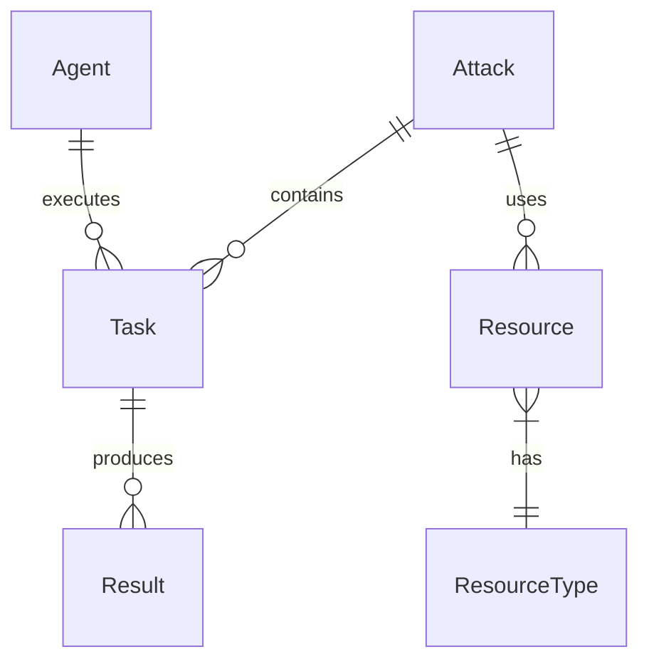

# System Components

This document details the core components of the CipherSwarm system.

## FastAPI Backend

The backend is built with FastAPI, providing a high-performance, async-first API server.

### Key Features

- Async request handling
- OpenAPI 3.0.1 specification
- Type-safe request/response validation
- Server-Sent Events (SSE) for real-time notifications
- JWT-based authentication
- Rate limiting and security features

### API Structure

```python
app/
├── api/
│   ├── v1/
│   │   ├── client/  # Agent API
│   │   ├── web/     # Web UI API
│   │   └── control/ # Control API
│   └── deps.py      # Dependencies
├── core/            # Core functionality
├── models/          # Database models
└── schemas/         # Pydantic schemas
```

## Database Layer

PostgreSQL is used as the primary data store, with SQLAlchemy as the ORM.

### Key Models

```python
# Agent Model
class Agent(Base):
    id: UUID
    name: str
    status: AgentStatus
    capabilities: JSON
    last_seen: datetime
    token_hash: str

# Attack Model
class Attack(Base):
    id: UUID
    name: str
    type: AttackType
    config: JSON
    status: AttackStatus
    created_at: datetime
    updated_at: datetime

# Task Model
class Task(Base):
    id: UUID
    attack_id: UUID
    agent_id: UUID
    status: TaskStatus
    progress: float
    started_at: datetime
    completed_at: datetime
```

### Database Design



## Caching Layer

Cashews is used for caching with in-memory backend by default, with optional Redis backend for production.

### Cache Structure

```python
# Key Patterns
f"agent:{agent_id}:status"      # Agent status
f"task:{task_id}:progress"      # Task progress
f"attack:{attack_id}:summary"   # Attack summary
f"user:{user_id}:session"       # User session

# TTL Settings
AGENT_STATUS_TTL = 300          # 5 minutes
TASK_PROGRESS_TTL = 60          # 1 minute
ATTACK_SUMMARY_TTL = 600        # 10 minutes
SESSION_TTL = 86400            # 24 hours
```

## Real-time Event System

Server-Sent Events (SSE) provide real-time notifications to web clients.

### Event Broadcasting

```python
# Event Service (implemented)
from app.core.services.event_service import EventService

# Broadcast events
await event_service.broadcast("campaigns", {"trigger": "refresh"})
await event_service.broadcast("agents", {"trigger": "refresh"})
await event_service.broadcast("toasts", {"message": "Hash cracked!"})
```

### SSE Endpoints

```python
# SSE Routes (implemented)
GET /api/v1/web/live/campaigns  # Campaign updates
GET /api/v1/web/live/agents     # Agent status updates  
GET /api/v1/web/live/toasts     # Toast notifications
```

## Storage Layer

MinIO provides S3-compatible object storage for attack resources.

### Bucket Structure (planned)

```
cipherswarm/
├── wordlists/       # Dictionary files
├── rules/           # Hashcat rules
├── masks/           # Mask patterns
├── results/         # Cracking results
└── temp/           # Temporary storage
```

### File Management (**planned, not implemented**)

```python
# NOTE: The StorageManager class is not present in the codebase. This is a planned interface.
class StorageManager:
    async def upload_wordlist(self, file: UploadFile) -> str:
        """Upload a wordlist file to MinIO."""

    async def get_presigned_url(self, path: str) -> str:
        """Generate presigned URL for file download."""

    async def verify_checksum(self, path: str, md5: str) -> bool:
        """Verify file integrity."""
```

## Task Queue

Celery is planned, not implemented. No Celery app or tasks exist in the codebase.

### Queue Configuration (**planned**)

```python
# Celery Configuration (planned, not in codebase)
CELERY_BROKER_URL = "redis://localhost:6379/1"
CELERY_RESULT_BACKEND = "redis://localhost:6379/1"
CELERY_TASK_SERIALIZER = "json"
CELERY_RESULT_SERIALIZER = "json"
CELERY_ACCEPT_CONTENT = ["json"]
CELERY_TIMEZONE = "UTC"
CELERY_ENABLE_UTC = True
```

### Task Types (**planned**)

```python
# No Celery tasks are implemented yet. The following are planned examples.
@celery.task
async def process_attack_results(task_id: UUID):
    """Process and aggregate attack results."""

@celery.task
async def cleanup_expired_tasks():
    """Clean up expired tasks and resources."""

@celery.task
async def monitor_agent_health():
    """Check agent health and update status."""
```

## Web Interface

The web interface is built with HTMX and Flowbite components (**partial/in-progress**).

### UI Components

```html
<!-- Agent Status Card -->
<div
    class="agent-card"
    hx-get="/api/v1/web/agents/{id}/status"
    hx-trigger="every 5s"
>
    <div class="status-indicator"></div>
    <div class="agent-info"></div>
    <div class="agent-actions"></div>
</div>

<!-- Task Progress -->
<div
    class="task-progress"
    hx-get="/api/v1/web/tasks/{id}/progress"
    hx-trigger="every 2s"
>
    <div class="progress-bar"></div>
    <div class="task-stats"></div>
</div>
```

### Real-time Updates

```javascript
// SSE Connection (implemented)
const eventSource = new EventSource("/api/v1/web/live/campaigns");
eventSource.onmessage = (event) => {
    const data = JSON.parse(event.data);
    if (data.trigger === "refresh") {
        // Refresh campaign data
        refreshCampaigns();
    }
};

// Event Handlers
ws.onmessage = (event) => {
    const data = JSON.parse(event.data);
    updateUI(data);
};

// UI Updates
function updateUI(data) {
    if (data.type === "task_progress") {
        updateTaskProgress(data);
    } else if (data.type === "agent_status") {
        updateAgentStatus(data);
    }
}
```

### Rate Limiting (**not implemented**)

```python
# Rate Limit Configuration (planned, not in codebase)
RATE_LIMITS = {
    "login": "5/minute",
    "register": "3/minute",
    "api": "100/minute",
    "agent": "1000/minute"
}

# Rate Limit Implementation (planned, not in codebase)
@app.middleware("http")
async def rate_limit_middleware(request: Request, call_next):
    """Apply rate limiting to requests."""
```

For more detailed information about specific aspects, see:

- [API Documentation](api.md)
- [Database Schema](database.md)
- [Security Guide](security.md)
