# CipherSwarm Architecture Diagrams

This document contains Mermaid diagrams illustrating the CipherSwarm system architecture.

---

## System Architecture Overview

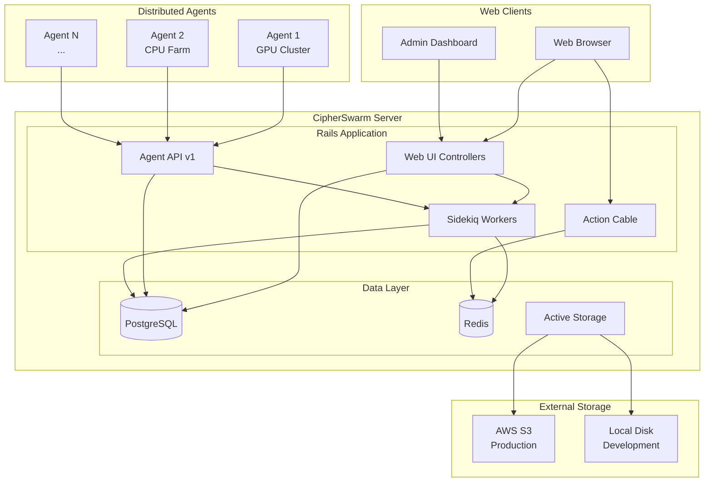

---

## Domain Model

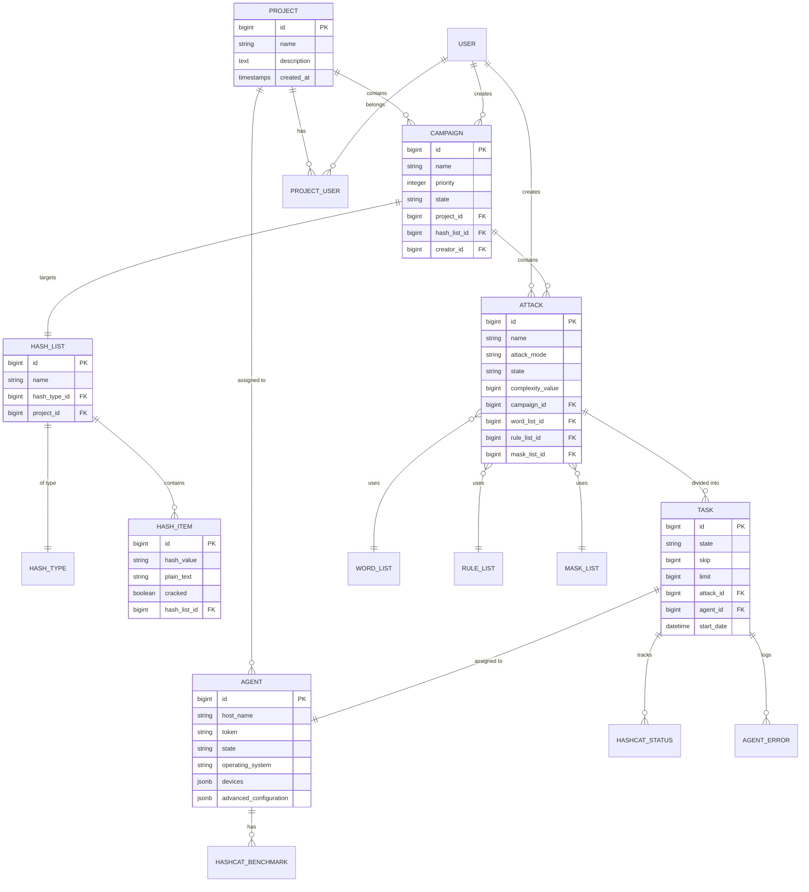

---

## State Machine Diagrams

### Agent State Machine

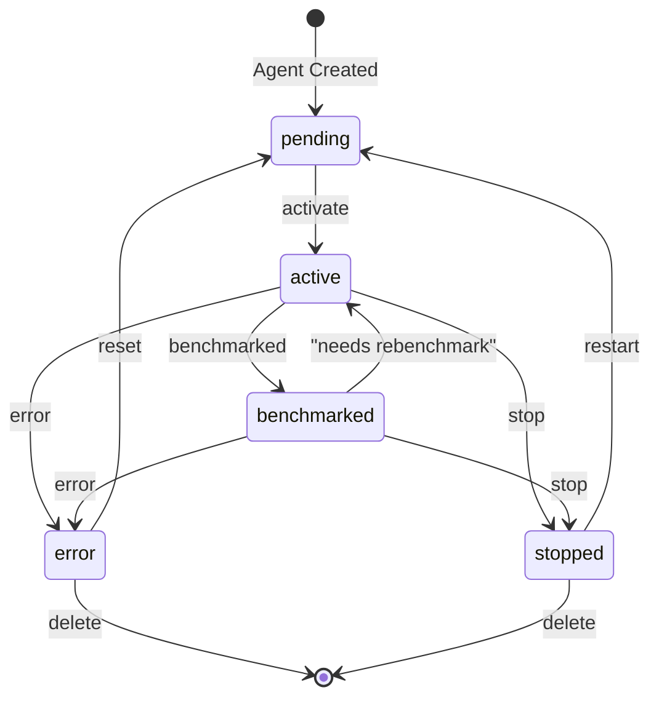

### Attack State Machine

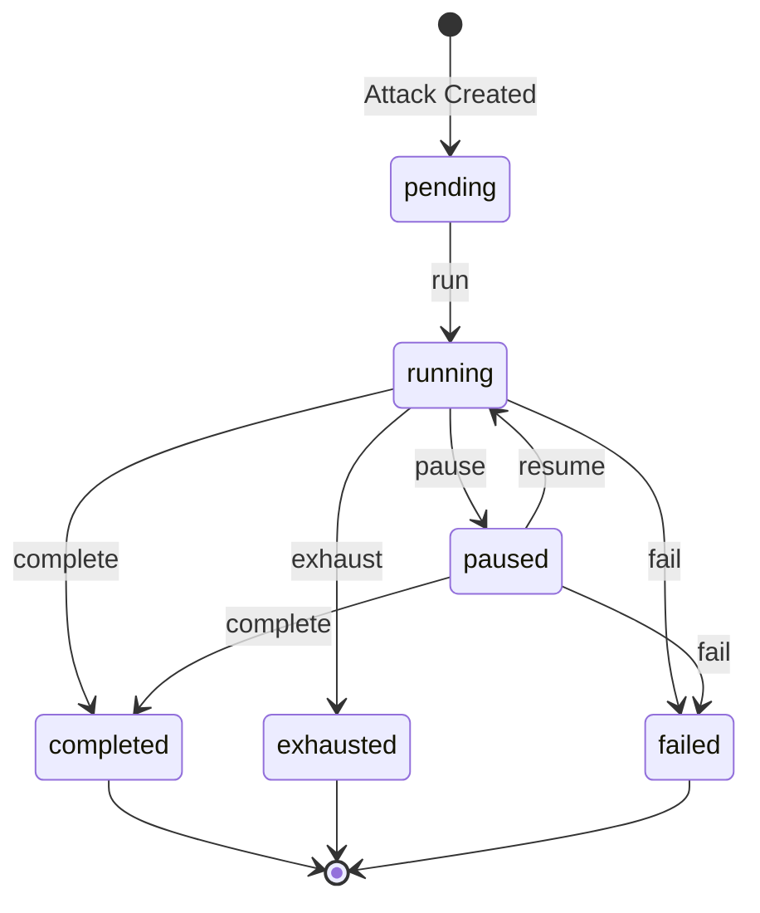

### Task State Machine

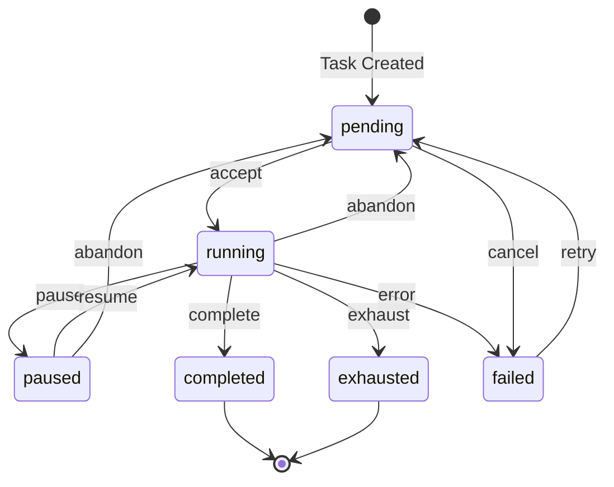

---

## Sequence Diagrams

### Agent Task Workflow

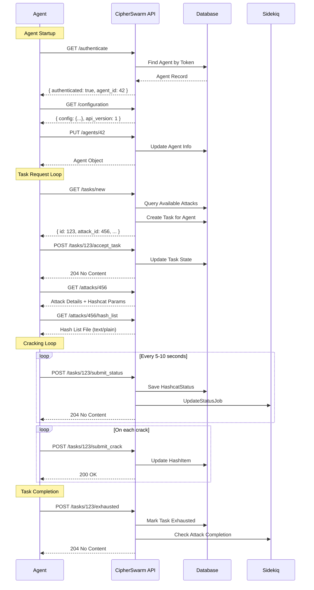

### Campaign Creation Flow

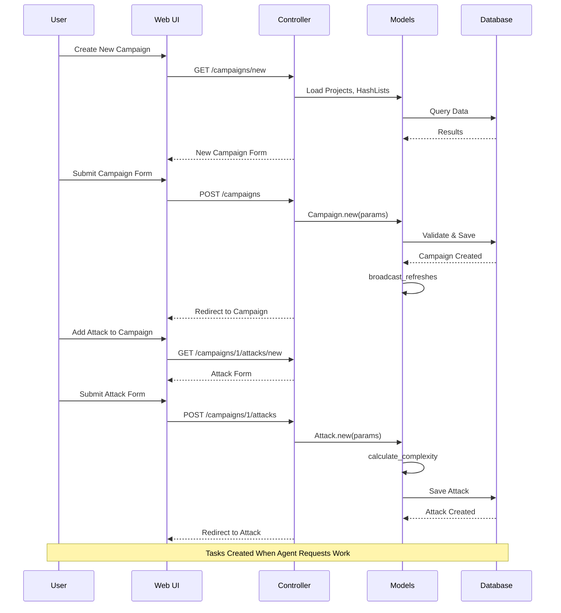

### Task Preemption Flow

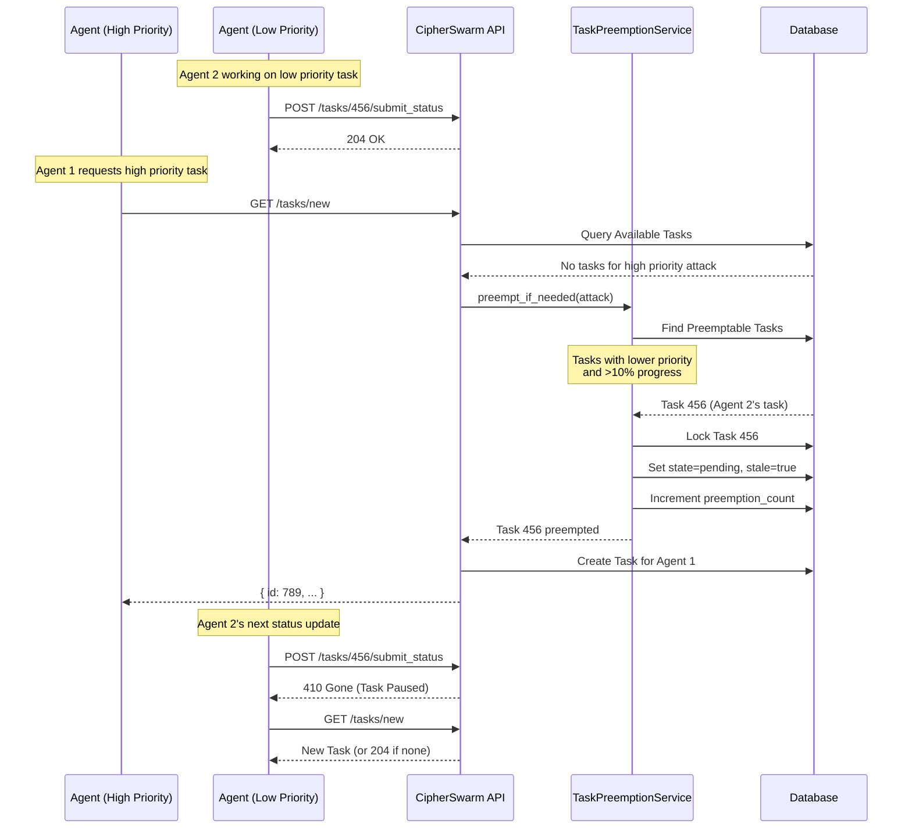

---

## Component Architecture

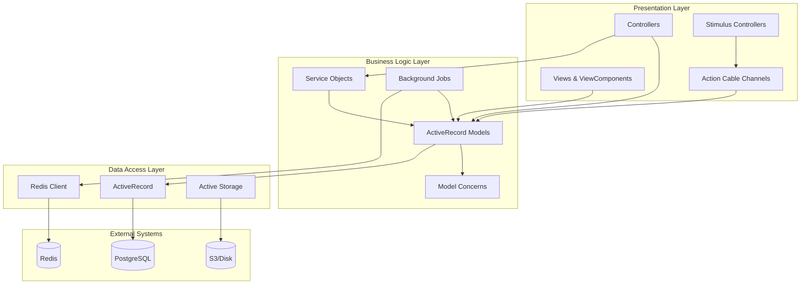

---

## Deployment Architecture

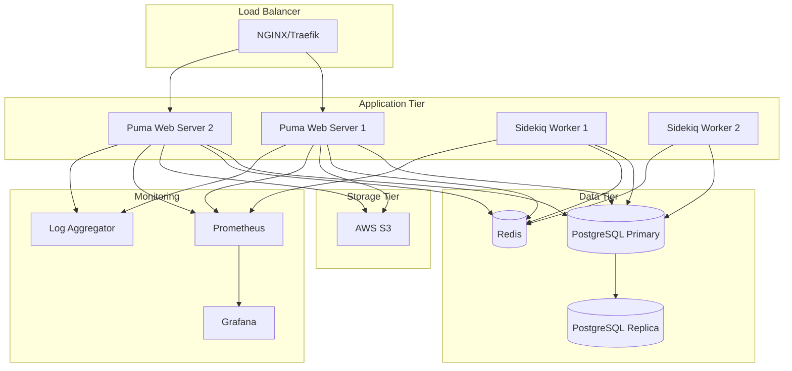

---

## Data Flow

### Hash Cracking Data Flow

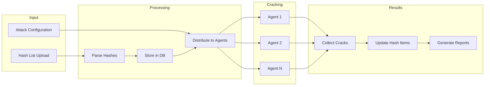

---

## API Request Flow

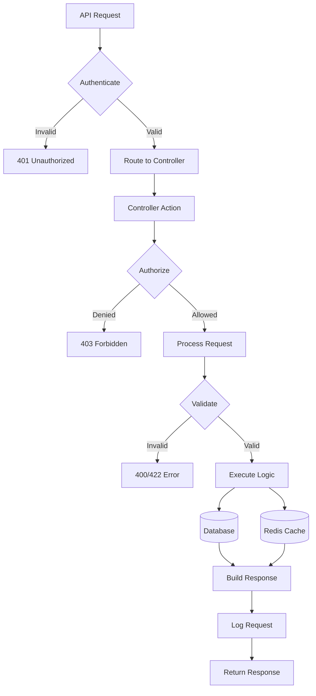

---

## Priority-Based Task Distribution

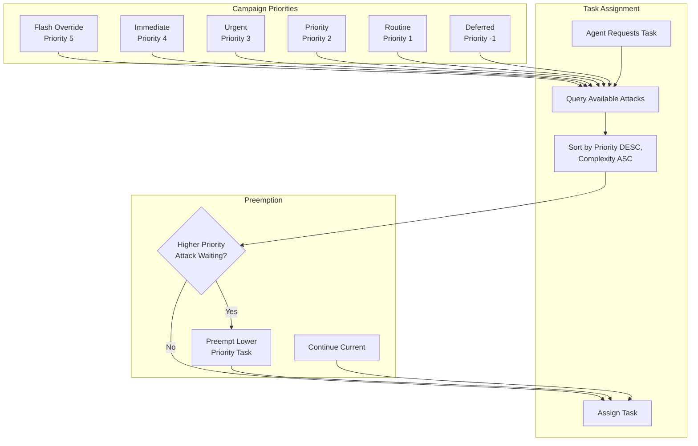
