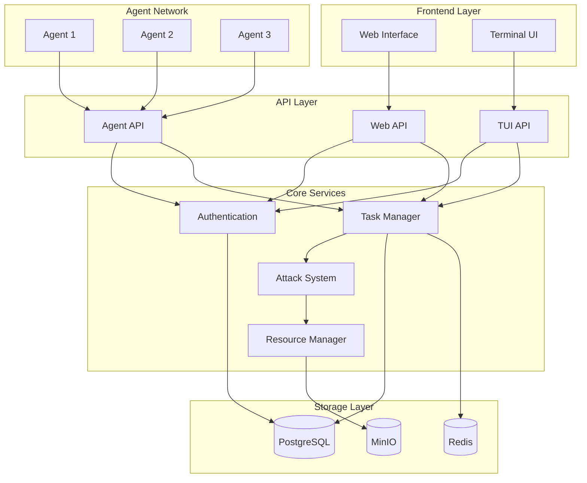
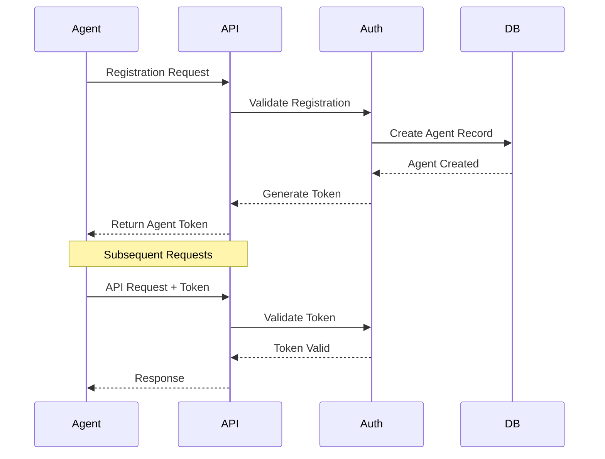
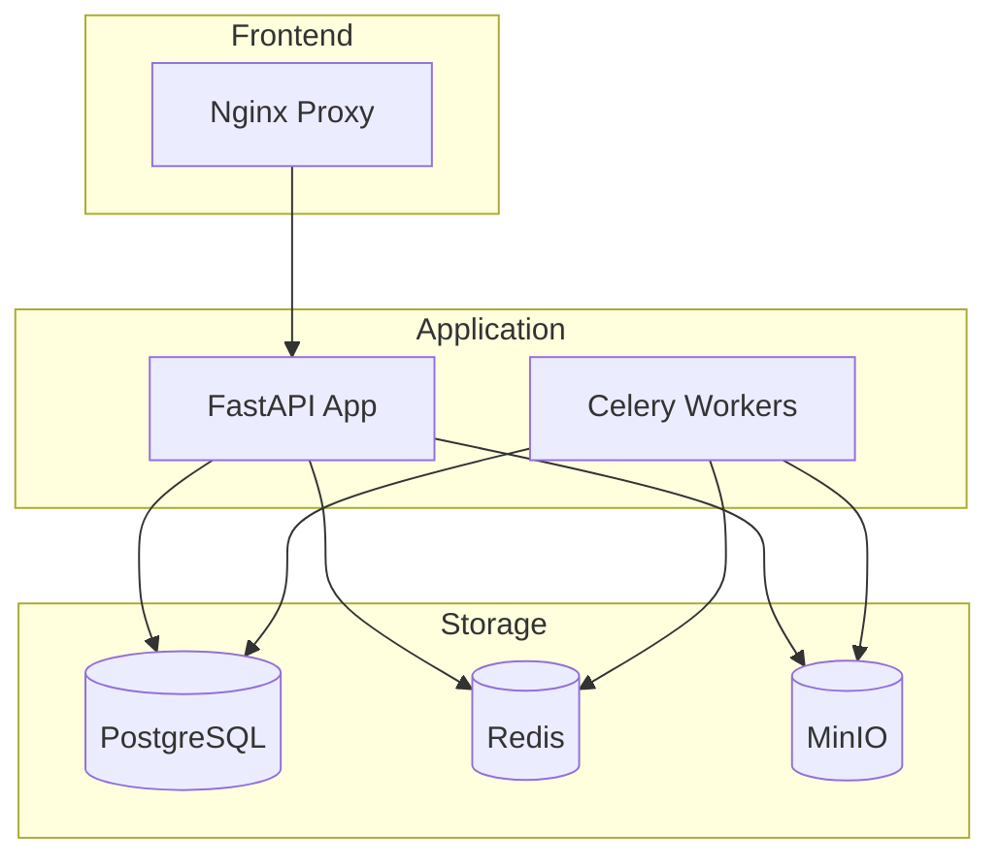

# Architecture Overview

CipherSwarm is designed as a distributed system that coordinates password cracking tasks across multiple agents. This document provides a high-level overview of the system architecture and its key components.

## System Architecture

## Core Components

### 1. Frontend Layer

#### Web Interface

-   Built with HTMX for dynamic updates (**partial/in-progress**)
-   Flowbite components for UI elements (**partial/in-progress**)
-   Server-side rendered templates
-   Real-time task monitoring (**planned**)
-   Attack configuration interface

#### Terminal UI (Planned)

-   Command-line interface for management
-   Real-time monitoring capabilities
-   Batch operation support
-   Scriptable workflows

### 2. API Layer

#### Agent API

-   OpenAPI 3.0.1 specification
-   JWT authentication
-   Task distribution
-   Result collection
-   Resource management

#### Web API

-   Powers the HTMX interface
-   Campaign management
-   Attack configuration
-   Agent monitoring
-   Results visualization

#### TUI API

-   Command-line client interface
-   Batch operations
-   Monitoring endpoints
-   Performance metrics

### 3. Core Services

#### Task Manager

-   Task creation and assignment
-   Progress monitoring
-   Result collection
-   Error handling
-   Load balancing

#### Attack System

-   Attack configuration
-   Resource distribution
-   Progress tracking
-   Result aggregation

#### Authentication

-   JWT-based authentication
-   Agent verification
-   User management
-   Permission control

#### Resource Manager

-   Wordlist management
-   Rule management
-   Mask pattern management
-   Resource distribution

### 4. Storage Layer

#### PostgreSQL Database

-   Agent information
-   Task data
-   Attack configurations
-   Results storage

#### Redis Cache

-   Session management (**planned**)
-   Task queues (**planned**)
-   Real-time updates (**planned**)
-   Rate limiting (**planned**)

#### MinIO Object Storage

-   Attack resources (**partial/stub only**)
-   Wordlists (**partial/stub only**)
-   Rule files (**partial/stub only**)
-   Result files (**partial/stub only**)

### 5. Agent Network

#### Agent Components

-   Hashcat integration
-   Resource caching
-   Progress reporting
-   Error handling
-   Health monitoring

## Security Architecture

### Authentication Flow

### Security Features

1. **API Security**

    - JWT-based authentication
    - Rate limiting
    - Request validation
    - HTTPS enforcement

2. **Agent Security**

    - Unique agent tokens
    - Secure resource downloads
    - Encrypted communication
    - Health verification

3. **Resource Security**
    - Access control
    - Resource verification
    - Secure distribution
    - Audit logging

## Deployment Architecture

### Container Structure

### Deployment Features

1. **Container Orchestration**

    - Docker Compose support
    - Service health checks
    - Automatic restarts
    - Volume management

2. **Scalability**

    - Horizontal scaling
    - Load balancing
    - Database replication
    - Cache distribution

3. **Monitoring**
    - Performance metrics
    - Resource usage
    - Error tracking
    - Health monitoring

## Performance Considerations

1. **Task Distribution**

    - Efficient workload distribution (**planned**)
    - Agent capability awareness (**planned**)
    - Dynamic load balancing (**planned**)
    - Progress monitoring (**planned**)

2. **Resource Management**

    - Resource caching (**planned**)
    - Efficient distribution (**planned**)
    - Bandwidth optimization (**planned**)
    - Storage optimization (**planned**)

3. **Database Optimization**
    - Query optimization
    - Index management
    - Connection pooling
    - Cache utilization (**planned**)

## Future Enhancements

1. **Planned Features**

    - Advanced analytics
    - Machine learning integration
    - Enhanced reporting
    - Automated optimization

2. **Scalability Improvements**

    - Multi-region support
    - Enhanced load balancing
    - Improved resource distribution
    - Advanced caching strategies

3. **Security Enhancements**
    - Advanced authentication
    - Enhanced monitoring
    - Improved auditing
    - Zero-trust architecture
