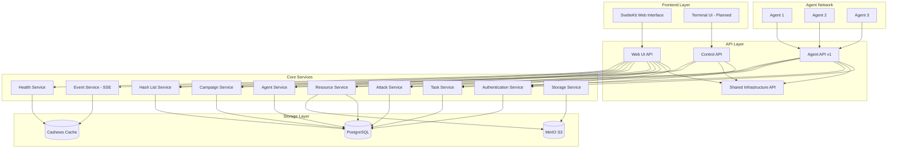
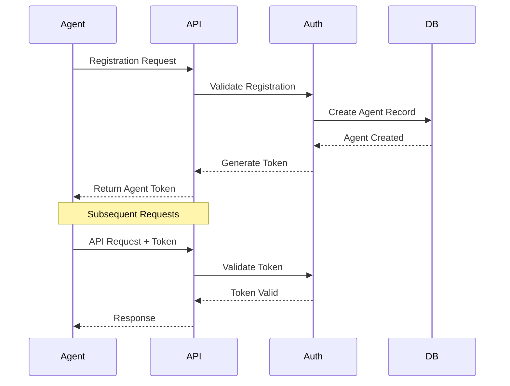
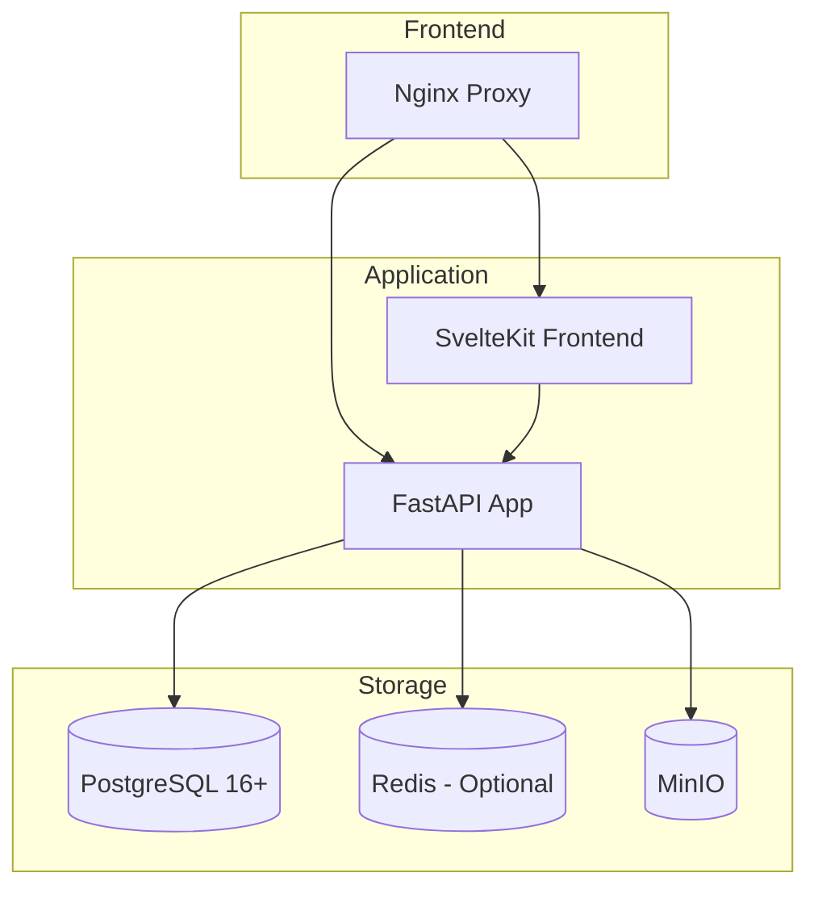

# Architecture Overview

CipherSwarm is designed as a distributed system that coordinates password cracking tasks across multiple agents. This document provides a high-level overview of the system architecture and its key components.

## System Architecture



## Core Components

### 1. Frontend Layer

#### SvelteKit Web Interface

- Built with SvelteKit for modern, reactive UI
- Shadcn-Svelte component library for consistent design
- Server-Sent Events (SSE) for real-time updates
- Responsive design with dark mode support
- Type-safe API integration with Zod validation
- Modal-based forms using Superforms

**Key Features:**

- Campaign and attack management interface
- Real-time agent monitoring dashboard
- Resource browser with inline editing
- Hash list management
- User and project administration
- Health monitoring and system status

#### Terminal UI (Planned)

- Command-line interface for management
- Real-time monitoring capabilities
- Batch operation support
- Scriptable workflows

### 2. API Layer

The API layer consists of four distinct interfaces, each serving different client types:

#### Agent API (`/api/v1/client/*`)

- **Specification**: OpenAPI 3.0.1 (locked to `contracts/v1_api_swagger.json`)
- **Authentication**: Bearer token authentication
- **Purpose**: Used by distributed CipherSwarm agents
- **Endpoints**:
  - `/api/v1/client/agents/*` - Agent lifecycle management
  - `/api/v1/client/attacks/*` - Attack configuration retrieval
  - `/api/v1/client/tasks/*` - Task management
  - `/api/v1/client/crackers/*` - Cracker binary updates
  - `/api/v1/client/configuration` - Agent configuration
  - `/api/v1/client/authenticate` - Agent authentication

#### Web UI API (`/api/v1/web/*`)

- **Purpose**: Powers the SvelteKit dashboard
- **Authentication**: JWT-based with refresh tokens
- **Features**: Pagination, filtering, real-time updates via SSE
- **Endpoints**:
  - `/api/v1/web/auth/*` - Authentication and user management
  - `/api/v1/web/campaigns/*` - Campaign management
  - `/api/v1/web/attacks/*` - Attack configuration
  - `/api/v1/web/agents/*` - Agent monitoring and control
  - `/api/v1/web/resources/*` - Resource management
  - `/api/v1/web/hash_lists/*` - Hash list management
  - `/api/v1/web/uploads/*` - Crackable file uploads
  - `/api/v1/web/live/*` - SSE event streams
  - `/api/v1/web/health/*` - System health monitoring
  - `/api/v1/web/modals/*` - UI helper endpoints

#### Control API (`/api/v1/control/*`)

- **Purpose**: Future Python TUI/CLI client interface
- **Authentication**: API key-based authentication
- **Error Format**: RFC9457 Problem Details for HTTP APIs
- **Endpoints**:
  - `/api/v1/control/campaigns/*` - Campaign operations
  - `/api/v1/control/hash_guess/*` - Hash type detection

#### Shared Infrastructure API

- **Purpose**: Common endpoints used by multiple interfaces
- **Examples**: `/api/v1/users`, `/api/v1/resources/{id}/download`
- **Features**: User management, resource access, file downloads

### 3. Core Services

The service layer provides business logic and data access abstraction:

#### Campaign Service

- Campaign lifecycle management
- Attack orchestration
- Progress tracking and metrics
- State management (draft, active, archived)

#### Attack Service

- Attack configuration and validation
- Keyspace estimation and complexity scoring
- Resource linkage validation
- Performance monitoring

#### Agent Service

- Agent registration and authentication
- Health monitoring and benchmarking
- Device management and configuration
- Performance data collection

#### Resource Service

- File upload and storage management
- Resource type validation and metadata
- Line-oriented editing for masks/rules/wordlists
- Presigned URL generation for secure downloads

#### Task Service

- Task creation and distribution
- Progress monitoring and result collection
- Error handling and retry logic
- Agent assignment and load balancing

#### Hash List Service

- Hash collection management
- Hash item tracking and status
- Export functionality (CSV, TSV)
- Project-scoped access control

#### Event Service

- Server-Sent Events (SSE) broadcasting
- Real-time notification system
- Project-scoped event filtering
- In-memory event distribution

#### Health Service

- System component monitoring
- Performance metrics collection
- Service availability checking
- Cached health status reporting

#### Storage Service

- MinIO S3-compatible storage integration
- Presigned URL management
- File verification and integrity checking
- Bucket and object lifecycle management

### 4. Storage Layer

#### PostgreSQL Database

**Core Models:**

- `Project` - Top-level organizational boundary
- `Campaign` - Coordinated cracking attempts
- `Attack` - Specific cracking configurations
- `Task` - Discrete work units for agents
- `HashList` - Collections of target hashes
- `HashItem` - Individual hash entries
- `Agent` - Registered client systems
- `User` - Authenticated system users
- `AttackResourceFile` - Reusable attack resources
- `CrackResult` - Successfully cracked hashes

**Relationships:**

- Projects contain campaigns, users, and agents
- Campaigns target hash lists through multiple attacks
- Attacks generate tasks assigned to agents
- Agents report results and performance data

#### Cashews Cache

- **Default Backend**: In-memory for development
- **Production Backend**: Redis (optional)
- **Configuration**: `CACHE_CONNECT_STRING` setting
- **TTL Strategy**: Short-lived caching (≤ 60s) for health data
- **Key Patterns**: Prefixed by service type

#### MinIO Object Storage

- **Purpose**: S3-compatible storage for attack resources
- **Bucket Structure**:
  - `wordlists/` - Dictionary attack word lists
  - `rules/` - Hashcat rule files
  - `masks/` - Mask pattern files
  - `charsets/` - Custom charset definitions
  - `temp/` - Temporary storage for uploads
- **Security**: Presigned URLs, access control, encryption at rest
- **Integration**: Managed through Storage Service

### 5. Agent Network

#### Agent Components

- Hashcat integration for password cracking
- Resource caching and management
- Real-time progress reporting
- Error handling and recovery
- Health monitoring and benchmarking
- Device capability reporting

## Security Architecture

### Authentication Flow



### Security Features

1. **API Security**
   - JWT-based authentication for web users
   - Bearer token authentication for agents
   - API key authentication for TUI clients
   - Rate limiting and request validation
   - HTTPS enforcement

2. **Agent Security**
   - Unique agent tokens with format `csa_{agent_id}_{random}`
   - Secure resource downloads via presigned URLs
   - Encrypted communication
   - Health verification and monitoring

3. **Resource Security**
   - Project-scoped access control
   - Resource verification and checksums
   - Secure distribution via MinIO
   - Audit logging for all operations

4. **Data Protection**
   - Project isolation for multi-tenancy
   - Hash data encryption
   - Secure credential storage
   - GDPR-compliant data handling

## Real-time Communication

### Server-Sent Events (SSE)

CipherSwarm uses SSE for real-time updates instead of WebSockets:

**Event Streams:**

- `/api/v1/web/live/campaigns` - Campaign/attack/task updates
- `/api/v1/web/live/agents` - Agent status and performance
- `/api/v1/web/live/toasts` - Crack results and notifications

**Event Format:**

```json
{
  "trigger": "refresh",
  "timestamp": "2024-01-01T12:00:00Z",
  "target": "campaign",
  "id": 123
}
```

**Advantages:**

- Simpler architecture (no Redis dependency)
- Better reliability (browser auto-reconnection)
- HTTP-based (works through proxies)
- Perfect for one-way notifications

## Deployment Architecture

### Container Structure



### Deployment Features

1. **Container Orchestration**
   - Docker Compose support
   - Service health checks
   - Automatic restarts
   - Volume management
   - Environment-based configuration

2. **Scalability**
   - Horizontal scaling support
   - Load balancing via Nginx
   - Database connection pooling
   - Cache distribution
   - Resource storage scaling

3. **Monitoring**
   - Health check endpoints
   - Performance metrics collection
   - Error tracking and logging
   - System status monitoring

## Development Workflow

### Technology Stack

- **Backend**: FastAPI with Python 3.13
- **Frontend**: SvelteKit with TypeScript
- **Database**: PostgreSQL 16+ with SQLAlchemy ORM
- **Cache**: Cashews with memory/Redis backends
- **Storage**: MinIO S3-compatible object storage
- **Authentication**: JWT tokens and bearer authentication
- **Real-time**: Server-Sent Events (SSE)
- **Testing**: Pytest with comprehensive test coverage
- **Package Management**: uv for Python dependencies

### API Versioning Strategy

- **Agent API v1**: Locked to OpenAPI 3.0.1 specification
- **Web UI API**: FastAPI-native with breaking change support
- **Control API**: RFC9457 error format compliance
- **Future versions**: Independent versioning per API interface

### Quality Assurance

- Type checking with mypy
- Code linting with ruff
- Automated testing with pytest
- Integration testing for all APIs
- Contract testing for Agent API compliance
- Security scanning and vulnerability assessment
