# 📘 CipherSwarm Phase 3 - Core User Flows (Dashboard + UI)

## 🛍️ Purpose

This document outlines the key user flows for CipherSwarm Phase 3, focusing on the real-time dashboard and core UI interactions. These flows ensure the SvelteKit-based frontend is tightly coupled to backend state transitions and agent orchestration logic.

---

## 👤 Roles and Assumptions

### Admin (Casbin: `super_user`)

* Full system access across all projects
* Can manage agents, resources, and user roles
* Can manage shared resources
* Can perform dangerous or irreversible actions (e.g., delete campaigns)

### Project Admin (Casbin: `project_admin`)

* Scoped to a specific project
* Can create and manage campaigns, tasks, and resources
* Can view and control agents within their project

### User (Casbin: `user`)

* Limited access
* Can view dashboards, progress, and results
* Can create campaigns and attacks using predefined resources
* Can create attacks with ephemeral resources
* May launch campaigns using predefined resources

---

## ✅ User Action Reference

The following list represents all discrete user-performable actions expected in CipherSwarm Phase 3. Each action either corresponds to a defined flow below or should be captured in upcoming UI/UX designs and backend endpoints.

### 🔐 Authentication & Session

* Log in using username/password
* Persist session across reloads
* Switch active project if multiple are available

### 🏁 Campaign Management

* View all campaigns (status, progress, summary)
* Create a new campaign (name, hashlist, sensitivity, description)
* Configure DAG (add/edit/remove attacks in ordered phases)
* Launch a campaign (triggers task/keyspace generation)
* Pause/resume a running campaign
* Delete or archive a campaign
* View campaign-level metrics and crack results

### ⚔️ Attack Configuration

* Add a new attack (Dictionary, Mask, Previous Passwords, etc.)
* Modify existing attack (via edit modal)
* Move attacks up/down in DAG order
* Duplicate or remove attacks
* Edit attack after launch with warning prompt (restarts attack)
* View complexity and estimated keyspace
* Use custom rule "modificators"
* Include dynamic wordlists (e.g., previous passwords)

### 🧠 DAG Awareness

* Visualize DAG ordering of attacks
* Understand attack dependencies
* Monitor execution status across DAG phases

### 🧱 Resource Management

* Upload new resource file (wordlist, rule, mask, charset)
* View list of uploaded resources
* Delete a resource file
* Edit inline (files <1MB)
* Use resource in attack config

### 👷 Agent Visibility & Control

* View all registered agents and their status
* View agent details (last seen, guess rate, task, config)
* Admin control: restart, disable GPU, deactivate agent

### 🔎 Monitoring & Feedback

* View dashboard cards (agents, hash rate, tasks, cracks)
* Observe real-time toasts on crack events
* View campaign/task progress bars
* Use expandable rows to drill into attacks

### 📈 Health & System Status

* View Redis, MinIO, PostgreSQL health
* View agent heartbeat and latency
* Retry or refresh failed services
* Admins see deeper diagnostics (WAL, queues)

### 📤 Export / Save / Load

* Export cracked hashes
* Export/import campaign templates (JSON)
* Save/load predefined campaign setups
* Reset attack list to defaults

---

## 🔐 Flow 1: Login and Project Selection

**Actors:** Admin, Project Admin, User
**Triggers:** Landing at `/dashboard`

1. User logs in with username/password or valid session cookie
2. Backend returns list of projects user has access to
3. If more than one, user selects project
4. Project is stored in local session; however, the dashboard is not scoped to a single project. Users can see all system activity across all projects. For campaigns marked as sensitive, the campaign name is redacted for users without permission, but campaign state and presence are still visible to indicate system activity.

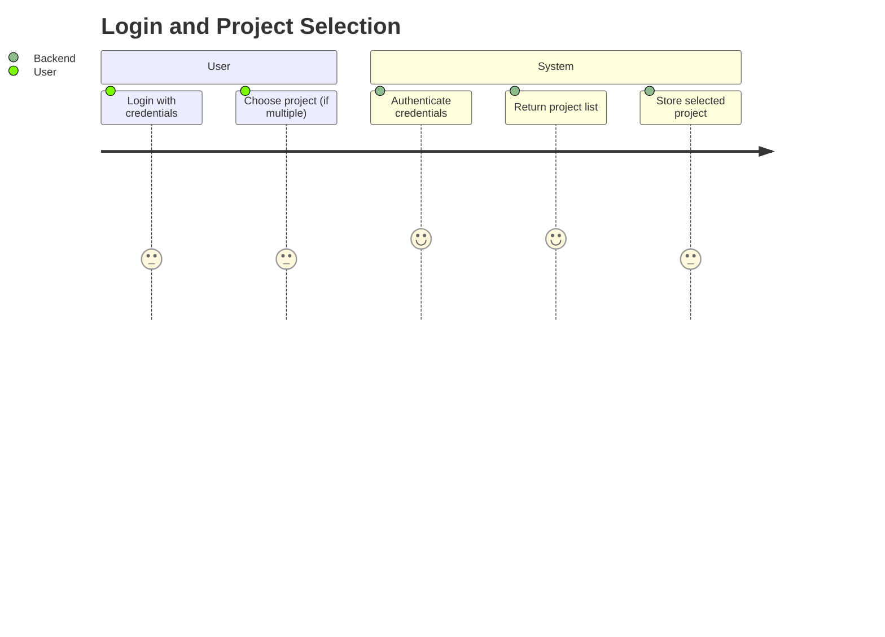

---

## 🦢 Flow 2: Real-Time Campaign Monitoring

**Actors:** All roles
**Triggers:** Dashboard load or WebSocket push

1. Frontend fetches:

   * Campaigns (running, completed)
   * Active agents
   * Task progress
2. Dashboard top cards update via WebSocket:

   * Online agents (card click opens Agent Sheet)
   * Running tasks
   * Recently cracked hashes
   * System hash rate (8hr trend)
3. Campaign rows update:

   * Progress bars
   * State icons (running, completed, error, paused)
   * Attack summary and ETA
4. User expands campaign for attack-level detail

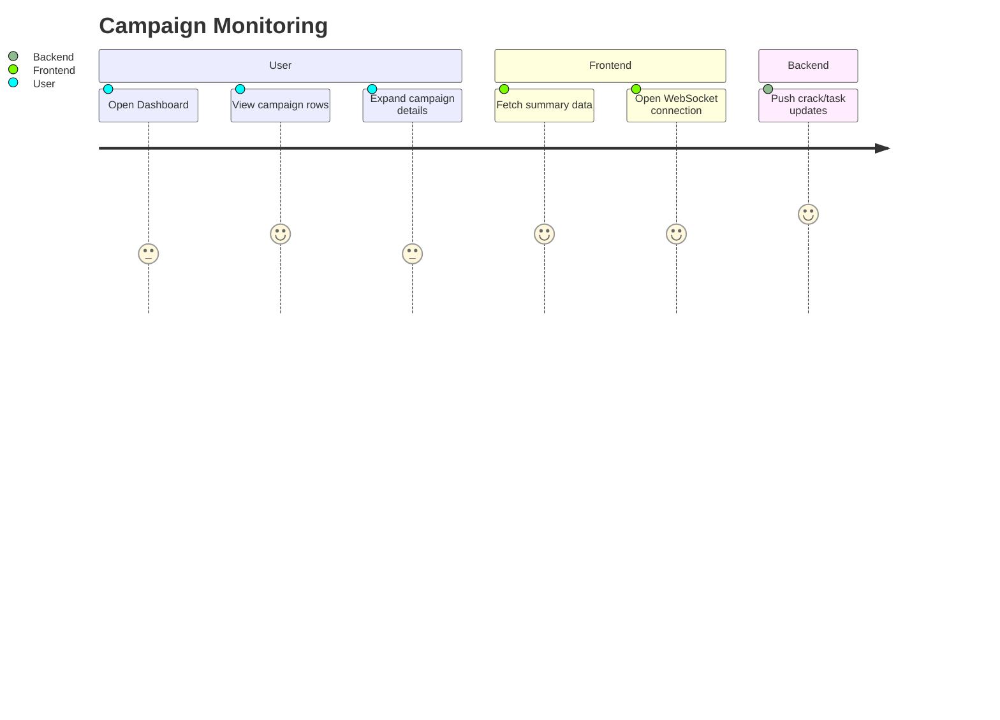

---

## 🚀 Flow 3: Launch Campaign Wizard

**Actors:** User, Project Admin, Admin
**Triggers:** Click "New Campaign"

1. **User clicks** the `Campaigns` icon in the sidebar (collapsed or expanded), then clicks the `New Campaign` button — triggers `modal dialog` overlay.

2. **Hashlist Selection Step:**

   * Toggle between upload vs. select mode using a radio button
   * If uploading: file picker uses MinIO upload + spinner → success toast.
   * If selecting existing: dropdown of available hashlists.

3. **Campaign Metadata Step:**

   * User enters name, optional description, and toggles DAG support.
   * When DAG is enabled, campaign scheduling changes: no attack from a later DAG phase will be assigned to any agent until all attacks from the earlier phases are fully completed, even if other agents are idle.
   * Form uses standard text inputs, checkbox. Upon completion, the modal closes and the user is taken to the campaign editor to add attacks. A toast appears confirming the campaign has been created, and the editor screen scrolls or focuses to the attack configuration section. Smooth animation or fade-in is used to emphasize the transition without jarring the user.
     *(Transition to Campaign Editor page)*

4. **Add Attacks Step:**

   * On first load of a new campaign with no attacks, the Add Attack modal opens automatically after a short delay with a fade-in animation. This gently encourages configuration without jarring the user.
   * `Add Attack` button → attack editor modal opens.
   * User chooses attack type via radio buttons in a wizard step (options: Dictionary / Mask / Brute / Hybrid). Tabs are not used to reduce cognitive load and better fit the guided flow pattern.
   * Dropdowns for wordlist/rule/mask/charset.
   * Estimated keyspace is retrieved via the `/api/v1/web/attacks/estimate` endpoint, which returns a `keyspace` value (big int) and a `complexity_score` (1–5). The UI displays this using a dot rating (e.g., ●●●○○) with a tooltip indicating complexity level (e.g., Low, Medium, High).
   * Save adds attack to ordered list.

*(Attack modal closes and user returns to Campaign Editor)*

5. **Review and Launch:**

   * List summary of attacks with keyspace, order, and comments.
   * `Launch Campaign` → disables button + shows spinner.

6. **Backend Response:**

   * Campaign + attacks created.
   * Tasks are scheduled.
   * UI returns to Campaign list with toast: “Campaign launched.”

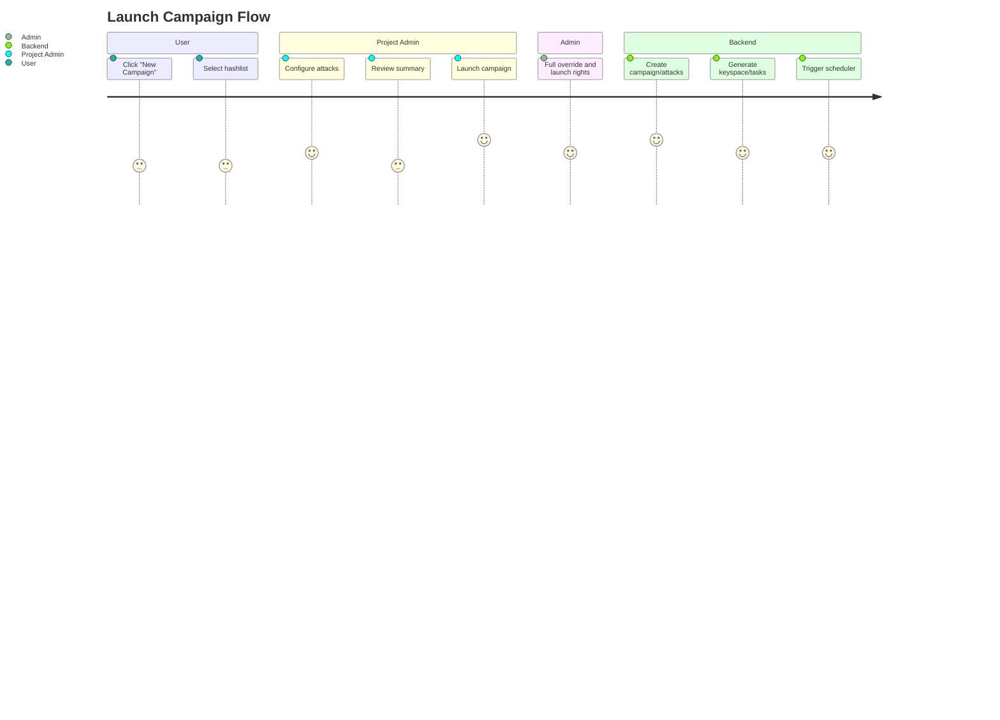

---

## 👷 Flow 4: Agent Sheet View

**Actors:** User,  Admin (manage)
**Triggers:** Click "Active Agents" card

1. Agent Sheet slides in from right
2. Each agent displayed with:

   * Status badge (🟢, 🟡, 🔴)
   * Last seen timestamp
   * Current task label
   * Guess rate + sparkline
3. Admins see expand button to:

   * View config and platform info
   * Toggle device use
   * Trigger restart or deactivate

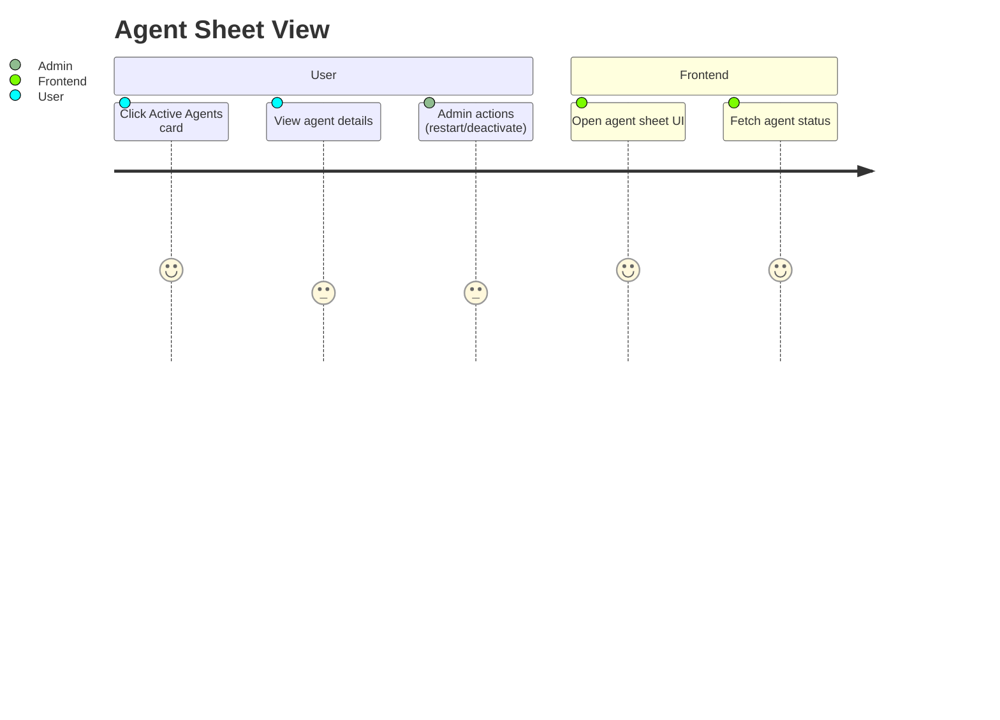

---

## 💥 Flow 5: Crack Notification → Results View

**Actors:** All roles
**Triggers:** Crack event

1. Toast appears ("3 new hashes cracked")
2. Clicking toast opens a filtered hash results view:

   * Regardless of origin, user is taken to a unified hash results view scoped to cracked items.
   * Cracked items include plaintext, timestamp, hashlist label, and attack info.
   * Export/download options available based on project permissions

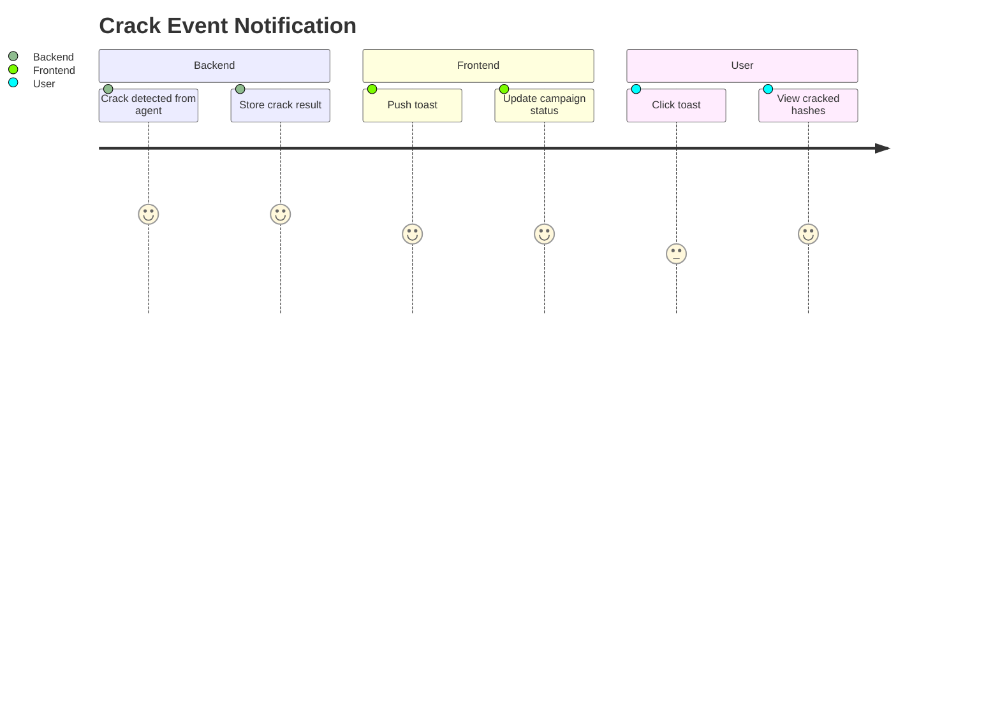

---

## 📁 Flow 6: Upload New Resource

**Actors:** Project Admin, User
**Triggers:** "Upload Resource" on Resources page

1. User selects file and type (wordlist, rule, mask, charset)
2. User enters metadata: label (required), description (optional), and sensitivity flag (checkbox)
3. Frontend uploads via presigned MinIO URL
4. Backend:

   * Validates and extracts metadata
   * Stores record with UUID, label, description, and sensitivity status
5. UI updates with new resource available, showing metadata in the resource list

### 🔐 Sensitivity and Access Behavior

| `project_id` | `sensitive` | Visibility                      | Editable By              |
| ------------ | ----------- | ------------------------------- | ------------------------ |
| null         | false       | Visible to all users            | Creator or Admin         |
| null         | true        | Redacted unless Admin           | Admin only               |
| Set          | false       | Visible to project members      | Project Admin or Creator |
| Set          | true        | Only visible to project members | Project Admin            |

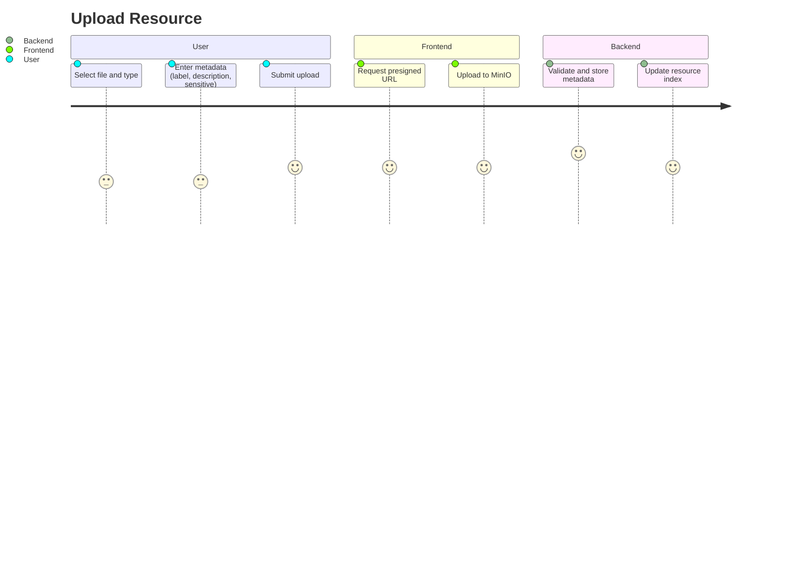

---

## 🧠 Flow 7: System Feedback Hooks

| Event                 | UI Update Location                  |
| --------------------- | ----------------------------------- |
| Crack Event           | Toast + Campaign Progress           |
| Agent Heartbeat       | Agent Sheet + Dashboard Card        |
| Campaign State Change | Campaign Row Status                 |
| Upload Complete       | Resources Page Table                |
| Failed Task           | Campaign Banner + Task Retry Button |

---

## 🆕 Flow 8: Pause / Resume / Delete Campaign

**Actors:** Admin
**Triggers:** User clicks dropdown on campaign row

1. User opens campaign row menu (⋮)
2. Options: Pause Campaign, Resume Campaign, Delete Campaign
3. On Pause:

   * Confirmation modal explains task pausing behavior
   * Backend updates task statuses to "paused"
   * UI shows paused icon and disables attacks
4. On Resume:

   * Backend reschedules any incomplete tasks
   * Progress bar resumes and dashboard updates
5. On Delete:

   * User receives warning about irreversible deletion
   * If confirmed, backend deletes campaign, attacks, and tasks
   * UI removes row and displays toast

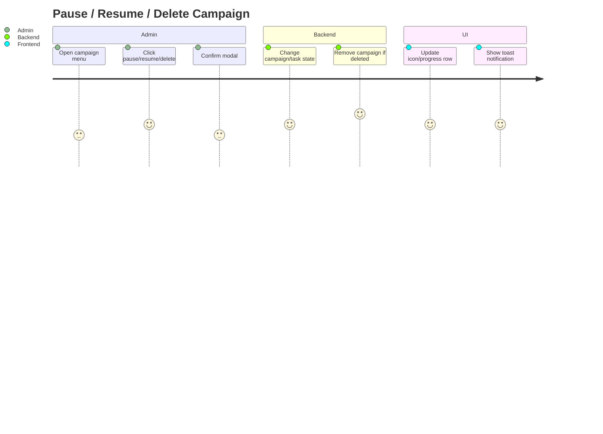

---

## 🆕 Flow 9: Agent Admin Controls

**Actors:** Admin only
**Triggers:** Click “⋮” or “Expand” on agent sheet

1. Admin expands agent row for controls
2. Options:

   * Restart agent
   * Deactivate agent
   * Disable individual devices (GPUs)
3. Actions:

   * Prompt for confirmation on restart/deactivation
   * Backend sends control command via API
   * UI updates with new agent status and log message

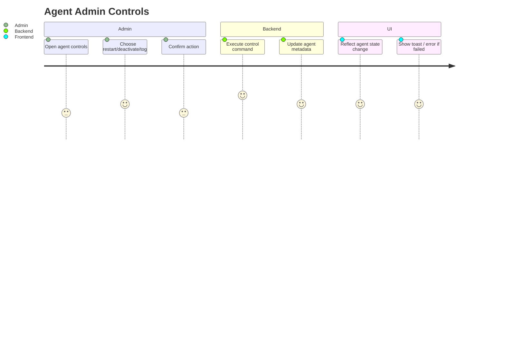

---

## 🆕 Flow 10: Inline Resource Editing (<1MB)

**Actors:** Admin, Analyst
**Triggers:** Click "Edit" icon on a small (<1MB) resource file

1. User clicks Edit button on file row (wordlist/rule/mask/charset)
2. Modal opens with text editor preloaded
3. Edits made and saved via `PUT` or `PATCH` request
4. Backend updates content in place
5. UI shows updated file contents on close

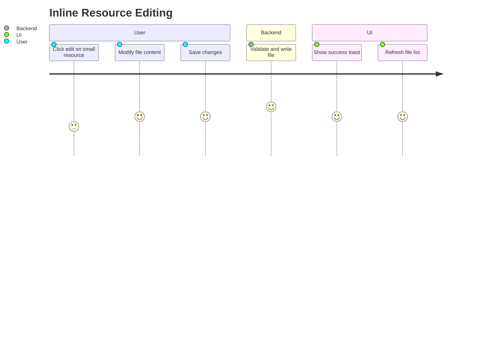

---

## 🆕 Flow 11: Advanced Metrics Panel (Admin Only)

**Actors:** Admin
**Triggers:** Click "Metrics" tab or sidebar item

1. Admin opens Advanced Metrics page
2. UI displays:

   * Redis queue latency / keyspace
   * MinIO bucket status (disk space, latency)
   * PostgreSQL WAL and sync lag
   * Agent runtime stats (uptime, failures, retries)
   * Peak crack rate history
3. All metrics update via WebSocket every 5–10s
4. Option to refresh manually or download snapshot

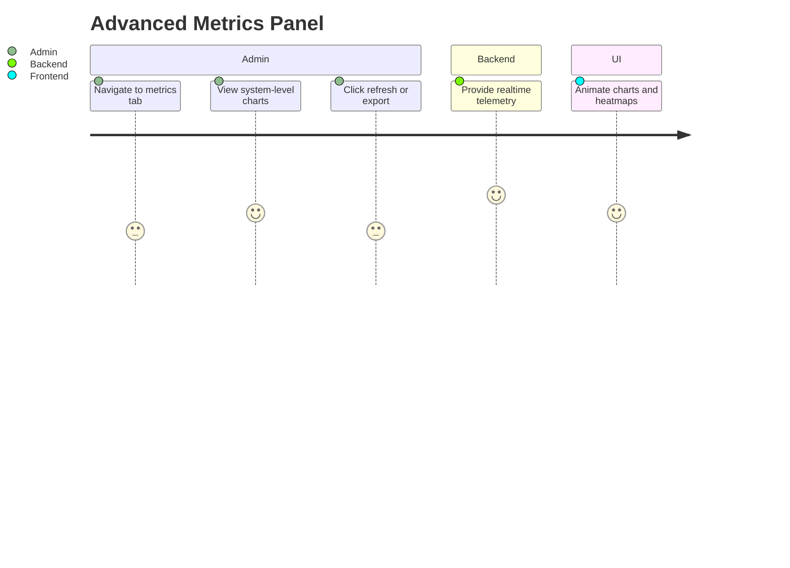

---

## 🆕 Flow 12: Export / Import Campaign Templates

**Actors:** Admin, Analyst
**Triggers:** Click “Export” or “Import” on Campaign Wizard

1. User clicks Export on existing campaign → downloads JSON
2. User clicks Import → file picker + format validation
3. Imported template pre-fills campaign wizard
4. User can still edit before launching

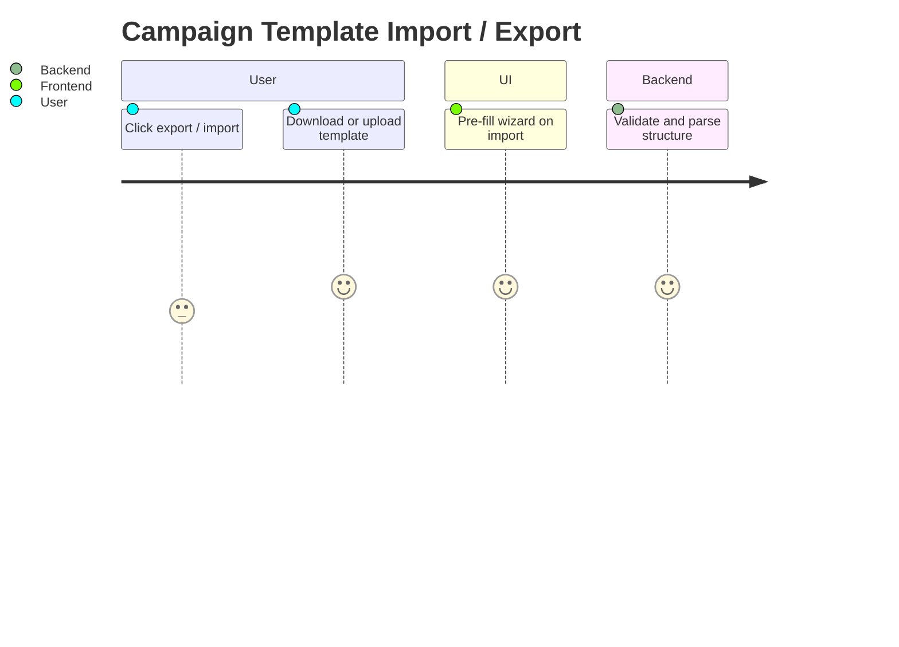

---

## 🆕 Flow 13: DAG Viewer / Editor UI

**Actors:** Admin, Analyst
**Triggers:** Add/edit attacks in Campaign Wizard

1. User sees attacks listed in DAG phase groups (1, 2, 3...)
2. UI provides drag-and-drop or up/down arrows to reorder attacks
3. Add Attack modal allows choosing DAG phase (default is last)
4. Visual DAG stepper (optional) shows execution order
5. Modifying order triggers backend warning if campaign is running.
6. When DAG is enabled, the campaign scheduler will not issue any tasks from later phases while an earlier-phase attack is still running on any agent. This ensures full phase isolation and honors defined sequencing, even if other agents are idle.

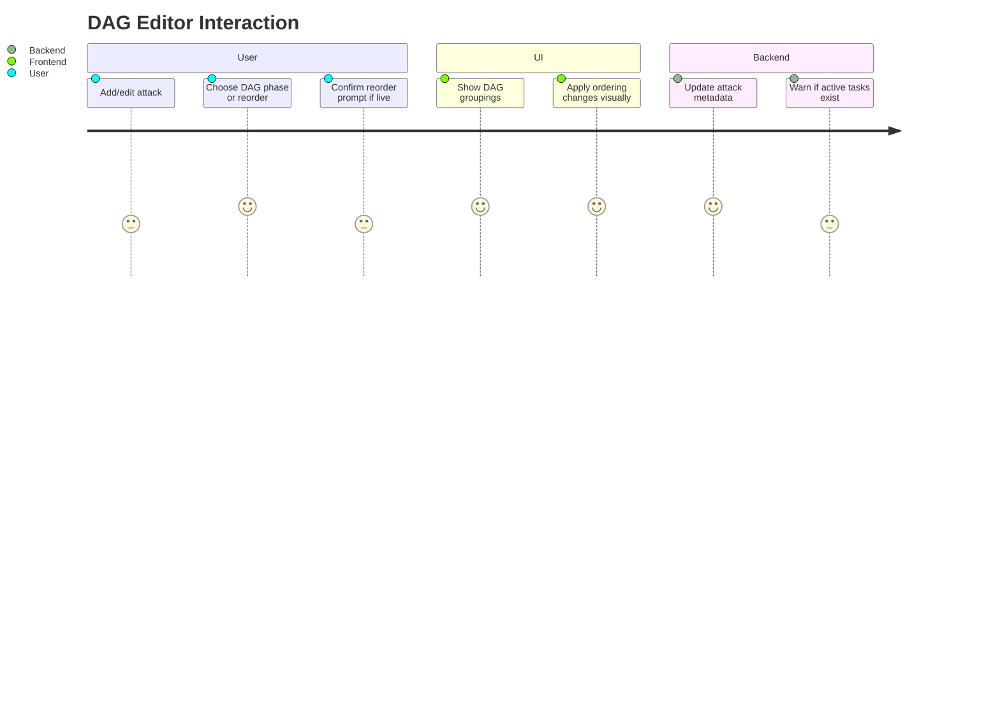

---

## 🆕 Flow 14: Rule Editor with learned.rules Overlay

**Actors:** Admin, Analyst
**Triggers:** Add/Edit Rule attack or learned.rule merge

1. User opens Rule Editor modal
2. File is shown in editable textbox (with syntax highlighting, if available)
3. “Overlay learned.rules” shows diff-style inline preview
4. User confirms whether to append, replace, or cancel
5. Modified rule saved as new ephemeral rule file

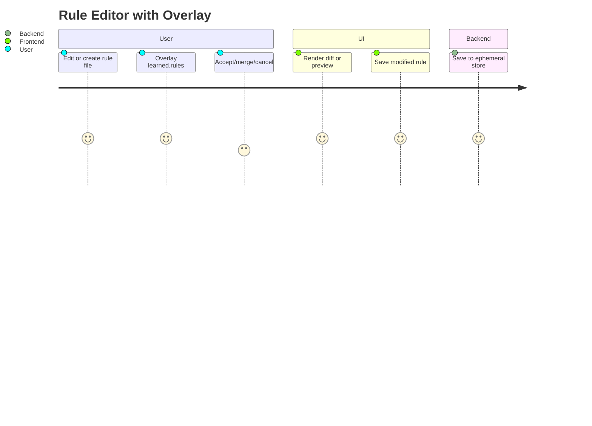

---

## 🗺️ Flow Mapping Table (Action → Flow → API/UI Components)

| Action                       | Flow ID | UI Elements                  | API Endpoint(s)                                   |
| ---------------------------- | ------- | ---------------------------- | ------------------------------------------------- |
| Log in / Select Project      | Flow 1  | Login form, project dropdown | `/auth/login`, `/projects/`                       |
| Dashboard updates            | Flow 2  | Campaign rows, top cards     | `/campaigns`, `/agents`, WebSocket `/status`      |
| Launch new campaign          | Flow 3  | Campaign Wizard, modal, tabs | `/campaigns`, `/attacks`, `/hashlists`            |
| View/edit agents             | Flow 4  | Agent Sheet, buttons         | `/agents`, `/agents/{id}/control`                 |
| Crack notifications          | Flow 5  | Toasts, cracked hash view    | WebSocket `/cracks`, `/hashlists/{id}/results`    |
| Upload resource              | Flow 6  | Upload modal, type selector  | `/resources/upload`, MinIO signed URL             |
| Pause/resume/delete campaign | Flow 8  | ⋮ menu, confirmation modals  | `/campaigns/{id}/pause`, `/resume`, `/delete`     |
| Agent control (admin)        | Flow 9  | Agent row actions            | `/agents/{id}/restart`, `/disable`, `/deactivate` |
| Inline file editing          | Flow 10 | Edit icon, modal editor      | `/resources/{id}`, `PUT` or `PATCH`               |
| Metrics dashboard            | Flow 11 | Metrics panel, charts        | `/metrics`, WebSocket `/system`                   |
| Export/import campaigns      | Flow 12 | Buttons in wizard            | `/campaigns/import`, `/campaigns/{id}/export`     |
| DAG phase editor             | Flow 13 | Reorder arrows, drag UI      | internal state only (during wizard)               |
| Rule diff overlay            | Flow 14 | Rule editor modal, diff view | `/rules/overlay`, `/rules`                        |

---

## 🆕 Flow 15: Manual Task Control (Pause / Reassign)

**Actors:** Admin only
**Triggers:** Expand attack → view tasks → click control icon

1. Admin drills down into a campaign and attack
2. For each task, admin sees action menu:

   * Pause Task
   * Reassign to Agent
3. On Pause:

   * Backend flags task as paused (if not already completed)
   * Agent receives cancel notification (if applicable)
   * UI updates task row with "paused" icon
4. On Reassign:

   * Modal shows list of compatible agents
   * Admin selects a new agent
   * Backend cancels original assignment, queues for new agent
   * UI reflects reassigned task state

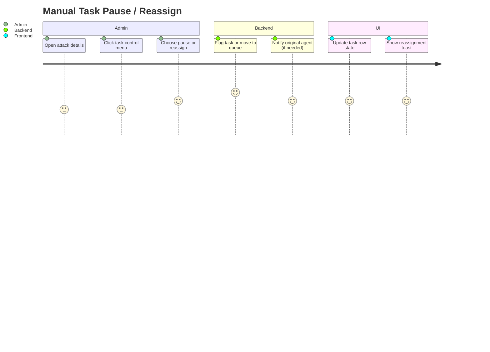

---

## 🧩 Notes for Skirmish

* Each flow should be mapped to API endpoints from `/api/v1/web/*`
* Use `fastapi_websocket_pubsub` for live updates
* Reuse Shadcn-Svelte components where possible
* Align with layout grid and status colors defined in `dashboard-ux.md`
