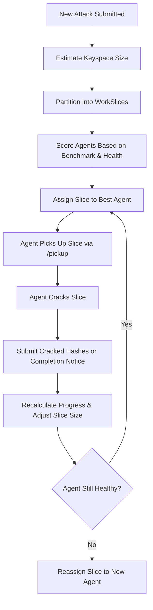

# CipherSwarm Phase 5: Advanced Task Distribution System

## Overview

This phase introduces an advanced scheduler for CipherSwarm that goes beyond Hashtopolis-style chunking. The goal is to intelligently divide cracking workloads across agents in a stable, high-speed, trusted environment. CipherSwarm agents are reliable, long-lived, and run on an internal network. This allows us to optimize cracking in ways that traditional distributed hash cracking systems cannot.

By the end of this phase, CipherSwarm will:

- Schedule tasks based on agent speed and health.
- Dynamically adjust workload sizes.
- Track real-time progress and reclaim unfinished work.
- Use adaptive algorithms to improve cracking throughput.

## Key Concepts

### TaskPlan

A precomputed breakdown of an attack's keyspace. It contains many WorkSlices, which represent the ranges of password guesses each agent will attempt.

### WorkSlice

A small unit of cracking work. Each one represents a specific segment of the password space (called the keyspace).

```text
Example:
  A dictionary with 10,000 words and 5 rules = 50,000 total password attempts.
  WorkSlice(start=0, length=10,000) = first 10k guesses
```

### Keyspace

Think of this like the number of combinations hashcat will try.

- Dictionary attack: `wordlist_length * rule_count`
- Mask attack: Number of character positions multiplied by charset size (e.g., `?l?l?l?l` = 26^4 = 456,976)
- Hybrid attack: Combined length = dict × mask or mask × dict

### AgentCapacity

Dynamic profile of an agent's ability. Based on:

- Hash speeds from benchmarks
- Stability (do they go offline?)
- How recently they checked in

### Leases

When a WorkSlice is assigned to an agent, it gets a short-term lease. If the agent doesn’t check in on time, the lease expires and the slice is reassigned.

## Scheduling Flow (Plain English)

1. A new attack is submitted with a big password space.
2. CipherSwarm estimates the total number of guesses.
3. It breaks that space into smaller slices (each meant to last 3–5 minutes of cracking).
4. Each agent is scored: Who is fastest and most reliable?
5. The best-matched agent gets the next slice.
6. That agent requests its slice via `/pickup` and starts cracking.
7. If an agent finishes early or fails, we reassign the leftover work.

## Mermaid Diagram



## Example

Say we have a mask attack that generates 1,000,000 guesses.

- We want each agent to get about 100,000 guesses per slice.
- An agent with 1 GPU might get 50,000 (slower)
- An agent with 16 GPUs might get 200,000 (faster)

If a hash is cracked by Agent A during slice 3, Agents B and C skip that hash and continue working on the rest of their assigned slices.

## Features Beyond Hashtopolis

| Feature                       | Hashtopolis | CipherSwarm (Phase 5) |
| ----------------------------- | ----------- | --------------------- |
| Static chunk sizes            | Yes         | No (adaptive sizing)  |
| Trusted agent behavior        | No          | Yes                   |
| Pre-scheduled task plans      | No          | Yes                   |
| Keyspace shape optimization   | No          | Planned               |
| Throughput-based rebalancing  | No          | Yes                   |
| Real-time progress adjustment | No          | Yes                   |

## Advanced Scheduling Features

### 🔥 Thermal & Power Awareness

- Agents report average device temperature and throttling via `/heartbeat`
- Scheduler penalizes hot or throttled agents in scoring
- High temps (>85°C) or throttling reduce slice score
- Optional: allow agents to self-limit to low-priority work when overheating

### 💤 Background Task Prioritization

- Campaigns can be marked as `background`
- Slices from these are only assigned to idle agents
- Preempted immediately if higher-priority work appears

### ⏳ Task Timeout (Crackless Watchdog)

- Monitor TaskSessions for activity
- If no crack after X hours, mark as stalled
- Slice is unassigned and requeued for later
- Can be toggled per campaign via UI or API

## ⛓️ Skip/Limit-Based WorkSlice Distribution

CipherSwarm's distributed model relies on Hashcat's `--skip` and `--limit` flags to split keyspaces precisely across agents. Each WorkSlice defines a window in the total keyspace.

### Key Usage

- `--skip=N`: skip N candidates before starting
- `--limit=M`: process only M candidates

This method:

- Avoids overlap
- Enables true parallel cracking
- Supports resume and tracking by slice

### Implementation Plan

1. Use `--keyspace` to determine total candidates
2. Divide into `WorkSlice(start, length)`
3. Assign `--skip=start`, `--limit=length` per agent
4. Monitor with `--status-json`, reassign if lease expires

This model avoids the unreliability of Hashcat's Brain feature, providing full transparency and orchestrator control.

## 🎭 Handling Incremental Attacks

Incremental (`--increment`) attacks span multiple masks of different lengths. CipherSwarm treats these as a multi-phase plan.

### Key Changes

- Add `KeyspacePhase` objects to the `TaskPlan` for each mask length
- Each phase is treated as an independent subspace with its own slices
- Phases must be completed in order

```python
class TaskPlan(Base):
    id: int
    attack_id: int
    mode: Enum("dictionary", "brute", "mask", "incremental")
    total_keyspace: int
    phases: list[KeyspacePhase]

class KeyspacePhase(Base):
    id: int
    task_plan_id: int
    mask: str
    start_index: int
    size: int
    phase_order: int
    slices: list[WorkSlice]
```

### Agent Behavior

- Agents are given one `KeyspacePhase` at a time
- CLI constructed with `--increment-min=X` and `--increment-max=X` to lock mask length
- Slices still use `--skip`/`--limit` within that phase's keyspace

### UI Impact

- Show per-mask progress bars
- Cancel unused phases if earlier ones succeed
- Enable crack-rate heat maps by mask length

## 🧬 Hybrid Attack Mode Support

Hybrid attacks (`-a 6`, `-a 7`) combine dictionaries and masks into a multiplicative keyspace.

### Mode Details

- `-a 6`: dictionary left, mask right (e.g. `password123`)
- `-a 7`: mask left, dictionary right (e.g. `123password`)

### Keyspace Strategy

- Treat like brute-force: `dictionary_length * mask_permutations`
- Use `--skip` and `--limit` normally

### `TaskPlan` Extension

```python
class TaskPlan(Base):
    attack_mode: Literal[6, 7]
    dictionary_path: str
    mask: str
    total_keyspace: int
    slices: list[WorkSlice]
```

### Agent Behavior

- Construct CLI with:

  ```bash
  hashcat -a 6 -m 1800 hashes.txt dict.txt ?d?d?d --skip=X --limit=Y
  ```

- Status polling with `--status-json` remains unchanged

### UI & Control

- Treat as one logical space
- Consider slice cancellation if hashes are exhausted early

CipherSwarm may calculate hybrid keyspaces internally or invoke `hashcat --keyspace` to validate its math, but for extremely large combinations, relying on hashcat's dry-run logic is more accurate and robust.

## Task List Summary

### Track A: Foundations

- [ ] Create `TaskPlanner` for WorkSlice generation
- [ ] Add `WorkSlice` model (offset, length, status)
- [ ] Add `AgentScorer`

### Track B: Lease + Dispatch

- [ ] Redis TTL leases
- [ ] Update `/pickup` endpoint to return best slice

### Track C: Feedback + Adaptation

- [ ] Slice result submission with guess rate
- [ ] Adjust future slice sizes based on past performance
- [ ] Integrate thermal and throttling data into scoring

### Track D: Fault Tolerance

- [ ] Agent crash detection
- [ ] Reclaim orphaned slices
- [ ] Retry logic for failed work
- [ ] Mark tasks as stalled after timeout period

### Track E: Visibility

- [ ] Add admin view for slice assignments
- [ ] Track per-agent cracking stats
- [ ] Show progress bars weighted by keyspace
- [ ] Add UI badge/warning for thermal throttling

## Closing Thoughts

CipherSwarm's new scheduler isn't just smarter. It's a command center for a fleet of cracking agents that know their own strengths and adapt mid-flight. If Phase 4 gave you a better CipherSwarm, Phase 5 turns it into the most intelligent distributed cracker ever built.
