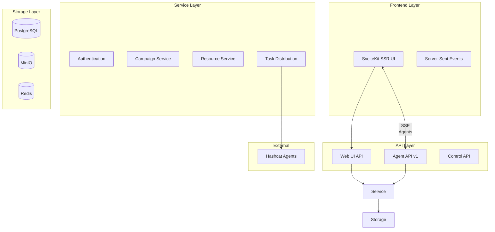

# Requirements Document: CipherSwarm

**Version**: 2.0  
**Status**: Draft  
**Author(s)**: UncleSp1d3r  
**Date Created**: 2025-01-07  
**Last Modified**: 2025-01-07

---

## Table of Contents

[TOC]

---

## 🪪 Introduction & Scope

### Project Overview

- **Project Description and Purpose**  
  CipherSwarm is a distributed password cracking management system designed for efficiency, scalability, and airgapped networks. It coordinates multiple hashcat instances across different machines to efficiently crack password hashes using various attack strategies, with a modern web interface and robust API.

- **Project Goals and Objectives**  
  • Enable distributed hashcat cracking across multiple machines with centralized coordination
  • Provide modern, user-friendly web interface for campaign and attack management
  • Support offline-first operations in airgapped environments
  • Maintain compatibility with existing agent infrastructure while modernizing the platform
  • Deliver comprehensive monitoring and real-time progress tracking
  • Support role-based access control and multi-project environments

- **Target Audience and Stakeholders**  
  • **Red Team Operators**: Primary users conducting password audits and penetration testing
  • **Blue Team Analysts**: Security professionals analyzing password complexity and patterns
  • **Infrastructure Administrators**: IT personnel managing and maintaining the distributed cracking infrastructure
  • **Project Managers**: Oversight personnel tracking progress and resource utilization

- **Project Boundaries and Limitations**  
  • Only supports hashcat as the cracking engine (no John the Ripper or other tools)
  • Designed for trusted LAN environments, not Internet-facing deployments
  • Requires high-speed, reliable network connections between agents
  • Not intended for anonymous or untrusted client connections

### Scope Definition

- **In-scope Features and Functionality**
  • Complete rewrite from Ruby on Rails to FastAPI + SvelteKit architecture
  • Agent API with full v1 contract compatibility for seamless migration
  • Modern Web UI with real-time updates and comprehensive campaign management
  • Three-tier testing architecture with Docker-based E2E testing
  • Resource management with MinIO object storage integration
  • Hash type detection and automated wordlist generation
  • Campaign templates with import/export capabilities
  • Role-based access control with project-level isolation

- **Out-of-scope Items**
  • Support for cracking tools other than hashcat
  • Internet-facing or cloud-based deployments
  • Advanced machine learning or AI-based attack strategies
  • Integration with external identity providers (beyond basic auth)

- **Success Criteria and Acceptance Criteria**
  • All existing v1 agents can connect and operate without modification
  • Web UI provides feature parity with existing Rails application
  • System can handle distributed workloads across 10+ agents simultaneously
  • E2E tests provide comprehensive coverage of all user workflows
  • Performance meets or exceeds existing Ruby on Rails implementation

- **Timeline and Milestones**
  • **Phase 1**: Core Infrastructure ✅ **COMPLETED**
  • **Phase 2**: API Implementation ✅ **COMPLETED** (2/3 parts)
  • **Phase 3**: Web UI Development ✅ **COMPLETED**
  • **Phase 4**: Containerization and Deployment
  • **Phase 5**: Task Distribution System
  • **Phase 6**: Monitoring, Testing and Documentation

### Context and Background

- **Business Context and Justification**
  Legacy Ruby on Rails system requires modernization for maintainability, performance, and feature development. The v2 rewrite addresses technical debt while maintaining operational continuity.

- **Previous Work and Dependencies**
  • Existing v1 API contract that must be maintained for agent compatibility
  • Established user workflows and UI patterns that need preservation
  • Current production deployments that require seamless migration path

- **Assumptions and Constraints**
  • All client machines are trustworthy and under direct user control
  • Users belong to the same organization or project team
  • High-speed LAN connectivity between all system components
  • PostgreSQL and MinIO infrastructure available for deployment

- **Risk Assessment Overview**
  • **Technical Risk**: Complexity of maintaining v1 API compatibility during rewrite
  • **Operational Risk**: Potential disruption during migration from Rails to FastAPI
  • **Performance Risk**: Ensuring new architecture matches or exceeds current performance
  • **User Risk**: Learning curve for new UI patterns and workflows

---

## ⚙️ Functional Requirements

### Core Features

- **F001**: Agent API must maintain full compatibility with v1 contract specification
- **F002**: Web UI must provide real-time updates via Server-Sent Events (SSE)
- **F003**: Campaign management with DAG-based attack ordering and execution
- **F004**: Resource management supporting wordlists, rules, masks, and charsets
- **F005**: Hash list management with automated hash type detection
- **F006**: Template system for campaign and attack reuse via JSON import/export
- **F007**: Role-based access control with admin, project admin, and user roles
- **F008**: Multi-project support with resource isolation and sharing controls
- **F009**: Agent monitoring with hardware configuration and performance tracking
- **F010**: Distributed task scheduling with automatic load balancing

### User Stories and Use Cases

1. **Campaign Lifecycle Management**: Red team operator creates a campaign, configures multiple attack strategies, launches distributed cracking across available agents, monitors progress in real-time, and exports results for reporting.

2. **Agent Fleet Management**: Infrastructure administrator registers new cracking agents, configures hardware settings, monitors performance and health status, and manages device assignments for optimal utilization.

3. **Resource Library Operations**: Security analyst uploads custom wordlists and rule files, organizes resources by project, shares resources across teams, and maintains version control through templates.

### Feature Priority Matrix

| Priority | Features |
| -------- | -------- |
| High | Agent API compatibility, Campaign CRUD, Attack configuration, Real-time monitoring, Resource management |
| Medium | Template import/export, Advanced agent controls, Performance analytics, Multi-project isolation |
| Low | Advanced visualization, Bulk operations, API rate limiting, Audit logging |

### Performance Requirements

- **API Response Time**: \<200ms for standard CRUD operations, \<500ms for complex queries
- **Real-time Updates**: SSE events delivered within 1 second of backend state changes
- **Concurrent Users**: Support 50+ simultaneous web UI users without degradation
- **Agent Scalability**: Handle 100+ concurrent agents with task distribution
- **File Upload**: Support resource files up to 1GB with progress indication
- **Database Performance**: Campaign queries with pagination under 100ms

---

## 🧑‍💻 User Interface Requirements

- **Web UI Framework**: SvelteKit 5 with Server-Side Rendering (SSR)
- **Component Library**: Shadcn-Svelte with Tailwind CSS v4 styling
- **Form Handling**: Superforms v2 with Zod validation and SvelteKit actions
- **Real-time Updates**: Server-Sent Events (SSE) for live data without polling
- **Authentication Flow**: Session-based authentication with proper SSR integration
- **Responsive Design**: Mobile-friendly layouts with touch-optimized controls
- **Theme Support**: Catppuccin Macchiato base with DarkViolet accent (#9400D3)
- **Accessibility**: WCAG 2.1 AA compliance with keyboard navigation and screen reader support

---

## 🧪 Technical Specifications

### Language and Runtime

- **Backend**: Python 3.13+ with FastAPI framework and async/await patterns
- **Frontend**: SvelteKit 5 with TypeScript and Svelte runes for state management
- **Database**: PostgreSQL 16+ with SQLAlchemy 2.0 async ORM
- **Object Storage**: MinIO for resource file management with S3-compatible API
- **Package Management**: uv for Python dependencies, pnpm for Node.js packages

### Core Libraries and Tooling

- **Backend Dependencies**: FastAPI, SQLAlchemy, Pydantic v2, Cashews (caching), name-that-hash
- **Frontend Dependencies**: SvelteKit, Shadcn-Svelte, Superforms, svelte-sonner, Tailwind CSS
- **Testing Stack**: pytest + testcontainers (backend), Vitest + Playwright (frontend)
- **Build Tools**: just for task automation, Docker for containerization
- **Development Tools**: ruff for linting/formatting, pre-commit for git hooks

### CI/CD & Testing

- **Three-Tier Testing Architecture**:
  1. Backend tests with testcontainers (Python + pytest)
  2. Frontend tests with mocked APIs (Vitest + Playwright)  
  3. Full E2E tests with Docker backend (Playwright + real services)
- **GitHub Actions**: Automated testing, linting, and security checks
- **Docker Infrastructure**: Complete containerization for development and deployment
- **Test Coverage**: 90%+ backend coverage, comprehensive E2E workflow coverage

---

## 🔒 Security Requirements

- **Code Security**: No hardcoded secrets, comprehensive input validation, SQL injection prevention
- **Authentication**: Session-based authentication with secure cookie handling and CSRF protection
- **Authorization**: Role-based access control with project-level resource isolation
- **Data Security**: Hash lists and sensitive resources marked with appropriate access controls
- **Network Security**: Designed for trusted LAN environments with optional TLS termination
- **Operational Security**: No telemetry or external data transmission, audit logging for sensitive operations

---

## 🛠️ System Architecture

### System Components

- **FastAPI Backend**: REST API server with async request handling
- **SvelteKit Frontend**: SSR web application with progressive enhancement
- **PostgreSQL Database**: Primary data store with async connection pooling
- **MinIO Object Storage**: File storage for resources with presigned URL access
- **Redis Cache**: Session storage and background task queuing
- **Agent Network**: Distributed hashcat clients with heartbeat monitoring

### Data Flow Diagrams

### Deployment

- **Container Strategy**: Multi-service Docker Compose with separate frontend/backend containers
- **Environment Support**: Development, staging, and production configurations
- **Health Monitoring**: Comprehensive health checks for all services with dependency management
- **Scaling Strategy**: Horizontal scaling supported for frontend and backend services
- **Data Persistence**: Volume mounts for database and object storage with backup strategies

---

## ✅ Compliance with EvilBit Labs Standards

| Principle | Implementation |
| --------- | -------------- |
| Offline-first | Complete functionality in airgapped environments, no external dependencies |
| Operator-focused | CLI and web interfaces optimized for efficient workflows, minimal cognitive load |
| Transparent outputs | JSON/CSV exports, comprehensive logging, clear progress indication |
| Ethical distribution | MPL-2.0 license, no tracking, no data collection |
| Sustainable design | Modern architecture for maintainability, comprehensive test coverage |

---

## 📎 Document Metadata

| Field | Value |
| ----- | ----- |
| Version | 2.0 |
| Created Date | 2025-01-07 |
| Last Modified | 2025-01-07 |
| Author(s) | UncleSp1d3r |
| Approval Status | Draft |

---

## 📚 Glossary & References

- **Agent**: Distributed hashcat client that executes cracking tasks
- **Campaign**: Comprehensive unit of work focused on a single hash list
- **Attack**: Defined unit of hashcat work (mode, wordlist, rules, etc.)
- **Task**: Smallest unit of work assigned to an agent
- **DAG**: Directed Acyclic Graph for attack execution ordering
- **SSE**: Server-Sent Events for real-time web updates
- **SSR**: Server-Side Rendering for progressive enhancement

**External References:**

- [FastAPI Documentation](https://fastapi.tiangolo.com/)
- [SvelteKit Documentation](https://kit.svelte.dev/)
- [Hashcat Documentation](https://hashcat.net/hashcat/)
- [MPL-2.0 License](https://opensource.org/licenses/MPL-2.0)

**Internal References:**

- Implementation Plan: `docs/v2_rewrite_implementation_plan/implementation_plan.md`
- API Documentation: `docs/api/overview.md`
- User Guide: `docs/user-guide/`
- Development Guide: `docs/development/`
